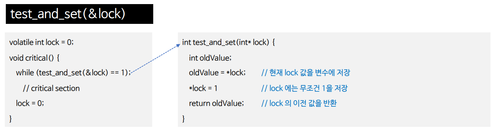
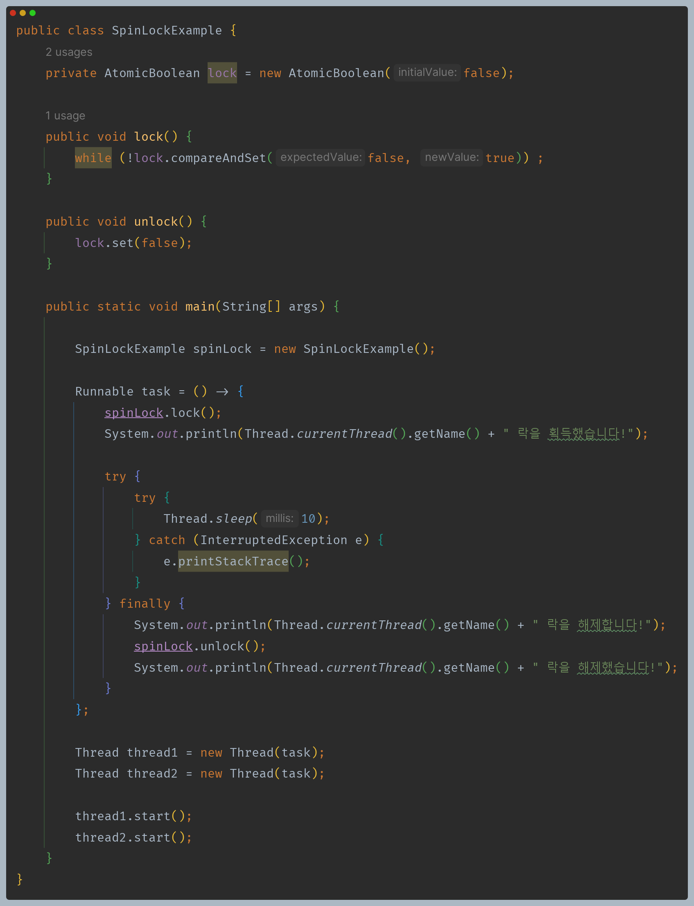

# 자바 동시성 프로그래밍 - 동기화 기법

## 스핀락 (SpinLock)

- 스핀락은 뮤텍스나 세마포어와 같은 동기화 기법의 일종으로, 기다리지 않고 스레드가 임계 영역을 사용할 수 있을 때까지 계속 반복하여 검사하는 동기화 메커니즘이다.

1. 스레드가 공유 자원에 접근하려고 할 때, 먼저 스핀락을 시도한다.
2. `test_and_set()` 함수가 이전 락 값인 0을 반환하면 아직 락이 잠기지 않았다는 것을 의미하며 while 루프를 빠져 나온다.
3. 스레드는 스핀락을 얻고 해당 자원을 사용한다.
4. 그러나 이전 락 값이 1이면 이미 다른 스레드에 의해 잠긴 것을 의미하며 스핀락을 얻을 때까지 계속해서 반복적으로 검사를 수행한다.
5. 스레드가 자원 사용이 끝나면 락을 0으로 변경해서 스핀락을 해제한다.

### 바쁜 대기 (Busy Waiting)

- `Busy Waiting`은 스레드가 어떤 조건이 만족될 때까지 계속해서 반복적으로 검사하는 것을 말한다.
- 스레드가 특정 조건을 기다리는 동안 아무런 유용한 작업을 수행하지 않고, 무한 반복 루프를 돌며 CPU 자원을 계속 사용하는 것을 의미한다.
- 스핀락은 이러한 `Busy Waiting` 을 사용하는 동기화 기법 중 하나이다.

### 스핀락 자바 구현 예제

---

## 스핀락 장단점

- **장점**
  - **컨텍스트 스위칭 비용 감소**
    - 스핀락은 뮤텍스나 세마포어와 같은 블로킹 기반의 동기화 기법과 달리, 스레드가 공유 자원을 얻을 때가지 블로킹하지 않고 반복적으로 검사(`busy waiting`)
    한다. 따라서 스핀락은 컨텍스트 스위칭 비용을 감소시키고, 빠른 공유 자원 접근을 가능하게 한다.
  - **대기 시간 감소**
    - 스핀락은 블로킹 대기 없이 바로 공유 자원에 접근하려고 시도하기 때문에 컨텍스트 스위칭 하는 시간 보다 임계 영역의 대기 시간이 더 짧을 때 유리하다.
- **단점**
  - **무한 루프로 인한 CPU 리소스 낭비**
    - 스핀락은 공유 자원이 사용 중일 때 무한 루프를 돌면서 계속해서 검사하므로, 다른 스레드가 공유 자원을 해제하지 않는 경우에는 `busy waiting` 으로 인해
    CPU 리소스가 낭비될 수 있다.
  - 스핀락은 공유 자원에 대한 경쟁이 많은 경우 또는 대기 시간이 긴 경우에는 비효율적이며 스레드들이 공유 자원에 대한 경쟁이 강하게 발생할 경우
    스핀락을 사용하면 대기 시간이 더 길어질 수 있다.

**싱글 코어 & 멀티 코어**
- 싱글 코어에서 스핀락을 사용하면, 해당 스레드가 무한 루프를 돌면서 다른 스레드가 CPU를 점유할 기회를 주지 않기 때문에 싱글 코어 환경에서는 일반적으로
`busy waiting` 으로 인해 성능이 저하될 수 있으므로 멀티 코어 환경에서 사용하는 것이 더 효율적이다.

> **스핀락은 멀티 코어 환경에 상관없이 대기 시간이 긴 경우나 공유 자원에 대한 경쟁이 많은 경우에는 다른 동기화 기법을 고려하는 것이 좋다.
> 대부분의 경우, 스핀락보다는 뮤텍스나 세마포어 등의 블로킹 기반의 동기화 기법을 사용하는 것이 더 적합할 수 있다.**

---

[이전 ↩️ - 동기화 기법 - 모니터]()

[메인 ⏫](https://github.com/genesis12345678/TIL/blob/main/Java/reactive/Main.md)

[다음 ↪️ - Java Synchronization - ]()