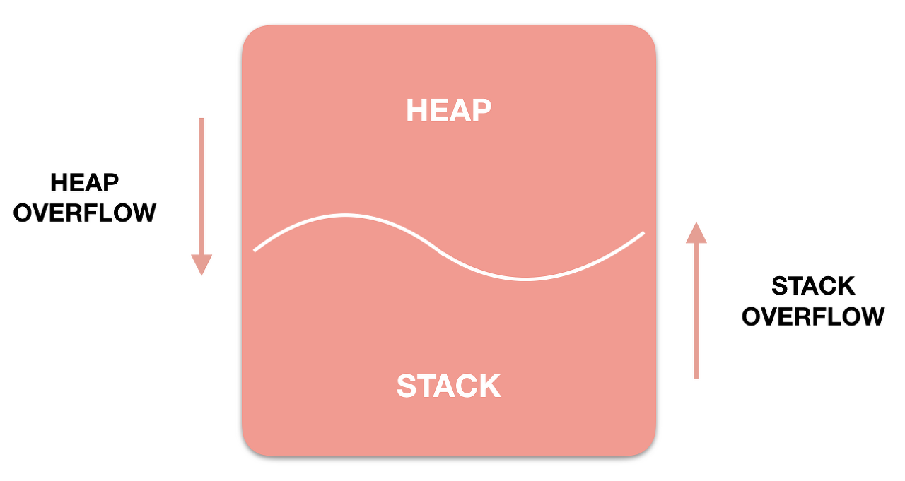

# Memory - 메모리

- 크게 ``코드``, ``데이터``, ``힙``, ``스택``영역으로 구성되어 있다.

 

## 1. 코드(Code) 영역
> **실행할 프로그램의 코드가 저장되는 영역**으로, 텍스트 영역이라고도 부른다. 
> CPU는 코드 영역에 저장된 명령어를 하나씩 가져가서 처리한다.
> 프로그램이 시작하도 종료될 때까지 메모리에 계속 남아있는다.

 

## 2. 데이터(Data) 영역
> **전역 변수와 정적(static) 변수가 저장되는 영역**으로, 
> 데이터 영역은 프로그램의 시작과 함께 할당되며, 프로그램이 종료되면 소멸한다.

 

## 3. 힙(Heap) 영역
> **사용자가 직접 관리할 수 있는 메모리 영역**으로, 
> 사용자에 의해 메모리 공간이 동적으로 할당되고 해제된다. 
> 힙 영역은 메모리의 **낮은 주소에서 높은 주소의 방향으로 할당된다.**
> 그래서 힙 영역에서는 **선입선출(FIFO) 방식**으로 데이터가 인출된다.

 

## 4. 스택(Stack) 영역
> 프로그램이 자동으로 사용하는 임시 메모리 영역이다. 
> **함수의 호출과 관계되는 지역 변수와 매개변수가 저장되는 영역**으로,
> 함수의 호출과 함께 할당되며, 함수의 호출이 완료되면 소멸한다. 
> 스택 영역은 메모리의 **높은 주소에서 낮은 주소의 방향으로 할당된다.**
> 그래서 스택 영역에서는 **후입선출(LIFO) 방식**으로 데이터가 인출된다.

 

## 오버플로우
> 메모리에 저장된 데이터가 허용된 메모리 영역을 넘어서는 경우를 말한다. 
> 오버플로우가 발생하면 데이터가 손실되거나 프로그램이 비정상적으로 종료될 수 있다.
> 오버플로우는 스택 영역에서 주로 발생한다.
> 힙이 스택을 침범하면 ``힙 오버 플로우``, 스택이 힙을 침범하면 ``스택 오버 플로우``라고 부른다.

