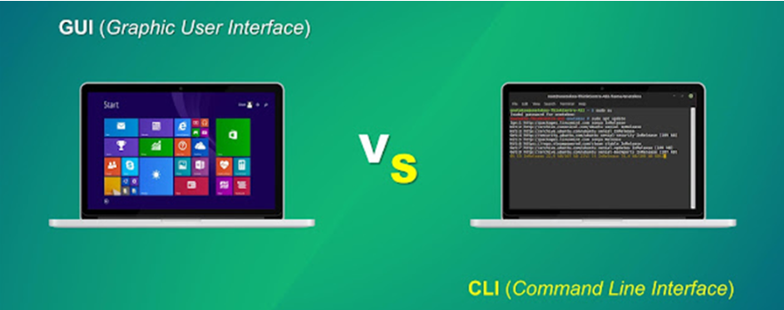

# OS - 운영체제

## Operating System
> 컴퓨터 시스템의 자원을 효율적으로 관리하며 사용자가 컴퓨터를 편리하고 효과적으로 사용할 수 있도록 환경을 제공하는 여러 프로그램의 모임
> - 컴퓨터 하드웨어와 응용 프로그램을 연결하는 소프트웨어 계층

윈도우, 맥, 안드로이드, ios 등이 대표적인 운영체제이다. 
사실 운영체제가 없어도 컴퓨터는 동작한다. 하지만 **운영체제가 없으면 사용자가 컴퓨터를 사용하기가 매우 불편해진다.** 
운영체제는 ``컴퓨터 하드웨어 바로 윗단에 설치되는 소프트웨어``로 하드웨어 + 운영체제를 컴퓨터 시스템이라고도 부른다. 

 

## 운영체제의 역할

### 1. 사용자를 위한 역할
- 사용자와 컴퓨터 하드웨어 사이에서 인터페이스 역할을 한다.
**GUI**와 **CLI**가 있다.
- GUI(Grapic User Interface) : 그래픽 사용자 인터페이스
  
    - 명령을 입력하거나 텍스트 기반의 입력이 아닌 아이콘, 메뉴, 버튼 등의
    그래픽 요소를 사용하여 상호 작용할 수 있도록 하는 시각적 인터페이스를 말한다.
- CLI(Command Line Interface) : 명령어 사용자 인터페이스

    - 텍스트 명령을 입력하여 컴퓨터에 명령을 내리는 인터페이스를 말한다.

 

### 2. 컴퓨터 하드웨어를 관리하는 역할

운영체제의 가장 핵심적인 기능으로 **컴퓨터 시스템 내의 자원을 효율적으로 관리**하는 역할을 한다.

#### 1. 프로세스 관리

> 우리는 브라우저로 인터넷 하나만 하지 않는다. 게임도 해야 되고, 노래도 틀어야 되고
> 동시에 해야 한다. 이렇게 **실행되는 프로그램을 프로세스**라고 하고
> 하나의 CPU는 한 번에 하나의 프로세스만 실행할 수 있는데 **우리는 동시에 하고 있다고 느낀다.**
> 이것은 운영체제가 프로세스를 관리하기 때문이다. 
> ``시분할 방식``과 ``CPU 스케줄링``을 통해 프로세스를 관리한다.

#### 2. 메모리 관리
> 프로세스가 실행되기 위해서는 메모리에 올라와야 한다. 메모리는 한정되어 있기 때문에
> 운영체제는 메모리를 효율적으로 관리해야 한다.  
> 메모리

#### 3. 하드웨어 관리
> 사용자의 하드웨어에 대한 직접적인 접근을 막는다. 
> 사용자가 하드웨어를 직접 제어하면 다른 사용자의 컴퓨터를 해킹할 수 있기 때문이다.
> 하드웨어를 직접 제어하는 것을 막고, 운영체제를 통해서만 하드웨어를 사용할 수 있도록 한다.
> 또한 HDD의 많은 파일들을 효율적으로 저장하고 관리해주는 역할을 한다.

 

## 운영체제의 목적

- **처리능력(Throughput)** : 일정 시간 내에 시스템이 처리하는 일의 양
- **반환 시간(Turnaround Time)** : 시스템에 작업을 의뢰한 시점부터 처리가 완료될 때까지 걸린 시간
- **사용 가능도(Availability)** : 시스템을 사용할 필요가 있을 때 즉시 사용 가능한 정도
- **신뢰도(Reliability)** : 시스템이 주어진 문제를 정확하게 해결하는 정도

 

## 운영체제의 구조

### 1. 인터페이스
> 사용자는 커널에 직접 접근할 수 없기 때문에 인터페이스를 통해 커널에 접근한다. 
> 인터페이스를 통해 커널에 명령을 전달하고, 커널은 명령을 수행한 후 그 결과를 인터페이스를 통해 사용자에게 전달한다. 

### 2. 커널
> 운영체제의 핵심으로, 운영체제의 모든 서비스를 제공한다. 
> 메모리에 항상 상주하며, 커널 자체를 운영체제라고 부르기도 한다. 
> 프로세스, 메모리, 저장장치를 관리하고 ``시스템 콜`` 과 ``드라이버``가 있다.

### 3. 시스템 콜
> 커널의 서비스를 받기 위해 사용자가 커널에게 명령을 전달하는 것 
> 사용자는 시스템 콜을 통해 커널에게 명령을 전달하고, 커널은 시스템 콜을 통해 사용자에게 명령의 결과를 전달한다. 
> 이러한 시스템 콜을 제공함으로써 운영체제는 컴퓨터 자원을 보호할 수 있다.

### 3-1. 인터럽트
> 인터럽트(Interrupt)는 특정 기능을 수행하는 도중에 급하게 다른 일을 
> 처리하고자 할 때 사용하는 기능이다. 
> 1. 기존의 작업을 처리하던 도중, 인터럽트 요청이 들어오면
> 2. 현재 컴퓨터가 처리하는 일을 중지하고 현재의 컴퓨터의 상태(CPU 레지스터의 값, 메인 메모리 등)를 저장한다.
> 3. 해당하는 인터럽트를 처리해주기 위한 인터럽트 서비스 루틴을 처리한다.
> 4. 인터럽트 처리가 끝나면, 인터럽트가 발생하기 전의 상태로 복귀하여 처리를 계속한다.

### 4. 드라이버
> **커널과 하드웨어의 인터페이스**를 담당하는 소프트웨어이다. 
> 보통 마우스, 키보드 같은 하드웨어는 꽂기만 해도 사용할 수 있지만,
> 프린터, 스캐너, 카메라 등의 하드웨어는 드라이버가 필요하다. 이 때 이 소프트웨어를 **다비이스 드라이버**라고 한다. 