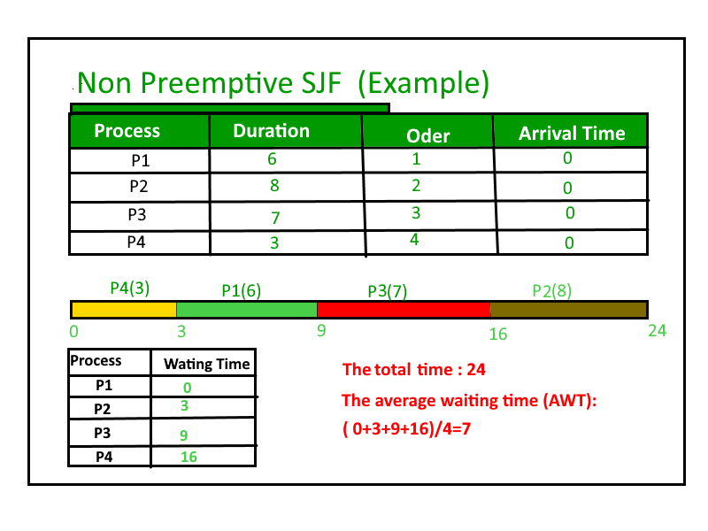
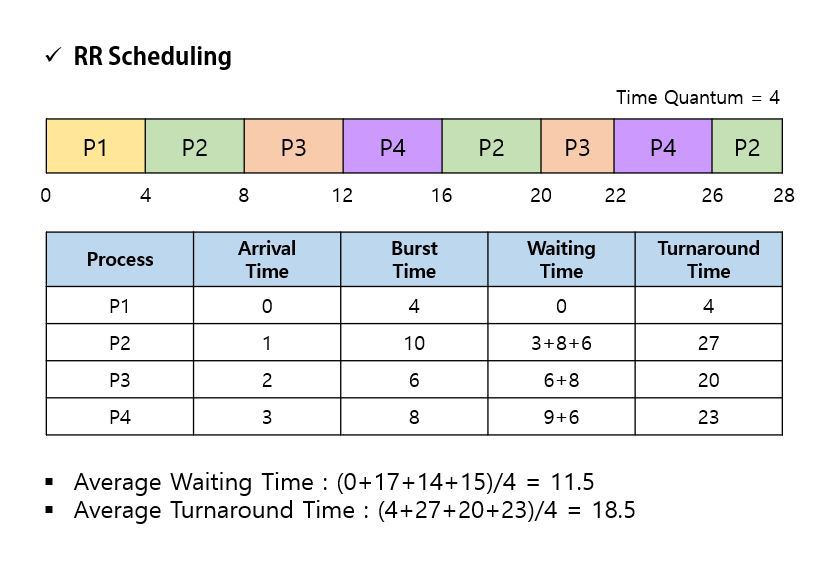
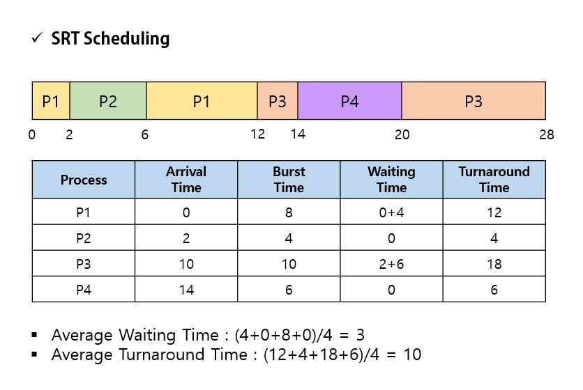
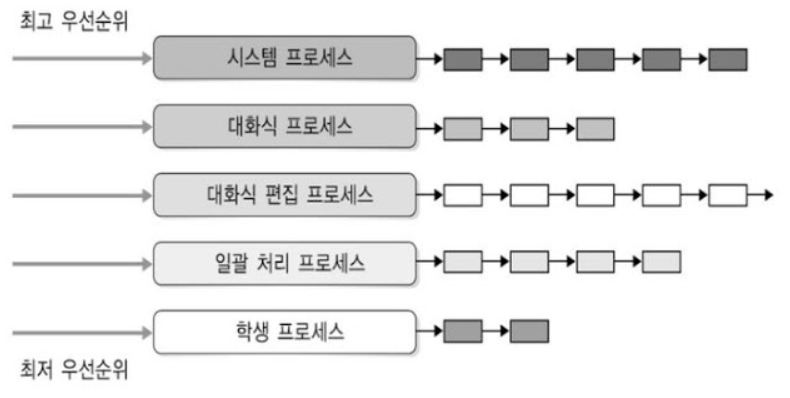
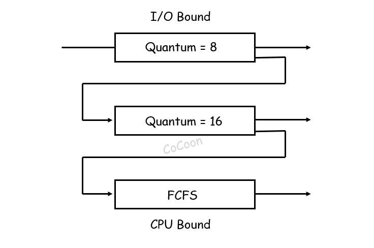

# CPU Scheduling

CPU 스케줄링의 성능은 **시스템 입장**과 ``사용자 입장``, 두 입장으로 나누어 성능을 고려해볼 수 있다.
**시스템 입장**에서는 CPU를 쉬지 않고 최대한 많이 돌리는 것이 중요하고, **사용자 입장**에서는
요청한 작업이 빨리 처리되는 것이 중요하다. 하지만 두 입장 모두를 만족시키긴 어렵기 때문에
CPU 스케줄링은 **최적화 문제**라고 할 수 있다.<br>

### 1. 시스템 입장에서의 성능 척도
- CPU Utilization(CPU 이용률) : 전체 시간 중 CPU가 일을 하는 시간의 비율
- Throughput(처리량) : 단위 시간당 작업의 수, 단위 시간당 프로세스를 몇개 완료시켰는가

### 2. 사용자 입장에서의 성능 척도
- Turnaround Time(반환 시간) : 작업을 요청한 시점부터 작업이 완료될 때까지 걸린 시간
- Waiting Time(대기 시간) : 작업을 요청한 시점부터 작업이 시작될 때까지 걸린 시간
- Response Time(응답 시간) : 사용자가 작업을 요청한 시점부터 첫 번째 결과가 나올 때까지 걸린 시간

<br>

## CPU 스케줄링 알고리즘
CPU 스케줄링 알고리즘은 크게 **비선점형 스케줄링**과 **선점형 스케줄링**으로 나눌 수 있다.<br>
**비선점형 스케줄링**은 프로세스가 CPU를 할당받으면 CPU가 반환될 때까지 CPU를 점유한다.<br>
**선점형 스케줄링**은 프로세스가 CPU를 할당받아 실행 중에 우선순위가 높은 프로세스가 도착하면
CPU를 강제로 회수당한다.<br>

### 비선점형 스케줄링

#### 1. FCFS(First Come First Served)
> 먼저 온 작업을 먼저 처리하는 방식이다.<br>


개념도 쉽고 공평해 보이지만 도착한 순서대로 처리하기 때문에 **대기 시간이 길어지는 현상**이 발생한다.<br>
이러한 현상을 **병목현상**이라고 하며, 이를 해결하기 위해 **SJF 스케줄링**이 등장하였다.<br>

<br>

#### 2. SJF(Shortest Job First)
> 실행 시간이 가장 짧은 작업을 먼저 처리하는 방식이다.<br>



FCFS의 단점을 보완한 방식이다. 하지만 **실행 시간을 정확히 예측할 수 없다는 단점**이 있다.<br>
실행 시간이 긴 프로세스의 경우 영원히 CPU를 얻지 못하는 **기아 상태**가 발생할 수 있다.<br>

<br>

#### 3. HRN(Highest Response-ratio Next)
> SJF 스케줄링의 기아 상태를 해결하기 위해 등장한 방식이다.<br>

우선순위를 계산해서 가장 높은 프로세스를 먼저 처리하는 방식이다.<br>
우선순위 = ```(대기 시간 + 실행 시간) / 실행 시간```<br>

<br>

### 선점형 스케줄링

#### 1. Priority Scheduling
> 우선순위가 높은 프로세스를 먼저 처리하는 방식이다.<br>

SJF도 일종의 우선순위 스케줄링이라고 할 수 있고 SJF와 마찬가지로 **기아 상태**가 발생할 수 있다.<br>
이를 해결하기 위해 **Aging**이라는 기법을 사용한다. Aging은 기다리는 시간이 길수록 우선순위를 높여주는 기법이다.<br>

<br>

#### 2. Round Robin
> 시분할 시스템을 위해 설계된 방식으로
> 프로세스에 우선 순위를 두지 않고 순서대로 시간단위(Time Quantum)로
> CPU를 할당하는 방식이다.<br>

보통 시간 단위는 10 ms ~ 100 ms 정도이며, 시간 단위동안 수행한 프로세스는
CPU를 반환하고 준비 큐의 맨 뒤로 가서 다시 줄을 선다.<br>



<br>

#### 3. Shortest Remaining Time
> SJF 스케줄링의 선점형 버전이다.<br>

차이는 선점형으로 바뀌어 실행 중에 우선순위가 높은 프로세스가 도착하면
현재 실행 중인 프로세스를 중단시키고 CPU를 강제로 회수한다.<br>



<br>

#### 4. Multi Level Queue
> **다단계 큐(MLQ)** : 커널 내의 준비 큐를 여러 개의 큐로 분리하여 큐 사이에도
> 우선순위를 부여하는 방식이다.<br>
> 각각의 큐에 대해 다른 스케줄링 알고리즘을 적용할 수 있다.

큐들 간의 프로세스 이동이 불가하기 때문에 스케줄링 부담이 적지만 유연성이 떨어진다.
우선순위가 낮은 프로세스가 오랫동안 CPU를 사용하지 못하는 **기아 상태**가 발생할 수 있다.<br>



<br>

#### 5. Multi Level Feedback Queue
> **다단계 피드백 큐(MLFQ)** : 다단계 큐에서 큐 사이의 프로세스 이동을 허용하는 방식이다.<br>

``FCFS``와 ``Round Robin``을 결합한 방식으로, FCFS 순서로 CPU를 할당받아 실행된다
만약 시간 단위가 지나도 실행이 완료되지 않으면 우선순위가 낮은 큐로 이동한다.<br>
이 때 우선 순위가 낮을수록 시간 단위가 길어져 보완이 가능하며, 마지막 단계에서 FCFS 방식을 사용한다.



#### - MLQ와 MLFQ의 차이점

- MLQ는 큐 사이의 프로세스 이동이 불가능하다.
- MLFQ는 큐 사이의 프로세스 이동이 가능하다.
- 그래서 MLQ 스케줄링은 스케줄링 부담이 적지만 유연성이 떨어진다.
- MLQ 스케줄링의 경우 우선순위가 낮은 프로세스가 오랫동안 CPU를 사용하지 못하는 기아 상태가 발생할 수 있다.
- MLFQ 스케줄링의 경우 Aging 기법을 사용하여 기아 상태를 해결한다.(우선순위가 낮은 큐에서 너무 오래 대기하면 다시 상위 큐로 이동)

