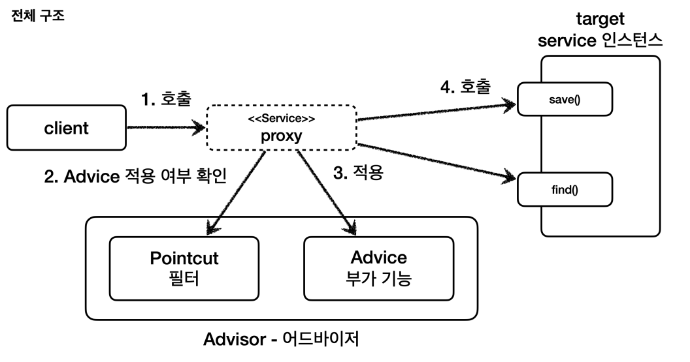
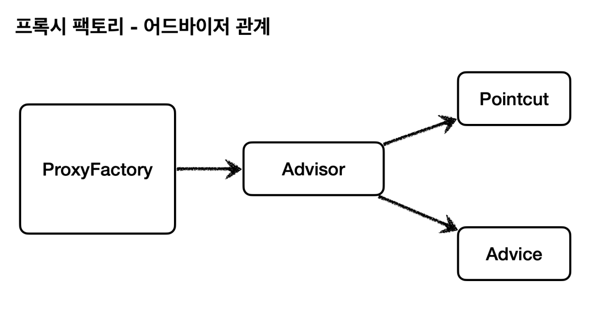
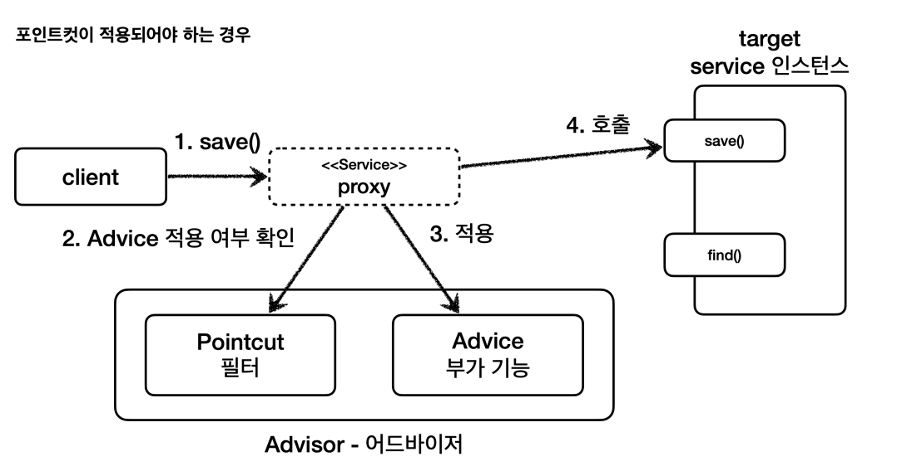
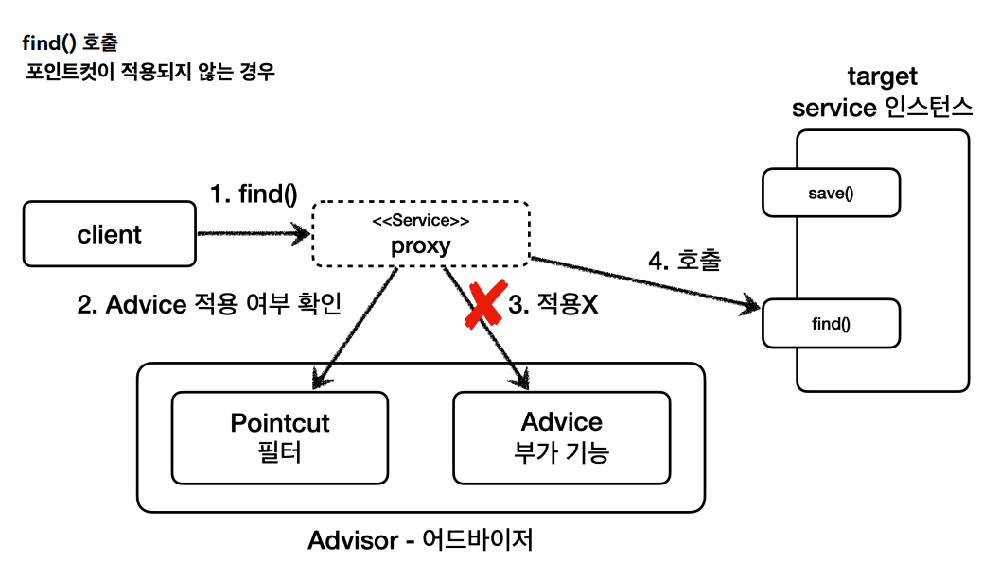
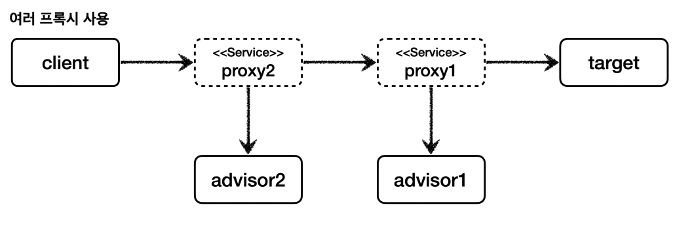
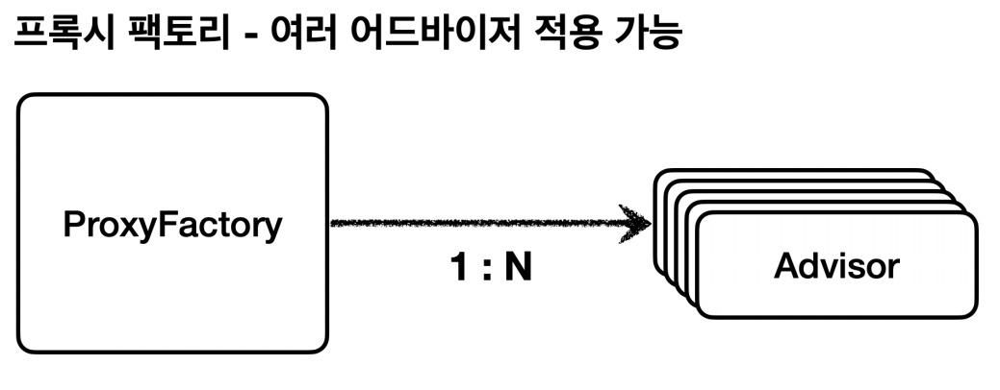
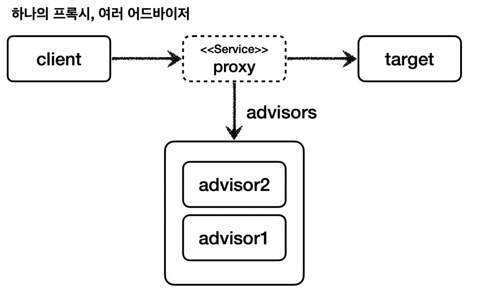

# 포인트컷, 어드바이스, 어드바이저

- **포인트컷(`Pointcut`)** : 어디에 부가 기능을 적용할지, 어디에 부가 기능을 적용하지 않을지 판단하는 필터링 로직이다. 주로 클래스와 메서드 이름으로
필터링한다. 어떤 포인트(`Point`)에 기능을 적용할지 하지 않을지 잘라서(`cut`) 구분하는 것이다.
- **어드바이스(`Advice`)** : 프록시가 호출하는 부가 기능이다. 프록시 로직이라 생각하면 된다.
- **어드바이저(`Advisor`)** : 단순하게 하나의 포인트컷과 하나의 어드바이스를 가지고 있는 것이다.

부가 기능 로직을 적용해야 하는데 **포인트컷으로 어디에? 적용할지** 선택하고 **어드바이스로 어떤 로직을 적용할지** 선택하는 것이다. 그리고
**이 모든 것을 알고 있는 것이 어드바이저다.**

- 조언(`Advice`)을 어디(`Pointcut`)에 할 것인가?
- 조언자(`Advisor`)는 어디(`Pointcut`)에 조언(`Advice`)을 해야할지 알고 있다.


- **역할과 책임**
  - 포인트컷은 대상 여부를 확인하는 필터 역할만 담당한다.
  - 어드바이스는 부가 기능 로직만 담당한다.
  - 이 둘을 합치면 어드바이저가 된다. 스프링의 어드바이저는 하나의 포인트컷 + 하나의 어드바이스로 구성된다.



<br>

## 예제 1
```java
@Test
void advisorTest1() {
    ServiceInterface target = new ServiceImpl();
    ProxyFactory proxyFactory = new ProxyFactory(target);
    DefaultPointcutAdvisor advisor = new DefaultPointcutAdvisor(Pointcut.TRUE, new TimeAdvice());
    proxyFactory.addAdvisor(advisor);
    
    ServiceInterface proxy = (ServiceInterface) proxyFactory.getProxy();
    
    proxy.save();
    proxy.find();
}
```
- `new DefaultPointcutAdvisor()` : `Advisor` 인터페이스의 가장 일반적인 구현체이다. 생성자를 통해 하나의 포인트컷과 하나의 어드바이저를 넣어주면 된다.



## 예제 2 - 포인트컷 직접 만들기

스프링이 제공하는 인터페이스
```java
public interface Pointcut {
    ClassFilter getClassFilter();
    MethodMatcher getMethodMatcher();
}

@FunctionalInterface
public interface ClassFilter {
    boolean matches(Class<?> clazz);
}

public interface MethodMatcher {
    boolean matches(Method method, Class<?> targetClass);
    //...
}
```
- 포인트컷은 크게 `ClassFilter`와 `MethodMatcher` 둘로 이루어진다.
- 이름 그대로 클래스가 맞는지, 메서드가 맞는지 확인할 때 사용한다.
- 둘 다 `true`를 반환해야 어드바이스를 적용할 수 있다.

```java
static class MyPointCut implements Pointcut{
    @Override
    public ClassFilter getClassFilter() {
        return ClassFilter.TRUE;
    }

    @Override
    public MethodMatcher getMethodMatcher() {
        return new MyMethodMatcher();
    }
}

static class MyMethodMatcher implements MethodMatcher{

    private String matchName = "save";

    @Override
    public boolean matches(Method method, Class<?> targetClass) {
        boolean result = method.getName().equals(matchName);
        log.info("포인트컷 호출 method={} targetClass={}", method.getName(), targetClass);
        log.info("포인트컷 결과 result={}", result);
        return result;
    }

    @Override
    public boolean isRuntime() {
        return false;
    }

    @Override
    public boolean matches(Method method, Class<?> targetClass, Object... args) {
        return false;
    }
}
```
```java
@Test
@DisplayName("직접 만든 포인트컷")
void advisorTest2() {
    ServiceInterface target = new ServiceImpl();
    ProxyFactory proxyFactory = new ProxyFactory(target);
    DefaultPointcutAdvisor advisor = new DefaultPointcutAdvisor(new MyPointCut(), new TimeAdvice());
    proxyFactory.addAdvisor(advisor);
    
    ServiceInterface proxy = (ServiceInterface) proxyFactory.getProxy();
    
    proxy.save();
    proxy.find();//어드바이스 적용 안됨
}
```





<br>

## 예제 3 - 스프링이 제공하는 포인트컷

```java
@Test
@DisplayName("스프링이 제공하는 포인트컷")
void advisorTest3() {
    ServiceInterface target = new ServiceImpl();
    ProxyFactory proxyFactory = new ProxyFactory(target);
    NameMatchMethodPointcut pointcut = new NameMatchMethodPointcut();//추기
    pointcut.setMappedName("save");//추가
    DefaultPointcutAdvisor advisor = new DefaultPointcutAdvisor(pointcut, new TimeAdvice());

    proxyFactory.addAdvisor(advisor);
    ServiceInterface proxy = (ServiceInterface) proxyFactory.getProxy();

    proxy.save();
    proxy.find();
}
```

<br>

## 예제 4 - 여러 어드바이저 함께 적용

어드바이저는 하나의 포인트컷과 하나의 어드바이스를 가지고 있다.<br>
만약 여러 어드바이저를 하나의 `target`에 적용하려면 어떻게 해야할까?

일단 단순하게 프록시를 여러 개 만들어보자.

```java
@Test
@DisplayName("여러 프록시")
void multiAdvisorTest1() {
    //client -> proxy2(advisor2) -> proxy1(advisor1) -> target

    //프록시1 생성
    ServiceInterface target = new ServiceImpl();
    ProxyFactory proxyFactory1 = new ProxyFactory(target);

    DefaultPointcutAdvisor advisor1 = new DefaultPointcutAdvisor(Pointcut.TRUE, new Advice1());
    proxyFactory1.addAdvisor(advisor1);

    ServiceInterface proxy1 = (ServiceInterface) proxyFactory1.getProxy();

    //프록시2 생성
    ProxyFactory proxyFactory2 = new ProxyFactory(proxy1);
    DefaultPointcutAdvisor advisor2 = new DefaultPointcutAdvisor(Pointcut.TRUE, new Advice2());
    proxyFactory2.addAdvisor(advisor2);

    ServiceInterface proxy2 = (ServiceInterface) proxyFactory2.getProxy();

    //실행
    proxy2.save();
}

@Slf4j
static class Advice1 implements MethodInterceptor{

    @Override
    public Object invoke(MethodInvocation invocation) throws Throwable {
        log.info("advice1 호출");
        return invocation.proceed();
    }
}

@Slf4j
static class Advice2 implements MethodInterceptor{

    @Override
    public Object invoke(MethodInvocation invocation) throws Throwable {
        log.info("advice2 호출");
        return invocation.proceed();
    }
}
```


잘못된 방법은 아니지만 당연히 비효율적이다. 적용해야하는 어드바이저가 10개라면 10개의 프록시를 생성해야 한다.

**스프링은 이 문제를 해결하기 위해 하나의 프록시에 여러 어드바이저를 적용할 수 있게 만들어두었다.**



```java
@Test
@DisplayName("하나의 프록시, 여러 어드바이저")
void multiAdvisorTest2() {
    //client -> proxy -> advisor2 -> advisor1 -> target

    DefaultPointcutAdvisor advisor1 = new DefaultPointcutAdvisor(Pointcut.TRUE, new Advice1());
    DefaultPointcutAdvisor advisor2 = new DefaultPointcutAdvisor(Pointcut.TRUE, new Advice2());
    //프록시1 생성
    ServiceInterface target = new ServiceImpl();
    ProxyFactory proxyFactory1 = new ProxyFactory(target);

    proxyFactory1.addAdvisor(advisor2);
    proxyFactory1.addAdvisor(advisor1);

    ServiceInterface proxy = (ServiceInterface) proxyFactory1.getProxy();

    //실행
    proxy.save();
}
```
- 등록하는 순서대로 `advisor`가 호출된다.



> **중요**
> 
> 스프링 AOP는 AOP 적용 수 만큼 프록시가 생성되는 것이 아니다.<br>
> 하나의 `target`에 여러 AOP가 동시에 적용되어도 스프링의 AOP는 `target`마다 하나의 프록시만 생성하도록 최적화를 한다.