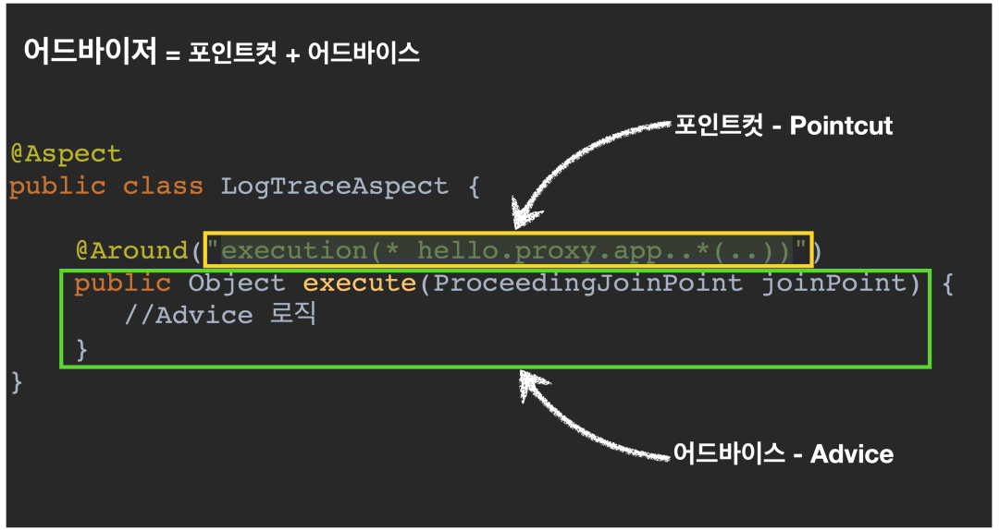
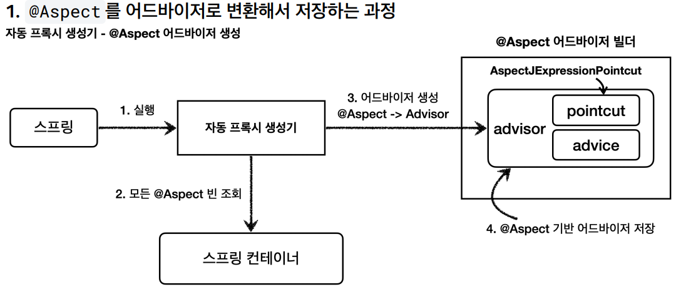
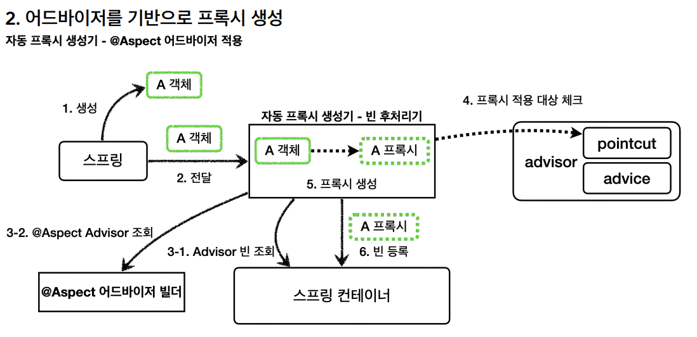

# @Aspect AOP

스프링 애플리케이션에 프록시를 적용하려면 포인트컷과 어드바이스로 구성되어 있는 어드바이저(`Advisor`)를 만들어서 스프링 빈으로 등록하면 된다.

그러면 자동 프록시 생성기는 스프링 빈으로 등록된 어드바이저들을 찾고 스프링 빈들에 자동으로 프록시를 적용해주는 작업들을 처리해준다.

스프링은 `@Aspect` 어노테이션으로 매우 편리하게 포인트컷과 어드바이스로 구성되어 있는 어드바이저 생성 기능을 지원한다.

> 참고 : `@Aspect`는 관점 지향 프로그래밍(`AOP`)을 가능하게 하는 AspectJ 프로젝트에서 제공하는 어노테이션이다. 스프링인 이것을 차용해서
> 프록시를 통한 AOP를 가능하게 한다.


```java
@Aspect
@RequiredArgsConstructor
public class LogTraceAspect {
    private final LogTrace logTrace;

    @Around("execution(* hello.proxy.app..*(..))")
    public Object execute(ProceedingJoinPoint joinPoint) throws Throwable{
        TraceStatus status = null;
        try {
            String message = joinPoint.getSignature().toShortString();
            status = logTrace.begin(message);

            Object result = joinPoint.proceed();

            logTrace.end(status);
            return result;
        } catch (Exception e) {
            logTrace.exception(status, e);
            throw e;
        }
    }
}
```
- `@Aspect` : 어노테이션 기반 프록시를 적용할 때 필요하다.
- `@Around` : 포인트컷 표현식을 넣는다. 표현식은 AspectJ 표현식을 사용한다. `@Around`의 메서드가 어드바이스가 된다.
- `ProceedingJointPoint joinPoint` : 어드바이스에 `MethodInvocation invocation`과 유사한 기능이다. 내부에 실제 호출 대상, 전달 인자,
  어떤 객체와 어떤 메서드가 호출되었는지 정보가 포함되어 있다.
- `joinPoint.proceed()` : 실제 호출 대상(`target`)을 호출한다.

```java
@Configuration
@Import({AppV1Config.class, AppV2Config.class})
public class AopConfig {

    @Bean
    public LogTraceAspect logTraceAspect(LogTrace logTrace) {
        return new LogTraceAspect(logTrace);
    }
}

@Import(AopConfig.class)
@SpringBootApplication(scanBasePackages = "hello.proxy.app.v3")
public class ProxyApplication {

    public static void main(String[] args) {
        SpringApplication.run(ProxyApplication.class, args);
    }

    @Bean
    public LogTrace logTrace() {
        return new ThreadLocalLogTrace();
    }
}
```
- `@Aspect`가 있어도 스프링 빈으로 등록해 주어야 한다. `@Component`로 컴포넌트 스캔을 사용해도 된다.

# @Aspect 프록시 - 설명

자동 프록시 생성기(`AnnotationAwareAspectHAutoProxyCreator`)는 `Advisor`를 자동으로 찾아와서 필요한 곳에 프록시를 생성하고 적용해준다.
자동 프록시 생성기는 여기에 추가로 하나의 역할을 더하는데 바로 `@Aspect`를 창자서 이것을 `Advisor`로 만들어준다. 그래서 이름 앞에 `AnnotationAware`(어노테이션을 인식하는)
가 붙어 있는 것이다.



**자동 프록시 생성기는 2가지 일을 한다.**
1. `@Aspect`를 보고 어드바이저로 변환해서 저장한다.
2. 어드바이저를 기반으로 프록시를 생성한다.



1. **실행** : 스프링 애플리케이션 로딩 시점에 자동 프록시 생성기를 호출한다.
2. **모든 @Aspect 빈 조회** : 자동 프록시 생성기는 스프링 컨테이너에서 `@Aspect` 어노테이션이 붙은 스프링 빈을 모두 조회한다.
3. **어드바이저 생성** : `@Aspec` 어드바이저 빌더를 통해 `@Aspect` 어노테이션 정보를 기반으로 어드바이저를 생성한다.
4. **@Aspect기반 어드바이저 저장** : 생성한 어드바이저를 `@Aspect` 어드바이저 빌더 내부에 저장한다.

**@Aspect 어드바이저 빌더**
`@Aspect` 의 정보를 기반으로 포인트컷, 어드바이스, 어드바이저를 생성하고 보관하는 것을 담당한다.<br>
`@Aspect` 의 정보를 기반으로 어드바이저를 만들고 @Aspect 어드바이저 빌더 내부 저장소에 캐시한다. 캐시에 어드바이저가 이미 만들어져 있는 경우 캐시에 저장된
어드바이저를 반환한다.



1. **생성** : 스프링 빈 대상이 되는 객체를 생성한다.(`@Bean`, 컴포넌트 스캔 모두 포함)
2. **전달** : 생성된 객체를 빈 저장소에 등록하기 직전에 빈 후처리기에 전달한다.
3. - **1. Advisor 빈 조회** : 스프링 컨테이너에서 `Advisor`빈을 모두 조회한다.
   - **2. @Aspect Advisor 조회** : `@Aspect` 어드바이저 빌더 내부에 저장된 `Advisor`를 모두 조회한다.
4. **프록시 적용 대상 체크** : `3-1`,`3-2`에서 조회한 `Advisor`에 포함되어 있는 포인트컷을 사용해서 해당 객체가 프록시를 적용할 대상인지 판단한다.
    이때 객체의 클래스 정보를 포함 해당 객체의 모든 메서드를 포인트컷에 비교해서 조건이 하나라도 만족하면 프록시 적용 대상이 된다.
5. **프록시 생성** : 프록시 적용 대상이면 프록시를 생성하고 프록시를 반환한다. 프록시 적용 대상이 아니라면 원본 객체를 반환한다.
6. **빈 등록** : 반환된 객체는 스프링 빈으로 등록된다.

**애플리케이션 전반에 로그를 남기는 기능은 특정 기능 하나에 관심이 있는 기능이 아니다. 애플리케이션 여러 기능들 사이에 걸쳐서 들어가는 관심사이다.**

이것을 **횡단 관심사(cross-cutting concerns)라고 한다.**


스프링 AOP를 사용하면 이러한 횡단 관심사를 매우 편리하게 관리할 수 있다.