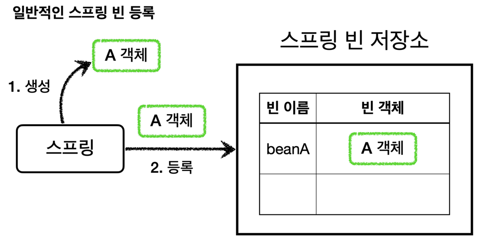
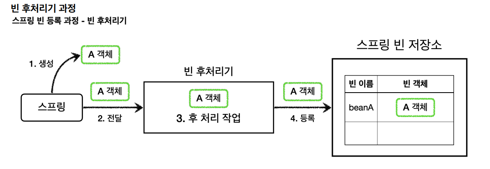
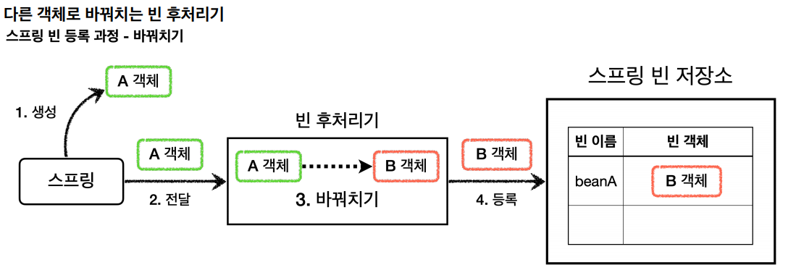
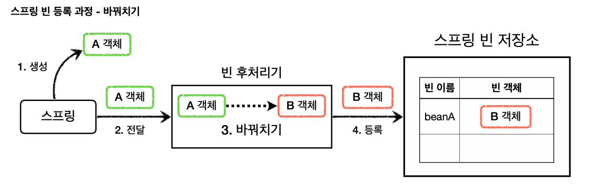
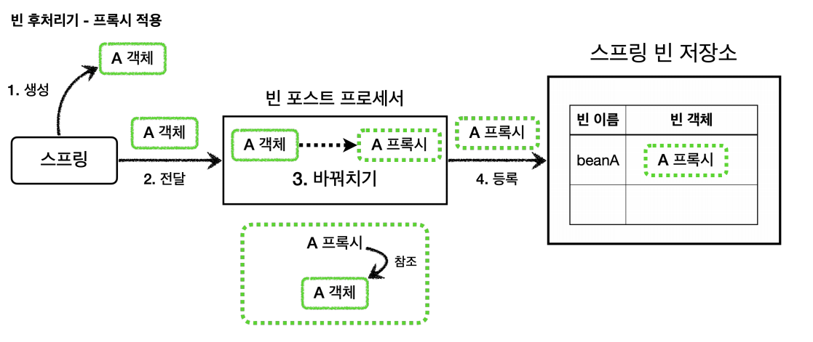

# 빈 후처리기



- `@Bean`이나 컴포넌트 스캔으로 스프링 빈을 등록하면 스프링은 대상 객체를 생성하고 스프링 컨테이너 내부의 빈 저장소에 등록한다.
- 그리고 이후에는 스프링 컨테이너를 통해 등록한 스프링 빈을 조회해서 사용한다.

**빈 후처리기 - BeanPostProcessor**
- 스프링이 빈 저장소에 등록할 목적으로 생성한 객체를 빈 저장소에 등록하기 직전에 조작하고 싶다면 `빈 후처리기`를 사용하면 된다.
- 이름 그대로 빈을 생성한 후에 무언가를 처리하는 용도로 사용한다.
- 객체를 조작할 수도 있고 완전히 다른 객체로 바꾸는 것도 가능하다.



1. **생성** : 스프링 빈 대상이 되는 객체를 생성한다.(`@Bean`, 컴포넌트 스캔 모두 포함)
2. **전달** : 생성된 객체를 빈 저장소에 등록하기 직전에 빈 후처리기에 전달한다.
3. **후 처리 작업** : 빈 후처리기는 전달된 스프링 빈 객체를 조작하거나 다른 객체로 바꿀 수도 있다.
4. **등록** : 빈 후처리기는 빈을 반환한다. 전달 된 빈을 그대로 반환하면 해당 빈이 등록되고, 바꿔치기하면 다른 객체가 빈 저장소에 등록된다.



<br>

## 예제 코드 - 일반적인 스프링 빈 등록

```java
@Test
void basicConfig() {
        ApplicationContext applicationContext = new AnnotationConfigApplicationContext(BasicConfig.class);
        //A는 빈으로 등록된다.
        A a = applicationContext.getBean("beanA", A.class);
        a.helloA();
        
        //B는 빈으로 등록되지 않는다.
        assertThrows(NoSuchBeanDefinitionException.class,
                         () -> applicationContext.getBean(B.class));
}

@Slf4j
@Configuration
static class BasicConfig {
    @Bean(name = "beanA")
    public A a() {
        return new A();
    }
}

@Slf4j
static class A {
    public void helloA() {
        log.info("hello A");
    }
}

@Slf4j
static class B {
    public void helloB() {
        log.info("hello B");
    }
}
```

## 예제 코드 - 빈 후처리기 적용

빈 후처리기를 통해서 A 객체를 B 객체로 바꿔보자.

스프링이 제공하는 인터페이스
```java
public interface BeanPostProcessor {
    @Nullable
    default Object postProcessBeforeInitialization(Object bean, String beanName) throws BeansException {
        return bean;
    }
    @Nullable
    default Object postProcessAfterInitialization(Object bean, String beanName) throws BeansException {
        return bean;
    }
}
```
- 빈 후처리기를 사용하려면 `BeanPostProcessor` 인터페이스를 구현하고 스프링 빈으로 등록하면 된다.
- `postProcessBeforeInitialization` : 객체 생성 이후에 `@PostConstruct`같은 초기화가 발생하기 전에 호출되는 후처리기이다.
- `postProcessAfterInitialization` : 객체 생성 이후에 `@PostConstruct`같은 초기화가 발생한 다음에 호출되는 후처리기이다.

```java
@Slf4j
public class BasicTest {

    @Test
    void basicConfig() {
        ApplicationContext ac = new AnnotationConfigApplicationContext(BeanPostProcessorConfig.class);
        //beanA 이름으로 B 객체가 빈으로 등록된다.
        B b = ac.getBean("beanA", B.class);
        b.helloB();

        //A는 빈으로 등록되지 않는다.
        assertThatThrownBy(() -> ac.getBean(A.class))
                .isInstanceOf(NoSuchBeanDefinitionException.class);
    }

    @Configuration
    static class BeanPostProcessorConfig {
        @Bean(name = "beanA")
        public A a() {
            return new A();
        }
        //빈 후처리기 빈 등록
        @Bean
        public AToBPostProcessor postProcessor() {
            return new AToBPostProcessor();
        }
    }

    static class A{
        public void helloA() {
            log.info("helloA");
        }
    }

    static class B{
        public void helloB() {
            log.info("helloB");
        }
    }

    static class AToBPostProcessor implements BeanPostProcessor {
        @Override
        public Object postProcessAfterInitialization(Object bean, String beanName) throws BeansException {
            log.info("beanName={}, bean={}", beanName, bean);
            if (bean instanceof A) {//빈 A가 들어오면 빈 B를 반환한다.
                return new B();
            }
            return bean;
        }
    }
}
```



<br>

## 빈 후처리기 정리

`빈 후처리기`는 빈을 조작하고 변경할 수 있는 후킹 포인트이다.<br>
이것은 빈 객체를 조작하거나 심지어 다른 객체로 바꾸는 것도 가능했다. 여기서 조작이라는 것은 해당 객체의 특정 메서드를 호출하는 것을 뜻한다.

일반적으로 스프링 컨테이너가 등록하는(특히 컴포넌트 스캔의 대상) 빈들은 중간에 조작할 방법이 없었는데 빈 후처리기를 사용하면 개발자가 등록하는 모든 빈들을
중간에 조작할 수 있다. **빈 객체를 프록시로 교체하는 것도 가능하다는 뜻이다.**

> `@PostConstruct`
> 
> `@PostConstruct`는 스프링 빈 생성 이후에 빈을 초기화하는 역할을 한다. 생각해보면 빈의 초기화 라는 것은 단순히 `@PostConstruct` 어노테이션이 붙은
> 초기화 메서드를 한번 호출만 하면 된다. 즉 생성된 빈을 한번 조작하는 것이다.
> 
> 스프링은 `CommonAnnotationBeanPostProcessor`라는 빈 후처리기를 자동으로 등록하는데 여기에서 `@PostConstruct`어노테이션이 붙은 메서드를 호출한다.<br>
> 스프링 스스로도 스프링 내부의 기능 확장을 위해 빈 후처리기를 사용한다.

<br>

# 애플리케이션 빈 후처리기 적용

빈 후처리기를 사용해서 실제 객체 대신 프록시를 스프링 빈으로 등록해보자. 이렇게 하면 수동 등록 빈을 포함해서 컴포넌트 스캔을 사용하는 빈까지
모두 프록시로 적용할 수 있다.



```java
@Slf4j
@RequiredArgsConstructor
public class PackageLogTracePostProcessor implements BeanPostProcessor {

    private final String basePackage;//특정 패키지 하위로만 빈 후처리기 적용
    private final Advisor advisor;

    @Override
    public Object postProcessAfterInitialization(Object bean, String beanName) throws BeansException {
        log.info("param beanName={}, bean={}", beanName, bean.getClass());
        //프록시 적용 대상 여부 체크
        //프록시 적용 대상이 아니면 원본을 그대로 진행
        String packageName = bean.getClass().getPackageName();
        if (!packageName.startsWith(basePackage)) {
            return bean;
        }

        //프록시 대상이면 프록시를 만들어서 반환
        ProxyFactory proxyFactory = new ProxyFactory(bean);
        proxyFactory.addAdvisor(advisor);

        Object proxy = proxyFactory.getProxy();
        log.info("create proxy: target={}, proxy={}", bean.getClass(), proxy.getClass());

        return proxy;
    }
}
```
- 원본 객체를 프록시 객체로 변환하는 클래스다. 이때 프록시 팩토리를 사용하는데 프록시 팩토리는 `advisor`가 필요하다. 외부에서 주입 받는다.
- 모든 스프링 빈들에 프록시를 적용할 필요는 없고 특정 패키지와 그 하위에 위치한 스프링 빈들만 프록시를 적용한다. 다른 패키지의 객체들은 원본 객체를 그대로 반환한다.
- 프록시 적용 대상은 원본 객체 대신에 프록시 객체를 반환한다. 따라서 스프링 컨테이너네 원본 객체 대신에 프록시 객체가 스프링 빈으로 등록된다.
- 원본 객체는 스프링 빈으로 등록되지 않는다.

```java
@Configuration
@Import({AppV1Config.class, AppV2Config.class})//V3는 컴포넌트 스캔
public class BeanPostProcessorConfig {

    @Bean
    public PackageLogTracePostProcessor logTracePostProcessor(LogTrace logTrace) {
        return new PackageLogTracePostProcessor("hello.proxy.app", getAdvisor(logTrace));
    }

    private Advisor getAdvisor(LogTrace logTrace) {
        //pointcut
        NameMatchMethodPointcut pointcut = new NameMatchMethodPointcut();
        pointcut.setMappedNames("request*", "order*", "save*");
        //advice
        LogTraceAdvice advice = new LogTraceAdvice(logTrace);

        return new DefaultPointcutAdvisor(pointcut, advice);
    }
}

@Import(BeanPostProcessorConfig.class)
@SpringBootApplication(scanBasePackages = "hello.proxy.app.v3") 
public class ProxyApplication {

    public static void main(String[] args) {
        SpringApplication.run(ProxyApplication.class, args);
    }

    @Bean
    public LogTrace logTrace() {
        return new ThreadLocalLogTrace();
    }
}
```
- **이제 프록시를 생성하는 코드가 설정 파일에는 필요 없다.** 순수한 빈 등록만 고민하면 된다.
- 프록시를 생성하고 프록시를 스프링 빈으로 등록하는 것은 모두 빈 후처리기가 처리해준다.
- V1 : 인터페이스가 있으므로 JDK 동적 프록시가 적용된다.
- V2, V3 : 구체 클래스만 있으므로 CGLIB 프록시가 적용된다.

> **중요**
> 
> 프록시의 적용 대상 여부를 간단히 패키지로 구분했다. 포인트컷을 사용하면 더 깔끔할 것 같다.
> 
> 포인트컷은 이미 클래스, 메서드 단위의 필터 기능을 가지고 있기 때문에 프록시 적용 대상 여부를 정밀하게 설정할 수 있다.<br>
> 참고로 어드바이저는 포인트컷을 가지고 있다. 따라서 어드바이저를 통해 포인트컷을 확인할 수 있다. 스프링 AOP는 포인트컷을 사용해서 프록시 적용 대상 여부를 체크한다.
> 
> **결론은 포인트컷은 다음 두곳에 사용된다.**
> 1. 프록시 적용 대상 여부를 체크해서 꼭 필요한 곳에만 프록시를 적용한다.(빈 후처리기 - 자동 프록시 생성)
> 2. 프록시의 어떤 메서드가 호출 되었을 떄 어드바이스를 적용할지 판단한다.(프록시 내부)