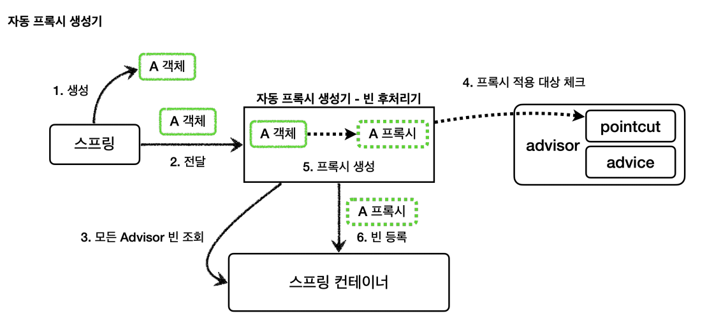
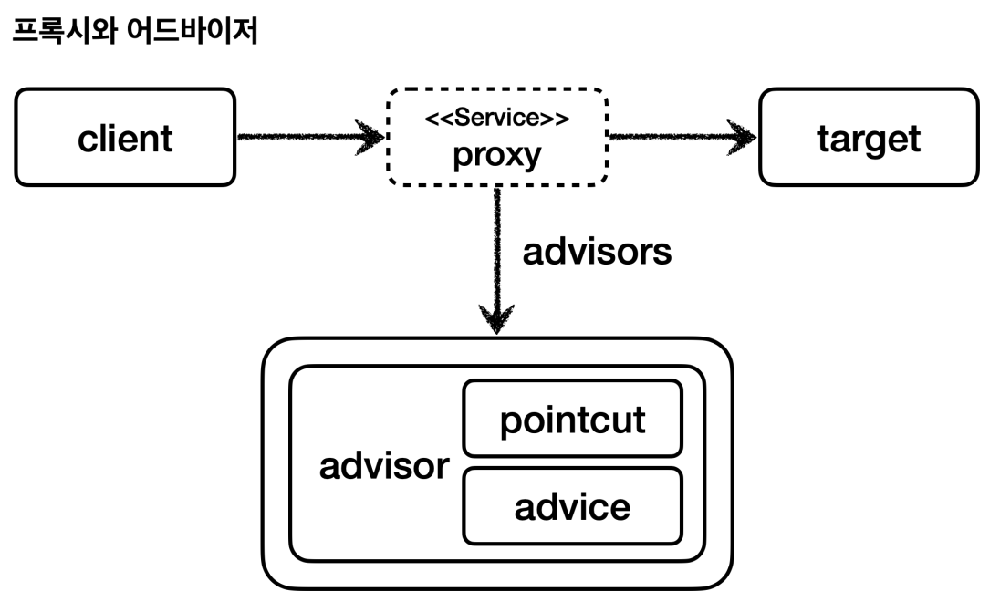

# 스프링이 제공하는 빈 후처리기

- build.gradle 추가
```java
implementation 'org.springframework.boot:spring-boot-starter-aop'
```
- 이 라이브러리를 추가하면 `aspectweaver`라는 `aspectJ` 관련 라이브러리를 등록하고 스프링 부트가 AOP 관련 클래스를 자동으로 스프링 빈에 등록한다.
- 스프링 부트가 없던 시절에는 `@EnableAspectJAutoProxy`를 직접 사용해야 했다.

**자동 프록시 생성기 - AutoProxyCreator**
- 스프링 부트 자동 설정으로 `AnnotationAwareAspectJAutoProxyCreator`라는 빈 후처리기가 스프링 빈에 자동으로 등록된다.
- 이름 그대로 자동으로 프록시를 생성해주는 빈 후처리기이다.
- 이 빈 후처리기는 스프링 빈으로 등록된 `Advisor`들을 자동으로 찾아서 프록시가 필요한 곳에 프록시를 적용해준다.
- `Advisor`안에는 `Pointcut`과 `Advice`가 이미 모두 포함되어 있다. `Advisor`만 알고 있으면 그 안에 있는 `Pointcut`으로 어떤 스프링 빈에
    프록시를 적용해야 할 지 알 수 있으며 `Advice`로 부가 기능을 적용하면 된다.



1. **생성** : 스프링이 스프링 빈 대상이 되는 객체를 생성한다.(`@Bean`, 컴포넌트 스캔 모두 포함)
2. **전달** : 생성된 객체를 빈 저장소에 등록하기 직전에 빈 후처리기에 전달한다.
3. **모든 Advisor 빈 조회** : 자동 프록시 생성기 - 빈 후처리기는 스프링 컨테이너에서 모든 `Advisor`를 조회한다.
4. **프록시 적용 대상 체크** : 앞서 조회한 `Advisor`에 포함되어 있는 포인트컷을 사용해서 해당 객체가 프록시를 적용할 대상인지 판단한다.
   - 이 때 객체의 클래스 정보는 물론이고 해당 객체의 모든 메서드를 포인트컷에 모두 매칭해본다. 조건이 하나라도 만족하면 프록시 적용 대상이 된다.
   - 10개의 메서드 중에 하나만 포인트컷 조건에 만족해도 프록시 적용 대상이 된다.
5. **프록시 생성** : 프록시 적용 대상이면 프록시를 생성해서 반환하고 프록시를 스프링 빈으로 등록한다. 프록시 적용 대상이 아니라면 원본 객체를 반환해서
        원본 객체를 스프링 빈으로 등록한다.
6. **빈 등록** : 반환된 객체는 스프링 빈으로 등록된다.



- 프록시는 내부에 어드바이저와 실제 호출해야 할 대상 객체(`target`)를 알고 있다.

## V1

```java
@Configuration
@Import({AppV1Config.class, AppV2Config.class})
public class AutoProxyConfig {

    @Bean
    public Advisor advisor1(LogTrace logTrace) {
        //pointcut
        NameMatchMethodPointcut pointcut = new NameMatchMethodPointcut();
        pointcut.setMappedNames("request*", "order*", "save*");
        //advice
        LogTraceAdvice advice = new LogTraceAdvice(logTrace);

        return new DefaultPointcutAdvisor(pointcut, advice);
    }
}

@Import(AutoProxyConfig.class)
@SpringBootApplication(scanBasePackages = "hello.proxy.app.v3")
public class ProxyApplication {

    public static void main(String[] args) {
        SpringApplication.run(ProxyApplication.class, args);
    }

    @Bean
    public LogTrace logTrace() {
        return new ThreadLocalLogTrace();
    }
}
```
- `advisor1`이라는 어드바이저 하나만 스프링 빈으로 등록했다.
- 스프링이 자동 프록시 생성기로 빈 후처리기를 자동으로 등록해준다.

**포인트컷은 2가지에 사용된다.**
1. **프록시 적용 여부 판단 - 생성 단계**
   - 자동 프록시 생성기는 포인트컷을 사용해서 해당 빈이 프록시를 생성할 필요가 있는지 없는지 체크한다.
   - 클래스 + 메서드 조건을 모두 비교한다. 이때 모든 메서드를 체크하는데 포인트컷 조건에 하나하나 매칭해본다.
   - 만약 조건에 맞는 것이 하나라도 있으면 프록시를 생성한다.
2. **어드바이스 적용 여부 판단 - 사용 단계**
   - 프록시가 호출 되었을 때 부가 기능은 어드바이스를 적용할지 말지 포인트컷을 보고 판단한다.
   - 포인트컷 조건에 만족하는 메서드만 프록시는 어드바이스를 먼저 호출하고 `target`을 호출한다.
   - 포인트컷 조건에 만족하지 않는 메서드는 어드바이스를 호출하지 않고 바로 `target`만 호출한다.

**프록시를 모든 곳에 생성하는 것은 비용 낭비다. 꼭 필요한 곳에 최소한의 프록시를 적용해야 한다.** 그래서 자동 프록시 생성기는 모든 스프링 빈에 프록시를
적용하지 않고 포인트컷으로 한번 필터링해서 어드바이스가 사용될 가능성이 있는 곳에만 프록시를 생성한다.

## V2

패키지에 메서드 이름까지 함께 지정할 수 있는 정밀한 포인트컷 조건을 설정할 수 있다.

**AspectJExpressionPointcut**
- `AspectJ`라는 AOP에 특화된 포인트컷 표현식을 적용할 수 있다.

```java
@Bean
public Advisor advisor2(LogTrace logTrace) {
    //pointcut
    AspectJExpressionPointcut pointcut = new AspectJExpressionPointcut();
    pointcut.setExpression("execution(* hello.proxy.app..*(..))");
    //advice
    LogTraceAdvice advice = new LogTraceAdvice(logTrace);

    return new DefaultPointcutAdvisor(pointcut, advice);
}
```
- `"execution(* hello.proxy.app..*(..))"`
  - `*` : 모든 반환 타입
  - `hello.proxy.app..` : 해당 패키지와 그 하위 패키지
  - `*(..)` : `*`은 모든 메서드 이름, `(..)`은 파라미터는 상관 없다.

## V3

```java
@Bean
public Advisor advisor3(LogTrace logTrace) {
    //pointcut
    AspectJExpressionPointcut pointcut = new AspectJExpressionPointcut();
    pointcut.setExpression("execution(* hello.proxy.app..*(..)) && !execution(* hello.proxy.app..noLog(..))");
    //advice
    LogTraceAdvice advice = new LogTraceAdvice(logTrace);

    return new DefaultPointcutAdvisor(pointcut, advice);
}
```
- `noLog`라는 메서드는 포인트컷 매칭에서 제외한다.


