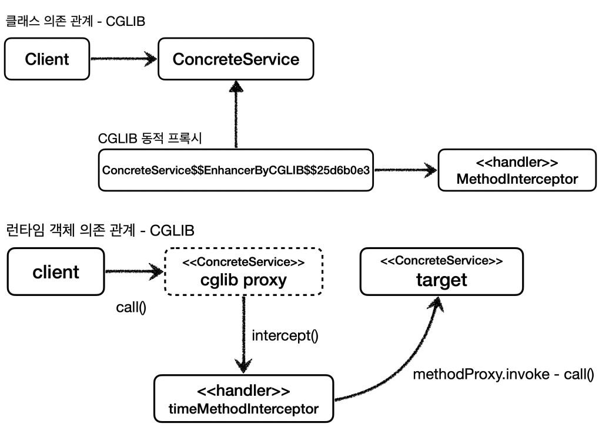
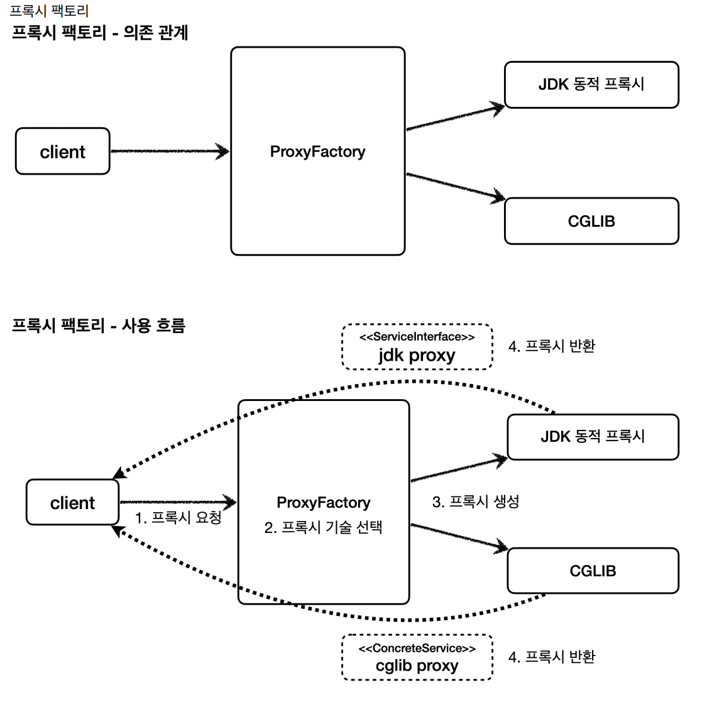
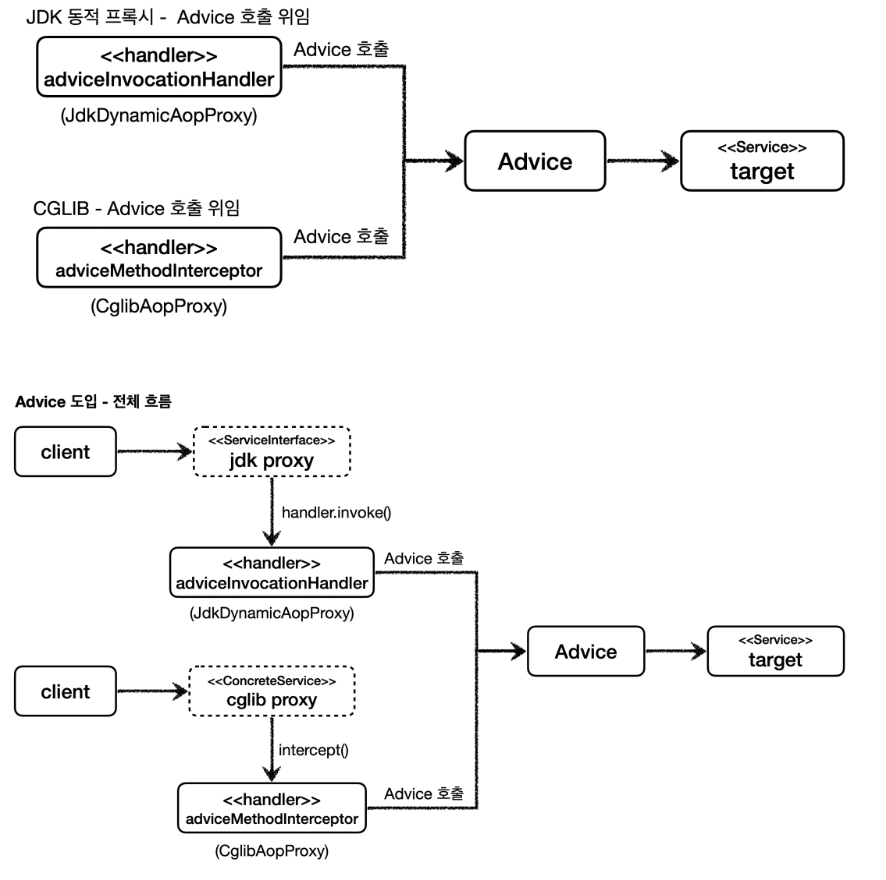

# CGLIB

**Code Generator Library**
- `CGLIB`는 바이트 코드를 조작해서 동적으로 클래스를 생성하는 기술을 제공하는 라이브러리이다.
- `CGLIB`를 사용하면 인터페이스가 없어도 구체 클래스만 가지고 동적 프록시를 생성할 수 있다.
- `CGLIB`은 원래는 외부 라이브러리인데, 스프링 프레임워크가 스프링 내부 소스 코드에 포함했다. 따라서
    스프링을 사용한다면 별도의 외부 라이브러리를 추가하지 않아도 사용할 수 있다.

```java
public interface ServiceInterface {
    void save();
    void find();
}

@Slf4j
public class ServiceImpl implements ServiceInterface{
    @Override
    public void save() {
        log.info("save 호출");
    }

    @Override
    public void find() {
        log.info("find 호출");
    }
}
```
```java
@Slf4j
public class ConcreteService {

    public void call() {
        log.info("ConcreteService 호출");
    }
}
```

## CGLIB 예제 코드

JDK 동적 프록시에서 실행 로직을 위해 `InvocationHandler`를 제공했듯이 CGLIB은 `MethodInterceptor`를 제공한다.

```java
package org.springframework.cglib.proxy;

public interface MethodInterceptor extends Callback { 
    public Object intercept(Object obj, Method method, Object[] args, MethodProxy proxy) throws Throwable;
}
```
- `Object obj` : CGLIB이 적용된 객체
- `Method method` : 호출된 메서드
- `Object[] args` : 메서드를 호출하면서 전달된 인수
- `MethodProxy proxy` : 메서드 호출에 사용

```java
@Slf4j
public class TimeMethodInterceptor implements MethodInterceptor {
    private Object target;

    public TimeMethodInterceptor(Object target) {
        this.target = target;
    }

    @Override
    public Object intercept(Object obj, Method method, Object[] args, MethodProxy methodProxy) throws Throwable {
        log.info("TimeProxy 실행");
        long startTime = System.currentTimeMillis();

        Object result = methodProxy.invoke(target, args);

        long endTime = System.currentTimeMillis();
        long resultTime = endTime - startTime;
        log.info("TimeProxy 종료, resultTime = {}", resultTime);

        return result;
    }
}
```
```java
@Test
void cglib() {
    ConcreteService target = new ConcreteService();
    
    Enhancer enhancer = new Enhancer();
    enhancer.setSuperclass(ConcreteService.class);
    enhancer.setCallback(new TimeMethodInterceptor(target));
    
    ConcreteService proxy = (ConcreteService) enhancer.create();
    
    log.info("targetClass={}", target.getClass());
    log.info("proxyClass={}", proxy.getClass());
    proxy.call();
}
```
- `Enhancer` : CGLIB는 `Enhancer`를 사용해서 프록시를 생성한다.
- `enhancer.setSuperClass()` : CGLIB는 구체 클래스를 상속 받아서 클래스를 생성할 수 있다. 어떤 구체 클래스를 상속 받을지 지정한다.
- `enhancer.setCallback()` : 프록시에 적용할 실행 로직을 할당한다.
- `enhancer.create()` : 프록시를 생성한다. 앞서 설정한 `setSuperclass()`에서 지정한 클래스를 상속 받아서 프록시가 만들어진다.

**JDK 동적 프록시는 인터페이스를 구현(`implement`)해서, CGLIB는 구체 클래스를 상속(`extend`)해서 프록시를 만든다.**



> CGLIB는 클래스 기반 프록시를 생성한다. 이 방식은 상속을 사용하기 때문에 몇 가지 제약이 있다.
> 
> - 부모 클래스의 생성자를 체크해야 한다.
> - 클래스에 `final`키워드가 붙으면 상속이 불가능하다.
> - 메서드에 `final`키워드가 붙으면 해당 메서드를 오버라이딩 할 수 없다.
> 
> 이렇게 직접 CGLIB를 사용하는 경우는 거의 없고 스프링이 제공하는 `ProxyFactory`라는 기술이 편리하게 도와준다.

<br>

## ProxyFactory

**인터페이스가 있는 경우에는 JDK 동적 프록시를 적용하고, 그렇지 않은 경우에는 CGLIB를 적용하려면 어떻게 해야할까?**

스프링은 유사한 기술들이 있을 때 그것들을 통합해서 일관성 있게 접근할 수 있고 더욱 편리하게 사용할 수 있는 추상화된 기술을 제공한다.<br>
스프링은 동적 프록시를 통합해서 편리하게 만들어주는 프록시 팩토리(`ProxyFactory`)라는 기능을 제공한다. 프록시 팩토리는 인터페이스가 있으면 JDK 동적 프록시를 사용하고
구체 클래스만 있다면 CGLIB를 사용한다. 이 설정을 변경할 수도 있다.



**두 기술을 함께 사용할 때 JDK 동적 프록시가 제공하는 `InvocationHandler`와 CGLIB가 제공하는 `MethodInterceptor`를 따로 관리해야 할까?**

스프링은 이 문제를 해결하기 위해 부가 기능을 적용할 때 `Advice`라는 개념을 도입했다. 개발자가 `Advice`만 만들면 `InvocationHandler`나 `MethodInterceptor`는
`Advice`를 호출하게 된다.



또한 스프링은 `Pointcut`이라는 개념으로 특정 메서드 이름의 조건에 맞을 때만 프록시 부가 기능이 적용되도록 해준다.

### 프록시 팩토리 예제

`Advice`를 만드는 방법은 여러가지 있지만 기본적인 방법은 이 인터페이스를 구현하면 된다.
```java
package org.aopalliance.intercept;

@FunctionalInterface
public interface MethodInterceptor extends Interceptor {
    @Nullable
    Object invoke(@Nonnull MethodInvocation invocation) throws Throwable;
}
```
- `MethodInvocation invocation` : 내부에는 다음 메서드를 호출하는 방법, 현재 프록시 객체 인스턴스, `args`, 메서드 정보 등이 포함되어 있다.
- CGLIB의 `MethodInterceptor`와 이름이 같지만 패키지가 다르다.
- 상속 관계 : `MethodInterceptor` -> `Interceptor` -> `Advice`

```java
@Slf4j
public class TimeAdvice implements MethodInterceptor {

    @Override
    public Object invoke(MethodInvocation invocation) throws Throwable {
        log.info("TimeProxy 실행");
        long startTime = System.currentTimeMillis();

        Object result = invocation.proceed();

        long endTime = System.currentTimeMillis();
        long resultTime = endTime - startTime;
        log.info("TimeProxy 종료, resultTime = {}", resultTime);

        return result;
    }
}
```
- `invocation.proceed()`를 호출하면 `target` 클래스를 호출하고 그 결과를 받는다.
  -  `target` 클래스의 정보는 `MethodInvocation invocation` 안에 모두 포함되어 있다.
  - 프록시 팩토리로 프록시를 생성하는 단계에서 이미 `target` 정보를 파라미터로 전달받는다.


```java
@Test
@DisplayName("인터페이스가 있으면 JDK 동적 프록시 사용")
void interfaceProxy() {
    ServiceInterface target = new ServiceImpl();
    ProxyFactory proxyFactory = new ProxyFactory(target);
    proxyFactory.addAdvice(new TimeAdvice());
    ServiceInterface proxy = (ServiceInterface) proxyFactory.getProxy();
    
    log.info("targetClass = {}", target.getClass());
    log.info("proxyClass = {}", proxy.getClass());
    
    proxy.save();
    
    assertThat(AopUtils.isAopProxy(proxy)).isTrue();
    assertThat(AopUtils.isJdkDynamicProxy(proxy)).isTrue();
    assertThat(AopUtils.isCglibProxy(proxy)).isFalse();
}
```
- `new ProxyFactory(target)` : 프록시 팩토리를 생성할 때 생성자에 프록시의 호출 대상을 함께 넘겨준다. 프록시 팩토리는 이 인스턴스 정보를 기반으로
    프록시를 만들어낸다. 이 인스턴스에 인터페이스가 있다면 JDK 동적 프록시를, 구체 클래스만 있다면 CGLIB를 통해서 동적 프록시를 생성한다.
- `proxyFactory.addAdvice()` : 프록시 팩토리를 통해서 만든 프록시가 사용할 부가 기능 로직을 설정한다.
- `AopUtils` : 프록시 팩토리로 프록시가 잘 적용되었는지 확인할 수 있는 유틸 클래스다.
  - 프록시 팩토리를 통해서 만들어야 `AopUtils`로 확인할 수 있다.

```java
@Test
@DisplayName("구체 클래스만 있으면 CGLIB 사용")
void concreteProxy() {
    ConcreteService target = new ConcreteService();
    ProxyFactory proxyFactory = new ProxyFactory(target);
    proxyFactory.addAdvice(new TimeAdvice());
    ConcreteService proxy = (ConcreteService) proxyFactory.getProxy();
    
    log.info("targetClass = {}", target.getClass());
    log.info("proxyClass = {}", proxy.getClass());
    
    proxy.call();
    
    assertThat(AopUtils.isAopProxy(proxy)).isTrue();
    assertThat(AopUtils.isJdkDynamicProxy(proxy)).isFalse();
    assertThat(AopUtils.isCglibProxy(proxy)).isTrue();
}
```

```java
@Test
@DisplayName("ProxyTargetClass 옵션을 사용하면 인터페이스가 있어도 CGLIB을 사용하고 클래스 기반 프록시 사용")
void proxyTargetClass() {
    ServiceInterface target = new ServiceImpl();
    ProxyFactory proxyFactory = new ProxyFactory(target);
    proxyFactory.setProxyTargetClass(true);//추가
    proxyFactory.addAdvice(new TimeAdvice());
    ServiceInterface proxy = (ServiceInterface) proxyFactory.getProxy();
    
    log.info("targetClass = {}", target.getClass());
    log.info("proxyClass = {}", proxy.getClass());
    
    proxy.save();
    
    assertThat(AopUtils.isAopProxy(proxy)).isTrue();
    assertThat(AopUtils.isJdkDynamicProxy(proxy)).isFalse();
    assertThat(AopUtils.isCglibProxy(proxy)).isTrue();//인터페이스가 있어도 CGLIB를 사용한다.
}
```

## 프록시 팩토리 정리

- **프록시 팩토리의 기술 선택 방법**
  - 대상에 인터페이스가 있으면 : JDK 동적 프록시, 인터페이스 기반 프록시
  - 대상에 구체 클래스만 있으면 : CGLIB, 구체 클래스 기반 프록시
  - `proxyTargetClass=ture` : CGLIB, 인터페이스 여부와 상관없이 구체 클래스 기반 프록시

**프록시의 부가 기능 로직을 특정 기술에 종속적이지 않게 `Advice`하나로 편리하게 사용할 수 있었다. 이것은 프록시 팩토리가 내부에서 JDK 동적 프록시인 경우
`InvocationHandler`가 `Advice`를 , CGLIB인 경우 `MethodInterceptor`가 `Advice`를 호출하도록 기능을 개발해두었기 때문이다.**

> **참고**
> 
> 스프링 부트는 AOP를 적용할 때 기본적으로 `proxyTargetClass=true`로 설정해서 사용한다. 따라서 인터페이스가 있어도 항상 CGLIB를 사용해서
> 구체 클래스를 기반으로 프록시를 생성한다.

