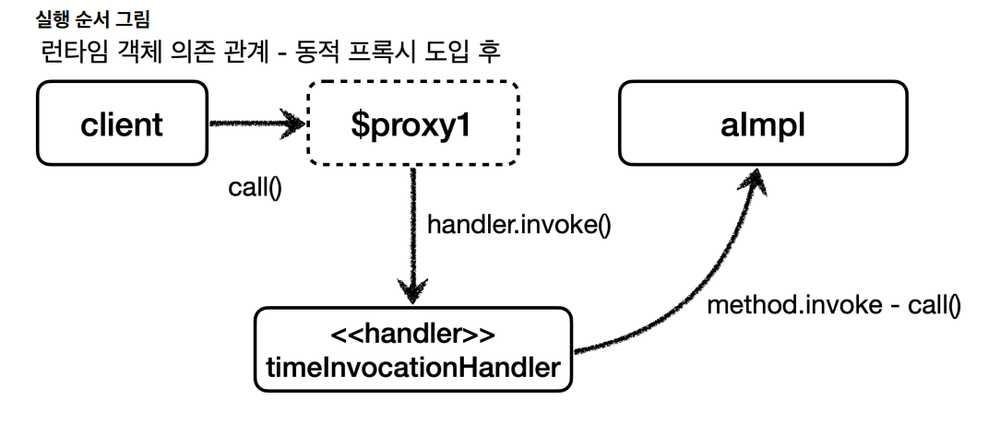
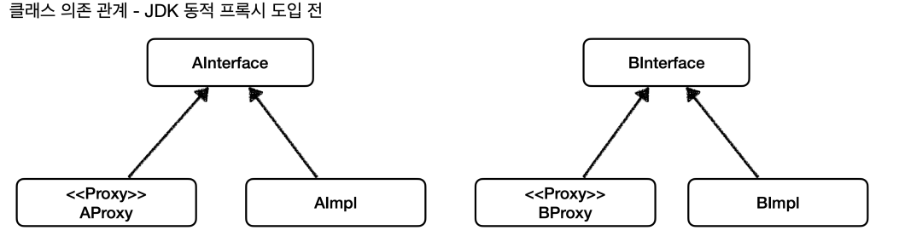
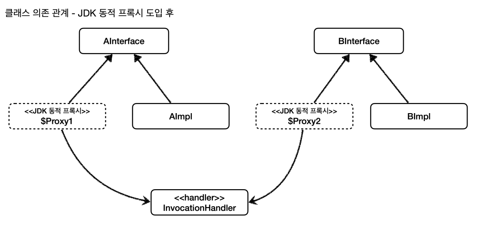
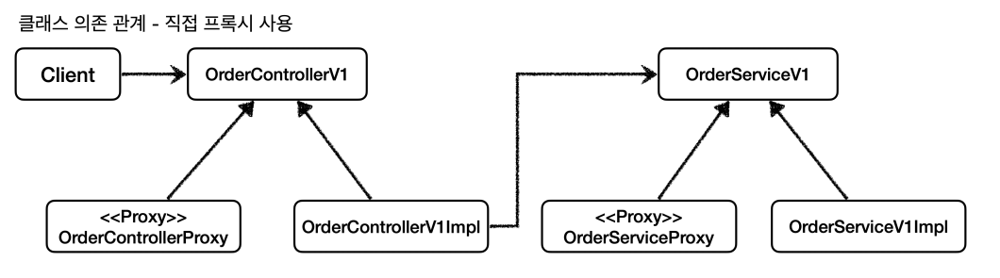
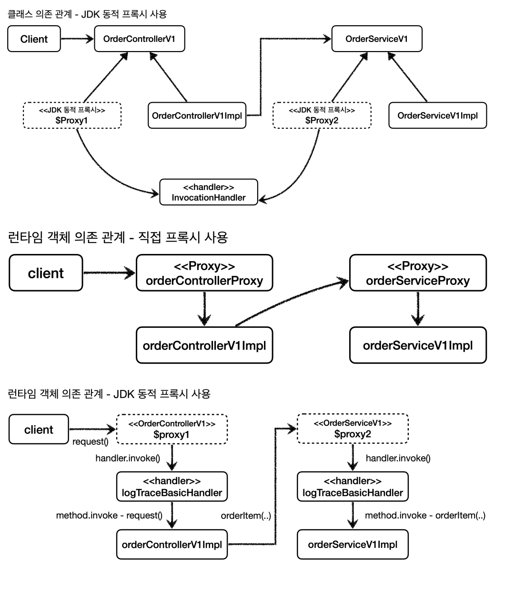

# JDK 동적 프록시

## 리플렉션

```java
@Test
void reflection0() {
    Hello target = new Hello();
    
    //공통 로직1 시작
    log.info("start");
    String result1 = target.callA();//호출하는 메서드가 다르다.
    log.info("result1={}", result1);
    
    //공통 로직2 시작
    log.info("start");
    String result2 = target.callB();//호출하는 메서드가 다르다.
    log.info("result2={}", result2);
}

@Slf4j
static class Hello{
    public String callA() {
        log.info("callA");
        return "A";
    }
    
    public String callB() {
        log.info("callB");
        return "B";
    }
}
```
- 호출하는 메서드만 다르고 전체 코드 흐름이 완전히 같다.
- 공통 로직1과 2를 하나의 메서드로 뽑고 싶지만 중간에 호출하는 메서드가 다르기 때문에 쉽지 않다.
- 호출하는 메서드를 동적으로 처리할 수 있다면 중복 문제를 해결할 수 있을 것 같다.

이럴 때 사용하는 기술이 바로 `리플렉션`이다. **리플렉션은 클래스나 메서드의 메타정보를 사용해서 동적으로 호출하는 매서드를 변경할 수 있다.**

```java
@Test
void reflection1() throws Exception {
    //클래스 정보
    Class<?> classHello = Class.forName("hello.proxy.jdkdynamic.ReflectionTest$Hello");
    
    Hello target = new Hello();
    
    Method methodCallA = classHello.getMethod("callA");//callA 메서드 정보
    Object result1 = methodCallA.invoke(target);
    log.info("result1={}", result1);
    
    Method methodCallB = classHello.getMethod("callB");//callA 메서드 정보
    Object result2 = methodCallB.invoke(target);
    log.info("result2={}", result2);
}
```
- `Class.forName("hello.proxy.jdkdynamic.ReflectionTest$Hello");` : 클래스 메타정보를 획득한다. 내부 클래스는 구분을 위해 `$`를 사용한다.
- `classHello.getMethod("callA");` : 해당 클래스의 메서드 메타정보를 획득한다.
- `methodCallA.invoke(target);` : 획득한 메서드 메타정보로 실제 인스턴스의 메서드를 호출한다.
  - 호출하면서 인스턴스를 넘겨주면 해당 인스턴스의 메서드를 찾아서 실행한다.
  - `invoke` : 부르다, 언급하다

**이제 공통 로직을 만들 수 있게 되었다.**

```java
@Test
void reflection2() throws Exception{
    Class<?> classHello = Class.forName("hello.proxy.jdkdynamic.ReflectionTest$Hello");
    
    Hello target = new Hello();
    
    Method methodCallA = classHello.getMethod("callA");
    dynamicCall(methodCallA, target);
    
    Method methodCallB = classHello.getMethod("callB");
    dynamicCall(methodCallB, target);
}

private void dynamicCall(Method method, Object target) throws Exception {
    log.info("start");
    Object result1 = method.invoke(target);
    log.info("result1={}", result1);
```
- `dynamicCall(Method method, Object target)`
  - 첫 번째 파라미터로 호출할 메서드 정보가 넘어온다. 
    - 기존에는 메서드 이름을 직접 호출했지만 이제는 `Method`라는 메타정보를 통해서 호출할 메서드 정보가 동적으로 제공된다.
  - 두 번째 파라미터로 실제 실행할 인스턴스 정보가 넘어온다.
    - 타입이 `Object`라는 것은 어떠한 인스턴스도 받을 수 있다는 뜻이다.

> **주의**
> 
> 리플렉션 기술은 런타임에 동작하기 때문에 컴파일 시점에 오류를 잡을 수 없다. 예를 들어 `getMethod()` 부분에 문자를 실수로 잘못 적어도 컴파일 오류가 나지 않고
> 해당 코드를 직접 실행하는 시점에 발생하는 오류인 런타임 오류가 발생한다.

<br>

## JDK 동적 프록시 예제

> 프록시를 적용하기 위해서 적용 대상의 숫자 만큼 프록시 클래스를 만들었다. 즉 클래스에 비례해서 프록시 클래스를 만들어야 했다. 문제는 프록시의 로직은 같은데
> 적용 대상에만 차이가 있는 것이다.
> 
> `동적 프록시` 기술을 사용하면 개발자가 직접 프록시 클래스를 만들지 않아도 된다. 동적 프록시에 원하는 실행 로직을 지정할 수 있다.
> 
> **JDK 동적 프록시는 인터페이스를 기반으로 동적으로 만들어 주기 때문에 인터페이스가 필수이다.**

```java
public interface AInterface {
    String call();
}

@Slf4j
public class AImpl implements AInterface{
    @Override
    public String call() {
        log.info("A 호출");
        return "A";
    }
}
```

```java
public interface BInterface {
    String call();
}

@Slf4j
public class BImpl implements BInterface{
    @Override
    public String call() {
        log.info("B 호출");
        return "B";
    }
}
```

JDK 동적 프록시를 사용하면 각 인터페이스마다 따로따로 프록시 클래스를 만들지 않아도 된다.

**JDK 동적 프록시에 적용할 로직은 `InvocationHandler` 인터페이스를 구현하면 된다.**

```java
package java.lang.reflect;

public interface InvocationHandler {
    public Object invoke(Object proxy, Method method, Object[] args) throws Throwable;
}
```
**제공되는 파라미터**
- `Object proxy` : 프록시 자신
- `Method method` : 호출한 메서드
- `Object[] args` : 메서드를 호출할 때 전달한 인수

```java
@Slf4j
public class TimeInvocationHandler implements InvocationHandler {

    private final Object target;

    public TimeInvocationHandler(Object target) {
        this.target = target;
    }

    @Override
    public Object invoke(Object proxy, Method method, Object[] args) throws Throwable {
        log.info("TimeProxy 실행");
        long startTime = System.currentTimeMillis();

        Object result = method.invoke(target, args);
        
        long endTime = System.currentTimeMillis();
        long resultTime = endTime - startTime;
        log.info("TimeProxy 종료, resultTime = {}", resultTime);

        return result;
    }
}
```
- `Object target` : 동적 프록시가 호출할 대상
- `method.invoke(target, args)` : 리플렉션을 사용해서 `target` 인스턴스의 메서드를 실행한다.

```java
@Test
void dynamicA() {
    AInterface target = new AImpl();
    TimeInvocationHandler handler = new TimeInvocationHandler(target);
    AInterface proxy = (AInterface) Proxy.newProxyInstance(AInterface.class.getClassLoader(),
                                    new Class[]{AInterface.class}, handler);
    proxy.call();
    log.info("targetClass={}", target.getClass());
    log.info("proxyClass={}", proxy.getClass());
}

@Test
void dynamicB() {
    BInterface target = new BImpl();
    TimeInvocationHandler handler = new TimeInvocationHandler(target);
    BInterface proxy = (BInterface) Proxy.newProxyInstance(BInterface.class.getClassLoader(),
                                    new Class[]{BInterface.class}, handler);
    proxy.call();
    log.info("targetClass={}", target.getClass());
    log.info("proxyClass={}", proxy.getClass());
}
```
- `new TimeInvocationHandler(target);` : 동적 프록시에 적용할 핸들러 로직
- `Proxy.newProxyInstance(AInterface.class.getClassLoader(),new Class[]{AInterface.class}, handler);` : 
  클래스 로더 정보, 인터페이스, 핸들러 로직을 넣어주면 해당 인터페이스를 기반으로 동적 프록시를 생성하고 그 결과를 반환해준다.



1. 클라이언트는 JDK 동적 프록시의 `call()`을 실행한다.
2. JDK 동적 프록시는 `InvocationHandler.invoke()`를 호출한다. `TimeInvocationHandler`가 구현체로 있으므로 `TimeInvocationHandler.invoke()`가 호출된다.
3. `TimeInvocationHandler`가 내부 로직을 수행하고 `method.invoke(target, args)`를 호출해서 `target`인 실제 객체(`AImpl`)를 호출한다.
4. 실제 객체 인스턴스의 `call()`이 실행된다.
5. 실제 객체 인스턴스의 `call()`의 실행이 끝나면 `TimeInvocationHandler`로 응답이 돌아온다. 시간 로그를 출력하고 결과를 반환한다.

> JDK 동적 프록시 기술 덕분에 적용 대상 만큼 프록시 객체를 만들지 않아도 된다. 같은 부가 기능 로직을 한 번만 개발해서 공통으로 적용할 수 있다.





<br>

## JDK 동적 프록시 적용
> **JDK 동적 프록시는 인터페이스가 필수다.**

```java
@RequiredArgsConstructor
public class LogTraceBasicHandler implements InvocationHandler {

    private final Object target;
    private final LogTrace logTrace;

    @Override
    public Object invoke(Object proxy, Method method, Object[] args) throws Throwable {
        TraceStatus status = null;
        try {
            String message = method.getDeclaringClass().getSimpleName() + "." + method.getName() + "()";
            status = logTrace.begin(message);

            Object result = method.invoke(target, args);
            logTrace.end(status);
            return result;
        } catch (Exception e) {
            logTrace.exception(status, e);
            throw e;
        }
    }
}
```
- `Method`를 통해서 호출되는 메서드 정보와 클래스 정보를 동적으로 확인할 수 있기 때문에 이 정보를 사용하면 된다.

```java
@Configuration
public class DynamicProxyBasicConfig {

    @Bean
    public OrderControllerV1 orderControllerV1(LogTrace logTrace) {
        OrderControllerV1Impl orderController = new OrderControllerV1Impl(orderServiceV1(logTrace));
        return  (OrderControllerV1) Proxy.newProxyInstance(
                                            OrderControllerV1.class.getClassLoader(),
                                            new Class[]{OrderControllerV1.class},
                                            new LogTraceBasicHandler(orderController, logTrace));
    }

    @Bean
    public OrderServiceV1 orderServiceV1(LogTrace logTrace) {
        OrderServiceV1Impl orderService = new OrderServiceV1Impl(orderRepositoryV1(logTrace));
        return  (OrderServiceV1) Proxy.newProxyInstance(
                                        OrderServiceV1.class.getClassLoader(),
                                        new Class[]{OrderServiceV1.class},
                                        new LogTraceBasicHandler(orderService, logTrace));
    }

    @Bean
    public OrderRepositoryV1 orderRepositoryV1(LogTrace logTrace) {
        OrderRepositoryV1Impl orderRepository = new OrderRepositoryV1Impl();

        return (OrderRepositoryV1) Proxy.newProxyInstance(
                                        OrderRepositoryV1.class.getClassLoader(),
                                        new Class[]{OrderRepositoryV1.class},
                                        new LogTraceBasicHandler(orderRepository, logTrace));
    }
}

@Import(DynamicProxyBasicConfig.class)
@SpringBootApplication(scanBasePackages = "hello.proxy.app.v3")
public class ProxyApplication {

  public static void main(String[] args) {
    SpringApplication.run(ProxyApplication.class, args);
  }

  @Bean
  public LogTrace logTrace() {
    return new ThreadLocalLogTrace();
  }
}
```





**이제 특정 조건을 만족할 때만 로그를 남기는 기능을 개발해보자.**

```java
public class LogTraceFilterHandler implements InvocationHandler {

    private final Object target;
    private final LogTrace logTrace;
    private final String[] patterns;

    public LogTraceFilterHandler(Object target, LogTrace logTrace, String[] patterns) {
        this.target = target;
        this.logTrace = logTrace;
        this.patterns = patterns;
    }

    @Override
    public Object invoke(Object proxy, Method method, Object[] args) throws Throwable {
        String methodName = method.getName();

        if (!PatternMatchUtils.simpleMatch(patterns, methodName)) {
            return method.invoke(target, args);
        }
        TraceStatus status = null;
        try {
            String message = method.getDeclaringClass().getSimpleName() + "." + method.getName() + "()";
            status = logTrace.begin(message);

            Object result = method.invoke(target, args);
            logTrace.end(status);
            return result;
        } catch (Exception e) {
            logTrace.exception(status, e);
            throw e;
        }
    }
}
```
- 특정 메서드 이름이 매칭되지 않으면 실제 로직을 바로 호출한다.
- 스프링이 제공하는 `PatternMatchUtils.simpleMatch()`를 사용하면 단순한 매칭 로직을 쉽게 적용할 수 있다.
- 적용할 패턴은 생성자를 통해서 외부에서 주입 받는다.

```java
@Configuration
public class DynamicProxyFilterConfig {
    private static final String[] PATTERNS = {"request*", "order*", "save*"};

    @Bean
    public OrderControllerV1 orderControllerV1(LogTrace logTrace) {
        OrderControllerV1Impl orderController = new OrderControllerV1Impl(orderServiceV1(logTrace));
        return  (OrderControllerV1) Proxy.newProxyInstance(
                                            OrderControllerV1.class.getClassLoader(),
                                            new Class[]{OrderControllerV1.class},
                                            new LogTraceFilterHandler(orderController, logTrace, PATTERNS));
    }

    @Bean
    public OrderServiceV1 orderServiceV1(LogTrace logTrace) {
        OrderServiceV1Impl orderService = new OrderServiceV1Impl(orderRepositoryV1(logTrace));
        return  (OrderServiceV1) Proxy.newProxyInstance(
                                        OrderServiceV1.class.getClassLoader(),
                                        new Class[]{OrderServiceV1.class},
                                        new LogTraceFilterHandler(orderService, logTrace, PATTERNS));
    }

    @Bean
    public OrderRepositoryV1 orderRepositoryV1(LogTrace logTrace) {
        OrderRepositoryV1Impl orderRepository = new OrderRepositoryV1Impl();

        return (OrderRepositoryV1) Proxy.newProxyInstance(
                                        OrderRepositoryV1.class.getClassLoader(),
                                        new Class[]{OrderRepositoryV1.class},
                                        new LogTraceFilterHandler(orderRepository, logTrace, PATTERNS));
    }
}

@Import(DynamicProxyFilterConfig.class)
@SpringBootApplication(scanBasePackages = "hello.proxy.app.v3")
public class ProxyApplication {

  public static void main(String[] args) {
    SpringApplication.run(ProxyApplication.class, args);
  }

  @Bean
  public LogTrace logTrace() {
    return new ThreadLocalLogTrace();
  }
}
```
- 메서드 이름이 `request`, `order`, `save`로 시작하는 메서드만 로그를 남긴다.

> **JDK 동적 프록시 한계**
> 
> **JDK 동적 프록시는 인터페이스가 필수이다.** 인터페이스 없이 동적 프록시를 적용하기 위해서는 일반적인 방법으로는 어렵고 `CGLIB`이라는 바이트 코드를 조작하는
> 특별한 라이브러리를 사용해야 한다.