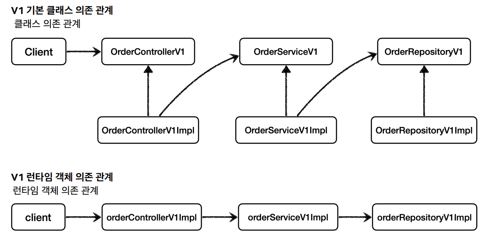
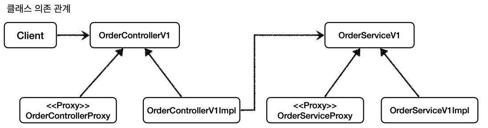
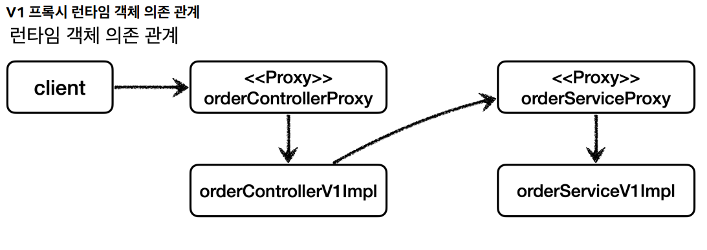
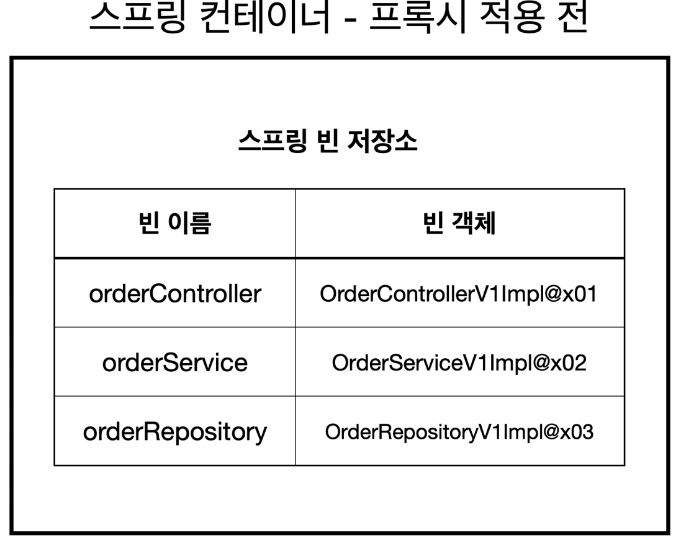
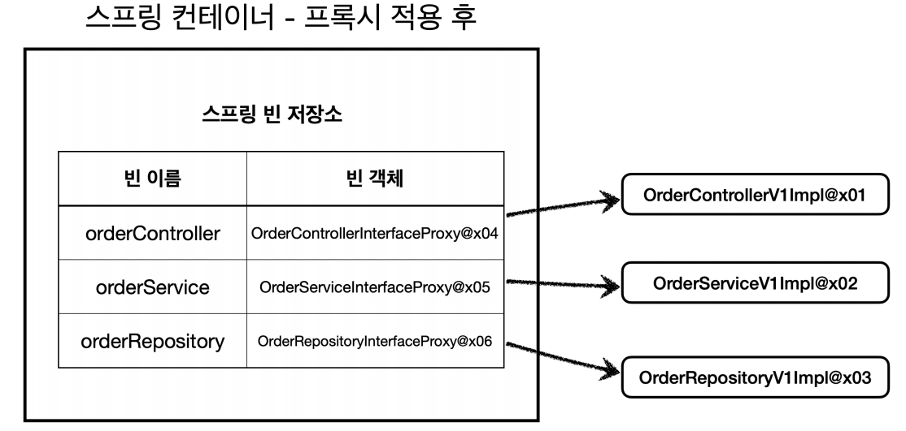

# 인터페이스 기반 프록시



**여기에 로그 추적용 프록시를 추적하면 이렇게 된다.**





각각 인터페이스에 맞는 프록시 구현체를 추가한 다음 애플리케이션 실행 시점에 프록시를 사용하도록 의존 관계를 설정해주어야 한다.

```java
@RequiredArgsConstructor
public class OrderRepositoryInterfaceProxy implements OrderRepositoryV1 {

    private final OrderRepositoryV1 target;//실제 객체
    private final LogTrace logTrace;

    @Override
    public void save(String itemId) {
        TraceStatus status = null;
        try {
            status = logTrace.begin("OrderRepository.save()");

            target.save(itemId);
            logTrace.end(status);
        } catch (Exception e) {
            logTrace.exception(status, e);
            throw e;
        }
    }
}

@RequiredArgsConstructor
public class OrderServiceInterfaceProxy implements OrderServiceV1 {

    private final OrderServiceV1 target;//실제 객체
    private final LogTrace logTrace;

    @Override
    public void orderItem(String itemId) {
        TraceStatus status = null;
        try {
            status = logTrace.begin("OrderService.orderItem()");

            target.orderItem(itemId);
            logTrace.end(status);
        } catch (Exception e) {
            logTrace.exception(status, e);
            throw e;
        }
    }
}

@RequiredArgsConstructor
public class OrderControllerInterfaceProxy implements OrderControllerV1 {

    private final OrderControllerV1 target;//실제 객체
    private final LogTrace logTrace;

    @Override
    public String request(String itemId) {
        TraceStatus status = null;
        try {
            status = logTrace.begin("OrderController.request()");

            String result = target.request(itemId);
            logTrace.end(status);
            return result;
        } catch (Exception e) {
            logTrace.exception(status, e);
            throw e;
        }
    }

    @Override
    public String noLog() {
        return target.noLog();
    }
}
```
```java
@Configuration
public class InterfaceProxyConfig {

    @Bean
    public OrderControllerV1 orderController(LogTrace logTrace) {
        OrderControllerV1Impl controllerImpl = new OrderControllerV1Impl(orderService(logTrace));

        return new OrderControllerInterfaceProxy(controllerImpl, logTrace);//프록시 빈 등록
    }

    @Bean
    public OrderServiceV1 orderService(LogTrace logTrace) {
        OrderServiceV1Impl serviceImpl = new OrderServiceV1Impl(orderRepository(logTrace));

        return new OrderServiceInterfaceProxy(serviceImpl, logTrace);//프록시 빈 등록
    }

    @Bean
    public OrderRepositoryV1 orderRepository(LogTrace logTrace) {
        OrderRepositoryV1Impl repositoryImpl = new OrderRepositoryV1Impl();

        return new OrderRepositoryInterfaceProxy(repositoryImpl, logTrace);//프록시 빈 등록
    }
}

@Import(InterfaceProxyConfig.class)
@SpringBootApplication(scanBasePackages = "hello.proxy.app.v3")
public class ProxyApplication {

    public static void main(String[] args) {
        SpringApplication.run(ProxyApplication.class, args);
    }

    @Bean
    public LogTrace logTrace() {
        return new ThreadLocalLogTrace();
    }
}
```

- **실제 객체를 스프링 빈으로 등록하지 않고 프록시를 실제 스프링 빈 대신 등록한다.**
- 프록시는 내부에 실제 객체(타겟)를 참조하고 있다.





- 스프링 컨테이너는 실제 객체가 아니라 **프록시 객체를 스프링 빈으로 등록하고 관리한다.**
- 실제 객체는 스프링 컨테이너와는 상관이 없고 프록시 객체를 통해서 참조될 뿐이다.

<br>

# 구체 클래스 기반 프록시

```java
@RequiredArgsConstructor
public class OrderRepositoryConcreteProxy extends OrderRepositoryV2 {

    private final OrderRepositoryV2 target;
    private final LogTrace logTrace;

    @Override
    public void save(String itemId) {
        TraceStatus status = null;
        try {
            status = logTrace.begin("OrderRepository.save()");

            target.save(itemId);
            logTrace.end(status);
        } catch (Exception e) {
            logTrace.exception(status, e);
            throw e;
        }
    }
}

public class OrderServiceConcreteProxy extends OrderServiceV2 {

    private final OrderServiceV2 target;
    private final LogTrace logTrace;

    public OrderServiceConcreteProxy(OrderServiceV2 target, LogTrace logTrace) {
        super(null);//부모의 생성자를 호출해야 함.
        this.target = target;
        this.logTrace = logTrace;
    }

    @Override
    public void orderItem(String itemId) {
        TraceStatus status = null;
        try {
            status = logTrace.begin("OrderService.orderItem()");

            target.orderItem(itemId);
            logTrace.end(status);
        } catch (Exception e) {
            logTrace.exception(status, e);
            throw e;
        }
    }
}

public class OrderControllerConcreteProxy extends OrderControllerV2 {

    private final OrderControllerV2 target;
    private LogTrace logTrace;

    public OrderControllerConcreteProxy(OrderControllerV2 target, LogTrace logTrace) {
        super(null);//부모의 생성자를 호출해야 함.
        this.target = target;
        this.logTrace = logTrace;
    }

    @Override
    public String request(String itemId) {
        TraceStatus status = null;
        try {
            status = logTrace.begin("OrderController.request()");

            String result = target.request(itemId);
            logTrace.end(status);
            return result;
        } catch (Exception e) {
            logTrace.exception(status, e);
            throw e;
        }
    }

    @Override
    public String noLog() {
        return target.noLog();
    }
}
```
```java
@Configuration
public class ConcreteProxyConfig {

    @Bean
    public OrderControllerV2 orderControllerV2(LogTrace logTrace) {
        OrderControllerV2 controllerImpl = new OrderControllerV2(orderServiceV2(logTrace));
        return new OrderControllerConcreteProxy(controllerImpl, logTrace);
    }

    @Bean
    public OrderServiceV2 orderServiceV2(LogTrace logTrace) {
        OrderServiceV2 serviceImpl = new OrderServiceV2(orderRepositoryV2(logTrace));
        return new OrderServiceConcreteProxy(serviceImpl, logTrace);
    }

    @Bean
    public OrderRepositoryV2 orderRepositoryV2(LogTrace logTrace) {
        OrderRepositoryV2 repositoryImpl = new OrderRepositoryV2();
        return new OrderRepositoryConcreteProxy(repositoryImpl, logTrace);
    }
}

@Import(ConcreteProxyConfig.class)
@SpringBootApplication(scanBasePackages = "hello.proxy.app.v3")
public class ProxyApplication {

    public static void main(String[] args) {
        SpringApplication.run(ProxyApplication.class, args);
    }

    @Bean
    public LogTrace logTrace() {
        return new ThreadLocalLogTrace();
    }
}
```
## 인터페이스 기반 프록시와 클래스 기반 프록시

- 인터페이스가 없어도 클래스 기반으로 프록시를 생성할 수 있다.
- 클래스 기반 프록시는 상속을 사용하기 때문에 몇 가지 단점이 있다.
- 부모 클래스의 생성자를 호출해야 한다.
- 클래스에 `final`키워드가 붙으면 상속이 불가능하다.
- 메서드에 `final`키워드가 붙으면 오버라이드을 할 수 없다.

대체적으로 클래스 기반 프록시보다는 인터페이스 기반의 프록시가 더 좋다. 인터페이스 기반의 프록시는 상속이라는 제약에서 자유롭다.

인터페이스 기반 프록시의 단점은 인터페이스가 필요하다는 것이다. 인터페이스가 없다면 인터페이스 기반 프록시를 만들 수 없다.

> 이론적으로는 모든 객체에 인터페이스를 도입해서 역할과 구현을 나누는 것이 좋다. 이렇게 하면 역할과 구현을 나누어서 구현체를 편리하게 변경할 수 있다.
> 
> 인터페이스를 도입하는 것은 구현을 변경할 가능성이 있을 때 효과적인데 구현을 변경할 가능성이 거의 없는 코드에 인터페이스를 적용하는 것은 번거롭고 실용적이지 않다.
> 
> 이런 곳에는 인터페이스를 적용하기 보다 구체 클래스를 바로 사용하는 것이 좋을 수도 있다.

프록시를 사용해서 기존 코드를 변경하지 않고 로그 추적기라는 부가 기능을 적용할 수 있었다. 문제는 프록시 클래스를 너무 많이 만들어야 한다는 점이다.

프록시 클래스가 하는 로직은 대상 클래스만 다를 뿐 모두 똑같다. **프록시 클래스를 하나만 만들어서 모든 곳에 적용하는 방법은 없을까?**

**동적 프록시 기술이 이 문제를 해결해준다.**