# 프록시 패턴 & 데코레이터 패턴

## 프록시 패턴


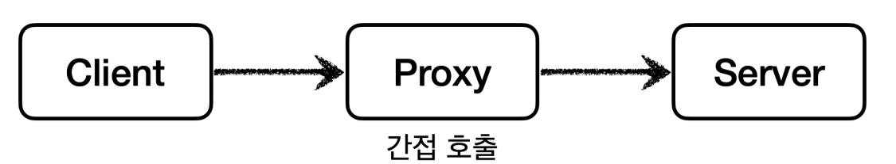

클라이언트가 요청한 결과를 서버에 직접 요청하는 것이 아니라 대리자(`Proxy`)를 통해서 대신 간접적으로 서버에 요청할 수 있다.

직접 호출과 다르게 간접 호출을 하면 대리자가 중간에서 여러가지 일을 할 수가 있다.
- **접근 제어, 캐싱**
  - 대리자가 이미 정보를 갖고 있으면 직접 서버를 호출하지 않아도 된다.
- **부가 기능 추가**
  - 진짜 서버가 제공하는 기능에 대해서 대리자가 부가적인 기능을 추가할 수 있다.
- **프록시 체인**
  - 대리자가 또 다른 대리자에게 요청할 수도 있다.
  - 중요한 점은 클라이언트는 대리자에게 한 번 요청한 이후 과정은 전혀 모른다는 점이다.
  
    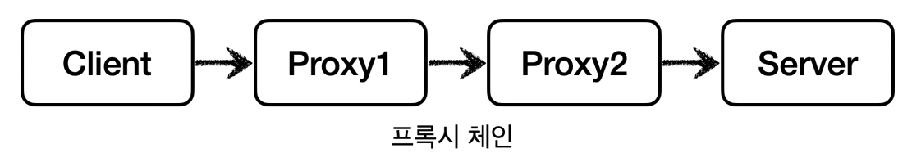

**객체에서 프록시가 되려면 클라이언트는 서버에 요청을 한 것인지 프록시에 요청을 한 것인지 전혀 몰라야 한다.** 

즉 서버와 프록시는 같은 인터페이스를 사용해야 한다. 그리고 클라이언트가 사용하는 서버 객체를 프록시 객체로 변경해도 클라이언트 코드를 전혀 변경하지 않고
동작할 수 있어야 한다.

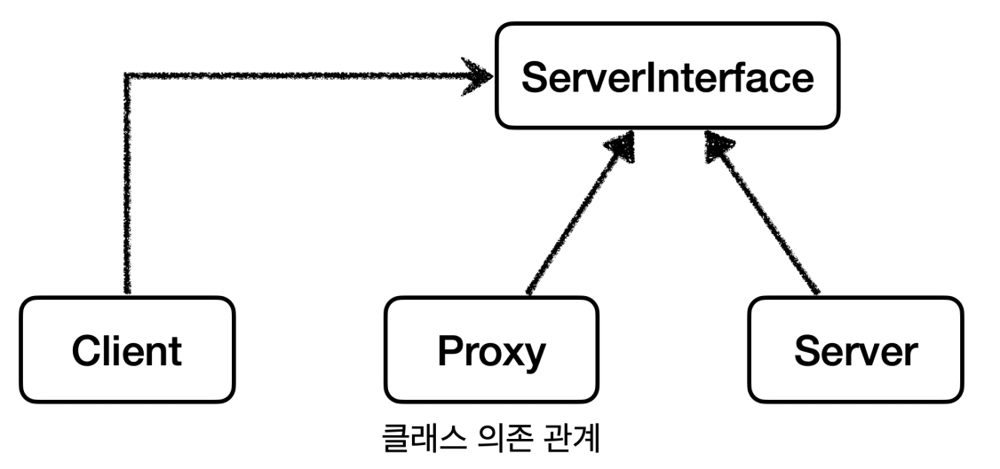

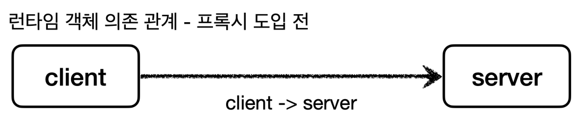

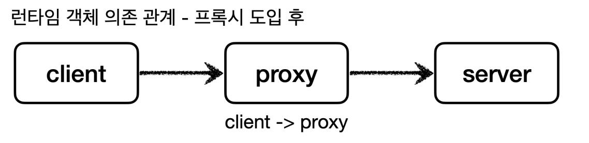

프록시 객체가 중간에 있으면 크게 2가지 기능을 수행할 수 있다.
- **접근 제어**
  - 권한에 따른 접근 차단
  - 캐싱
  - 지연 로딩
- **부가 기능 추가**
  - 원래 서버가 제공하는 기능에 더해서 부가 기능을 수행한다.
  - 예) 요청 값이나 응답 값을 중간에 변형
  - 예) 실행 시간을 측정해서 추가 로그를 남김

> **GOF 디자인 패턴**
> 
> GOF 디자인 패턴에서는 의도에 따라 프록시 패턴과 데코레이터 패턴을 구분한다.
> - **프록시 패턴** : 접근 제어가 목적
> - **데코레이터 패턴** : 새로운 기능 추가가 목적
> 
> **둘 다 프록시를 사용하지만 의도가 다르다는 점이 핵심이다.**

<br>

## 프록시 패턴 예제

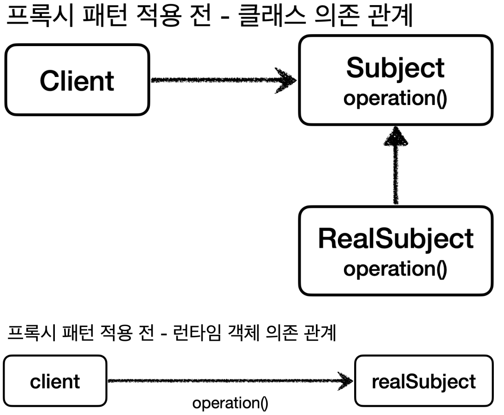

```java
public interface Subject {
    String operation();
}

@Slf4j
public class RealSubject implements Subject{
    @Override
    public String operation() {
        log.info("실제 객체 호출");
        sleep();
        return "data";
    }

    private void sleep() {
        try {
            Thread.sleep(1000);
        } catch (InterruptedException e) {
            throw new RuntimeException(e);
        }
    }
}
```
- 데이터를 조회하는 데 1초가 걸리는 로직이다.

```java
public class ProxyPatternClient {
    private Subject subject;

    public ProxyPatternClient(Subject subject) {
        this.subject = subject;
    }

    public void execute() {
        subject.operation();
    }
}

@Test
void noProxyTest() {
    RealSubject realSubject = new RealSubject();
    ProxyPatternClient client = new ProxyPatternClient(realSubject);
    client.execute();
    client.execute();
    client.execute();
}
```
- `execute()`를 3번 호출하므로 총 3초가 걸린다.

이 데이터가 한 번 조회되고 변하지 않는 데이터라면 처음 조회했을 때만 조회한 다음 어딘가에 보관해두고 이후 호출할 때는 보관된 데이터를 사용하는 것이
성능상 좋을 것이다. 

**이런 것을 `캐시`라고 한다.**

프록시 객체를 통해서 캐시를 적용해보자.

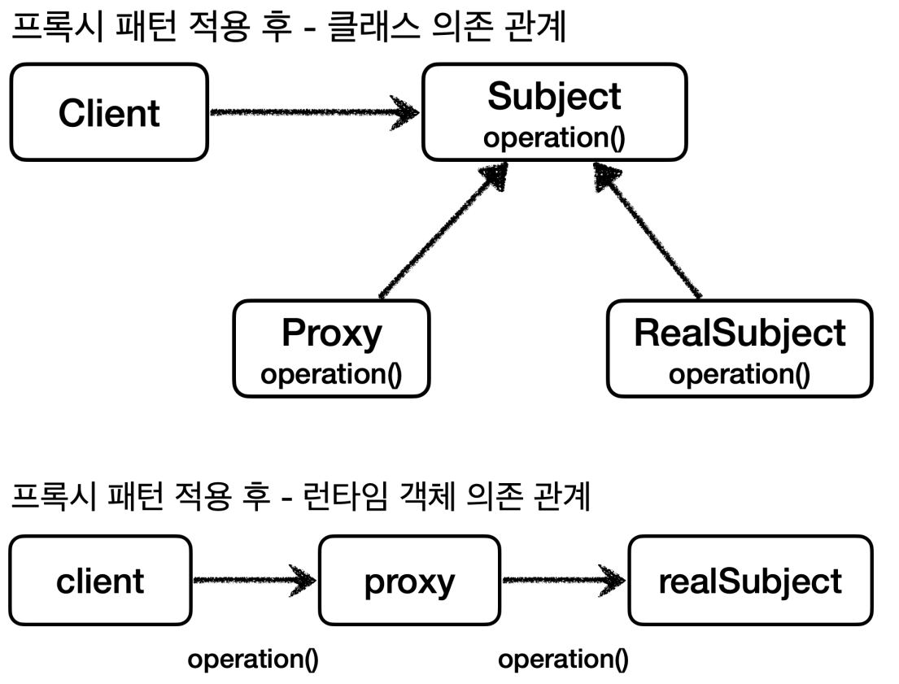

```java
@Slf4j
public class CacheProxy implements Subject{

    private Subject target;
    private String cacheValue;

    public CacheProxy(Subject target) {
        this.target = target;
    }

    @Override
    public String operation() {
        log.info("프록시 호출");
        if (cacheValue == null) {
            cacheValue = target.operation();
        }
        return cacheValue;
    }
}
```
- 프록시도 실제 객체와 모양이 같아야 하기 때문에 인터페이스를 구현해야 한다.
- `private Subject target` : 클라이언트가 프록시를 호출하면 프록시가 최종적으로 실제 객체를 호출해야 하기 때문에 프록시는 내부에 실제 객체의 참조를
    가지고 있어야 한다. 이렇게 프록시가 호출하는 대상을 `target`이라 한다.

```java
@Test
void cacheProxyTest() {
    RealSubject realSubject = new RealSubject();//진짜 객체
    CacheProxy cacheProxy = new CacheProxy(realSubject);//프록시 객체, 프록시는 진짜(target)를 알고 있어야 한다.

    ProxyPatternClient client = new ProxyPatternClient(cacheProxy);//클라이언트는 프록시에 요청을 한다.
    client.execute();
    client.execute();
    client.execute();
}
```
- 처음 `execute()`를 수행할 때만 1초의 시간이 걸리고 이후 요청에는 캐시된 데이터를 가져오므로 거의 즉시 반환된다.
- 프록시 패턴의 핵심은 진짜 객체와 클라이언트 코드를 전혀 변경하지 않고 프록시를 도입해서 접근 제어를 했다는 점이다.
- 클라이언트 입장에서는 프록시 객체가 주입되었는지 실제 객체가 주입되었는지 알지 못한다.

<br>

## 데코레이터 패턴

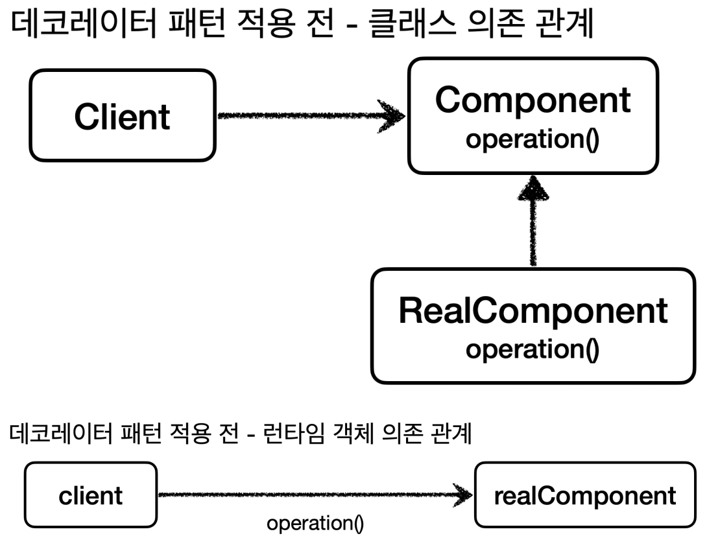

```java
public interface Component {
    String operation();
}

@Slf4j
public class RealComponent implements Component{
    @Override
    public String operation() {
        log.info("RealComponent 실행");
        return "data";
    }
}

@Slf4j
public class DecoratorPatternClient {

    private Component component;

    public DecoratorPatternClient(Component component) {
        this.component = component;
    }

    public void execute() {
        String result = component.operation();
        log.info("result={}", result);
    }
}

@Test
void noDecorator() {
    RealComponent realComponent = new RealComponent();
    DecoratorPatternClient client = new DecoratorPatternClient(realComponent);
    client.execute();
}
```

**프록시는 크게 접근 제어와 부가 기능 추가라는 2가지 기능을 할 수 있다.**

프록시 패턴에서 캐시를 통한 접근 제어를 알아보았고 이번에는 프록시를 활용해서 부가 기능을 추가해보자. 이렇게 프록시로 부가 기능을 추가하는 것을
`데코레이터 패턴`이라고 한다.

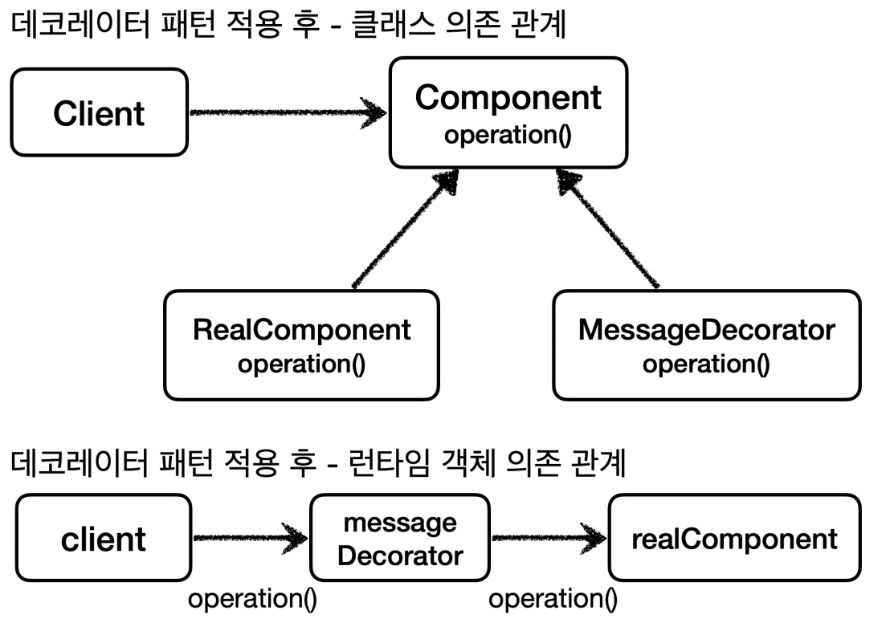

```java
@Slf4j
public class MessageDecorator implements Component {
    
    private Component component;

    public MessageDecorator(Component component) {
        this.component = component;
    }

    @Override
    public String operation() {
        log.info("MessageDecorator 실행");
        String result = component.operation();
        String decoResult = "*****" + result + "*****";
        return decoResult;
    }
}
```
- `MessageDecorator`는 실제 객체(`Component`)에서 반환된 데이터를 중간에 변형해서 반환한다.

```java
@Test
void decorator1() {
    RealComponent realComponent = new RealComponent();
    MessageDecorator messageDecorator = new MessageDecorator(realComponent);
    
    DecoratorPatternClient client = new DecoratorPatternClient(messageDecorator);
    client.execute();
}
```

**이번에는 실행 시간을 측정하는 데코레이터를 추가해보자.**

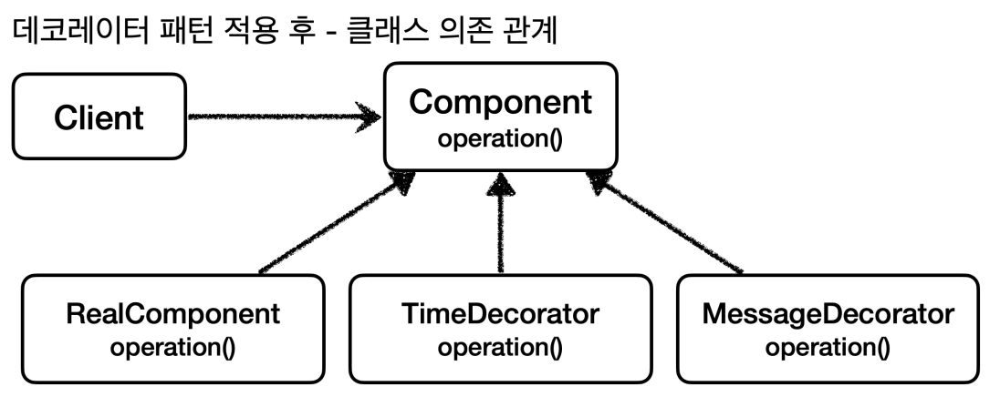

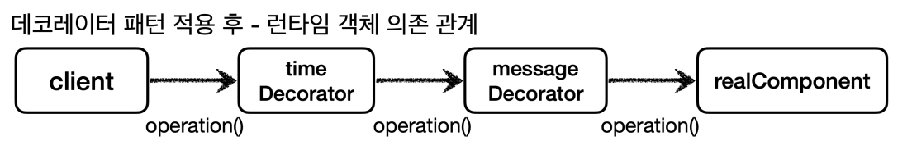

```java
@Slf4j
public class TimeDecorator implements Component{

    private Component component;

    public TimeDecorator(Component component) {
        this.component = component;
    }

    @Override
    public String operation() {
        log.info("TimeDecorator 실행");

        long startTime = System.currentTimeMillis();

        String result = component.operation();

        long endTime = System.currentTimeMillis();
        long resultTime = endTime - startTime;
        log.info("TimeDecorator 종료, resultTime={}", resultTime);
        return result;
    }
}
```
```java
@Test
void decorator2() {
    RealComponent realComponent = new RealComponent();//진짜 객체
    MessageDecorator messageDecorator = new MessageDecorator(realComponent);//메시지 데코레이터 -> 진짜 객체
    TimeDecorator timeDecorator = new TimeDecorator(messageDecorator);//실행시간 데코레이터 -> 메시지 데코레이터
    
    DecoratorPatternClient client = new DecoratorPatternClient(timeDecorator);//클라이언트 -> 실행시간 데코레이터
    client.execute();
}
```

## 프록시 패턴과 데코레이터 패턴 정리

> 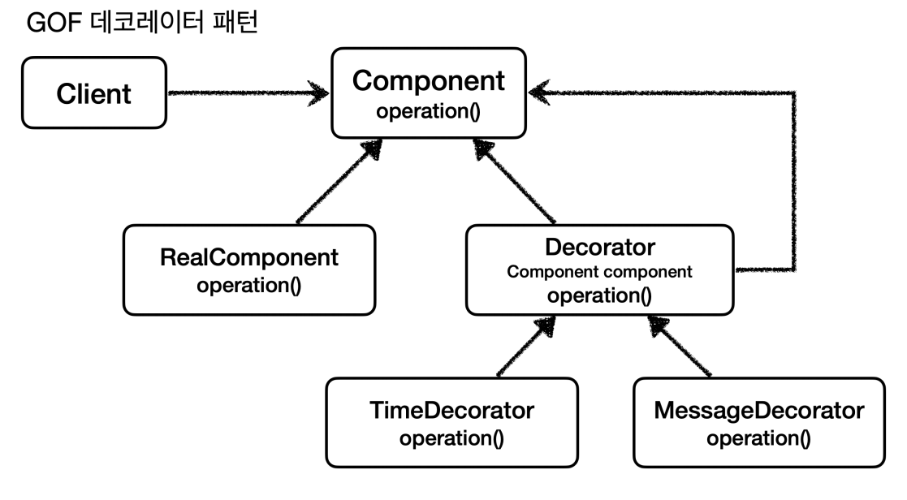
> 
> `Decorator` 기능에는 일부 중복이 있다. 꾸며주는 역할을 하는 `Decorator`들은 스스로 존재할 수 없고 항상 꾸며줄 대상이 있어야 한다. 따라서 내부에
> 호출 대상인 `Component`를 가지고 있어야 한다. 그리고 `component`를 항상 호출해야 한다. 이런 중복을 제거하기 위해 `component`를 속성으로 가지고 있는
> `Decorator`라는 추상 클래스를 만드는 방법도 있다.
> 
> 프록시 패턴과 데코레이터 패턴은 모양의 거의 비슷해서 구분할 수 있는 방법이 필요하다.<br>
> **디자인 패턴에서 중요한 것은 그 패턴을 만든 `의도`가 중요하다.**
> 
> _프록시 패턴의 의도_ : 다른 개체에 대한 **접근을 제어하기 위해** 대리자를 제공<br>
> _데코레이터 패턴의 의도_ : **객체에 추가 책임(기능)을 동적으로 추가하고** 기능 확장을 위한 유연한 대안 제공 
> 
> 정리하면 프록시를 사용하고 해당 프록시가 접근 제어가 목적이라면 `프록시 패턴`, 새로운 기능을 추가하는 것이 목적이라면 `데코레이터 패턴`이 된다.
