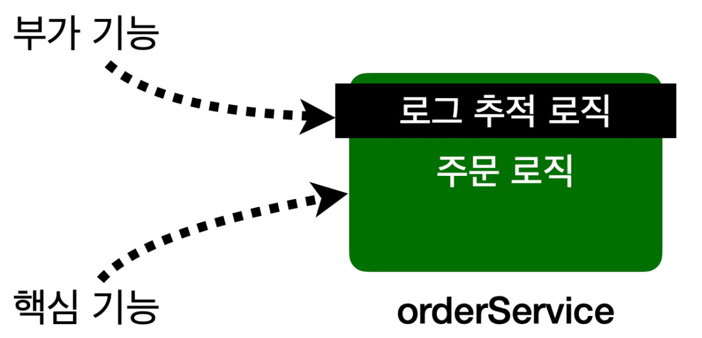
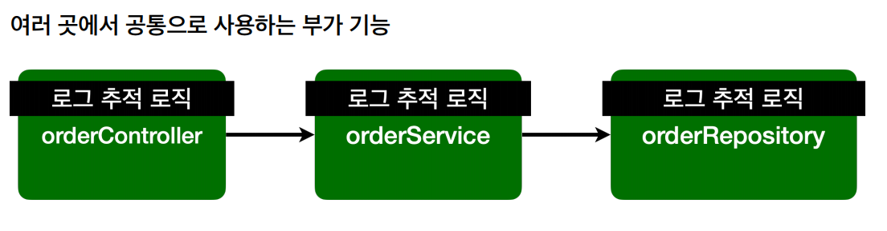
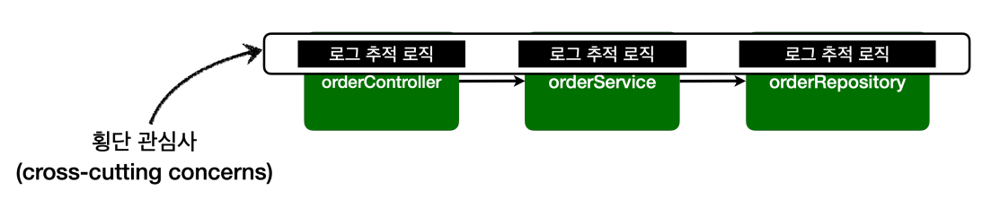
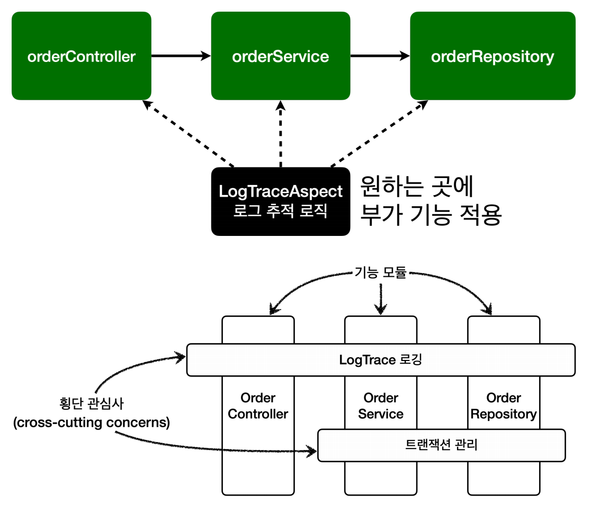
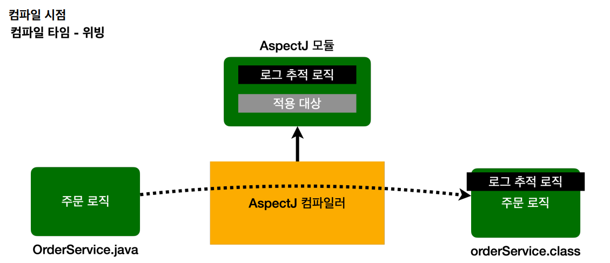
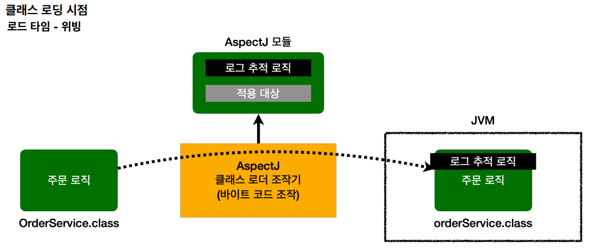
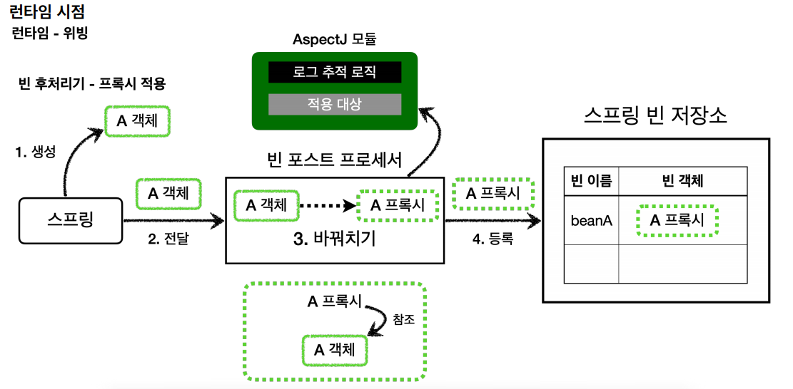
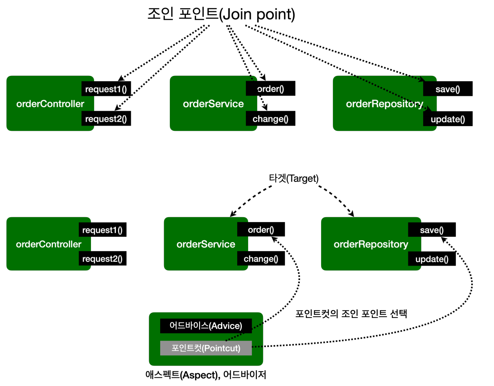

# 스프링 AOP 개념

## 핵심 기능과 부가 기능
애플리케이션 로직은 크기 **핵심 기능**과 **부가 기능**으로 나눌 수 있다.

**핵심 기능**은 해당 객체가 제공하는 고유의 기능이다. 예를 들어 `OrderService`의 핵심 로직은 주문 로직이다. 
**부가 기능**은 핵심 기능을 보조하기 위해 제공되는 기능이다. 예를 들어 로그 추적, 트랜잭션 기능 로직이 있다. 이러한 부가 기능은 단독으로 사용되지 않고
핵심 기능과 함께 사용된다.

핵심 기능은 주문 로직과 부가 기능은 로그 추적 로직이 하나의 객체 안에 섞여 들어가게 된다. 부가 기능이 필요한 이렇게 둘을 합해서 하나의 로직을 완성해야 한다.

보통 부가 기능은 여러 클래스에 걸쳐서 함께 사용된다. 이러한 부가 기능은 `횡단 관심사`가 된다. **하나의 부가 기능이 여러 곳에 동일하게 사용되는 것이다.**

**부가 기능을 적용하려면 다음과 같은 문제점들이 있다.**
- 부가 기능을 적용할 때 많은 반복이 필요하다.
- 부가 기능이 여러 곳에 퍼져서 중복 코드를 만들어낸다.
- 부가 기능을 변경할 때 많은 수정이 필요하다.
- 부가 기능의 적용 대상을 변경할 때 많은 수정이 필요하다.

**소프트웨어 개발에서 변경 지점은 하나가 될 수 있도록 잘 모듈화 되어야 한다.**

 

## AOP - 애스펙트

**핵심 기능과 부가 기능을 분리**

애스펙트(aspect)는 부가 기능과 부가 기능을 어디에 적용할지 선택하는 기능을 합해서 하나의 모듈로 만들었다.

`aspect`는 관점 이라는 뜻인데 이름 그대로 애플리케이션을 바라보는 관점을 하나하나의 기능에서 ``횡단 관심사`` 관점으로 보는 것이다. 
이렇게 **애스팩트를 사용한 프로그래밍 방식을 관점 지향 프로그래밍을 AOP(Aspect-Oriented Programming)이라 한다.**

AOP의 대표적인 구현체로는 **AspectJ 프레임워크**가 있다. 스프링도 AOP를 지원하지만 대부분 AspectJ의 문법을 차용하고 AspectJ가 제공하는 기능의 일부만 제공한다.

 

## AOP 적용 방식

AOP를 사용하면핵심 기능과 부가 기능이 코드상 완전히 분리되어서 관리된다. 그렇다면 AOP를 사용할 때 부가 기능 로직은 어떤 방식으로
실제 로직에 추가 될까?

**크게 3가지 방법이 있다.**
- 컴파일 시점
- 클래스 로딩 시점
- 런타임 시점(프록시)

- `.java` 소스 코드를 컴파일러를 사용해서 `.class`를 만드는 시점에 부가 기능 로직을 추가할 수 있다.
- 이때는 AspectJ가 제공하는 특별한 컴파일러를 사용해야 한다.
- 컴파일된 `.class`를 디컴파일 해보면 애스펙트 관련 호출 코드가 들어간다.
- 이렇게 원본 로직에 부가 기능 로직이 추가되는 것을 `위빙`이라고 한다.
- 위빙(Weaving) : (옷감 등을)짜다, 엮다
- **단점** : 특별한 컴파일러도 필요하고 복잡하다.

- 자바를 실행하면 자바 언어는 `.class`파일을 JVM 내부의 클래스 로더에 보관한다.
- 이때 중간에서 `.class`파일을 조작한 다음 JVM에 올릴 수 있다.
- 자바 언어는 `.class`파일을 JVM에 저장하기 전에 조작할 수 있는 기능을 제공한다.
- 이 시점에 애스펙트를 적용하는 것을 `로드 타임 위빙`이라 한다.
- **단점** : 자바를 실행할 때 특별한 옵션(`java -javaagent`)을 통해 클래스 로더 조작기를 지정해야 하는데 이 부분이 번거롭고 운영하기 어렵다.

- 런타임 시점은 컴파일도 다 끝나고 클래스 로더에 클래스도 다 올라가서 이미 자바가 실행되고 난 다음을 말한다.
- 자바의 메인(`main`) 메서드가 실행된 다음이다. 
- 자바 언어가 제공하는 범위 안에서 부가 기능을 적용해야 한다.
- 이때 스프링과 같은 컨테이너의 도움을 받고 DI, 빈 후처리기 같은 개념들을 총 동원한다. 이렇게 하면 최종적으로 프록시를 통해 스프링 빈에 부가 기능을 적용할 수 있다.

**정리**
- `컴파일 시점`, `클래스 로딩 시점` : 실제 대상 코드에 애스펙트를 통한 부가 기능 호출 코드가 포함된다. AspectJ를 직접 사용해야 한다.
- `런타임 시점` : 실제 대상 코드는 그대로 유지되고 프록시를 통해 부가 기능이 적용된다. 항상 프록시를 통해야 부가 기능을 사용할 수 있다.
        **스프링 AOP는 이 방식을 사용한다.**

**AOP 적용 위치**
- 적용 가능 지점(조인 포인트) : 생성자, 필드 값 접근, static 메서드 접근, 메서드 실행
  - AOP를 적용할 수 있는 지점을 조인 포인트(`Join point`라고 한다.)
- AspectJ를 사용해서 컴파일 시점과 클래스 로딩 시점에 적용하는 AOP는 바이트코르를 실제 조작하기 때문에 해당 기능을 모든 지점에 다 적용할 수 있다.
- **프록시 방식을 사용하는 스프링 AOP는 메서드 실행 지점에만 AOP를 적용할 수 있다.**
  - 프록시는 메서드 오버라이딩 개념으로 동작하기 때문에 생성자나 static 메서드, 필드 값 접근에는 프록시 개념이 적용될 수 없다.
  - **프록시를 사용하는 스프링 AOP의 조인 포인트는 메서드 실행으로 제한된다.**
- **프록시 방식을 사용하는 스프링 AOP는 스프링 컨테이너가 관리할 수 있는 스프링 빈에만 AOP를 적용할 수 있다.**

 

## AOP 용어 정리

- **조인 포인트(Join point)**
  - 어드바이스가 적용될 수 있는 위치. 메서드 실행, 생성자 호출, 필드 값 접근, static 메서드 접근 같은 프로그램 실행 중 지점
  - 조인 포인트는 추상적인 개념이다. AOP를 적용할 수 있는 모든 지점이라 생각하면 된다.
  - **스프링 AOP는 프록시 방식을 사용하므로 조인 포인트는 항상 메서드 실행 지점으로 제한된다.**
- **포인트컷(Pointcut)**
  - 조인 포인트 중에서 어드바이스가 적용될 위치를 선별하는 기능
  - 주로 AspectJ 표현식을 사용해서 지정
  - 프록시를 사용하는 스프링 AOP는 메서드 실행 지점만 포인트컷으로 선별 가능
- **타겟(Target)**
  - 어드바이스를 받는 객체, 포인트컷으로 결정된다.
- **어드바이스(Advice)**
  - 부가 기능
  - Around, Before, After와 같은 다양한 종류의 어드바이스가 있다.
- **애스펙트(Aspect)**
  - 어드바이스 + 포인트컷을 모듈화 한 것(`@Aspect`)
  - 여러 어드바이스와 포인트컷이 함께 존재한다.
- **어드바이저(Advisor)**
  - 하나의 어드바이스와 하나의 포인트컷으로 구성
  - 스프링 AOP에서만 사용되는 특별한 용어다.
- **위빙(Weaving)**
  - 포인트컷으로 결정한 타겟의 조인 포인트에 어드바이스를 적용하는 것
  - 위빙을 통해 핵심 기능 코드에 영향을 주지 않고 부가 기능을 추가할 수 있다.
  - AOP 적용을 위해 애스펙트에 객체를 연결한 상태
- **AOP 프록시**
  - AOP 기능을 구현하기 위해 만든 프록시 객체
  - 스프링에서 AOP 프록시는 JDK 동적 프록시 또는 CGLIB 프록시이다.
