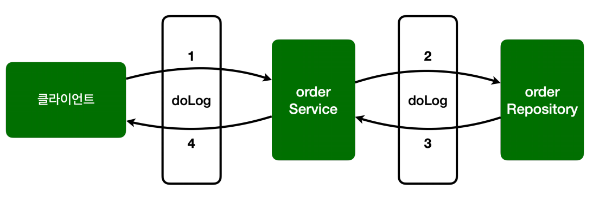
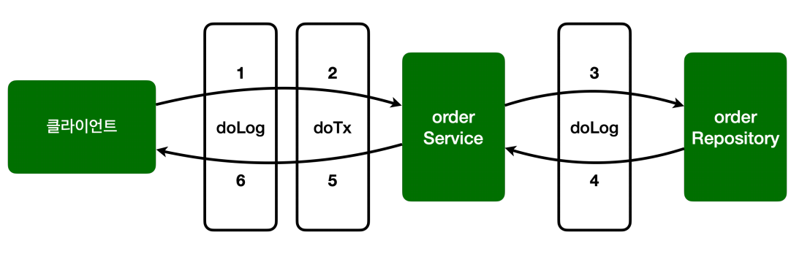

# 스프링 AOP 구현 - V1

## @Aspect 사용

스프링 AOP를 구현하는 가장 일반적인 방법은 `@Aspect`를 사용하는 방법이다.

```java
@Slf4j
@Aspect
public class AspectV1 {

    @Around("execution(* hello.aop.order..*(..))")
    public Object doLog(ProceedingJoinPoint joinPoint) throws Throwable {
        log.info("[log] {}", joinPoint.getSignature());
        return joinPoint.proceed();
    }
}
```
- `@Around` 어노테이션의 값인 `execution(* hello.aop.order..*(..))`가 포인트컷이 된다.
  - `hello.aop.order` 패키지와 그 하위패키지(`..`)를 지정하는 AspectJ 표현식이다.
- `@Around` 어노테이션의 메서드인 `doLog`는 어드바이스(`Advice`)가 된다.

```java
@Slf4j
@SpringBootTest
@Import(AspectV1.class)//추가
public class AopTest {

    @Autowired OrderService orderService;
    @Autowired OrderRepository orderRepository;

    @Test
    void aopInfo() {
        log.info("isAopProxy, orderService={}", AopUtils.isAopProxy(orderService));//true
        log.info("isAopProxy, orderRepository={}", AopUtils.isAopProxy(orderRepository));//true
    }

    @Test
    void success() {
        orderService.orderItem("itemA");
    }

    @Test
    void exception() {
        assertThatThrownBy(() -> orderService.orderItem("ex"))
                .isInstanceOf(IllegalStateException.class);

    }
}
```
- `@Aspect`는 애스펙트라는 표식일 뿐 컴포넌트 스캔이 되는 것은 아니다. `AspectV1`을 스프링 AOP로 사용하려면 스프링 빈으로 등록해야 한다.
- 스프링 빈으로 등록하는 방법은 여러가지가 있다.
  - `@Bean` 수동 등록
  - `@Component` 자동 등록
  - `@Import` 주로 설정 파일을 추가할 때 사용(`@Configuration`)
- `@Import`로 스프링 빈을 등록할 수도 있다.

콘솔 결과
```text
hello.aop.order.aop.AspectV1             : [log] void hello.aop.order.OrderService.orderItem(String)
hello.aop.order.OrderService             : [orderService] 실행
hello.aop.order.aop.AspectV1             : [log] String hello.aop.order.OrderRepository.save(String)
hello.aop.order.OrderRepository          : [orderRepository] 실행
```
- `joinpoint` 시그니처 출력 결과다.



# 스프링 AOP 구현 - V2

## 포인트컷 분리

`@Around`에 포인트컷 표현식을 직접 넣을 수도 있지만 `@Pointcut`어노테이션을 사용해서 별도로 분리할 수 있다.

```java
@Slf4j
@Aspect
public class AspectV2 {

    @Pointcut("execution(* hello.aop.order..*(..))")
    private void allOrder(){} //포인트컷 시그니처

    @Around("allOrder()")
    public Object doLog(ProceedingJoinPoint joinPoint) throws Throwable {
        log.info("[log] {}", joinPoint.getSignature());
        return joinPoint.proceed();
    }
}
```
- `@Pointcut` 어노테이션을 사용했다.
- 메서드 이름과 파라미터를 합쳐서 포인트컷 시그니처라 한다.
- 메서드의 반환 타입은 `void`여야 한다.
- 코드 내용은 비워두어야 한다.
- 포인트컷 시그니처는 `allOrder()`다. 주문과 관련된 모든 기능을 대상으로 하는 포인트컷 이라는 뜻이다.(**이름으로 의미를 부여할 수 있다.**)
- 접근 제어자는 내부에서만 사용하면 `private`을 사용하고 `public`으로 열어두어 다른 애스펙트에서 참고하도록 할 수도 있다.

```java
@Slf4j
@SpringBootTest
@Import(AspectV2.class)//변경
public class AopTest { ... }
```
- `AspectV2`를 스프링 빈으로 등록하도록 변경했다.

# 스프링 AOP 구현 - V3

## 어드바이스 추가

로그를 출력하는 기능에 추가로 트랜잭션을 적용하는 코드를 추가해보자.

- 핵심 로직 실행 직전에 트랜잭션을 시작
- 핵심 로직 실행
  - 핵심 로직 실행에 문제가 없으면 커밋
  - 핵심 로직 실행에 예외가 발생하면 롤백

```java
@Slf4j
@Aspect
public class AspectV3 {

    @Pointcut("execution(* hello.aop.order..*(..))")
    private void allOrder(){} //포인트컷 시그니처

    //클래스 이름 패턴이 *Service
    @Pointcut("execution(* *..*Service.*(..))")
    private void allService(){}

    @Around("allOrder()")
    public Object doLog(ProceedingJoinPoint joinPoint) throws Throwable {
        log.info("[log] {}", joinPoint.getSignature());
        return joinPoint.proceed();
    }

    //hello.aop.order 패키지와 하위 패키지 이면서 동시에 클래스 이름 패턴이 *Service
    @Around("allOrder() && allService()")
    public Object doTransaction(ProceedingJoinPoint joinPoint) throws Throwable {
        try {
            log.info("[트랜잭션 시작] {}", joinPoint.getSignature());
            Object result = joinPoint.proceed();
            log.info("[트랜잭션 커밋] {}", joinPoint.getSignature());
            return result;
        } catch (Exception e) {
            log.info("[트랜잭션 롤백] {}", joinPoint.getSignature());
            throw e;
        } finally {
            log.info("[리소스 릴리즈] {}", joinPoint.getSignature());
        }
    }
}
```
- `allOrder()` 포인트컷은 `hello.aop.order` 패키지와 그 하위 패키지를 대상으로 한다.
- `allService()` 포인트컷은 타입 이름 패턴이(`*Service`)를 대상으로 한다.(클래스, 인터페이스에 모두 적용)
- `@Around("allOrder() && allService()")`
  - 포인트컷을 조합할 수도 있다. `&&`(AND), `||`(OR), `!`(NOT) 모두 가능하다.
  - 결과적으로 `doTransaction()`어드바이스는 `orderService`에만 적용된다.

```java
@Import(AspectV3.class) //변경
@SpringBootTest
public class AopTest { ... }
```
```text
## success() 실행 결과 콘솔
[log] void hello.aop.order.OrderService.orderItem(String)
[트랜잭션 시작] void hello.aop.order.OrderService.orderItem(String)
[orderService] 실행
[log] String hello.aop.order.OrderRepository.save(String)
[orderRepository] 실행
[트랜잭션 커밋] void hello.aop.order.OrderService.orderItem(String)
[리소스 릴리즈] void hello.aop.order.OrderService.orderItem(String)
```



- 로그를 남기는 순서가 `doLog()` -> `doTransaction()` 순서로 작동한다. 
- 어드바이스가 적용되는 순서를 변경하고 싶으면 어떻게 해야 할까?
- 실행 시간을 측정해야 하는데 트랜잭션과 관련된 시간을 제외하고 측정하고 싶다면 트랜잭션 이후에 로그를 남겨야 할 것이다.