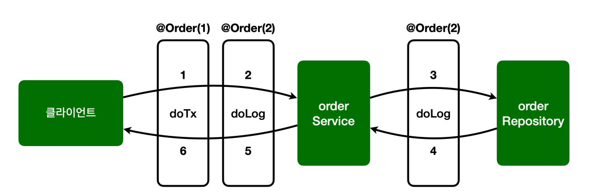
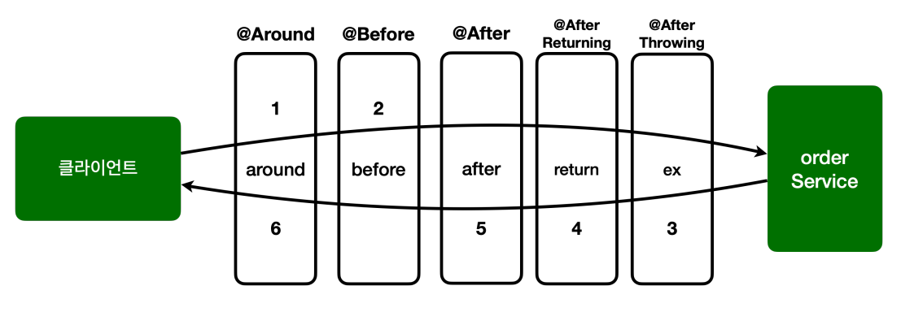

# 스프링 AOP 구현 - V4

## 포인트컷 참조

포인트컷을 공용으로 사용하기 위해 별도의 외부 클래스에 모아두어도 된다.

```java
public class Pointcuts {

    @Pointcut("execution(* hello.aop.order..*(..))")
    public void allOrder(){} //포인트컷 시그니처

    //클래스 이름 패턴이 *Service
    @Pointcut("execution(* *..*Service.*(..))")
    public void allService(){}

    @Pointcut("allOrder() && allService()")
    public void orderAndService(){}
}
```
- 외부에서 호출하기 위해 `public`으로 열어두어야 한다.

```java
@Slf4j
@Aspect
public class AspectV4Pointcut {

    @Around("Pointcuts.allOrder()")
    public Object doLog(ProceedingJoinPoint joinPoint) throws Throwable {
        log.info("[log] {}", joinPoint.getSignature());
        return joinPoint.proceed();
    }

    //hello.aop.order 패키지와 하위 패키지 이면서 동시에 클래스 이름 패턴이 *Service
    @Around("Pointcuts.orderAndService()")
    public Object doTransaction(ProceedingJoinPoint joinPoint) throws Throwable {
        try {
            log.info("[트랜잭션 시작] {}", joinPoint.getSignature());
            Object result = joinPoint.proceed();
            log.info("[트랜잭션 커밋] {}", joinPoint.getSignature());
            return result;
        } catch (Exception e) {
            log.info("[트랜잭션 롤백] {}", joinPoint.getSignature());
            throw e;
        } finally {
            log.info("[리소스 릴리즈] {}", joinPoint.getSignature());
        }
    }
}
```
- 사용하는 방법은 클래스 이름과 포인트컷 시그니처를 지정하면 된다.
- 포인트컷을 모아둔 클래스와 포인트컷을 사용하려는 클래스의 패키지가 다르다면 포인트컷을 사용하려는 클래스에서 패키지명까지 포함해 주어야 한다.

```java
@Slf4j
@SpringBootTest
@Import(AspectV4Pointcut.class)
public class AopTest { ... }
```
- 실행 결과는 기존과 똑같다.

# 스프링 AOP 구현 - V5

## 어드바이스 순서

어드바이스는 기본적으로 순서를 보장하지 않는다. 순서를 지정하고 싶으면 `@Aspect` 지정 단위로 `@Order` 어노테이션을 적용해야 한다. 문제는 이것을
어드바이스 단위가 아니라 클래스 단위로 적용해야 한다는 점이다.<br>
하나의 애스펙트에 여러 어드바이스가 있으면 순서를 보장 받을 수 없고 **애스펙트를 별도의 클래스로 분리해야 한다.**

```java
@Slf4j
public class AspectV5Order {

    @Aspect
    @Order(2)
    public static class LogAspect{
        @Around("Pointcuts.allOrder()")
        public Object doLog(ProceedingJoinPoint joinPoint) throws Throwable {
            log.info("[log] {}", joinPoint.getSignature());
            return joinPoint.proceed();
        }
    }

    @Aspect
    @Order(1)
    public static class TxAspect{
        //hello.aop.order 패키지와 하위 패키지 이면서 동시에 클래스 이름 패턴이 *Service
        @Around("Pointcuts.orderAndService()")
        public Object doTransaction(ProceedingJoinPoint joinPoint) throws Throwable {
            try {
                log.info("[around][트랜잭션 시작] {}", joinPoint.getSignature());
                Object result = joinPoint.proceed();
                log.info("[around][트랜잭션 커밋] {}", joinPoint.getSignature());
                return result;
            } catch (Exception e) {
                log.info("[around][트랜잭션 롤백] {}", joinPoint.getSignature());
                throw e;
            } finally {
                log.info("[around][리소스 릴리즈] {}", joinPoint.getSignature());
            }
        }
    }
}
```
- 하나의 애스펙트 안에 있떤 어드바이스를 각각 내부 클래스로 분리했다. (각각 별도의 클래스로 만들어도 된다.)
- 각 애스펙트에 `@Order` 어노테이션을 통해 실행 순서를 적용했다.

```java
@Slf4j
@SpringBootTest
@Import({AspectV5Order.TxAspect.class, AspectV5Order.LogAspect.class})
public class AopTest { ... }
```
- 두 개의 클래스를 스프링 빈으로 등록해야 한다.

```text
## success() 실행 결과 콘솔
[트랜잭션 시작] void hello.aop.order.OrderService.orderItem(String)
[log] void hello.aop.order.OrderService.orderItem(String)
[orderService] 실행
[log] String hello.aop.order.OrderRepository.save(String)
[orderRepository] 실행
[트랜잭션 커밋] void hello.aop.order.OrderService.orderItem(String)
[리소스 릴리즈] void hello.aop.order.OrderService.orderItem(String)
```
- 트랜잭션 어드바이스가 먼저 실행되고 이후에 로그 어드바이스가 적용됐다.



# 스프링 AOP 구현 - V6

## 어드바이스 종류

- `@Around` : 메서드 호출 전후에 수행으로 가장 강력한 어드바이스다. 조인 포인트 실행 여부 선택, 반환 값 변환, 예외 변환 등이 가능하다.
- `@Before` : 조인 포인트 실행 이전에 실행
- `@AfterReturning` : 조인 포인트가 정상 완료후 실행
- `@AfterThrowing` : 메서드가 예외를 던지는 경우 실행
- `@After` : 조인 포인트가 정상 또는 예외에 관계없이 실행(`finally`와 비슷)

```java
@Slf4j
@Aspect
public class AspectV6Advice {

    @Around("Pointcuts.orderAndService()")
    public Object doTransaction(ProceedingJoinPoint joinPoint) throws Throwable {
        try {
            //@Before
            log.info("[트랜잭션 시작] {}", joinPoint.getSignature());
            Object result = joinPoint.proceed();
            //@AfterReturning
            log.info("[트랜잭션 커밋] {}", joinPoint.getSignature());
            return result;
        } catch (Exception e) {
            //@AfterThrowing
            log.info("[트랜잭션 롤백] {}", joinPoint.getSignature());
            throw e;
        } finally {
            //@After
            log.info("[리소스 릴리즈] {}", joinPoint.getSignature());
        }
    }

    @Before("Pointcuts.orderAndService()")
    public void deBefore(JoinPoint joinPoint) {
        log.info("[before] {}", joinPoint.getSignature());
    }

    @AfterReturning(value = "Pointcuts.orderAndService()", returning = "result")
    public void doReturn(JoinPoint joinPoint, Object result){
        log.info("[return] {} return={}", joinPoint.getSignature(), result);
    }

    @AfterThrowing(value = "Pointcuts.orderAndService()", throwing = "ex")
    public void doThrowing(JoinPoint joinPoint, Exception ex) {
        log.info("[ex] {} message={}", joinPoint.getSignature(), ex.getMessage());
    }

    @After(value = "Pointcuts.orderAndService()")
    public void doAfter(JoinPoint joinPoint) {
        log.info("[after] {}", joinPoint.getSignature());
    }
}
```
- 사실 `@Around`를 제외한 어드바이스들은 `@Around`가 할 수 있는 일의 일부만 제공할 뿐이다. 따라서 `@Around` 어드바이스만 사용해도 필요한 기능을 모두 수행할 수 있다.
- 모든 어드바이스는 `JoinPoint`를 첫 번째 파라미터에 사용할 수 있다.(생략 가능)
- `@Around`는 `ProceedingJoinPoint`를 사용해야 한다.
- `ProceedingJoinPoint`는 `JoinPoint`의 하위 타입이다.

**JoinPoint 인터페이스 주요 기능**
- `getArgs()` : 메서드 인수를 반환
- `getThis()` : 프록시 객체를 반환
- `getTarget()` : 대상 객체를 반환
- `getSignature()` : 조언되는 메서드에 대한 설명을 반환
- `toString()` : 조언되는 방법에 대한 유용한 설명을 인쇄

**ProceedingJointPoint 인터페이스 주요 기능**
- `proceed()` : 다음 어드바이스나 타겟을 호출

### @Before
조인 포인트 실행 전
```java
@Before("Pointcuts.orderAndService()")
public void deBefore(JoinPoint joinPoint) {
    log.info("[before] {}", joinPoint.getSignature());
}
```
- `@Around`와 다르게 작업 흐름을 변경할 수는 없다.
- `@Around`는 `ProceedingJoinPoint.proceed()`를 호출해야 다음 대상이 호출된다. 만약 호출하지 않으면 다음 대상이 호출되지 않는다.
- `@Befores`는 `ProceedingJoinPoint.proceed()` 자체를 사용하지 않는다. 메서드 종료 시 자동으로 다음 타겟이 호출된다.
- 물론 예외가 발생하면 다음 코드가 호출되지는 않는다.

### @AfterReturning
메서드 실행이 정상적으로 반환될 때 사용
```java
@AfterReturning(value = "Pointcuts.orderAndService()", returning = "result")
public void doReturn(JoinPoint joinPoint, Object result){
    log.info("[return] {} return={}", joinPoint.getSignature(), result);
}
```
- `returning` 속성에 사용된 이름은 어드바이스 메서드의 매개변수 이름과 일치해야 한다.
- `returning`절에 지정된 타입의 값을 반환하는 메서드만 대상으로 실행한다.(부모 타입을 지정하면 자식 타입도 인정)
- `@Around`와 다르게 반환되는 객체를 변경할 수는 없다. 반환 객체를 변경하려면 `@Around`를 사용해야 한다.
- 반환 객체를 조작할 수는 있다.

### @AfterThrowing
메서드 실행이 예외를 던져서 종료될 때 실행
```java
@AfterThrowing(value = "Pointcuts.orderAndService()", throwing = "ex")
public void doThrowing(JoinPoint joinPoint, Exception ex) {
    log.info("[ex] {} message={}", joinPoint.getSignature(), ex.getMessage());
}
```
- `throwing` 속성에 사용된 이름은 어드바이스 메서드의 매개변수 이름과 일치해야 한다.
- `throwing`절에 지정된 타입과 맞는 예외를 대상으로 실행한다.(부모 타입을 지정하면 자식 타입도 인정)

### @After
메서드 실행이 종료되면 실행된다.(`finally`와 비슷)
```java
@After(value = "Pointcuts.orderAndService()")
public void doAfter(JoinPoint joinPoint) {
    log.info("[after] {}", joinPoint.getSignature());
}
```
- 정상 및 예외 반환 조건을 모두 처리한다.
- 일반적으로 리소스를 해제하는 데 사용한다.

### @Around
- 메서드 실행의 주변에서 실행된다. 메서드 실행 전후에 작업을 수행한다.
- 가장 강력한 어드바이스다.
  - 조인 포인트 실행 여부 선택(`joinPoint.proceed()` 호출 여부 선택)
  - 전달 값 변환(`joinPoint.proceed(args[])`)
  - 반환 값 변환
  - 예외 변환
  - 트랜잭션 처럼 `try~catch~finally` 모두 들어가는 구문 처리 가능
- 어드바이스의 첫 번째 파라미터는 `ProceedingJoinPoint`를 사용해야 한다.
- `proceed()`를 통해 대상을 실행한다.
  - 여러 번 실행할 수도 있다.(재시도)

```text
## success() 실행 결과 콘솔
[around][트랜잭션 시작] void hello.aop.order.OrderService.orderItem(String)
[before] void hello.aop.order.OrderService.orderItem(String)
[orderService] 실행
[orderRepository] 실행
[return] void hello.aop.order.OrderService.orderItem(String) return=null
[after] void hello.aop.order.OrderService.orderItem(String)
[around][트랜잭션 커밋] void hello.aop.order.OrderService.orderItem(String)
[around][리소스 릴리즈] void hello.aop.order.OrderService.orderItem(String)
```


- 실행 순서: `@Around`, `@Before`, `@After`, `@AfterReturning`, `@AfterThrowing`
- 어드바이스가 적용되는 순서는 이렇지만 호출 순서와 리턴 순서는 반대이다.
- `@Aspect`안에 동일한 종류의 어드바이스가 2개 이상 있으면 순서는 보장되지 않는다. 이 경우 `@Aspect`를 별도 클래스로 분리하고 `@Order`를 적용해야 한다.

> **@Around 외에 다른 어드바이스가 존재하는 이유**
> 
> `@Around`하나만 있어도 다른 모든 어드바이스의 기능을 수행할 수 있다. 그런데 다른 어드바이스들이 존재하는 이유는 무엇일까?<br>
> `@Around`는 항상 `joinPoint.proceed()`를 호출해야 한다. 호출하지 않으면 다음 타켓이 호출되지 않는다. 하지만 `@Before`는 `joinPoint.proceed()`를
> 자동으로 호출해 주기 때문에 생략이 가능하다.
> 
> `@Around`가 가장 넓은 기능을 제공하지만 실수할 가능성이 있다. 반면에 `@Before`, `@After` 같은 어드바이스는 기능은 적지만 실수할 가능성이 낮고 코드도 단순하다.
> 그리고 가장 중요한 점은 **이 코드를 작성한 의도가 명확하게 드러난다는 점이다.** `@Before`라는 어노테이션을 보면 이 코드는 타겟 실행 전에 한정해서 어떤 일을 하는
> 코드라는 것을 명확하게 알 수 있다는 것이다.
> 
> **좋은 설계는 제약이 있는 것이다.**<br>
> `@Around`를 사용했는데 실수로 다음 타겟을 호출하지 않는다면 큰 장애가 일어날 것이다. 처음부터 `@Before`같은 한정된 기능을 사용했다면 이런 문제 자체가 발생하지 않았을 것이다.
> 
> 제약 덕분에 역할이 명확해지고 의도도 파악하기 쉬워진다.