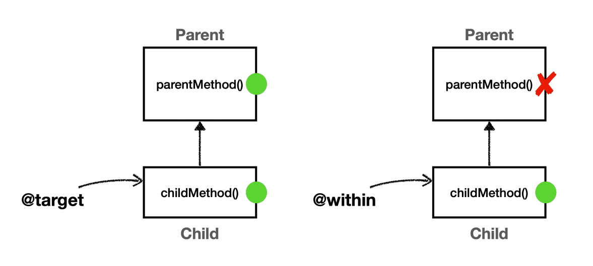

# 포인트컷 지시자

## within

`within` 지시자는 특정 타입 내의 조인 포인트에 대한 매칭을 제한한다.<br>
해당 타입이 매칭되면 그 안의 메서드(조인 포인트)들이 자동으로 매칭되는 것이다. 문법은 단순한데 `execution`에서 타입 부분만 사용한다고 보면 된다.

```java
@Test
void withinExact() {
    pointcut.setExpression("within(hello.aop.member.MemberServiceImpl)");
    assertThat(pointcut.matches(helloMethod, MemberServiceImpl.class)).isTrue();
}

@Test
void withinStar() {
    pointcut.setExpression("within(hello.aop.member.*Service*)");
    assertThat(pointcut.matches(helloMethod, MemberServiceImpl.class)).isTrue();
}

@Test
void withinSubPackage() {
    pointcut.setExpression("within(hello.aop..*)");
    assertThat(pointcut.matches(helloMethod, MemberServiceImpl.class)).isTrue();
}
```

**`within` 사용 시 주의할 점은 표현식에 부모 타입을 지정하면 안 된다.** 

```java
@Test
@DisplayName("타겟의 타입에만 직접 적용, 인터페이스를 선정하면 안된다.")
void withinSuperTypeFalse() {
    pointcut.setExpression("within(hello.aop.member.MemberService)");
    assertThat(pointcut.matches(helloMethod, MemberServiceImpl.class)).isFalse();
}

@Test
@DisplayName("execution은 타입 기반, 인터페이스 선정 가능")
void executionSuperTypeTrue() {
    pointcut.setExpression("execution(* hello.aop.member.MemberService.*(..))");
    assertThat(pointcut.matches(helloMethod, MemberServiceImpl.class)).isTrue();
}
```
- 부모 타입 지정 시 `within`은 타입 매칭에 실패하고, `execution`은 성공한다.
- 이 부분에서 `execution`과 차이가 있다.

## args

인자가 주어진 타입의 인스턴스인 조인 포인트로 매칭한다. 기본 문법은 `execution`의 `args`부분과 같다.

```java
public class ArgsTest {

    Method helloMethod;

    @BeforeEach
    public void init() throws NoSuchMethodException {
        helloMethod = MemberServiceImpl.class.getMethod("hello", String.class);
    }

    private AspectJExpressionPointcut pointcut(String expression) {
        AspectJExpressionPointcut pointcut = new AspectJExpressionPointcut();
        pointcut.setExpression(expression);
        return pointcut;
    }

    @Test
    void args() {
        //hello(String)와 매칭
        assertThat(pointcut("args(String)")
                .matches(helloMethod, MemberServiceImpl.class)).isTrue();

        assertThat(pointcut("args(Object)")
                .matches(helloMethod, MemberServiceImpl.class)).isTrue();

        assertThat(pointcut("args()")
                .matches(helloMethod, MemberServiceImpl.class)).isFalse();

        assertThat(pointcut("args(..)")
                .matches(helloMethod, MemberServiceImpl.class)).isTrue();

        assertThat(pointcut("args(*)")
                .matches(helloMethod, MemberServiceImpl.class)).isTrue();

        assertThat(pointcut("args(String,..)")
                .matches(helloMethod, MemberServiceImpl.class)).isTrue();
    }

    /**
     * execution(* *(java.io.Serializable)): 메서드의 시그니처로 판단(정적)
     * args(java.io.Serializable): 런타임에 전달된 인수로 판단(동적)
     */
    @Test
    void argsVsExecution() {
        //Args
        assertThat(pointcut("args(String)")
                .matches(helloMethod, MemberServiceImpl.class)).isTrue();
        assertThat(pointcut("args(java.io.Serializable)")
                .matches(helloMethod, MemberServiceImpl.class)).isTrue();
        assertThat(pointcut("args(Object)")
                .matches(helloMethod, MemberServiceImpl.class)).isTrue();

        //Execution
        assertThat(pointcut("execution(* *(String))")
                .matches(helloMethod, MemberServiceImpl.class)).isTrue();
        assertThat(pointcut("execution(* *(java.io.Serializable))")//매칭 실패
                .matches(helloMethod, MemberServiceImpl.class)).isFalse();
        assertThat(pointcut("execution(* *(Object))")//매칭 실패
                .matches(helloMethod, MemberServiceImpl.class)).isFalse();
    }
}
```
- `pointcut()` : `AspectJExpressionPointcut`에 포인트컷은 한 번만 지정할 수 있다. 포인트컷을 여러 번 지정하기 위해 포인트컷 자체를 생성하는 메서드다.
- 자바가 기본으로 제공하는 `String`은 `Object`, `Serializable`의 하위 타입이다.
- 정적으로 클래스에 선언된 정보만 보고 판단하는 `execution(* *(Object))`은 매칭에 실패한다.
- 동적으로 실제 파라미터에 넘어온 객체 인스턴스로 판단하는 `args(Object`)는 매칭에 성공한다.
- `args`는 단독으로 사용되기 보다는 파라미터 바인딩에서 주로 사용된다.

## @target, @within

- `@target` : 실행 겍체의 클래스에 주어진 타입의 어노테이션이 있는 조인 포인트
- `@within` : 주어진 어노테이션이 있는 타입 내 조인 포인트



**@target vs @within**
- `@target`은 인스턴스의 모든 메서드를 조인 포인트로 적용한다.
- `@within`은 해당 타입 내에 있는 메서드만 조인 포인트로 적용한다.

`@target`은 부모 클래스의 메서드까지 어드바이스를 다 적용하고, `@within`은 자기 자신의 클래스에 정의된 메서드에만 어드바이스를 적용한다.

```java
@Slf4j
@SpringBootTest
@Import(AtTargetAtWithinTest.Config.class)
public class AtTargetAtWithinTest {

    @Autowired Child child;

    @Test
    void success() {
        log.info("child Proxy={}", child.getClass());
        child.childMethod();//부모, 자식 모두 있는 메서드
        child.parentMethod();//부모 클래스만 있는 메서드
    }

    @TestConfiguration
    static class Config{
        @Bean
        public Child child() {
            return new Child();
        }

        @Bean
        public AtTargetAtWithinAspect atTargetAtWithinAspect() {
            return new AtTargetAtWithinAspect();
        }
    }

    static class Parent{
        public void parentMethod(){}//부모에만 있는 메서드
    }

    @ClassAop
    static class Child extends Parent{
        public void childMethod(){}
    }

    @Slf4j
    @Aspect
    static class AtTargetAtWithinAspect{
        //@target: 인스턴스 기준으로 모든 메서드의 조인 포인트를 선정, 부모 타입의 메서드도 적용
        @Around("execution(* hello.aop..*(..)) && @target(hello.aop.member.annotation.ClassAop)")
        public Object atTarget(ProceedingJoinPoint joinPoint) throws Throwable {
            log.info("[@target] {}", joinPoint.getSignature());
            return joinPoint.proceed();
        }

        //@within: 선택된 클래스 내부에 있는 메서드만 조인 포인트로 선정, 부모 타입의 메서드는 적용 되지 않는다.
        @Around("execution(* hello.aop..*(..)) && @within(hello.aop.member.annotation.ClassAop)")
        public Object atWithin(ProceedingJoinPoint joinPoint) throws Throwable {
            log.info("[@within] {}", joinPoint.getSignature());
            return joinPoint.proceed();
        }
    }
}
```
```text
## 실행결과
child Proxy=class hello.aop.pointcut.AtTargetAtWithinTest$Child$$SpringCGLIB$$0
[@target] void hello.aop.pointcut.AtTargetAtWithinTest$Child.childMethod()
[@within] void hello.aop.pointcut.AtTargetAtWithinTest$Child.childMethod()
[@target] void hello.aop.pointcut.AtTargetAtWithinTest$Parent.parentMethod()
```
- `parentMethod()`는 `Parent` 클래스에만 정의되어 있고 `Child`클래스에 정의되어 있지 않기 때문에 `@within`에서 AOP 적용이 되지 않는다.

> `@target`, `@within` 지시자는 파라미터 바인딩에서 함께 사용된다.

> `args`, `@args`, `@target` 지시자는 단독으로 사용하면 안 된다.
> 
> 실행 시점에 일어나는 포인트컷 적용 여부는 프록시가 있어야 실행 시점에 판단할 수 있다. 프록시가 없다면 판단 자체가 불가능하다. 그런데 스프링 컨테이너가
> 프록시를 생성하는 시점은 **스프링 컨테이너가 만들어지는 애플리케이션 로딩 시점에 적용할 수 있다.** 따라서 `args`, `@args`, `@target` 같은 포인트컷
> 지시자가 있으면 스프링은 모든 스프링 빈에 AOP를 적용하려고 시도한다. 프록시가 없으면 실행 시점에 판단 자체가 불가능하다.<br>
> 문제는 이렇게 모든 스프링 빈에 AOP 프록시를 적용하려고 하면 스프링이 내부에서 사용하는 빈 중에는 `final`로 지정된 빈들도 있기 때문에 오류가 발생할 수 있다.
> **그렇기 때문에 이러한 표현식은 최대한 프록시 적용 대상을 축소하는 표현식(`execution` 등)과 함께 사용해야 한다.**