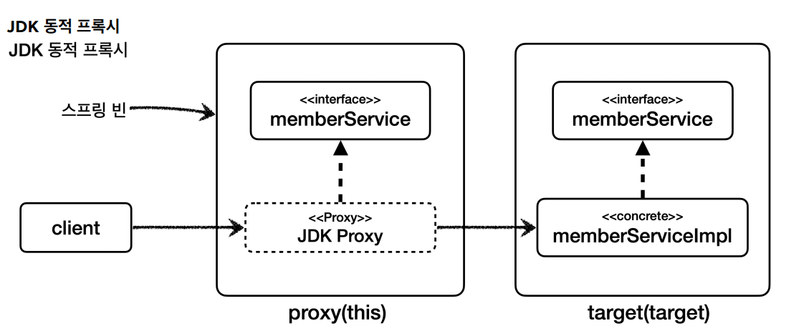
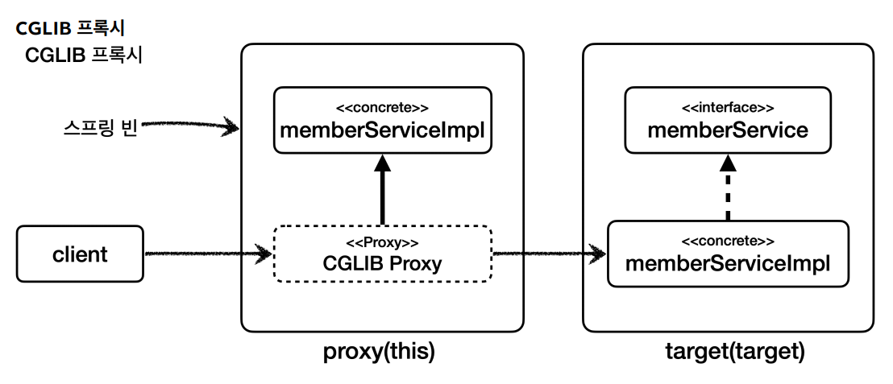

# 포인트컷 지시자

## @annotation

`@annotation` : 메서드가 주어진 어노테이션을 가지고 있는 조인 포인트를 매칭한다.

```java
@Component
public class MemberServiceImpl implements MemberService{

    @Override
    @MethodAop("test value")
    public String hello(String param) {
        return "ok";
    }
}
```
```java
@Slf4j
@SpringBootTest
@Import(AtAnnotationTest.AtAnnotationAspect.class)
public class AtAnnotationTest {

    @Autowired MemberService memberService;

    @Test
    void success() {
        log.info("memberService Proxy={}", memberService.getClass());
        memberService.hello("helloA");
    }

    @Slf4j
    @Aspect
    static class AtAnnotationAspect{
        @Around("@annotation(hello.aop.member.annotation.MethodAop)")
        public Object doAtAnnotation(ProceedingJoinPoint joinPoint) throws Throwable {
            log.info("[@annotation] {}", joinPoint.getSignature());
            return joinPoint.proceed();
        }
    }
}
```
```text
## 실행 결과
memberService Proxy=class hello.aop.member.MemberServiceImpl$$SpringCGLIB$$0
[@annotation] String hello.aop.member.MemberServiceImpl.hello(String)
```

## bean
 스프링 전용 포인트컷 지시자로 빈의 이름으로 지정한다.
 
```java
@Slf4j
@SpringBootTest
@Import(BeanTest.BeanAspect.class)
public class BeanTest {

    @Autowired OrderService orderService;

    @Test
    void success() {
        orderService.orderItem("itemA");
    }

    @Aspect
    static class BeanAspect {

        @Around("bean(orderService) || bean(*Repository)")
        public Object doLog(ProceedingJoinPoint joinPoint) throws Throwable {
            log.info("[bean] {}", joinPoint.getSignature());
            return joinPoint.proceed();
        }
    }
}
```
- 스프링 빈의 이름으로 AOP 적용 여부를 지정할 수 있다. 스프링에서만 사용할 수 있는 특별한 지시자이다.
- `*`과 같은 패턴을 사용할 수 있다.

```text
## 실행 결과
[bean] void hello.aop.order.OrderService.orderItem(String)
[orderService] 실행
[bean] String hello.aop.order.OrderRepository.save(String)
[orderRepository] 실행
```

## 매개변수 전달

다음은 포인트컷 표현식을 사용해서 어드바이스에 매개변수를 전달할 수 있다.
- `this`, `target`, `args`, `@target`, `@within`, `@annotation`, `@args`

```java
@Slf4j
@SpringBootTest
@Import(ParameterTest.ParameterAspect.class)
public class ParameterTest {

    @Autowired MemberService memberService;

    @Test
    void success() {
        log.info("memberService Proxy={}", memberService.getClass());
        memberService.hello("helloA");
    }

    @Slf4j
    @Aspect
    static class ParameterAspect{

        @Pointcut("execution(* hello.aop.member..*.*(..))")
        private void allMember(){}

        @Around("allMember()")
        public Object logArgs1(ProceedingJoinPoint joinPoint) throws Throwable {
            Object arg1 = joinPoint.getArgs()[0];
            log.info("[logArgs1]{}, arg={}", joinPoint.getSignature(), arg1);
            return joinPoint.proceed();
        }

        @Around("allMember() && args(arg, ..)")
        public Object logArgs2(ProceedingJoinPoint joinPoint, Object arg) throws Throwable {
            log.info("[logArgs2]{}, arg={}", joinPoint.getSignature(), arg);
            return joinPoint.proceed();
        }

        @Before("allMember() && args(arg, ..)")
        public void logArgs3(String arg) {
            log.info("[logArgs3] arg={}", arg);
        }

        @Before("allMember() && this(obj)")
        public void thisArgs(JoinPoint joinPoint, MemberService obj) {
            log.info("[this]{}, obj={}", joinPoint.getSignature(), obj.getClass());
        }

        @Before("allMember() && target(obj)")
        public void targetArgs(JoinPoint joinPoint, MemberService obj) {
            log.info("[target]{}, obj={}", joinPoint.getSignature(), obj.getClass());
        }

        @Before("allMember() && @target(annotation)")
        public void atTarget(JoinPoint joinPoint, ClassAop annotation) {
            log.info("[@target]{}, obj={}", joinPoint.getSignature(), annotation);
        }

        @Before("allMember() && @within(annotation)")
        public void atWithin(JoinPoint joinPoint, ClassAop annotation) {
            log.info("[@within]{}, obj={}", joinPoint.getSignature(), annotation);
        }

        @Before("allMember() && @annotation(annotation)")
        public void atAnnotation(JoinPoint joinPoint, MethodAop annotation) {
            log.info("[@annotation]{}, annotationValue={}", joinPoint.getSignature(), annotation.value());
        }
    }
}
```
- `logArgs1` : `joinPoint.getArgs()[0]`과 같이 매개변수를 전달 받는다.
- `logArgs2` : `args(arg, ..)`와 같이 매개변수를 전달 받는다.
- `logArgs3` : `@Before`를 사용한 축약 버전이다. 타입을 `String`으로 제한했다.
- `this` : 프록시 객체를 전달 받는다.
- `target` : 실제 대상 객체를 전달 받는다.
- `@target`, `@within` : 타입의 어노테이션을 전달 받는다.
- `@annotation` : 메서드의 어노테이션을 전달 받는다. 해당 어노테이션의 값을 받아서 사용할 수도 있다.

```text
## 실행 결과(순서는 보장되지 않음)
memberService Proxy=class hello.aop.member.MemberServiceImpl$$SpringCGLIB$$0
[logArgs1]String hello.aop.member.MemberServiceImpl.hello(String), arg=helloA
[logArgs2]String hello.aop.member.MemberServiceImpl.hello(String), arg=helloA
[logArgs3] arg=helloA
[this]String hello.aop.member.MemberServiceImpl.hello(String), obj=class hello.aop.member.MemberServiceImpl$$SprigCGLIB$$0
[target]String hello.aop.member.MemberServiceImpl.hello(String), obj=class hello.aop.member.MemberServiceImpl
[@target]String hello.aop.member.MemberServiceImpl.hello(String), obj=@hello.aop.member.annotation.ClassAop()
[@within]String hello.aop.member.MemberServiceImpl.hello(String), obj=@hello.aop.member.annotation.ClassAop()
[@annotation]String hello.aop.member.MemberServiceImpl.hello(String), annotationValue=test value
```

## this와 target

- `this` : 스프링 빈 객체(스프링 AOP 프록시)를 대상으로 하는 조인 포인트
- `target` : Target 빈 객체(스프링 AOP 프록시가 가리키는 실제 대상)를 대상으로 하는 조인 포인트

`this`와 `target`은 적용 타입 하나를 정확하게 지정해야 한다. 여기서 `*`같은 패턴을 사용할 수 없으며 부모 타입을 허용한다.

**단순히 타입 하나를 정하는 것인데 둘은 어떤 차이가 있을까?**

스프링에서 AOP를 적용하면 실제 `target` 객체 대신에 프록시 객체가 스프링 빈으로 등록된다.
- `this`는 스프링 빈으로 등록되어 있는 **프록시 객체**를 대상으로 포인트컷을 매칭한다.
- `target`은 실제 **target 객체**를 대상으로 포인트컷을 매칭한다.

**스프링은 프록시를 생성할 때 JDK 동적 프록시와 CGLIB를 선택할 수 있는데 둘의 프록시를 생성하는 방식이 다르기 때문에 차이가 발생한다.**
- **JDK 동적 프록시** : 인터페이스를 구현한 프록시 객체를 생성한다.(인터페이스가 필수)
- **CGLIB** : 인터페이스가 있어도 구체 클래스를 상속 받아서 프록시 객체를 생성한다.

### JDK 동적 프록시를 적용했을 때



**포인트컷으로 인터페이스 지정**
- `this(...MemberService)` : proxy 객체를 보고 판단한다. `this`는 부모 타입을 허용하기 때문에 AOP가 적용된다.
- `target(...MemberService)` : target 객체를 보고 판단한다. `target`은 부모 타입을 허용하기 때문에 AOP가 적용된다.

**포인트컷으로 구체 클래스 지정**
- `this(...MemberServiceImpl)` : proxy 객체를 보고 판단한다. **JDK 동적 프록시로 만들어진 프록시 객체는 인터페이스를 기반으로 구현된 새로운 클래스다.**
    따라서 구체 클래스를 전혀 알지 못하므로 **AOP 적용 대상이 아니다.**
- `target(...MemberServiceImpl)` : target 객체를 보고 판단한다. target 객체가 구체 클래스 타입이므로 AOP 적용 대상이다.

### CGLIB 프록시를 적용했을 때



**포인트컷으로 인터페이스 지정**
- `this(...MemberService)` : proxy 객체를 보고 판단한다. `this`는 부모 타입을 허용하기 때문에 AOP가 적용된다.
- `target(...MemberService)` : target 객체를 보고 판단한다. `target`은 부모 타입을 허용하기 때문에 AOP가 적용된다.

**포인트컷으로 구체 클래스 지정**
- `this(...MemberServiceImpl)` : proxy 객체를 보고 판단한다. **CGLIB 프록시로 만들어진 프록시 객체는 구체 클래스를 상속받아서 만들었기 때문에 AOP가 적용된다.**
  - `this`가 부모 타입을 허용하기 때문에 포인트컷의 대상이 된다.
- `target(...MemberServiceImpl)` : target 객체를 보고 판단한다. target 객체가 구체 클래스 타입이므로 AOP 적용 대상이다.

**프록시를 대상으로 하는 `this`의 경우 구체 클래스를 지정하면 프록시 생성 전략에 따라서 다른 결과가 나올 수 있다.**

```java
/**
 * application.properties
 * spring.aop.proxy-target-class=true CGLIB(default)
 * spring.aop.proxy-target-class=false JDK 동적 프록시
 */
@Slf4j
@Import(ThisTargetTest.ThisTargetAspect.class)
@SpringBootTest(properties = "spring.aop.proxy-target-class=false")//JDK 동적프록시
//@SpringBootTest(properties = "spring.aop.proxy-target-class=true")//CGLIB
public class ThisTargetTest {

    @Autowired MemberService memberService;

    @Test
    void success() {
        log.info("memberService Proxy={}", memberService.getClass());
        memberService.hello("helloA");
    }

    @Aspect
    static class ThisTargetAspect {

        //부모 타입 허용
        @Around("this(hello.aop.member.MemberService)")
        public Object doThisInterface(ProceedingJoinPoint joinPoint) throws Throwable {
            log.info("[this-interface] {}", joinPoint.getSignature());
            return joinPoint.proceed();
        }
        //부모 타입 허용
        @Around("target(hello.aop.member.MemberService)")
        public Object doTargetInterface(ProceedingJoinPoint joinPoint) throws Throwable {
            log.info("[target-interface] {}", joinPoint.getSignature());
            return joinPoint.proceed();
        }

        @Around("this(hello.aop.member.MemberServiceImpl)")
        public Object doThis(ProceedingJoinPoint joinPoint) throws Throwable {
            log.info("[this-impl] {}", joinPoint.getSignature());
            return joinPoint.proceed();
        }

        @Around("target(hello.aop.member.MemberServiceImpl)")
        public Object doTarget(ProceedingJoinPoint joinPoint) throws Throwable {
            log.info("[target-impl] {}", joinPoint.getSignature());
            return joinPoint.proceed();
        }
    }
}
```
- `application.properties`에 적용하는 대신에 위 방식으로 하면 각 테스트마다 다른 설정을 손쉽게 적용할 수 있다.

```text
## spring.aop.proxy-target-class=false JDK 동적 프록시 사용 실행 결과

memberService Proxy=class jdk.proxy3.$Proxy56
[target-impl] String hello.aop.member.MemberService.hello(String)
[target-interface] String hello.aop.member.MemberService.hello(String)
[this-interface] String hello.aop.member.MemberService.hello(String)
```
- JDK 동적 프록시를 사용하면 `this-impl`부분이 출력되지 않는다.
- `this`는 스프링 AOP 프록시 객체를 대상으로 하는데 JDK 동적 프록시는 인터페이스를 기반으로 생성되므로 구체 클래스를 알 수 없다.

```text
## spring.aop.proxy-target-class=true(생략 가능, 스프링 부트 기본 옵션) CGLIB 프록시 사용 실행 결과

memberService Proxy=class hello.aop.member.MemberServiceImpl$$SpringCGLIB$$0
[target-impl] String hello.aop.member.MemberServiceImpl.hello(String)
[target-interface] String hello.aop.member.MemberServiceImpl.hello(String)
[this-impl] String hello.aop.member.MemberServiceImpl.hello(String)
[this-interface] String hello.aop.member.MemberServiceImpl.hello(String)
```

> **참고** : `this`, `target` 지시자는 단독으로 사용되기 보다는 파라미터 바인딩에서 주로 사용된다.