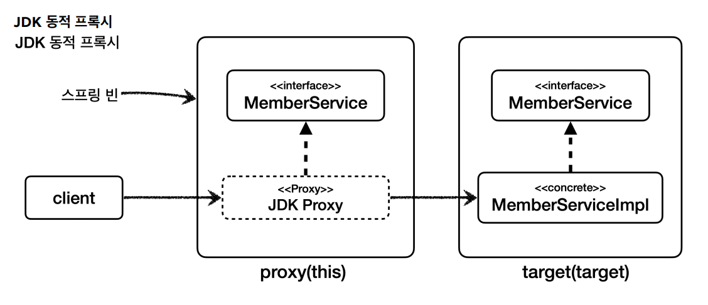
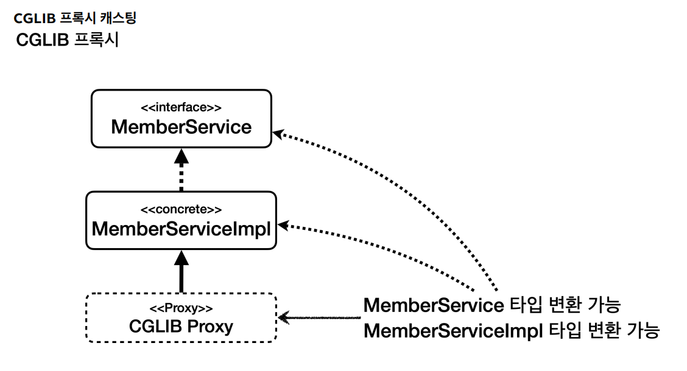
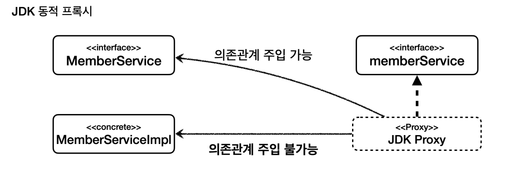
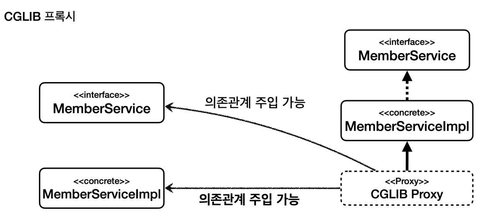
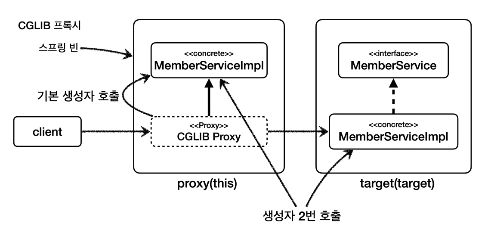

# 스프링 AOP 주의사항

## 프록시 기술과 한계 - 타입 캐스팅

JDK 동적 프록시와 CGLIB를 사용해서 AOP 프록시를 만드는 방법은 각각 장단점이 있다.<br>
**JDK 동적 프록시는 인터페이스가 필수**이고, 인터페이스를 기반으로 프록시를 생성한다.<br>
**CGLIB는 구체 클래스를 기반으로** 프록시를 생성한다.

인터페이스가 없고 구체 클래스만 있는 경우에는 CGLIB밖에 선택지가 없고, 인터페이스가 있는 경우에는 JDK 동적 프록시나 CGLIB를 선택할 수 있다.

스프링이 프록시를 만들 때 제공하는 `ProxyFactory`에 `proxyTargetClass` 옵션에 따라 선택할 수 있다.
- `proxyTargetClass=false` : JDK 동적 프록시를 사용해서 인터페이스 기반 프록시 생성
- `proxyTargetClass=true` : CGLIB를 사용해서 구체 클래스 기반 프록시 생성
- 옵션과 무관하게 인터페이스가 없으면 JDK 동적 프록시를 적용할 수 없으므로 CGLIB를 사용한다.

**인터페이스 기반으로 프록시를 생성하는 JDK 동적 프록시는 구체 클래스로 타입 캐스팅이 불가능한 한계가 있다.**

### 예제 코드
```java
@Test
void jdkProxy() {
    MemberServiceImpl target = new MemberServiceImpl();
    ProxyFactory proxyFactory = new ProxyFactory(target);
    proxyFactory.setProxyTargetClass(false);//JDK 동적 프록시

    //프록시를 인터페이스로 캐스팅 -> 성공
    MemberService memberServiceProxy = (MemberService) proxyFactory.getProxy();

    //JDK 동적 프록시를 구현 클래스로 캐스팅 시도 실패, ClassCastException 예외 발생
    assertThatThrownBy(() -> {
        MemberServiceImpl castingMemberService = (MemberServiceImpl) memberServiceProxy;
    }).isInstanceOf(ClassCastException.class);
}
```
- `MemberService` 인터페이스를 구현한 `MemberServiceImpl` 타입을 기반으로 JDK 동적 프록시를 생성했다.
- JDK 동적 프록시는 `MemberService` 인터페이스를 기반으로 프록시를 생성한다.
- `memberServiceProxy`가 `JDK Proxy`가 된다.



- 여기에서 `JDK Proxy`를 대상 클래스인 `MemberServiceImpl` 타입으로 캐스팅 할 때 예외가 발생한다.
- JDK 동적 프록시는 인터페이스를 기반으로 프록시를 생성한다. `JDK Proxy`는 `MemberService` 인터페이스를 기반으로 생성된 프록시이다.
- 따라서 `JDK Proxy`는 `MemberService`(인터페이스)로 캐스팅은 가능하지만 `MemberServiceImpl`은 어떤 것인지 전혀 알지 못한다.

**CGLIB를 사용해보자.**

```java
@Test
void cglibProxy() {
    MemberServiceImpl target = new MemberServiceImpl();
    ProxyFactory proxyFactory = new ProxyFactory(target);
    proxyFactory.setProxyTargetClass(true);//CGLIB 프록시

    //프록시를 인터페이스로 캐스팅 -> 성공
    MemberService memberServiceProxy = (MemberService) proxyFactory.getProxy();

    //CGLIB 프록시를 구현 클래스로 캐스팅 시도 성공
    MemberServiceImpl castingMemberService = (MemberServiceImpl) memberServiceProxy;
    assertThat(castingMemberService).isNotNull();
}
```


- `MemberServiceImpl` 타입을 기반으로 CGLIB 프록시를 생성했다.
- `MemberServiceImpl` 타입은 `MemberService` 인터페이스를 구현했고, CGLIB는 구체 클래스를 기반으로 프록시를 생성한다.
- CGLIB는 `MemberServiceImpl` 구체 클래스를 기반으로 프록시를 생성한다.
- `memberServiceProxy`가 `CGLIB Proxy`가 된다.



- `CGLIB Proxy`는 `MemberServiceImpl` 구체 클래스를 기반으로 생성된 프록시이다.
- `CGLIB Proxy`는 `MemberServiceImpl` 은 물론, 이의 부모인 `MemberService` 인터페이스로도 캐스팅이 가능하다.

**이러한 타입 캐스팅 문제는 의존관계 주입시에 발생한다.**

## 프록시 기술과 한계 - 의존관계 주입

**JDK 동적 프록시를 사용하면서 의존관계 주입을 할 때 어떤 문제가 발생하는지 알아보자.**

```java
@Slf4j
@Aspect
public class ProxyDIAspect {

    @Before("execution(* hello.aop..*.*(..))")
    public void doTrace(JoinPoint joinPoint) {
        log.info("[proxyDIAdvice] {}", joinPoint.getSignature());
    }
}
```
```java
@Slf4j
@SpringBootTest(properties = "spring.aop.proxy-target-class=false")//JDK 동적 프록시, DI 예외 발생
//@SpringBootTest(properties = "spring.aop.proxy-target-class=true")//CGLIB 프록시, 성공
@Import(ProxyDIAspect.class)
public class ProxyDITest {

    @Autowired MemberService memberService;//인터페이스
    @Autowired MemberServiceImpl memberServiceImpl;//구체 클래스

    @Test
    void go() {
        log.info("memberService class={}", memberService.getClass());
        log.info("memberServiceImpl class={}", memberServiceImpl.getClass());
        memberServiceImpl.hello("helloA");
    }
}
```
- `spring.aop.proxy-target-class=false`로 설정을 해서 스프링 AOP가 JDK 동적 프록시를 사용하도록 하고 실행을 하면 다음 오류가 발생한다.
```text
BeanNotOfRequiredTypeException: Bean named 'memberServiceImpl' is expected to be of type 'hello.aop.member.MemberServiceImpl' but was actually of type 'jdk.proxy3.$Proxy56'
```
- `memberServiceImpl`에 주입되길 기대하는 타입은 `hello.aop.member.MemberServiceImpl`인데 실제 넘어온 타입은 `jdk.proxy3.$Proxy56`이다.
- 타입 예외가 발생한다.



- JDK 동적 프록시는 인터페이스를 기반으로 프록시를 생성하기 때문에 인터페이스인 `MemberService` 타입으로 캐스팅이 가능하다.
- 하지만 구체 클래스인 `MemberServiceImpl` 타입은 전혀 알지 못하므로 해당 타입에 주입할 수 없는 것이다.



- CGLIB 방식을 사용하면 정상 동작한다.
- CGLIB 프록시는 `MemberServiceImpl` 구체 클래스를 기반으로 만들어진다.
- 그렇기 때문에 구체 클래스는 물론이고 구체 클래스의 부모 타입은 `MemberService` 인터페이스 타입으로도 캐스팅이 가능하다.

**그렇다면 마냥 CGLIB가 좋은 것일까?**

## 프록시 기술과 한계 - CGLIB

CGLIB는 구체 클래스를 상속 받기 때문에 다음과 같은 문제가 있다.
- 대상 클래스에 기본 생성자 필수
- 생성자 2번 호출 문제
- `final` 키워드 클래스, 메서드 사용 불가

**대상 클래스에 기본 생성자 필수**
- 자바 언어에서 상속을 받으면 자식 클래스의 생성자를 호출할 때 자식 클래스의 생성자에서 부모 클래스의 생성자로 호출해야 한다.
- 자식 클래스의 생성자 첫줄에 부모 클래스의 기본 생성자를 호출하는 `super()`가 자동으로 들어가진다.
- CGLIB를 사용할 때 CGLIB가 만드는 프록시의 생성자는 우리가 호출하는 것이 아니다.
- CGLIB 프록시는 대상 클래스를 상속 받고 생성자에서 대상 클래스의 기본 생성자를 호출한다. 따라서 대상 클래스의 기본 생성자를 만들어야 한다.

**생성자 2번 호출 문제**
1. 실제 target의 객체를 생성할 때
2. 프록시 객체를 생성할 때 부모 클래스의 생성자 호출



## 프록시 기술과 한계 - 스프링의 해결책

스프링 4.0부터는 `objenesis`라는 특별한 라이브러리를 사용해서 **기본 생성자 필수 문제**와 **생성자 2번 호출 문제**가 해결되었다.

스프링 부트 2.0 부터 CGLIB를 기본으로 사용하도록 해 구체 클래스 타입으로 의존관계를 주입하는 문제를 해결하였다.<br>
스프링 부트는 별도의 설정이 없다면 AOP를 적용할 때 기본적으로 `proxyTargetClass=true`로 설정해서 사용한다. 따라서 인터페이스가 있어도
JDK 동적 프록시를 사용하는 것이 아니라 항상 `CGLIB`를 사용해서 구체 클래스를 기반으로 프록시를 생성한다.

물론 다음과 같은 설정으로 JDK 동적 프록시도 사용할 수 있다.
```properties
## application.properties
spring.aop.proxy-target-class=false
```

```java
@Slf4j
//@SpringBootTest(properties = "spring.aop.proxy-target-class=false")//JDK 동적 프록시, DI 예외 발생
//@SpringBootTest(properties = "spring.aop.proxy-target-class=true")//CGLIB 프록시, 성공
@SpringBootTest
@Import(ProxyDIAspect.class)
public class ProxyDITest {
```
- 이렇게 아무 설정 없이 사용하면 기본으로 CGLIB 프록시를 사용한다.