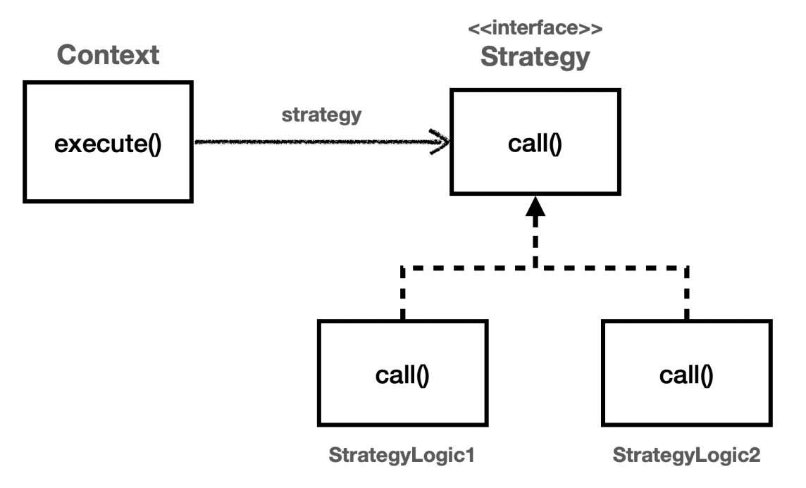
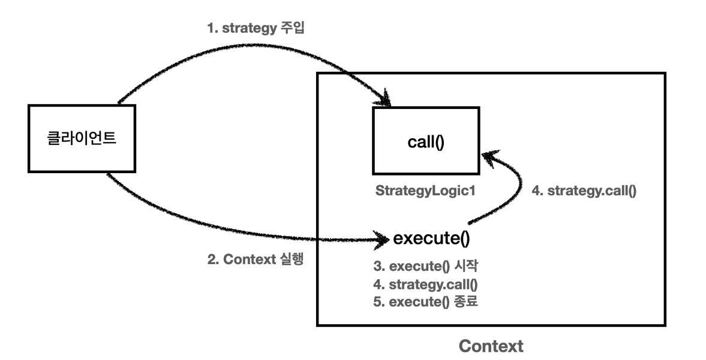
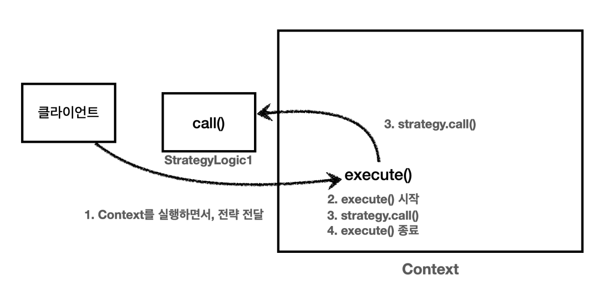

# 전략 패턴

```java
@Test
void templateMethodV0() {
    logic1();
    logic2();
}

private void logic1() {
    long startTime = System.currentTimeMillis();

    log.info("비즈니스 로직1 실행");

    long endTime = System.currentTimeMillis();
    long resultTime = endTime - startTime;

    log.info("resultTime = {}", resultTime);
}

private void logic2() {
    long startTime = System.currentTimeMillis();

    log.info("비즈니스 로직2 실행");

    long endTime = System.currentTimeMillis();
    long resultTime = endTime - startTime;

    log.info("resultTime = {}", resultTime);
}
```

## 전략 패턴 - V1

템플릿 메서드 패턴은 부모 클래스에 변하지 않는 템플릿을 두고 변하는 부분을 자식 클래스에 두어서 상속을 사용한다.

전략 패턴은 변하지 않는 부분을 `Context`에 두고, 변하는 부분을 인터페이스를 만들고 해당 인터페이스를 구현하도록 한다. **상속이 아니라 위임으로 문제를 해결한다.**



```java
public interface Strategy {
    void call();
}

@Slf4j
public class StrategyLogic1 implements Strategy{
    @Override
    public void call() {
        log.info("비즈니스 로직1 실행");
    }
}

@Slf4j
public class StrategyLogic2 implements Strategy{
    @Override
    public void call() {
        log.info("비즈니스 로직2 실행");
    }
}
```

```java
/**
 * 필드에 전략을 보관하는 방식
 */
@Slf4j
public class ContextV1 {

    private Strategy strategy;

    public ContextV1(Strategy strategy) {
        this.strategy = strategy;
    }

    public void execute() {
        long startTime = System.currentTimeMillis();

        strategy.call();

        long endTime = System.currentTimeMillis();
        long resultTime = endTime - startTime;

        log.info("resultTime = {}", resultTime);
    }
}
```
- `ContextV1`은 변하지 않는 로직을 가지고 있는 템플릿 역할을 한다. 전략 패턴에서는 이것을 컨텍스트(문맥)라고 한다.
- 컨텍스트는 크게 변하지 않지만 그 안에서 `strategy`를 통해 일부 전략이 변경 된다 생각하면 된다.
- `Context`는 내부에 `Strategy`필드를 가지고 있다. 이 필드에 변하는 부분인 `Strategy`의 구현체를 주입하면 된다.
- **전략 패턴의 핵심은 인터페이스에 의존 한다는 점이다.** 구현체를 변경하거나 새로 만들어도 `Context`코드에는 영향을 주지 않는다.
- **스프링에서 의존관계 주입하는 방식이 전략 패턴이다.**

```java
/**
 * 전략 패턴 사용
 */
@Test
void strategyV1() {
    StrategyLogic1 strategyLogic1 = new StrategyLogic1();
    ContextV1 contextV1 = new ContextV1(strategyLogic1);
    contextV1.execute();

    StrategyLogic1 strategyLogic2 = new StrategyLogic1();
    ContextV1 contextV2 = new ContextV1(strategyLogic2);
    contextV2.execute();
}
```



```java
/**
 * 전략 패턴 익명 내부 클래스1
 */
@Test
void strategyV2() {
    Strategy strategyLogic1 = new Strategy() {
        @Override
        public void call() {
            log.info("비즈니스 로직1 실행");
        }
    };
    ContextV1 contextV1 = new ContextV1(strategyLogic1);
    contextV1.execute();

    Strategy strategyLogic2 = new Strategy() {
        @Override
        public void call() {
            log.info("비즈니스 로직2 실행");
        }
    };
    ContextV1 contextV2 = new ContextV1(strategyLogic2);
    contextV2.execute();
}
```
```java
/**
 * 전략 패턴 익명 내부 클래스2
 */
@Test
void strategyV3() {
    ContextV1 contextV1 = new ContextV1(new Strategy() {
        @Override
        public void call() {
            log.info("비즈니스 로직1 실행");
        }
    });
    contextV1.execute();

    ContextV1 contextV2 = new ContextV1(new Strategy() {
        @Override
        public void call() {
            log.info("비즈니스 로직2 실행");
        }
    });
    contextV2.execute();
}
```
```java
/**
 * 전략 패턴 람다
 */
@Test
void strategyV4() {
    ContextV1 contextV1 = new ContextV1(() -> log.info("비즈니스 로직1 실행"));
    contextV1.execute();
    
    ContextV1 contextV2 = new ContextV1(() -> log.info("비즈니스 로직2 실행"));
    contextV2.execute();
}
```

> 변하지 않는 부분을 `Context`에 두고 변하는 부분을 `Strategy`를 구현해서 만들었다. 그리고 `Context`내부 필드에 `Strategy`를 주입해서 사용했다.
> 
> 이 방식은 `Context`와 `Strategy`를 실행 전에 원하는 모양으로 조립해 두고 그 다음에 `Context`를 실행하는 선 조립, 후 실행 방식에서 매우 유용하다.
> 
> 스프링에서 애플리케이션 로딩 시점에 의존관계 주입을 통해 필요한 의존관계를 모두 맺어두고 난 다음에 실제 요청을 처리하는 것과 같은 원리이다.
> 
> 하지만 단점은 한 번 조립이 된 이후에는 전략을 변경하기가 어렵다. `setter`를 제공할 수도 있지만 싱글톤으로 사용하면 동시성 이슈 등 문제가 있다.먼저 조립하고
> 사용하는 방식보다 더 유연하게 전략 패턴을 사용할 수 있는 방법은 없을까?

<br>

## 전략 패턴 - V2
필드에 주입하는 방식 말고 전략을 실행할 때 직접 파라미터로 전달하는 방식을 사용해본다.

```java
/**
 * 전략을 파라미터로 전달 받는 방식
 */
@Slf4j
public class ContextV2 {

    public void execute(Strategy strategy) {
        long startTime = System.currentTimeMillis();

        strategy.call();

        long endTime = System.currentTimeMillis();
        long resultTime = endTime - startTime;

        log.info("resultTime = {}", resultTime);
    }
}

/**
 * 전략 패턴 적용
 */
@Test
void strategyV1() {
    ContextV2 context = new ContextV2();
    context.execute(new StrategyLogic1());
    context.execute(new StrategyLogic2());
}
```
- 클라이언트에서 `Context`를 실행하는 시점에 원하는 `Strategy`를 전달할 수 있다. 원하는 전략을 유연하게 변경할 수 있다.



```java
/**
 * 전략 패턴 익명 내부 클래스
 */
@Test
void strategyV2() {
    ContextV2 context = new ContextV2();
    
    context.execute(new Strategy() {
        @Override
        public void call() {
            log.info("비즈니스 로직1 실행");
        }
    });
    
    context.execute(new Strategy(){
        @Override
        public void call() {
            log.info("비즈니스 로직2 실행");
        }
    });
}
```
```java
 /**
  * 전략 패턴 내부 클래스2, 람다
  */
 @Test
 void strategyV3() {
     ContextV2 context = new ContextV2();
     
     context.execute(() -> log.info("비즈니스 로직1 실행"));
     context.execute(() -> log.info("비즈니스 로직2 실행"));
 }
```