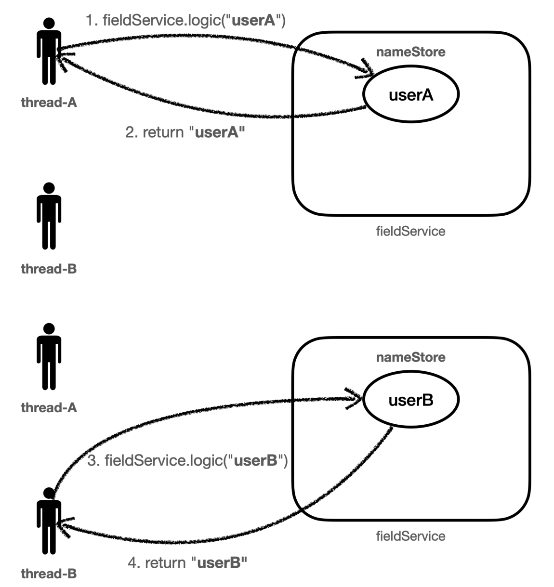
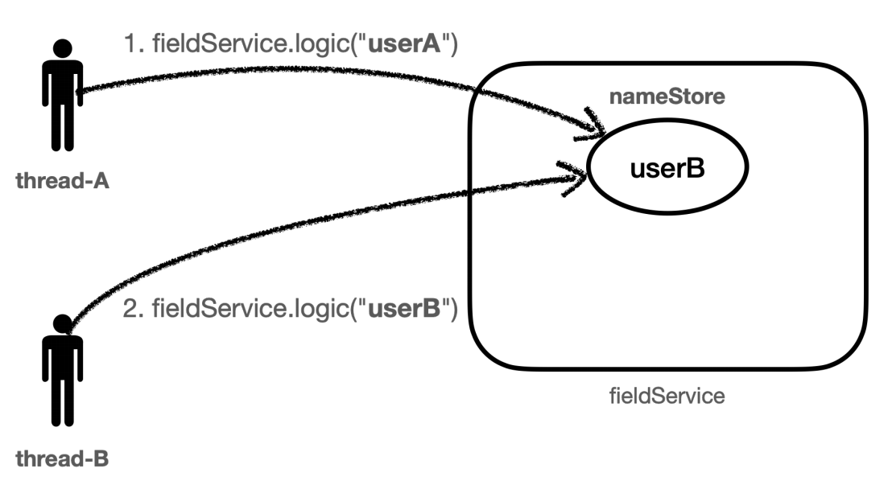
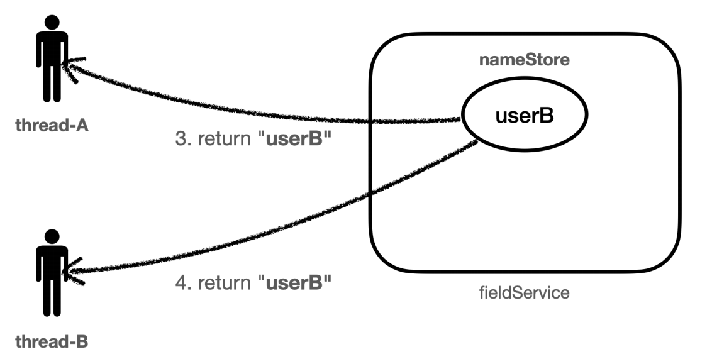

# 동시성 문제 - 예제

```java
@Slf4j
public class FieldService {
    private String nameStore;

    public String logic(String name) {
        log.info("저장 name={} -> nameStore={}", name, nameStore);
        nameStore = name;
        sleep();
        log.info("조회 nameStore={}", nameStore);
        return nameStore;
    }

    private void sleep() {
        try {
            Thread.sleep(1000);
        } catch (InterruptedException e) {
            throw new RuntimeException(e);
        }
    }
}
```
- 파라미터로 넘어온 `name`을 필드에 저장한다. 
- 1초 쉰 다음 필드에 저장된 값을 반환한다.

```java
@Slf4j
public class FieldServiceTest {

    private FieldService fieldService = new FieldService();

    @Test
    void field() {
        log.info("main start");
        Runnable userA = () -> fieldService.logic("userA");
        Runnable userB = () -> fieldService.logic("userB");

        Thread threadA = new Thread(userA);
        threadA.setName("thread-A");

        Thread threadB = new Thread(userB);
        threadB.setName("thread-B");

        threadA.start();
        sleep(2000); // 동시성 문제 발생 안함
//        sleep(100); // 동시성 문제 발생
        threadB.start();
        sleep(3000); // 메인 쓰레드 종료 대기
        log.info("main exit");
    }

    private void sleep(int millis) {
        try {
            Thread.sleep(millis);
        } catch (InterruptedException e) {
            throw new RuntimeException(e);
        }
    }
}
```
- `sleep(2000)`으로 `threadA`의 실행이 끝나고 나서 `threadB`가 실행되도록 했다.
- `fieldService.logic()` 메서드는 내부에 `sleep(100)`으로 1초의 지연이 있다. 1초 이후에 호출하면 순서대로 실행할 수 있다.



**이제 동시성 문제가 발생하는 `sleep(100)`으로 해보자.**


- 먼저 `threadA`가 값을 보관했다.



- `threadA`가 실행한 로직은 1초 후에 종료되는데 0.1초 이후에 `threadB`가 값을 보관했다. `threadA`가 보관했던 값은 제거되고 `threadB`가 보관한 값이 저장된다.



- `threadA`는 자신이 저장했던 값을 받지 못하고 `threadB`가 저장했던 값을 반환받는다.
- `threadB`는 자신이 저장했던 값을 반환받는다.

**이렇게 여러 쓰레드가 동시에 같은 인스턴스의 필드 값을 변경하면서 발생하는 문제를 `동시성 문제`라고 한다. 이런 동시성 문제는 여러 쓰레드가 같은 인스턴스의
필드에 접근해야 하기 때문에 트래픽이 많아질수록 자주 발생한다.<br>
스프링 빈 처럼 싱글톤 객체의 필드를 변경하며 사용할 때 이러한 동시성 문제를 조심해야 한다.**

> **참고**
> 
> 이런 동시성 문제는 지역 변수에서는 발생하지 않는다. 지역 변수는 쓰레드마다 각각 다른 메모리 영역이 할당된다. 
> 
> 동시성 문제가 발생하는 곳은 같은 인스턴스의 필드(주로 싱글톤에서 자주 발생), 또는 `static`같은 공용 필드에 접근할 때 발생한다.<br>
> 동시성 문제는 값을 읽기만 하면 발생하지 않고, 어디선가 값을 변경하기 때문에 발생한다.