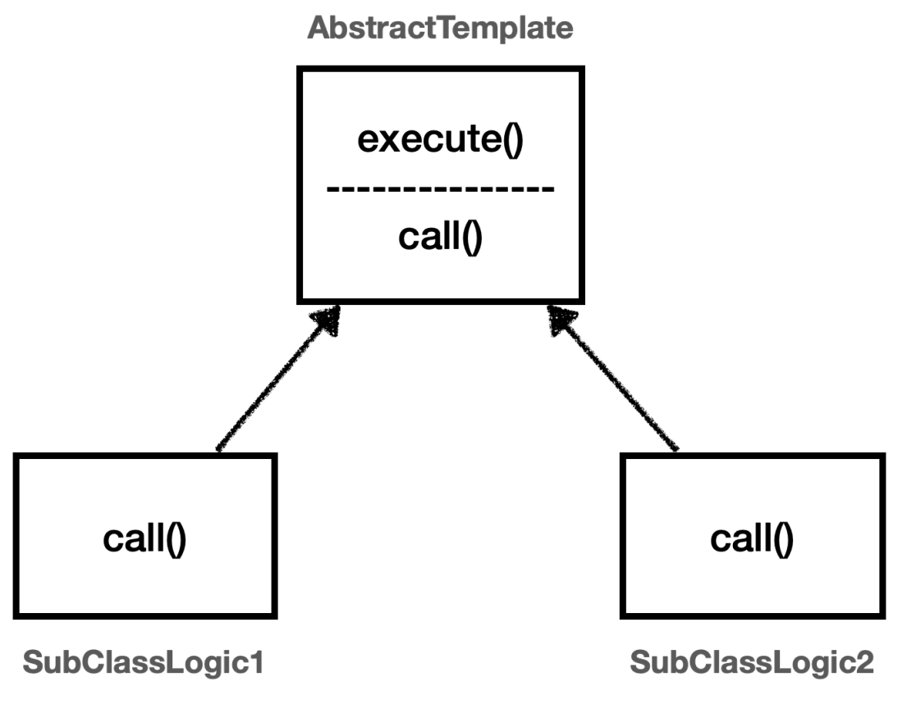
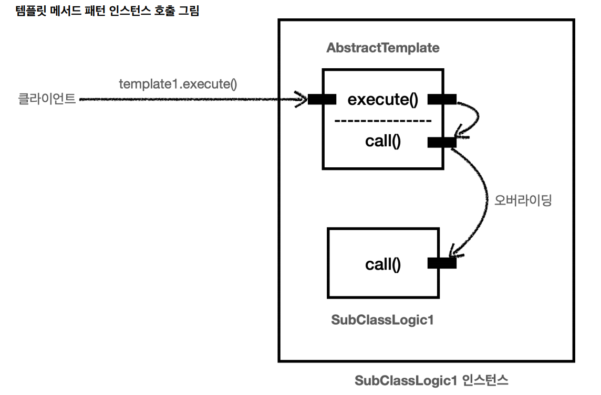

# 템플릿 메서드 패턴

```java
@Slf4j
public class TemplateMethodTest {

    @Test
    void templateMethodV0() {
        logic1();
        logic2();
    }

    private void logic1() {
        long startTime = System.currentTimeMillis();

        log.info("비즈니스 로직1 실행");

        long endTime = System.currentTimeMillis();
        long resultTime = endTime - startTime;

        log.info("resultTime = {}", resultTime);
    }

    private void logic2() {
        long startTime = System.currentTimeMillis();

        log.info("비즈니스 로직2 실행");

        long endTime = System.currentTimeMillis();
        long resultTime = endTime - startTime;

        log.info("resultTime = {}", resultTime);
    }
}
```
- 핵심 기능인 비즈니스 로직(변하는 부분)과 부가 기능인 시간을 측정하는 로직(변하지 않는 부분) 

**디자인 패턴 중 하나인 템플릿 메서드 패턴을 사용해서 변하는 부분과 변하지 않는 부분을 분리할 수 있다.**

## 템플릿 메서드 패턴 - V1



```java
@Slf4j
public abstract class AbstractTemplate {

    public void execute() {
        long startTime = System.currentTimeMillis();
        call();
        long endTime = System.currentTimeMillis();
        long resultTime = endTime - startTime;

        log.info("resultTime = {}", resultTime);
    }
    protected abstract void call();
}
```
- 템플릿 메서드 패턴은 템플릿을 사용하는 방식으로 템플릿이라는 틀에 변하지 않는 부분을 몰아둔다. 그리고 일부 변하는 부분을 별도로 호출해서 해결한다.
- 부모 클래스에 변하지 않는 템플릿 코드를 둔다. 변하는 부분은 자식 클래스에 두고 상속과 오버라이딩(다형성)을 사용해서 처리한다.

```java
@Slf4j
public class SubClassLogic1 extends AbstractTemplate{
    @Override
    protected void call() {
        log.info("비즈니스 로직1 실행");
    }
}

@Slf4j
public class SubClassLogic2 extends AbstractTemplate{
    @Override
    protected void call() {
        log.info("비즈니스 로직2 실행");
    }
}

/**
 * 템플릿 메서드 패턴 적용
 */
@Test
void templateMethodV1() {
    AbstractTemplate template1 = new SubClassLogic1();
    template1.execute();

    AbstractTemplate template2 = new SubClassLogic2();
    template2.execute();
}
```



<br>

## 템플릿 메서드 패턴 - V2

템플릿 메서드 패턴은 클래스를 계속 만들어야 한다는 단점이 있다.

`익명 내부 클래스`를 사용하면 객체 인스턴스를 생성하면서 동시에 생성할 클래스를 상속 받은 자식 클래스를 정의할 수 있다. 이 클래스는 직접 지정하는 이름이 없고
클래스 내부에 선언되는 클래스여서 `익명 내부 클래스` 라고 한다.

```java
/**
 * 템플릿 메서드 패턴, 익명 내부 클래스 적용
 */
@Test
void templateMethodV2() {
    AbstractTemplate template1 = new AbstractTemplate() {
        @Override
        protected void call() {
            log.info("비즈니스 로직1 실행");
        }
    };
    template1.execute();

    AbstractTemplate template2 = new AbstractTemplate() {
        @Override
        protected void call() {
            log.info("비즈니스 로직2 실행");
        }
    };
    template2.execute();
}
```