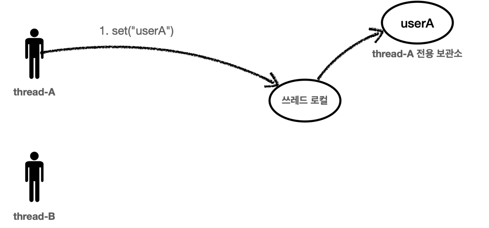
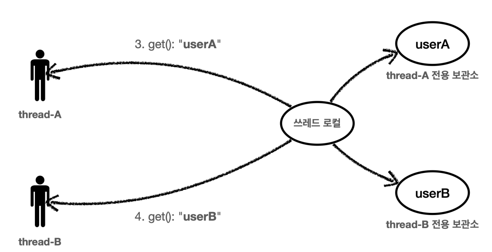
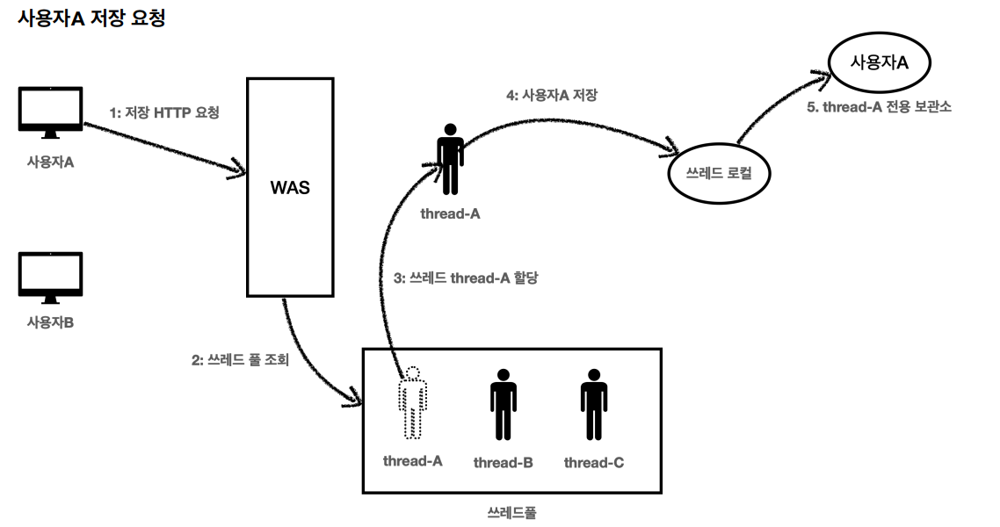
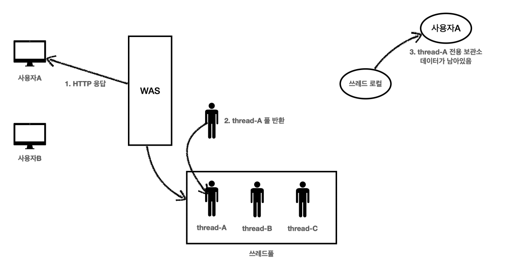
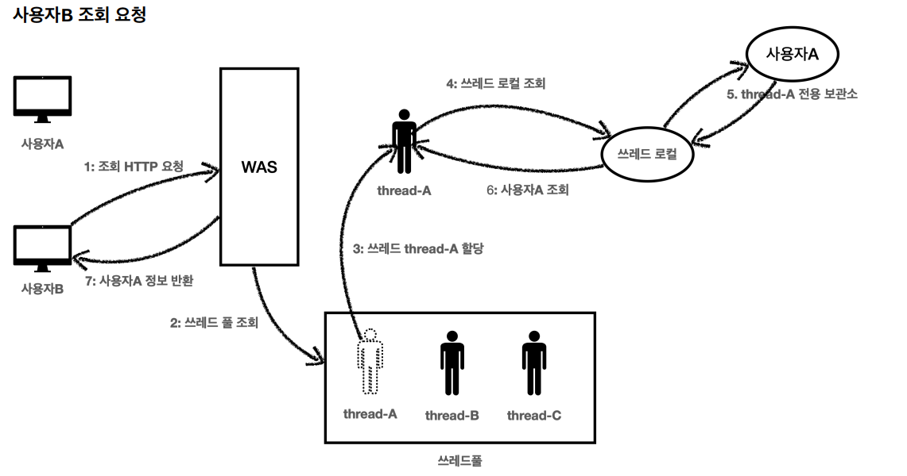

# 쓰레드 로컬

쓰레드 로컬을 사용하면 각 쓰레드마다 별도의 내부 저장소를 제공하기 때문에 같은 인스턴스(싱글톤)의 쓰레드 로컬 필드에 접근해도 문제없다.

```java
@Slf4j
public class ThreadLocalService {
    
    private ThreadLocal<String> nameStore = new ThreadLocal<>();

    public String logic(String name) {
        log.info("저장 name={} -> nameStore={}", name, nameStore.get());//값 조회
        nameStore.set(name);//값 저장
        sleep();
        log.info("조회 nameStore={}", nameStore.get());
        return nameStore.get();
    }

    private void sleep() {
        try {
            Thread.sleep(1000);
        } catch (InterruptedException e) {
            throw new RuntimeException(e);
        }
    }
}

@Slf4j
public class ThreadLocalServiceTest {

    private ThreadLocalService service = new ThreadLocalService();

    @Test
    void field() {
        log.info("main start");
        Runnable userA = () -> service.logic("userA");
        Runnable userB = () -> service.logic("userB");

        Thread threadA = new Thread(userA);
        threadA.setName("thread-A");
        Thread threadB = new Thread(userB);
        threadB.setName("thread-B");

        threadA.start();
//        sleep(2000); // 동시성 문제 발생 안함
        sleep(100); // 동시성 문제 발생
        threadB.start();
        sleep(3000); // 메인 쓰레드 종료 대기
        log.info("main exit");
    }

    private void sleep(int millis) {
        try {
            Thread.sleep(millis);
        } catch (InterruptedException e) {
            throw new RuntimeException(e);
        }
    }
}
```






`threadA`와 `threadB`가 각각 별도의 저장소를 가지기 때문에 동시 요청이 와도 전혀 문제 없이 각자 원하는 값을 얻을 수 있게 되었다.

<br>

## LogTrace 쓰레드 로컬 적용

```java
@Slf4j
public class ThreadLocalLogTrace implements LogTrace {
    public static final String START_PREFIX = "-->";
    public static final String COMPLETE_PREFIX = "<--";
    public static final String EX_PREFIX = "<X-";

//    private TraceId traceHolder; // traceId 동기화, 동시성 이슈 발생
    private ThreadLocal<TraceId> traceHolder = new ThreadLocal<>();

    @Override
    public TraceStatus begin(String message) {
        syncTraceId();
        TraceId traceId = traceHolder.get();
        Long startTimeMs = System.currentTimeMillis();
        log.info("[{}] {}{}",
                traceId.getId(),
                addSpace(START_PREFIX, traceId.getLevel()),
                message);

        return new TraceStatus(traceId, startTimeMs, message);
    }

    private void syncTraceId() {
        TraceId traceId = traceHolder.get();
        if (traceId == null) {
            traceHolder.set(new TraceId());
        } else {
            traceHolder.set(traceId.createNextId());
        }
    }

    @Override
    public void end(TraceStatus status) {
        complete(status, null);
    }

    @Override
    public void exception(TraceStatus status, Exception e) {
        complete(status, e);
    }

    private void complete(TraceStatus status, Exception e) {
        Long stopTimeMs = System.currentTimeMillis();
        long resultTimeMs = stopTimeMs - status.getStartTimeMs();

        TraceId traceId = status.getTraceId();
        if (e == null) {
            log.info("[{}] {}{} time={}ms",
                    traceId.getId(),
                    addSpace(COMPLETE_PREFIX, traceId.getLevel()),
                    status.getMessage(),
                    resultTimeMs);
        } else {
            log.info("[{}] {}{} time={}ms ex={}" ,
                    traceId.getId(),
                    addSpace(EX_PREFIX, traceId.getLevel()),
                    status.getMessage(),
                    resultTimeMs,
                    e.toString());
        }
        releaseTraceId();
    }

    private void releaseTraceId() {
        TraceId traceId = traceHolder.get();
        if (traceId.isFirstLevel()) {
            traceHolder.remove(); //destroy
        } else {
            traceHolder.set(traceId.createPreviousId());
        }
    }

    private String addSpace(String prefix, int level) {
        StringBuilder sb = new StringBuilder();
        for (int i = 0; i < level; i++) {
            sb.append((i == level - 1) ? "|" + prefix : "|    ");
        }
        return sb.toString();
    }
}
```

- 쓰레드 로컬을 모두 사용하고 나면 꼭 `ThreadLocal.remove()`를 호출해서 쓰레드 로컬에 저장된 값을 제거해 주어야 한다.

```java
@Configuration
public class LogTraceConfig {

    @Bean
    public LogTrace logTrace() {
        return new ThreadLocalLogTrace();
    }
}
```

## 쓰레드 로컬 주의 사항

**쓰레드 로컬의 값을 사용 후 제거하지 않고 그냥 두면 WAS(톰캣)처럼 쓰레드 풀을 사용하는 경우에 심각한 문제가 발생할 수 있다.**



1. 사용자A가 저장 HTTP를 요청한다.
2. WAS는 쓰레드 풀에서 쓰레드를 하나 조회한다.
3. 쓰레드 `thread-A`가 할당되었다.
4. `thread-A`는 사용자A의 데이터를 쓰레드 로컬에 저장한다.
5. 쓰레드 로컬의 `thread-A` 전용 보관소에 사용자A 데이터를 보관한다.



1. 사용자A의 HTTP 응답이 끝난다.
2. WAS는 사용이 끝난 `thread-A`를 쓰레드 풀에 반환한다. 쓰레드를 생성하는 비용은 비싸기 때문에 쓰레드를 제거하지 않고 보통 쓰레드 풀을 통해서 쓰레드를 재사용한다.
3. `thread-A`는 쓰레드 풀에 아직 살아있기 때문에 쓰레드 로컬의 `thread-A` 전용 보관소에 사용자A 데이터도 함께 살아있다.



1. 사용자B가 새로운 HTTP 요청을 한다.
2. WAS는 쓰레드 풀에서 쓰레드를 하나 조회한다.
3. 쓰레드 `thread-A`가 할당되었다.(다른 쓰레드가 할당될 수도 있다.)
4. `thread-A`는 쓰레드 로컬에서 데이터를 조회한다.
5. 쓰레드 로컬은 `thread-A` 전용 보관소에 있는 사용자A 데이터를 반환한다.
6. 사용자A 데이터가 반환된다.
7. 사용자B는 사용자A의 정보를 조회하게 된다.

> **이런 문제를 예방하려면 한 요청이 끝날 때 쓰레드 로컬의 값을 `ThreaLocal.remove()`를 통해서 꼭 제거해야 한다.**
> 
> 쓰레드 로컬을 사용할 때는 이 부분을 유념해서 사용해야 한다.