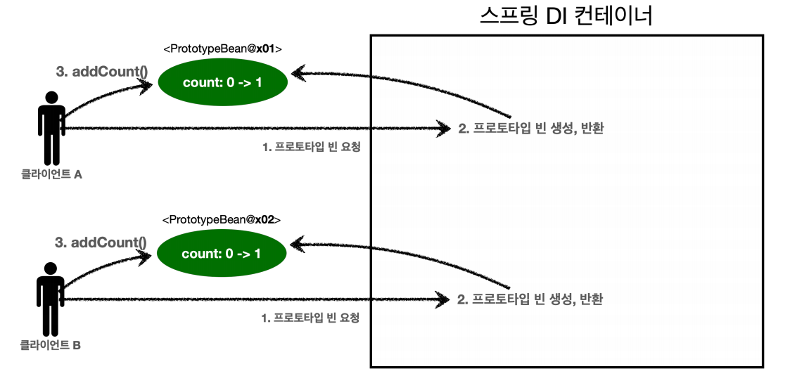

# 스프링 빈 스코프 - 1

**스프링은 다양한 빈 스코프를 지원한다.**
- **싱글톤** : 기본 스코프, 스프링 컨테이너의 시작과 종료까지 유지되는 가장 넓은 범위의 스코프
- **프로토타입** : 스프링 컨테이너는 프로토타입 빈의 의존관계 주입까지만 관여하고 더는 관리하지 않는 매우 짧은 범위의 스코프
- **웹 관련 스코프**
  - **request** : 웹 요청이 들어오고 나갈 떄까지 유지되는 스코프
  - **session** : 웹 세션이 생성되고 종료될 때까지 유지되는 스코프
  - **application** : 웹의 서블릿 컨텍스트와 같은 범위로 유지되는 스코프

<br>

## 프로토타입 스코프

싱글톤 스코프의 빈을 조회하면 스프링 컨테이너는 항상 같은 인스턴스의 스프링 빈을 반환한다. 반면에 프로토타입 스코프를 스프링 컨테이너에 조회하면 스프링
컨테이너는 항상 새로운 인스턴스를 생성해서 반환한다.

**스프링 컨테이너는 프로토타입 빈을 생성하고 의존관계 주입, 초기화까지만 처리한다.** 클라이언트에 빈을 반환하고 이후 스프링 컨테이너는 생성된 프로토타입 빈을
관리하지 않는다. 즉 프로토타입 빈을 관리할 책임은 클라이언트에 있으며 `@PreDestroy`같은 종료 메서드가 호출되지 않는다.

```java
//싱글톤
@Test
void singletonBeanFind() {
        AnnotationConfigApplicationContext ac = new AnnotationConfigApplicationContext(SingletonBean.class);
        
        SingletonBean bean1 = ac.getBean(SingletonBean.class);
        SingletonBean bean2 = ac.getBean(SingletonBean.class);
        
        System.out.println("bean1 = " + bean1);
        System.out.println("bean2 = " + bean2);
        
        assertThat(bean1).isSameAs(bean2);
        ac.close();
    }
    
@Scope("singleton")
static class SingletonBean{
    @PostConstruct
    public void init() {
        System.out.println("SingletonBean.init");
    }
    
    @PreDestroy
    public void destroy() {
        System.out.println("SingletonBean.destroy");
    }
}

//프로토타입
@Test
void prototypeBeanFind() {
    AnnotationConfigApplicationContext ac = new AnnotationConfigApplicationContext(PrototypeBean.class);

    System.out.println("find prototypeBean1");
    PrototypeBean bean1 = ac.getBean(PrototypeBean.class);

    System.out.println("find prototypeBean2");
    PrototypeBean bean2 = ac.getBean(PrototypeBean.class);

    System.out.println("bean1 = " + bean1);
    System.out.println("bean2 = " + bean2);

    assertThat(bean1).isNotSameAs(bean2);

    ac.close();
}

@Scope("prototype")
static class PrototypeBean{
    @PostConstruct
    public void init() {
        System.out.println("PrototypeBean.init");
    }
    @PreDestroy
    public void destroy() {
        System.out.println("PrototypeBean.destroy");
    }
}
```
- `싱글톤 빈`은 빈 초기화 메서드를 한 번만 실행하고 같은 인스턴스의 빈을 반환한다. 그리고 종료 메서드까지 정상적으로 호출된다.
- `프로토타입 빈`은 프로토타입 빈을 조회한 만큼 완전히 다른 스프링 빈이 생성되고 초기화 메서드도 두 번 실행된다. 그리고 종료 메서드도 실행되지 않는다.
  - 종료 메서드를 실행하려면 클라이언트에서 직접 `destroy()` 메서드를 호출해야 한다.

<br>

### 프로토타입 스코프 - 싱글톤 빈과 함께 사용 시 문제점

```java
@Test
void prototypeFind() {
    AnnotationConfigApplicationContext ac = new AnnotationConfigApplicationContext(PrototypeBean.class);
    
    PrototypeBean bean1 = ac.getBean(PrototypeBean.class);
    bean1.addCount();
    assertThat(bean1.getCount()).isEqualTo(1);
    
    PrototypeBean bean2 = ac.getBean(PrototypeBean.class);
    bean2.addCount();
    assertThat(bean2.getCount()).isEqualTo(1);
}

@Scope("prototype")
static class PrototypeBean{
    private int count = 0;
    public void addCount() {
        count++;
    }
    public int getCount() {
        return count;
    }
    @PostConstruct
    public void init() {
        System.out.println("PrototypeBean.init " + this);
    }
    @PreDestroy
    public void destroy() {
        System.out.println("PrototypeBean.destroy");
    }
}
```



프로토타입 빈은 항상 새로운 인스턴스를 반환하기 때문에 당연히 서로의 독단적인 결과를 갖게 된다.

**싱글톤 빈에서 프로토타입 빈을 의존관계 주입 받아서 사용하면 어떻게 될까?**

```java
@Test
void singletonClientUsePrototype() { 
    AnnotationConfigApplicationContext ac = new AnnotationConfigApplicationContext(ClientBean.class, PrototypeBean.class);
    
    ClientBean clientBean1 = ac.getBean(ClientBean.class); 
    int count1 = clientBean1.logic();
    assertThat(count1).isEqualTo(1);
    
    ClientBean clientBean2 = ac.getBean(ClientBean.class); 
    int count2 = clientBean2.logic();
    assertThat(count2).isEqualTo(2);
}

static class ClientBean {

    private final PrototypeBean prototypeBean;
    
    @Autowired
    public ClientBean(PrototypeBean prototypeBean) {
        this.prototypeBean = prototypeBean;
    }
    
    public int logic() {
        prototypeBean.addCount();
        int count = prototypeBean.getCount();
        return count;
    }
}
```
- **clientBean은 싱글톤이고 내부에 가지고 있는 프로토타입 빈은 주입 시점에 스프링 컨테이너에 요청해서 프로토타입 빈이 새로 생성이 된 것이지 사용할 때 마다 새로 생성되지
않는다.**

**싱글톤 빈과 프로토타입 빈을 함께 사용할 때 항상 새로운 프로토타입 빈을 생성하려면?**

- 싱글톤 빈이 스프링 컨테이너(`ApplicationContext`)를 주입을 받고 프로토타입 빈을 사용할 때마다 새로 요청하기
  - 직접 필요한 의존관계를 찾는 것을 DL(Dependency Lookup)이라고 하는데 스프링은 이러한 기능을 제공한다.

```java
@Autowired
private ObjectProvider<PrototypeBean> prototypeBeanProvider; 

public int logic() {
    PrototypeBean prototypeBean = prototypeBeanProvider.getObject(); 
    prototypeBean.addCount();
    int count = prototypeBean.getCount(); 
    return count;
}
```
- `prototypeBeanProvider.getObject()`를 통해서 항상 새로운 프로토타입 빈을 생성한다.
- 스프링에 의존하는 기술이다.

자바 표준을 사용하려면 `Provider`를 사용하면 된다.
- gradle 추가
```properties
implementation 'jakarta.inject:jakarta.inject-api:2.0.1'
```

```java
@Autowired
private Provider<PrototypeBean> prototypeBeanProvider;

public int logic() {
        PrototypeBean prototypeBean = prototypeBeanProvider.get();
        prototypeBean.addCount();
        return prototypeBean.getCount();
    }
```