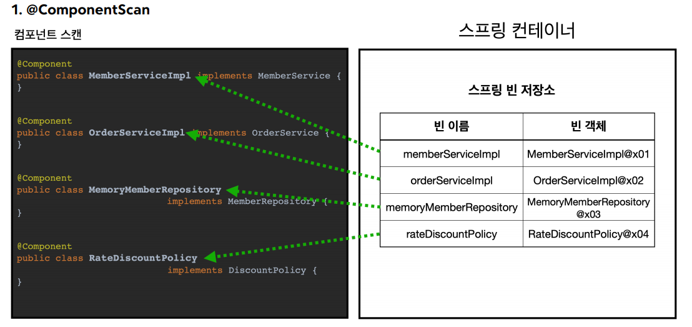
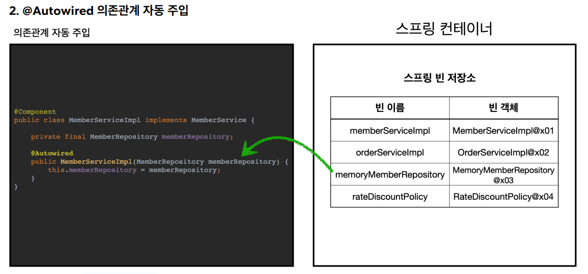

# 스프링 컴포넌트 스캔

스프링 빈을 직접 일일이 등록하지 않아도 스프링은 컴포넌트 스캔이라는 자동으로 스프링 빈을 등록해주는 기능을 제공한다.

```java
@Configuration
@ComponentScan(
        excludeFilters = @ComponentScan.Filter(type = ANNOTATION, classes = Configuration.class)
)
public class AutoAppConfig {
}
```
- `@Configuration`도 컴포넌트 스캔의 대상이 되기 때문에 빈이 충돌하지 않도록 컴포넌트 스캔 대상에서 제외해준다.
- `@Bean`으로 직접 등록하는 코드가 하나도 없다.

이제 스프링 빈으로 등록할 클래스를 컴포넌트 스캔의 대상이 되기 위해서 `@Component`를 붙어주어야 한다.(`@Configuration`도 내부에 `@Component`가 있다.)

```java
@Component
public class MemoryMemberRepository implements MemberRepository{ ... }

@Component
public class RateDiscountPolicy implements DiscountPolicy{ ... }

@Component
public class MemberServiceImpl implements MemberService {
    private final MemberRepository memberRepository;

    @Autowired
    public MemberServiceImpl(MemberRepository memberRepository) {
        this.memberRepository = memberRepository;
    }
}

@Component
public class OrderServiceImpl implements OrderService {
    
    private final MemberRepository memberRepository;
    private final DiscountPolicy discountPolicy;
    
    @Autowired
    public OrderServiceImpl(MemberRepository memberRepository, DiscountPolicy discountPolicy) {
        this.memberRepository = memberRepository;
        this.discountPolicy = discountPolicy;
    }
}
```
- `@Bean`으로 직접 스프링 빈으로 등록하고 의존관계도 직접 명시하지 않기 때문에 의존관계 주입도 클래스 안에서 해결해야 한다.
- `@Autowired`는 의존관계를 자동으로 주입해준다.

```java
@Test
void basicScan() {
        ApplicationContext ac = new AnnotationConfigApplicationContext(AutoAppConfig.class);
        MemberService memberService = ac.getBean(MemberService.class);
        assertThat(memberService).isInstanceOf(MemberService.class);
}
```

### 컴포넌트 스캔 동작 방식



- `@ComponentScan`은 `@Component`가 붙은 모든 클래스를 스프링 빈으로 등록한다.
- 스프링 빈의 기본 이름은 클래스명을 사용하는데 앞글자만 소문자를 사용한다.
  - 스프링 빈의 이름을 직접 지정하고 싶으면 `@Component("example")` 이런 식으로 하면 된다.



- 생성자에 `@Autowired`를 지정하면 스프링 컨테이너가 자동으로 해당 스프링 빈을 찾아서 주입한다.
- 기본 전략은 타입이 같은 빈을 찾아서 주입한다.
- 생성자에 파라미터가 여러 개여도 다 찾아서 자동으로 주입한다.

<br>

### 컴포넌트 스캔 탐색 위치

```java
@ComponentScan(
        basckPackages = "hello.core"
)
```
- `basckPackages` : 탐색할 패키지의 시작 위치를 지정한다. 이 패키지를 포함해서 하위 패키지를 탐색한다.
  - 배열(`{}`)을 사용해서 여러 시작 위치를 지정할 수도 있다.
- `basePackageClasses` : 지정한 클래스의 패키지를 탐색 시작 위치로 지정한다.
- 지정하지 않으면 `@ComponentScan`이 붙은 설정 정보 클래스의 패키지가 시작 위치가 된다.
- **관례를 따라 패키지 위치를 지정하지 않고 설정 정보 클래스의 위치를 프로젝트 최상단에 두는 것이 좋다.**
  - 스프링 부트는 `@SpringBootApplication` 내부에 `@ComponentScan`이 들어있다.

### 컴포넌트 스캔 기본 대상

컴포넌트 스캔은 `@Component`뿐만 아니라 다양한 어노테이션을 컴포넌트 스캔의 대상이 되도록 한다.(모두 내부에 `@Component`가 있다.)<br>
또한 단순 컴포넌트 스캔 대상의 용도 뿐만 아니라 스프링이 부가 기능을 수행한다.
- `@Controller` : 스프링 MVC 컨트롤러에서 사용한다.
  - 부가 기능 : **스프링 MVC 컨트롤러로 인식한다.**
- `@Service` : 스프링 비즈니스 로직에서 사용한다.
  - 특별한 처리를 하는 건 없고 핵심 비즈니스 계층을 인식하는데 도움이 된다. 
- `@Repository` : 스프링 데이터 접근 계층에서 사용한다.
  - 부가 기능 : **스프링 데이터 접근 계층으로 인식하고 데이터 계층의 예외를 스프링 예외로 변환해준다.**
- `@Configuration` : 스프링 설정 정보에서 사용한다.
  - 부가 기능 : **스프링 설정 정보로 인식하고 스프링 빈이 싱글톤을 보장하도록 추가 처리를 한다.**

### 필터
- `includeFilters` : 컴포넌트 스캔 대상을 추가로 지정한다.
- `excludeFilters` : 컴포넌트 스캔에서 제외할 대상을 지정한다.

```java
//컴포넌트 스캔 대상에 추가할 어노테이션
@Target(ElementType.TYPE)
@Retention(RetentionPolicy.RUNTIME)
@Documented
public @interface MyIncludeComponent {
}

//컴포넌트 스캔 대상에서 제외할 어노테이션
@Target(ElementType.TYPE)
@Retention(RetentionPolicy.RUNTIME)
@Documented
public @interface MyExcludeComponent {
}

@MyIncludeComponent
public class BeanA {
}

@MyExcludeComponent
public class BeanB {
}

//테스트 코드
@Test
void filterScan() {
    ApplicationContext ac = new AnnotationConfigApplicationContext(ComponentFilterAppConfig.class);
    BeanA beanA = ac.getBean("beanA", BeanA.class);
    assertThat(beanA).isNotNull();

    assertThrows(NoSuchBeanDefinitionException.class,
            () -> ac.getBean("beanB", BeanB.class));
}

@Configuration
@ComponentScan(
        includeFilters = @Filter(type = ANNOTATION, classes = MyIncludeComponent.class),
        excludeFilters = @Filter(type = ANNOTATION, classes = MyExcludeComponent.class)
)
static class ComponentFilterAppConfig {
}
```
`BeanA`는 스프링 빈으로 등록 됐고 `BeanB`는 스프링 빈으로 등록되지 않았다.

> 필터를 사용해 동적으로 스프링 빈을 등록하거나 제외할 순 있지만 권장하는 방법은 스프링 부트가 기본으로 제공하는 컴포넌트 스캔에 맞추어 사용하는 것이 좋다.

<br>

### 빈 등록 충돌
```java
@Configuration
@ComponentScan(
        excludeFilters = @ComponentScan.Filter(type = ANNOTATION, classes = Configuration.class)
)
public class AutoAppConfig {

    @Bean(name = "memoryMemberRepository")
    public MemberRepository memberRepository() {
        return new MemoryMemberRepository();
    }
}

@Component
public class MemoryMemberRepository implements MemberRepository{ ... }
```
수동 빈 등록과 자동 빈 등록의 이름이 겹치는 상황이다.

**이 경우 수동 등록이 우선권을 가진다.(수동 빈이 자동 빈을 오버라이딩 한다.)**

개발자가 의도적으로 한 거라면 당연히 수동이 우선권을 가져야 한다. 하지만 결국에는 빈 이름이 겹치는 애매한 상황이 되는 것이다. 최근 스프링 부트는
수동 빈 등록과 자동 빈 등록이 충돌나면 오류가 발생하도록 기본 값을 가진다.

그리고 스프링 부트는 다음과 같은 설정을 하도록 제안한다.
```properties
spring.main.allow-bean-definition-overriding=true
```

> **결론은 애초에 위와 같은 설정을 하지 않도록 애매하지 않게 명확한 코드를 작성하는 것이 중요하다.**