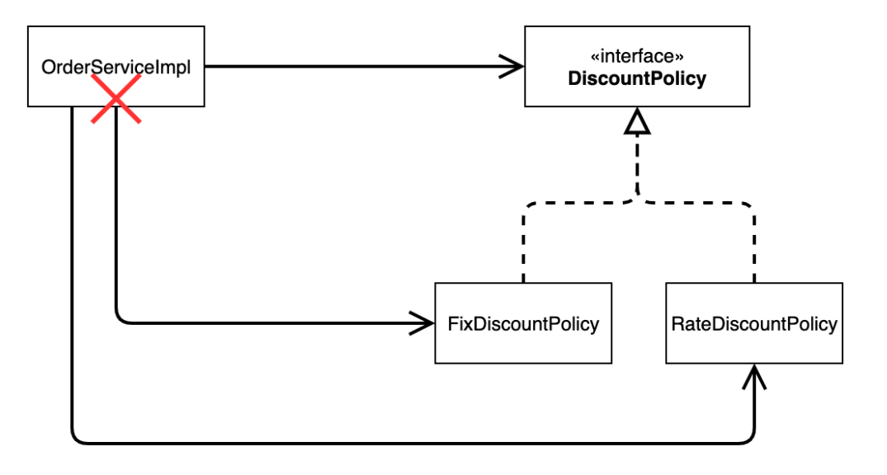

# 순수한 자바만으로 설계 - 1

### 회원 엔티티
```java
@Getter @Setter
@AllArgsConstructor
public class Member {
    private Long id;
    private String name;
    private Grade grade;
}

public enum Grade {
    BASIC, VIP
}
```

### 메모리 회원 저장소
```java
public interface MemberRepository { 
    void save(Member member);
    Member findById(Long memberId);
}

public class MemoryMemberRepository implements MemberRepository{

    private static Map<Long, Member> store = new HashMap<>();

    @Override
    public void save(Member member) {
        store.put(member.getId(), member);
    }

    @Override
    public Member findById(Long memberId) {
        return store.get(memberId);
    }
}
```
`HashMap`은 동시성 이슈가 발생할 수 있으니 `ConcurrentHashMap`을 사용하는 것이 좋다.

### 회원 서비스
```java
public interface MemberService {
    void join(Member member);
    Member findMember(Long memberId);
}

public class MemberServiceImpl implements MemberService {
    
    private final MemberRepository memberRepository = new MemoryMemberRepository();
    
    public void join(Member member) {
        memberRepository.save(member);
    }
    
    public Member findMember(Long memberId) {
        return memberRepository.findById(memberId);
    }
}
```

### 테스트 코드
```java
public class MemberServiceTest {

    MemberService memberService = new MemberServiceImpl();

    @Test
    void join() {
        // given
        Member member = new Member(1L, "memberA", Grade.VIP);
        // when
        memberService.join(member);
        Member findMember = memberService.findMember(member.getId());
        // then
        Assertions.assertThat(member).isEqualTo(findMember);
    }
}
```

### 할인 정책
```java
public interface DiscountPolicy {
    /**
     * @return 할인 대상 금액
     */
    int discount(Member member, int price);
}
//정액 할인 정책
public class FixDiscountPolicy implements DiscountPolicy{

    private final int DISCOUNT_FIX_AMOUNT = 1000;

    @Override
    public int discount(Member member, int price) {
        if (member.getGrade() == Grade.VIP) {
            return DISCOUNT_FIX_AMOUNT;
        } else return 0;
    }
}
```

### 할인 엔티티
```java
@Getter @Setter
@AllArgsConstructor
@ToString
public class Order {

    private Long memberId;
    private String itemName;
    private int itemPrice;
    private int discountPrice;

    public int calculatePrice() {
        return itemPrice - discountPrice;
    }
}
```

### 주문 서비스
```java
public interface OrderService {
    Order createOrder(Long memberId, String itemName, int itemPrice);
}

public class OrderServiceImpl implements OrderService {
    
    private final MemberRepository memberRepository = new MemoryMemberRepository();
    private final DiscountPolicy discountPolicy = new FixDiscountPolicy();
    
    @Override
    public Order createOrder(Long memberId, String itemName, int itemPrice) {
        Member member = memberRepository.findById(memberId);
        int discountPrice = discountPolicy.discount(member, itemPrice);
        
        return new Order(memberId, itemName, itemPrice, discountPrice);
    }
}
```

### 테스트 코드
```java
public class OrderServiceTest {

    MemberService memberService = new MemberServiceImpl();
    OrderService orderService = new OrderServiceImpl();

    @Test
    void createOrder() {
        // given
        Long memberId = 1L;
        Member member = new Member(memberId, "memberA", Grade.VIP);
        memberService.join(member);
        // when
        Order order = orderService.createOrder(memberId, "itemA", 10_000);
        // then
        assertThat(order.calculatePrice()).isEqualTo(9000);
        assertThat(order.getDiscountPrice()).isEqualTo(1000);
    }
}
```

> 인터페이스를 활용하여 역할과 구현을 분리하고 다형성을 활용하여 구현 객체를 분리해 DIP를 잘 지킨 것 같다.
> 
> 그렇다면 새로운 할인 정책을 추가해보자.


### 새로운 할인 정책
```java
//10% 할인 정책
public class RateDiscountPolicy implements DiscountPolicy{

    private final int DISCOUNT_PERCENT = 10;

    @Override
    public int discount(Member member, int price) {
        if (member.getGrade() == Grade.VIP) {
            return price * DISCOUNT_PERCENT / 100;
        } else return 0;
    }
}
```

### 새로운 할인 정책 적용
```java
public class OrderServiceImpl implements OrderService {
    
    //private final DiscountPolicy discountPolicy = new FixDiscountPolicy(); 
      private final DiscountPolicy discountPolicy = new RateDiscountPolicy();
}
```
**새로운 할인 정책을 적용하기 위해서는 기존 클라이언트의 코드를 변경해야 한다.** 즉 `OCP`를 위반한다.



위 코드는 단순히 `DiscountPolicy`인터페이스만 의존하는 것이 아닌 실제 구현체도 함께 의존하고 있다. 그렇기 때문에 정책이 변경되면
클라이언트 코드도 함께 변경해야 하는 것이다.

**어떻게 문제를 해결해야 할까?**<br>
DIP를 위반하지 않도록 **인터페이스에만** 의존관계를 변경해야 한다.

### 인터페이스에만 의존하도록 코드 변경
```java
public class OrderServiceImpl implements OrderService {
      private DiscountPolicy discountPolicy;
}
```

이렇게 하면 될 것 같지만 당연히 구현체가 없기 때문에 코드를 실행하지 못하고 `NullPointException`이 발생한다.

**문제를 해결하기 위해서는 누군가가 클라이언트 코드(`OrderServiceImpl`)에 인터페이스(`DiscountPolicy`)의 구현 객체를 대신 생성하고 주입해주어야 한다.**