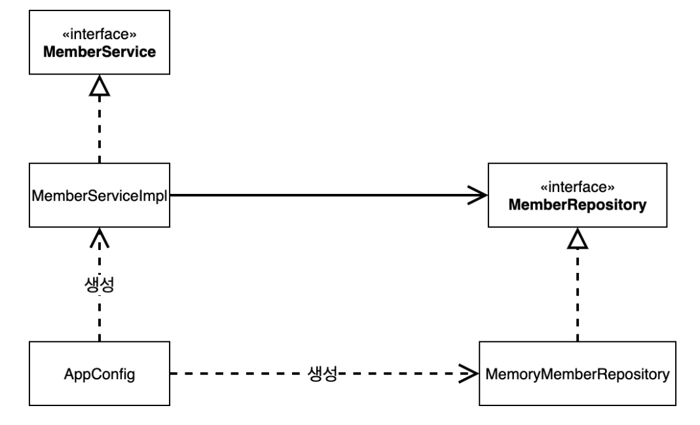
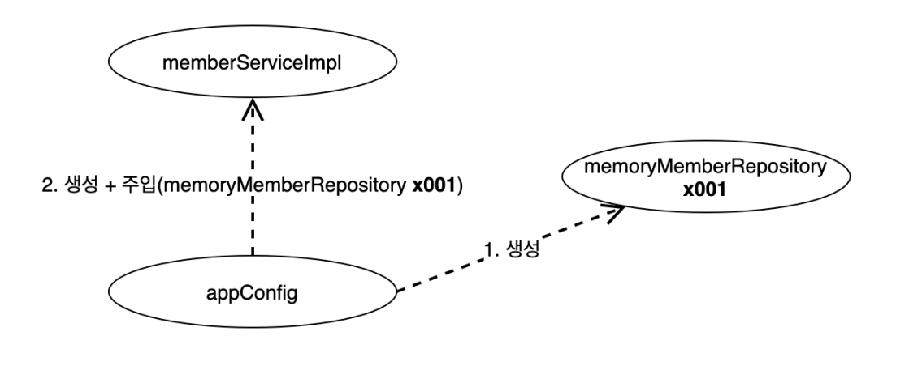
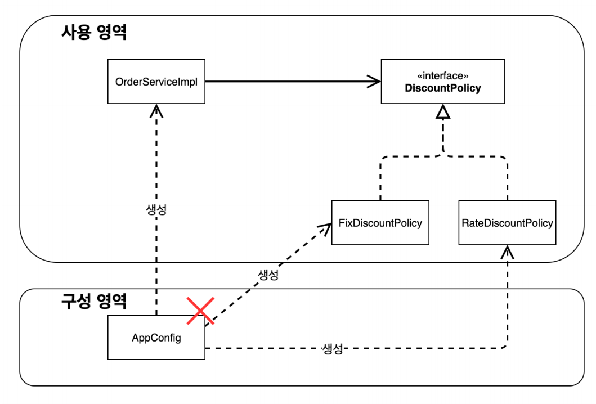

# 순수한 자바만으로 설계 - 2

**관심사를 분리**하여 애플리케이션의 전체 동작 방식을 구성하기 위해 **구현 객체를 생성하고 연결하는 책임을 가지는** 별도의 클래스를 만들어본다.

### AppConfig
```java
public class AppConfig {

    public MemberService memberService() {
        return new MemberServiceImpl(new MemoryMemberRepository());
    }

    public OrderService orderService() {
        return new OrderServiceImpl(new MemoryMemberRepository(), new FixDiscountPolicy());
    }
}
```

### 클라이언트 코드에 생성자로 주입
```java
public class MemberServiceImpl implements MemberService {

    private final MemberRepository memberRepository;

    public MemberServiceImpl(MemberRepository memberRepository) {
        this.memberRepository = memberRepository;
    }
    ...
}

public class OrderServiceImpl implements OrderService {

    private final MemberRepository memberRepository;
    private final DiscountPolicy discountPolicy;

    public OrderServiceImpl(MemberRepository memberRepository, DiscountPolicy discountPolicy) {
        this.memberRepository = memberRepository;
        this.discountPolicy = discountPolicy;
    }
    ...
}
```
이제 클라이언트 코드는 인터페이스만 의존하고 구현 객체를 의존하지 않는다. 클라이언트 코드는 생성자를 통해서 어떤 구현 객체가 주입될지는 전혀 모르고 오직 `AppConfig`(외부)에서
결정된다. 클라이언트 코드는 의존관계에 대한 고민은 외부에 맡기고 실행에만 집중할 수 있다.





### 테스트 코드
```java
public class MemberServiceTest {

    MemberService memberService;

    @BeforeEach
    void beforeEach() {
        memberService = new AppConfig().memberService();
    }
    ...
}

public class OrderServiceTest {

    MemberService memberService;
    OrderService orderService;

    @BeforeEach
    void beforeEach() {
        AppConfig appConfig = new AppConfig();
        memberService = appConfig.memberService();
        orderService = appConfig.orderService();
    }
    ...
}
```
`AppConfig`에서 필요한 객체를 생성해 주기 때문에 사용하는 코드에서는 직접 생성할 필요가 없다.

### AppConfig 리팩토링
```java
public class AppConfig {
    
    public MemberService memberService() {
        return new MemberServiceImpl(memberRepository());
    }

    public MemberRepository memberRepository() {
        return new MemoryMemberRepository();
    }

    public OrderService orderService() {
        return new OrderServiceImpl(memberRepository(), discountPolicy());
    }

    public DiscountPolicy discountPolicy() {
        return new RateDiscountPolicy();
    }
}
```
중복을 제거하고 각 구현체가 한 눈에 들어오게 된다.

**이제 할인 정책을 변경하려면 어떻게 해야 할까?**
```java
public class AppConfig {
    ...

    public DiscountPolicy discountPolicy() {
//        return new RateDiscountPolicy();
        return new FixDiscountPolicy();
    }
}
```
사용하는 코드는 하나의 변경 없이 설정을 담당하는 `AppConfig`만 변경하면 된다.



**AppConfig의 등장으로 `SRP`, `DIP`, `OCP` 원칙을 적용할 수 있게 되었다.**

<br>

## 스프링으로 전환
```java
@Configuration
public class AppConfig {

    @Bean
    public MemberService memberService() {
        return new MemberServiceImpl(memberRepository());
    }

    @Bean
    public MemberRepository memberRepository() {
        return new MemoryMemberRepository();
    }

    @Bean
    public OrderService orderService() {
        return new OrderServiceImpl(memberRepository(), discountPolicy());
    }

    @Bean
    public DiscountPolicy discountPolicy() {
        return new FixDiscountPolicy();
    }
}
```
- 설정을 구성한다는 뜻의 `@Configuration`을 붙여준다.
- 각 메서드에 `@Bean`을 붙여주면 스프링 컨테이너에 스프링 빈으로 등록된다.

```java
public class OrderApp {
    public static void main(String[] args) {
//        AppConfig appConfig = new AppConfig();
//        MemberService memberService = appConfig.memberService();
//        OrderService orderService = appConfig.orderService();
        ApplicationContext ac = new AnnotationConfigApplicationContext(AppConfig.class);

        MemberService memberService = ac.getBean("memberService", MemberService.class);

        OrderService orderService = ac.getBean("orderService", OrderService.class);

        long memberId = 1L;
        Member member = new Member(memberId, "memberA", Grade.VIP);
        memberService.join(member);
        Order order = orderService.createOrder(memberId, "itemA", 10000);

        System.out.println("order = " + order);
    }
}
```
이제부터는 `AppConfig`에서 직접 객체를 꺼내서 사용하는 것이 아닌 스프링 컨테이너에서 꺼내서 사용해야 한다.
- `ApplicationContext`가 스프링 컨테이너다.
- 스프링 컨테이너는 `@Configuration`이 붙은 `AppConfig`를 설정 정보로 사용한다. 여기서 `@Bean`이 붙은 메서드를 모두 호출해서 반환된 객체를
스프링 컨테이너에 등록한다. 스프링 컨테이너에 등록된 객체를 **스프링 빈**이라 한다.
- 스프링 빈은 `@Bean`이 붙은 메서드의 명을 스프링 빈의 이름으로 사용한다.