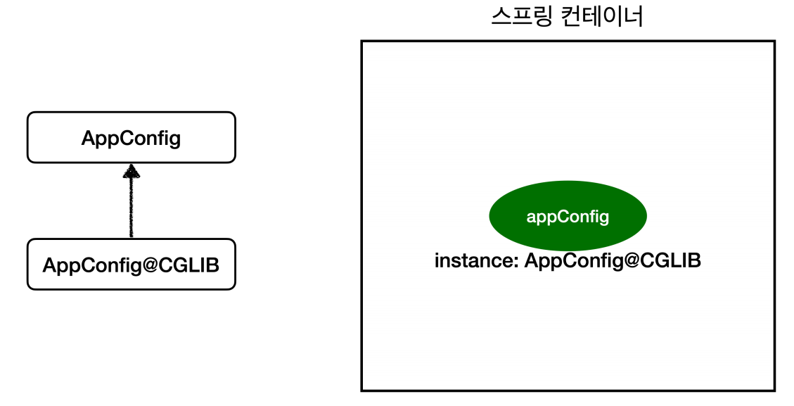

# 싱글톤 컨테이너 - 2

## @Configuration과 싱글톤

```java
@Configuration
public class AppConfig {

    @Bean
    public MemberService memberService() {
        return new MemberServiceImpl(memberRepository());
    }

    @Bean
    public MemberRepository memberRepository() {
        return new MemoryMemberRepository();
    }

    @Bean
    public OrderService orderService() {
        return new OrderServiceImpl(memberRepository(), discountPolicy());
    }
}
```
코드를 보면 `memberService()`와 `orderService()`에서 각각 memberRepository()를 호출하기 때문에 `new MemoryMemberRepository()`가 두 번 생성되는 것처럼 보인다.
싱글톤이 되는 것일까 하는 의문이 생긴다.

```java
@Test
void configurationTest() {
    ApplicationContext ac = new AnnotationConfigApplicationContext(AppConfig.class);
    
    MemberServiceImpl memberService = ac.getBean("memberService", MemberServiceImpl.class);
    OrderServiceImpl orderService = ac.getBean("orderService", OrderServiceImpl.class);
    MemberRepository memberRepository = ac.getBean("memberRepository", MemberRepository.class);
    
    MemberRepository memberRepository1 = memberService.getMemberRepository();
    MemberRepository memberRepository2 = orderService.getMemberRepository();
    
    System.out.println("memberService -> memberRepository1 = " + memberRepository1);
    System.out.println("orderService -> memberRepository2 = " + memberRepository2);
    System.out.println("memberRepository = " + memberRepository);
    
    assertThat(memberRepository1).isSameAs(memberRepository);
    assertThat(memberRepository2).isSameAs(memberRepository);
}
```
하지만 테스트를 해보면 모두 같은 참조값을 갖고 있는 것을 확인할 수 있다.

<br>

## @Configuration 바이트코드 조작
스프링 컨테이너는 스프링 빈이 싱글톤이 되도록 보장해 주어야 하기 때문에 스프링은 자바 코드의 바이트 코드를 조작하는 라이브러리를 사용한다.

```java
@Test
void configurationDeep() {
    ApplicationContext ac = new AnnotationConfigApplicationContext(AppConfig.class);
    AppConfig bean = ac.getBean(AppConfig.class);
    
    System.out.println("bean.getClass() = " + bean.getClass());
    //출력: bean.getClass() = class hello.core.AppConfig$$SpringCGLIB$$0
}
```
`AnnotationConfigApplicationContext`에 파라미터로 넘긴 값도 스프링 빈으로 등록이 된다. 

출력 결과를 보면 순수한 클래스 명이 아닌 `...CGLIB`가 붙으면서 복잡해졌다. 이것은 내가 만든 클래스가 아니라 스프링이 `CGLIB`라는 바이트코드 조작 라이브러리를
사용해서 기존 클래스를 상속 받은 임의의 다른 클래스를 만들고 그 다른 클래스를 스프링 빈으로 등록한 것이다.



임의의 다른 클래스가 싱글톤이 보장되도록 해주는데 아마 이런 방식으로 동작할 것이다.
- `@Bean`이 붙은 메서드마다 이미 스프링 빈이 존재하면 존재하는 빈을 반환하고, 스프링 빈이 없으면 생성해서 스프링 빈으로 등록하고 반환한다.

**`@Configuration`을 적용하지 않고 `@Bean`만 적용하면?**

`@Configuration`을 적용하지 않으면 `CGLIB` 기술 없이 순수한 클래스가 된다. `@Bean`만 사용해도 스프링 빈으로 등록은 되지만 싱글톤을 보장하지는 않는다.

**고민할 것 없이 스프링 설정 정보는 항상 `@Configuration`을 사용해야 한다.**


