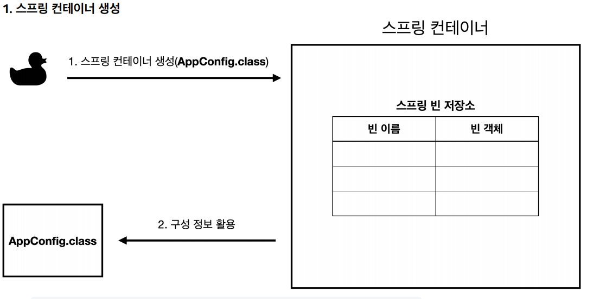
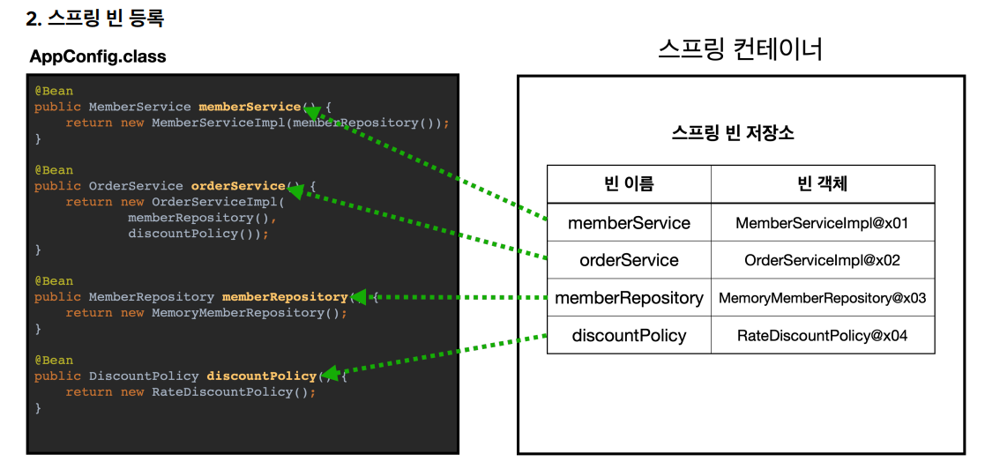
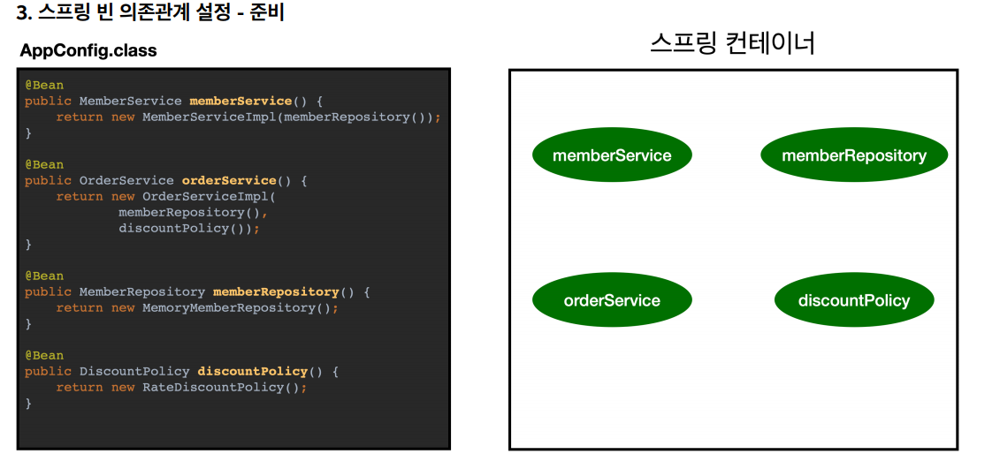
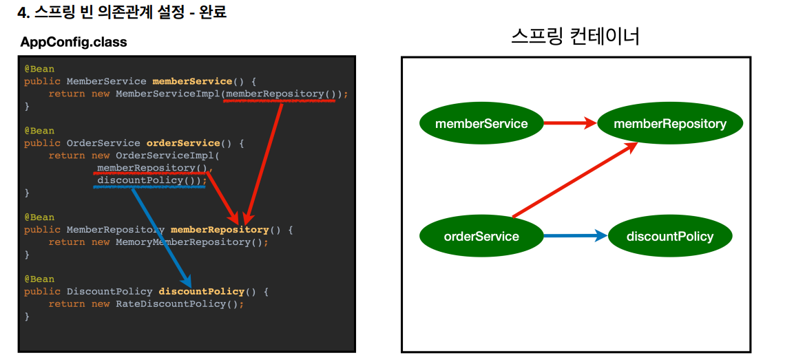

# 스프링 컨테이너 - 1

## 스프링 컨테이너 생성
```java
ApplicationContext applicationContext = new AnnotationConfigApplicationContext(AppConfig.class);
```
- `ApplicationContext`를 스프링 컨테이너라 하며, 인터페이스다.
- 스프링 컨테이너는 XML 기반과 애노테이션 기반의 자바 설정 클래스를 지원한다.

### 스프링 컨테이너 생성 과정

- 스프링 컨테이너를 생성할 때는 설정 정보를 지정해주어야 한다.(`AppConfig`)


- 스프링 컨테이너는 파라미터로 넘어온 설정 클래스 정보를 사용해서 스프링 빈을 등록한다.
- 빈 이름은 메서드 이름을 사용하며 빈 이름을 직접 부여할 수 있다.
- **빈 이름은 항상 다른 이름을 부여해야 한다.** 같은 이름을 부여하면 다른 빈이 무시되거나 기존 빈을 덮어버릴 수 있다.




- 스프링 컨테이너는 설정 정보를 참고해서 의존관계를 주입(`DI`)한다.
- 단순히 자바 코드를 호출하는 것이 아니라 싱글톤 컨테이너를 사용한다.

### 컨테이너에 등록된 빈 조회
```java
public class ApplicationContextInfoTest {

    AnnotationConfigApplicationContext ac = new AnnotationConfigApplicationContext(AppConfig.class);

    @Test
    @DisplayName("모든 빈 출력하기")
    void findAllBeans() {
        String[] beanDefinitionNames = ac.getBeanDefinitionNames();

        for (String beanDefinitionName : beanDefinitionNames) {
            Object bean = ac.getBean(beanDefinitionName);
            System.out.println("name = " + beanDefinitionName + "\nObject = " + bean);
            System.out.println("-------------------------------------------------------------------------");
        }
    }

    @Test
    @DisplayName("애플리케이션 빈 출력하기")
    void findApplicationBeans() {
        String[] beanDefinitionNames = ac.getBeanDefinitionNames();
        for (String beanDefinitionName : beanDefinitionNames) {
            BeanDefinition beanDefinition = ac.getBeanDefinition(beanDefinitionName);

            //Role ROLE_APPLICATION: 직접 등록한 애플리케이션 빈
            //Role ROLE_INFRASTRUCTURE: 스프링이 내부에서 사용하는 빈
            if (beanDefinition.getRole() == BeanDefinition.ROLE_APPLICATION) {
                Object bean = ac.getBean(beanDefinitionName);
                System.out.println("name = " + beanDefinitionName + "\nObject = " + bean);
                System.out.println("-------------------------------------------------------------------------");
            }
        }
    }
}
```
- `ac.getBeanDefinitionNames()` : 스프링에 등록된 모든 빈 이름 조회
- `ac.getBean()` : 빈 이름으로 빈 객체(인스턴스)를 조회한다.
- `ac.getRole()` : 스프링이 내부에서 사용하는 빈과 직접 등록한 빈을 구분할 수 있다.

### 빈 조회 - 기본
```java
public class ApplicationContextBasicFindTest {
    AnnotationConfigApplicationContext ac = new AnnotationConfigApplicationContext(AppConfig.class);

    @Test
    @DisplayName("빈 이름으로 조회")
    void findBeanByName() {
        MemberService memberService = ac.getBean("memberService", MemberService.class);
        assertThat(memberService).isInstanceOf(MemberServiceImpl.class);
    }

    @Test
    @DisplayName("이름 없이 타입으로만 조회")
    void findBeanByType() {
        MemberService memberService = ac.getBean(MemberService.class);
        assertThat(memberService).isInstanceOf(MemberServiceImpl.class);
    }

    @Test
    @DisplayName("구체 타입으로 조회")
    void findBeanByName2() {
        MemberServiceImpl memberService = ac.getBean("memberService", MemberServiceImpl.class);
        assertThat(memberService).isInstanceOf(MemberServiceImpl.class);
    }

    @Test
    @DisplayName("빈 이름으로 조회X")
    void findBeanByNameX() {
        assertThrows(NoSuchBeanDefinitionException.class, 
                () -> ac.getBean("xxxxx", MemberService.class));
    }
}
```

- `ac.getBean(빈 이름, 타입)`
- `ac.getBean(타입)`
- 조회 대상 스프링 빈이 없으면 `NoSuchBeanDefinitionException` 예외가 발생한다.

### 빈 조회 - 동일한 타입이 둘 이상
```java
public class ApplicationContextSameBeanFindTest {
    AnnotationConfigApplicationContext ac = new AnnotationConfigApplicationContext(SameBeanConfig.class);

    @Test
    @DisplayName("타입으로 조회시 같은 타입이 둘 이상 있으면, 중복 오류가 발생한다.")
    void findBeanByTypeDuplicate() {
        assertThrows(NoUniqueBeanDefinitionException.class, () -> ac.getBean(MemberRepository.class));
    }

    @Test
    @DisplayName("타입으로 조회시 같은 타입이 둘 이상 있으면, 빈 이름을 지정하면 된다.")
    void findBeanByName() {
        MemberRepository memberRepository = ac.getBean("memberRepository1", MemberRepository.class);
        assertThat(memberRepository).isInstanceOf(MemberRepository.class);
    }

    @Test
    @DisplayName("특정 타입을 모두 조회하기")
    void findAllBeanByType() {
        Map<String, MemberRepository> beansOfType = ac.getBeansOfType(MemberRepository.class);
        for (String key : beansOfType.keySet()) {
            System.out.println("key = " + key + "\nvalue = " + beansOfType.get(key));
        }
        System.out.println("beansOfType = " + beansOfType);
        assertThat(beansOfType.size()).isEqualTo(2);
    }

    @Configuration
    static class SameBeanConfig {
        @Bean
        public MemberRepository memberRepository1() {
            return new MemoryMemberRepository();
        }

        @Bean
        public MemberRepository memberRepository2() {
            return new MemoryMemberRepository();
        }
    }
}
```

### 빈 조회 - 상속 관계
- 부모 타입으로 조회하면 자식 타입도 함께 조회된다.
- 그래서 `Object`는 모든 자바 객체의 최고 부모이므로 `Object`로 조회하면 모든 스프링 빈을 조회한다.

```java
public class ApplicationContextExtendsFindTest {
    AnnotationConfigApplicationContext ac = new AnnotationConfigApplicationContext(TestConfig.class);

    @Test
    @DisplayName("부모 타입으로 조회 시, 자식이 둘 이상 있으면, 중복 오류가 발생한다.")
    void findBeanByParentTypeDuplicate() {
        assertThrows(NoUniqueBeanDefinitionException.class, ()->
                ac.getBean(DiscountPolicy.class));
    }

    @Test
    @DisplayName("부모 타입으로 조회 시, 자식이 둘 이상 있으면, 빈 이름을 지정하면 된다.")
    void findBeanByParentTypeBeanName() {
        DiscountPolicy bean = ac.getBean("rateDiscountPolicy", DiscountPolicy.class);
        assertThat(bean).isInstanceOf(RateDiscountPolicy.class);
    }

    @Test
    @DisplayName("특정 하위 타입으로 조회")
    void findBeanBySubType() {
        RateDiscountPolicy bean = ac.getBean(RateDiscountPolicy.class);
        assertThat(bean).isInstanceOf(RateDiscountPolicy.class);
    }

    @Test
    @DisplayName("부모 타입으로 모두 조회하기")
    void findAllBeanByParentType() {
        Map<String, DiscountPolicy> beansOfType = ac.getBeansOfType(DiscountPolicy.class);
        for (String key : beansOfType.keySet()) {
            System.out.println("key = " + key + "\nvalue = " + beansOfType.get(key));
        }
    }

    @Test
    @DisplayName("부모 타입으로 모두 조회하기 - Object")
    void findAllBeanByObjectType() {
        Map<String, Object> beansOfType = ac.getBeansOfType(Object.class);
        for (String key : beansOfType.keySet()) {
            System.out.println("key = " + key + "\nvalue = " + beansOfType.get(key));
        }
    }

    @Configuration
    static class TestConfig {
        @Bean
        public DiscountPolicy rateDiscountPolicy() {
            return new RateDiscountPolicy();
        }
        
        @Bean
        public DiscountPolicy fixDiscountPolicy() {
            return new FixDiscountPolicy();
        }
    }
}
```