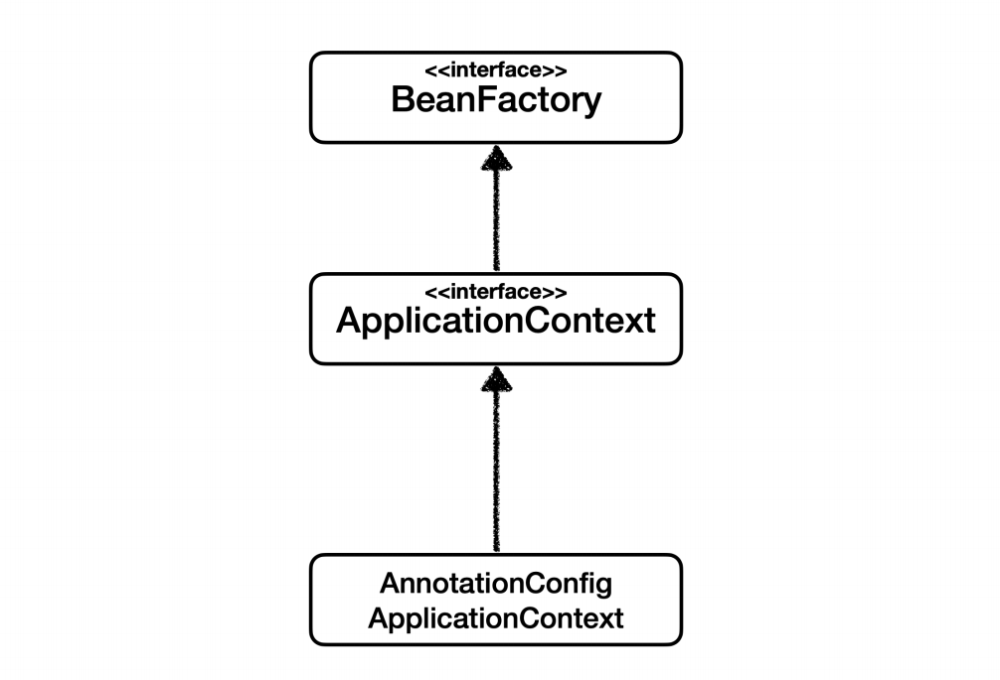
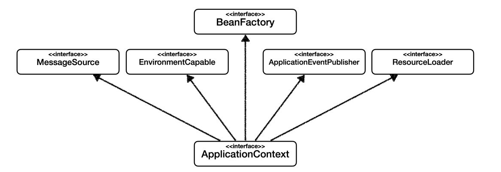
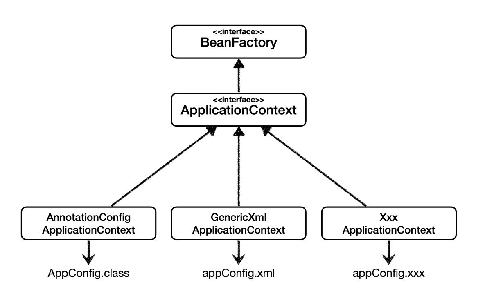
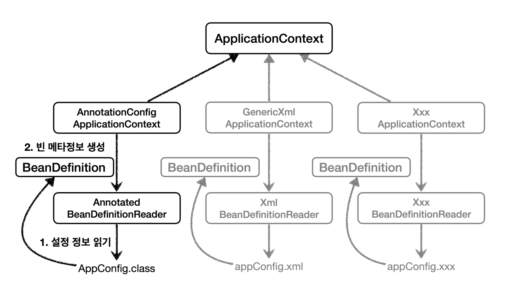

# 스프링 컨테이너 - 2

## BeanFactory와 ApplicationContext



- **BeanFactory**
  - 스프링 컨테이너의 최상위 인터페이스다.
  - 스프링 빈을 관리하고 조회하는 역할을 담당한다.
  - `getBean()`을 제공한다.
- **ApplicationContext**
  - `BeanFactory` 기능을 모두 상속받아서 제공한다.

**ApplicationContext는 여러가지 부가 기능을 제공한다.**


- 메시지소스를 활용한 국제화 기능
- 환경 변수
  - 로컬, 개발, 운영 환경 등을 구분해서 처리한다.
- 애플리케이션 이벤트
- 편리한 리소스 조회

## XML 설정
스프링 컨테이너는 다양한 형식의 설정 정보를 설정할 수 있게 유연하게 설계되어 있다.



- appconfig.xml
```xml
<?xml version="1.0" encoding="UTF-8"?>
<beans xmlns="http://www.springframework.org/schema/beans"
       xmlns:xsi="http://www.w3.org/2001/XMLSchema-instance"
       xsi:schemaLocation="http://www.springframework.org/schema/beans http://www.springframework.org/schema/beans/spring-beans.xsd">

    <bean id="memberService" class="hello.core.member.MemberServiceImpl">
        <constructor-arg name="memberRepository" ref="memberRepository" />
    </bean>

    <bean id="memberRepository" class="hello.core.member.MemoryMemberRepository"/>

    <bean id="orderService" class="hello.core.order.OrderServiceImpl">
        <constructor-arg name="memberRepository" ref="memberRepository"/>
        <constructor-arg name="discountPolicy" ref="disCountPolicy"/>
    </bean>

    <bean id="disCountPolicy" class="hello.core.discount.RateDiscountPolicy"/>
</beans>
```

- 사용 코드
```java
public class XmlAppContext {

    @Test
    void xmlAppContext() {
        ApplicationContext ac = new GenericXmlApplicationContext("appConfig.xml");
        MemberService memberService = ac.getBean("memberService", MemberService.class);
        assertThat(memberService).isInstanceOf(MemberService.class);
    }
}
```

스프링 컨테이너는 `BeanDefinition`이라는 추상화가 있다.



어노테이션 기반이나 XML 기반에 따라 `...Reader`가 각각 맞게 생성되고 빈 설정 메타정보를 기반으로 스프링 컨테이너가 스프링 빈을 생성한다.