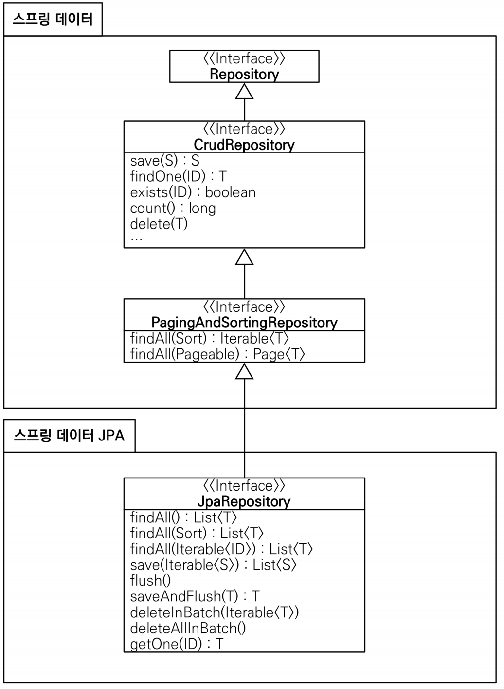

# 공통 인터페이스 기능

스프링 데이터 JPA는 간단한 CRUD 기능을 공통으로 처리하는 `JpaRepository` 인터페이스를 제공한다. 스프링 데이터 JPA를 사용하는 가장 단순한 방법은
이 인터페이스를 상속받는 것이다. 그리고 제네릭에 `엔티티 클래스`와 엔티티 클래스가 사용하는 `식별자 타입`을 지정하면 된다.
```java
public interface MemberRepository extends JpaRepository<Member, Long>{
}
```

`JpaRepository` 인터페이스 계층 구조



- `T findOne(Id)` -> `Optional<T> findById(Id)` 변경됐다.
- `boolean exists(Id)` -> `boolean existsById(Id)` 변경됐다.

**제네릭**
- `T` : 엔티티
- `ID` : 엔티티의 식별자 타입
- `S` : 엔티티와 그 자식 타입

**주요 메서드**
- `save(S)` : 새로운 엔티티는 저장하고 **이미 있는 엔티티는 병합한다.**
- `delete(T)` : 엔티티 하나를 삭제한다. 내부에서 `em.remove()`를 호출한다.
- `findById(ID)` : 엔티티 하나를 조회한다. 내부에서 `em.find()`를 호출한다.
- `getOne(ID)` : 엔티티를 프록시로 조회한다. 내부에서 `em.getReference()`를 호출한다.
- `findAll(...)` : 모든 엔티티를 조회한다. 정렬(`Sort`)이나 페이징(`Pageable`) 조건을 파라미터로 제공할 수 있다.