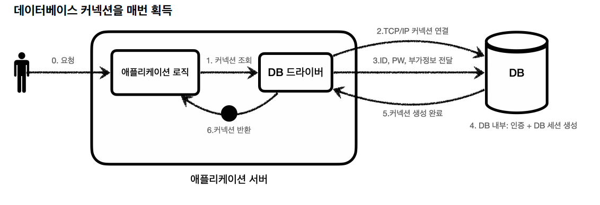
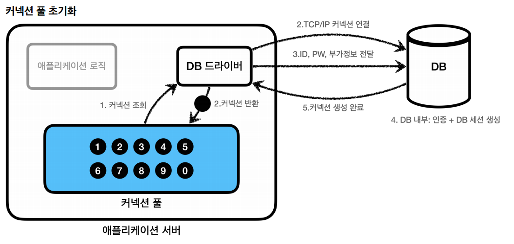
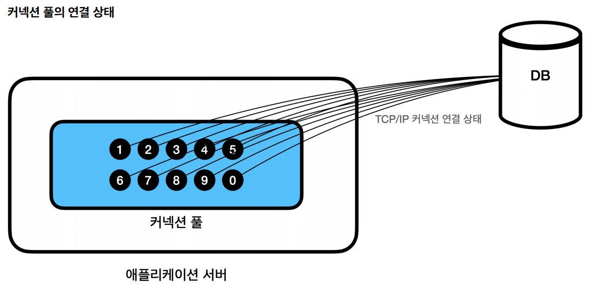
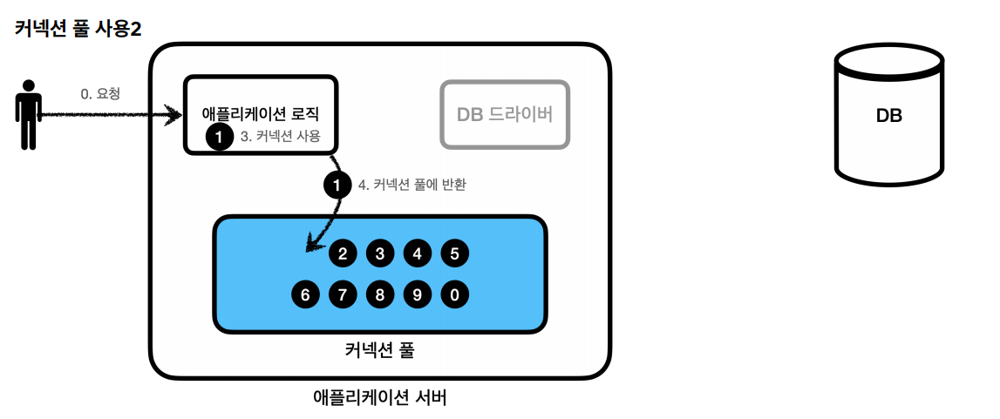
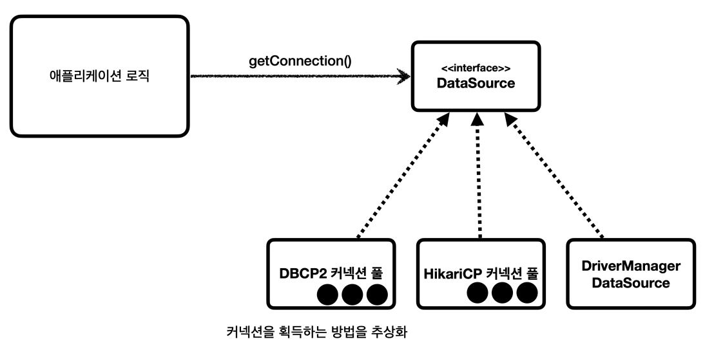

# 커넥션 풀과 데이터소스

## 커넥션 풀



데이터베이스 커넥션을 획득할 때는 다음과 같은 복잡한 과정을 거친다.
1. 애플리케이션 로직은 DB 드라이버를 통해 커넥션을 조회한다.
2. DB 드라이버는 DB와 `TCP/IP` 커넥션을 연결한다. 이 과정에서 3 way handshake 같은 `TCP/IP`연결을 위한 네트워크 동작이 발생한다.
3. DB 드라버는 `TCP/IP`커넥션이 연결되면 ID, PW 같은 기타 부가정보를 DB에 전달한다.
4. DB는 `ID, PW`를 통해 내부 인증을 완료하고 내부에 DB 세션을 생성한다.
5. DB는 커넥션 생성 완료 응답을 보낸다.
6. DB 드라이버는 커넥션 객체를 생성해서 클라이언트에 반환한다.

이렇게 커넥션을 새로 만드는 것은 DB포함 애플리케이션 서버에서도 `TCP/IP`커넥션을 새로 생성하기 위한 리소스를 매번 사용해야 하기에 성능에 매우 좋지 않다.

**그래서 커넥션을 미리 생성해두고 사용하는 커넥션 풀 이라는 게 생겨났다.**



**애플리케이션을 시작하는 시점**에 커넥션 풀은 필요한 만큼 커넥션을 미리 확보해서 풀에 보관한다. (기본 보통 10개)



커넥션 풀에 들어있는 커넥션은 `TCP/IP`로 DB에 커넥션이 연결되어 있는 상태이기 때문에 언제든지 즉시 SQL을 DB에 전달할 수 있다.


- 애플리케이션 로직에서 이제 DB 드라이버를 통해서 새로운 커넥션을 획득하는 것이 아닌 **커넥션 풀**을 통해 **이미 생성되어 있는** 커넥션을 객체 참조로 가져가 쓴다.
- 커넥션 풀에 커넥션을 요청하면 커넥션 풀은 자신이 가지고 있는 커넥션 중에 하나를 반환한다.



- 애플리케이션 로직은 커넥션 풀에서 받은 커넥션을 사용해서 SQL을 DB에 전달하고 그 결과를 처리한다.
- 커넥션을 모두 사용하고 나면 이제는 커넥션을 종료하는 것이 아니라 다음에 다시 사용할 수 있도록 **그대로** 커넥션 풀에 반환한다. **커넥션이 살아있는 상태로 커넥션 풀에 반환해야 한다.**
- 대표적인 커넥션 풀 오픈소스는 `commons-dbcp2`, `tomcat-jdbc pool`, `HikariCP` 등이 있는데 최근에는 **HikariCP**를 거의 주로 사용한다.

---

## 데이터소스
커넥션을 얻는 방법은 **JDBC DriverManager**를 직접 사용하거나 **커넥션 풀**을 사용하는 등 다양한 방법이 있다.

그런데 커넥션을 획득하는 방법의 변경이 일어나면 커넥션을 획득하는 애플리케이션 코드도 함께 변경을 해야 한다. 예를 들어 `DriverManager`를 사용해서 커넥션을 획득하다가
`HikariCP` 같은 커넥션 풀을 사용하도록 변경하면 의존관계가 변경되기 때문에 변경이 불가피하다.

**그래서 자바에서는 이런 문제를 해결하기 위해 `DataSource`라는 인터페이스를 제공한다.**


- `DataSource`는 **커넥션을 획득하는 방법을 추상화**한 인터페이스로 핵심 기능은 커넥션 조회 하나이다.
- 대부분의 커넥션 풀은 `DataSource` 인터페이스를 이미 구현해두었다.
- `DriverManager`는 `DataSource` 인터페이스를 사용하지 않는다. 그래서 스프링은 `DriverManager`도 `DataSource`를 통해서 사용할 수 있도록
`DriverManagerDataSource`라는 `DataSource`를 구현한 클래스를 제공한다.

---

## DataSource 예제

**`DriverManager`를 통해 커넥션 획득**
```java
@Test
void driverManager() throws SQLException {
    Connection con1 = DriverManager.getConnection(URL, USERNAME, PASSWORD);
    Connection con2 = DriverManager.getConnection(URL, USERNAME, PASSWORD);

    log.info("connection={}, class={}", con1, con1.getClass());
    log.info("connection={}, class={}", con2, con2.getClass());
}
```

**`DriverManagerDataSource`를 통해 커넥션 획득**
```java
@Test
void dataSourceDriverManager() throws SQLException {
    // DriverManagerDataSource - 항상 새로운 커넥션 획득
    DriverManagerDataSource dataSource = new DriverManagerDataSource(URL, USERNAME, PASSWORD);
    useDataSource(dataSource);
}
private void useDataSource(DataSource dataSource) throws SQLException {
    Connection con1 = dataSource.getConnection();
    Connection con2 = dataSource.getConnection();
    log.info("connection={}, class={}", con1, con1.getClass());
    log.info("connection={}, class={}", con2, con2.getClass());
}
```

`DriverManager`는 커넥션을 획득할 때마다 `URL`, `USERNAME`, `PASSWORD` 같은 파라미터를 계속 전달해야 하는 반면 `Datasource` 방식은 처음 객체를 생성할 때만
필요한 파라미터를 넘겨두고 커넥션을 획득할 때는 단순히 `getConnection()`만 호출하면 된다.

**👆 설정과 사용의 분리**
- **설정** : `DataSource`를 만들고 필요한 속성들을 사용해서 `URL`, `USERNAME`, `PASSWORD`같은 부분을 입력하는 것으로 이렇게 설정과 관련된 속성들은 
한 곳에 있는 것이 변경에 더 유연하게 대처할 수 있다.
- **사용** : 설정은 신경쓰지 않고 `DataSource`의 `getConnection()`만 호출해서 사용하면 된다.

```java
 @Test
void dataSourceConnectionPool() throws SQLException, InterruptedException {
    //커넥션 풀링
    HikariDataSource dataSource = new HikariDataSource();
    dataSource.setJdbcUrl(URL);
    dataSource.setUsername(USERNAME);
    dataSource.setPassword(PASSWORD);
    dataSource.setMaximumPoolSize(10);
    dataSource.setPoolName("MyPool");

    useDataSource(dataSource);
    Thread.sleep(1000);
}

private void useDataSource(DataSource dataSource) throws SQLException {
    Connection con1 = dataSource.getConnection();
    Connection con2 = dataSource.getConnection();
    log.info("connection={}, class={}", con1, con1.getClass());
    log.info("connection={}, class={}", con2, con2.getClass());
}
```

> 👆
> 
> 커넥션 풀에 커넥션을 채울 때에는 `MyPool connecntion Adder`라는 이름으로 별도의 쓰레드를 사용해서 커넥션 풀에 커넥션을 채운다. 왜냐하면 커넥션 풀에
> 커넥션을 채우는 것은 상대적으로 오래 걸리는 일인데 애플리케이션을 실행할 때 커넥션 풀을 채울 때 까지 마냥 대기하고 있다면 애플리케이션 실행 시간이 늦어진다.
> 이렇게 별도의 쓰레드를 사용해서 커넥션 풀을 채워야 애플리케이션 실행 시간에 영향을 주지 않는다.

---

## DataSource 적용 예제

```java
/**
 * JDBC - DataSource 사용, JdbcUtils 사용
 */
@Slf4j
public class MemberRepositoryV1 {

    private final DataSource dataSource;

    public MemberRepositoryV1(DataSource dataSource) {
        this.dataSource = dataSource;
    }

    public Member save(Member member) throws SQLException {
        String sql = "insert into member(member_id, money) values(?, ?)";

        Connection con = null;
        PreparedStatement pstmt = null;

        try {
            con = getConnection();
            pstmt = con.prepareStatement(sql);
            pstmt.setString(1, member.getMemberId());
            pstmt.setInt(2, member.getMoney());
            pstmt.executeUpdate();
            return member;
        } catch (SQLException e) {
            log.error("db error", e);
            throw e;
        } finally {
            close(con, pstmt, null);
        }
    }

    public Member findById(String memberId) throws SQLException {
        String sql = "select * from member where member_Id = ?";

        Connection con = null;
        PreparedStatement pstmt = null;
        ResultSet rs = null;

        try {
            con = getConnection();
            pstmt = con.prepareStatement(sql);
            pstmt.setString(1, memberId);

            rs = pstmt.executeQuery();

            if (rs.next()) {
                Member member = new Member();
                member.setMemberId(rs.getString("member_id"));
                member.setMoney(rs.getInt("money"));
                return member;
            } else {
                throw new NoSuchElementException("member not found memberId=" + memberId);
            }
        } catch (SQLException e) {
            log.error("db error", e);
            throw e;
        } finally {
            close(con, pstmt, rs);
        }
    }

    public void update(String memberId, int money) throws SQLException {
        String sql = "update member set money = ? where member_id = ?";

        Connection con = null;
        PreparedStatement pstmt = null;
        ResultSet rs = null;

        try {
            con = getConnection();
            pstmt = con.prepareStatement(sql);
            pstmt.setInt(1,money);
            pstmt.setString(2, memberId);

            int resultSize = pstmt.executeUpdate();
            log.info("resultSize={}", resultSize);

        } catch (SQLException e) {
            log.error("db error", e);
            throw e;
        } finally {
            close(con, pstmt, rs);
        }
    }

    public void delete(String memberId) throws SQLException {
        String sql = "delete from member where member_id = ?";

        Connection con = null;
        PreparedStatement pstmt = null;

        try {
            con = getConnection();
            pstmt = con.prepareStatement(sql);
            pstmt.setString(1, memberId);

            pstmt.executeUpdate();
        } catch (SQLException e) {
            log.error("db error", e);
            throw e;
        } finally {
            close(con, pstmt, null);
        }
    }

    private void close(Connection con, Statement stmt, ResultSet rs) {
        JdbcUtils.closeResultSet(rs);
        JdbcUtils.closeStatement(stmt);
        JdbcUtils.closeConnection(con);
    }

    private Connection getConnection() throws SQLException {
        Connection con = dataSource.getConnection();
        log.info("get connection={}, class={}", con, con.getClass());
        return con;
    }
}
```

**테스트 코드**
```java
@Slf4j
class MemberRepositoryV1Test {

    MemberRepositoryV1 repository;

    @BeforeEach
    void beforeEach() {
        //기본 DriverManager - 항상 새로운 커넥션을 획득
        //DriverManagerDataSource dataSource = new DriverManagerDataSource(URL, USERNAME, PASSWORD);

        //커넥션 풀링
        HikariDataSource dataSource = new HikariDataSource();
        dataSource.setJdbcUrl(URL);
        dataSource.setUsername(USERNAME);
        dataSource.setPassword(PASSWORD);

        repository = new MemberRepositoryV1(dataSource);
    }

    @Test
    void crud() throws SQLException {
        //save
        Member member = new Member("memberV5", 10000);
        repository.save(member);

        //findById
        Member findMember = repository.findById(member.getMemberId());
        log.info("findMember={}", findMember);

        assertThat(findMember).isEqualTo(member);

        //update: money 10000 -> 20000
        repository.update(member.getMemberId(), 20000);
        Member updateMember = repository.findById(member.getMemberId());
        assertThat(updateMember.getMoney()).isEqualTo(20000);

        //delete
        repository.delete(member.getMemberId());
        assertThatThrownBy(() -> repository.findById(member.getMemberId()))
                .isInstanceOf(NoSuchElementException.class);
    }
}
```

- `DriverManagerDataSource`를 사용하면 항상 새로운 커넥션이 생성되어서 사용된다.
- `HikariDataSource`로 커넥션 풀을 사용하면 같은 커넥션이 재사용 된다. 테스트는 순서대로 실행되기 때문에 커넥션을 사용하고 다시 돌려주는 것을 반복한다.
- 웹 애플리케이션에 동시에 여러 요청이 들어오면 여러 쓰레드에서 커넥션 풀의 커넥션을 다양하게 가져간다.

> 👆 이제 레포지토리 코드는 `DataSource` 인터페이스에만 의존하기 때문에 커넥션을 획득하는 방법의 변경이 일어나도 레포지토리 코드는 변경할 필요가 없다. 
> 이것이 `DataSource`를 사용하는 장점이다. (`DI` + `OCP`)