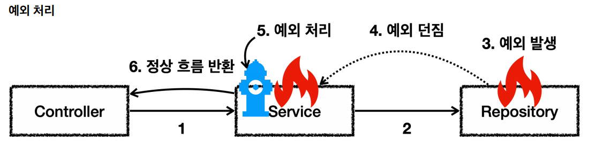
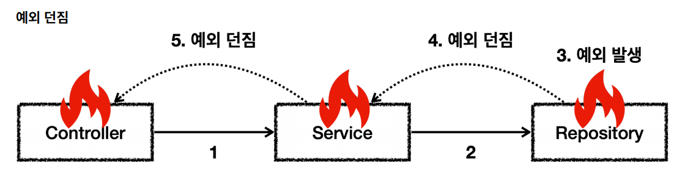

# 자바 예외

## 예외 계층

- `Object` : 예외도 하나의 객체이다. 모든 객체의 최상위 부모는 `Object`이므로 예외의 최상위 부모도 `Object`이다.
- `Throwable` : 최상위 예외로 하위에 `Exception`과 `Error`가 있다.
- `Error` : *메모리 부족이나 심각한 시스템 오류와 같이 애플리케이션에서 복구 불가능한 시스템 예외이다. 애플리케이션 개발자는 이 예외를 잡으려고 해서는 안 된다.*
  - 상위 예외를 `catch`로 잡으면 그 하위 예외까지 함께 잡기 때문에 애플리케이션 로직에서는 `Throwable`예외도 잡으면 안 되는데 `Error`예외도 함꼐 잡을 수 있기 대문이다.
    애플리케이션 로직은 이런 이유로 `Exception`부터 필요한 예외로 생각하고 잡으면 된다.
  - `Error`는 언체크 예외다.
- `Exception`
  - 체크 예외
  - 애플리케이션 로직에서 사용할 수 있는 실질적인 최상위 예외다.
  - `Exception`과 그 하위 예외는 모두 컴파일러가 체크하는 **체크 예외**이다. 단 `RuntimeException`은 예외로 한다.
- `RuntimeException`
  - 컴파일러가 체크하지 않는 언체크 예외다.
  - `RuntimeException`과 그 자식 예외는 모두 언체크 예외다.
  - `RuntimeException`의 이름을 따라서 `RuntimeException`과 그 하위 언체크 예외를 **런타임 예외**라고 많이 부른다.

---

## 예외 기본 규칙
> 예외는 폭탄 돌리기와 같다. 잡아서 처리하거나 처리할 수 없으면 밖으로 던져야 한다.

**예외에 대한 2가지 기본 규칙**
1. 예외를 잡아서 처리하거나 던져야 한다.
2. 예외를 잡거나 던질 때 지정한 예외 뿐만 아니라 그 예외의 자식들도 함께 처리된다.
   - `Exception`을 `catch`로 잡으면 그 하위 예외들도 모두 잡을 수 있다.
   - `Exception`을 `throws`로 던지면 그 하위 예외들도 모두 던질 수 있다.

**예외를 처리하지 못하고 계속 던지면?**
- 자바 `main()` 쓰레드의 경우 예외 로그를 출력하면서 시스템이 종료된다.
- 웹 애플리케이션의 경우 여러 사용자의 요청을 처리하기 때문에 하나의 예외 때문에 시스템이 종료되면 안 된다. `WAS`가 해당 예외를 받아서 처리하는데 주로
사용자에게 개발자가 지정한 오류 페이지를 보여준다.

---

- [체크 예외](https://github.com/genesis12345678/TIL/blob/main/Spring/database_1/javaException/check/check.md)
- [언체크 예외](https://github.com/genesis12345678/TIL/blob/main/Spring/database_1/javaException/uncheck/uncheck.md)