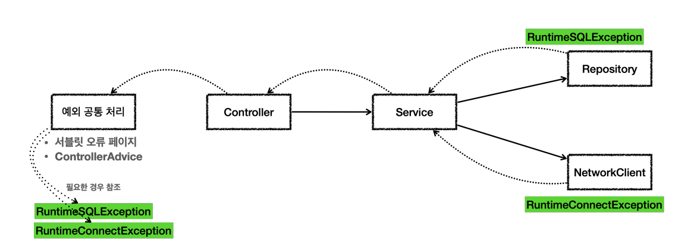

# 언체크 예외
> `RuntimeException`과 그 하위 예외는 언체크 예외로 분류된다. 말 그대로 컴파일러가 예외를 체크하지 않는다는 뜻이다.
> 
> 체크예외와 차이점은 예외를 던지는 `throws`를 생략할 수 있다. 이 경우 자동으로 예외를 던진다.

```java
@Slf4j
public class UncheckedTest {
    
    @Test
    void unchecked_catch() {
        Service service = new Service();
        service.callCatch();
    }

    @Test
    void unchecked_throw() {
        Service service = new Service();
        assertThatThrownBy(service::callThrow)
                .isInstanceOf(MyUncheckedException.class);
    }

    /**
     * RuntimeException을 상속받은 예외는 언체크 예외가 된다.
     */
    static class MyUncheckedException extends RuntimeException{
        public MyUncheckedException(String message) {
            super(message);
        }
    }

    /**
     * Unchecked 예외는 예외를 잡거나, 던지지 않아도 된다.
     * 예외를 잡지 않으면 자동으로 밖으로 던진다.
     */
    static class Service{
        Repository repository = new Repository();

        /**
         * 필요한 경우 예외를 잡아서 처리하면 된다.
         */
        public void callCatch() {
            try {
                repository.call();
            } catch (MyUncheckedException e) {
                log.info("예외 처리, message={}", e.getMessage(), e);
            }
        }

        /**
         * 예외를 잡이 않아도 된다. 자연스럽게 상위로 넘어건다.
         * 체크 예외와 다르게 throws 예외 선언을 하지 않아도 된다.
         */
        public void callThrow() {
            repository.call();
        }
    }

    static class Repository{
        public void call() {
            throw new MyUncheckedException("ex");
        }
    }
}
```

**언체크 예외 장단점**<br>
언체크 예외는 예외를 잡아서 처리할 수 없을 때 예외를 밖으로 던지는 `throws`를 생략할 수 있는데 이것 때문에 장단점이 동시에 존재한다.

- 장점 : 신경쓰고 싶지 않은 언체크 예외를 무시할 수 있다. 체크 예외의 경우 처리할 수 없는 예외를 밖으로 던지려면 항상 `throws {예외}`를 선언해야 하지만
언체크 예외는 이 부분을 생략할 수 있다. **신경쓰고 싶지 않은 예외의 의존관계를 참조하지 않아도 된다.**
- 단점 : 언체크 예외는 개발자가 실수로 누락할 수 있다. 반면에 체크 예외는 컴파일러를 통해 예외 누락을 잡아준다.

<br>

## 언체크 예외 활용



런타임 예외(언체크)이기 때문에 서비스, 컨트롤러는 해당 예외들을 처리할 수 없다면 별도의 선언 없이 그냥 두면 된다.
```java
@Slf4j
public class UnCheckedAppTest {

    @Test
    void checked() {
        Controller controller = new Controller();
        assertThatThrownBy(controller::request)
                .isInstanceOf(RuntimeException.class);
    }

    @Test
    void printEx() {
        Controller controller = new Controller();
        try {
            controller.request();
        } catch (Exception e) {
//            e.printStackTrace();
            log.info("ex", e);
        }
    }

    static class Controller{
        Service service = new Service();

        public void request() {
            service.logic();
        }
    }

    static class Service {
        Repository repository = new Repository();
        NetworkClient networkClient = new NetworkClient();

        public void logic() {
            repository.call();
            networkClient.call();
        }
    }


    static class NetworkClient{
        public void call() {
            throw new RuntimeConnectException("연결 실패");
        }
    }

    static class Repository {
        public void call() {
            try {
                runSQL();
            } catch (SQLException e) {
                throw new RuntimeSQLException(e);
            }
        }
        private void runSQL() throws SQLException {
            throw new SQLException("ex");
        }
    }

    static class RuntimeSQLException extends RuntimeException {
        public RuntimeSQLException(Throwable cause) {
            super(cause);
        }
    }

    static class RuntimeConnectException extends RuntimeException {
        public RuntimeConnectException(String message) {
            super(message);
        }
    }
}
```
- 레포지토리에서 **체크 예외**인 `SQLException`이 발생하면 **언체크 예외**인 `RuntimeSQLException`으로 전환해서 예외를 던진다.
- 시스템에서 발생한 예외는 대부분 **복구 불가능 예외**이다. 런타임 예외를 사용하면 서비스나 컨트롤러가 이런 복구 불가능한 예외를 신경쓰지 않아도 된다.
이렇게 복구 불가능한 예외는 공통으로 처리해 줘야 한다.
- 런타임 예외는 `throws`를 선언할 필요 없이 무시하면 되기 때문에 체크 예외처럼 강제로 예외를 의존하지 않아도 된다.


런타임 예외는 놓칠 수 있기 때문에 문서화가 중요하다. 또는 코드에 `throws {런타임 예외}`를 남겨서 중요한 예외를 인지할 수 있게 해준다.

- 문서화 예시
```java
/**
 * Make an instance managed and persistent.
 * @param entity  entity instance
 * @throws EntityExistsException if the entity already exists.
 * @throws IllegalArgumentException if the instance is not an
 *         entity
 * @throws TransactionRequiredException if there is no transaction when
 *         invoked on a container-managed entity manager of that is of type
 *         <code>PersistenceContextType.TRANSACTION</code>
 */
public void persist(Object entity);
```

<br>

## 예외 포함과 스택 트레이스
> 예외를 전환할 때는 꼭 기존 예외를 포함해야 한다.

```java
public void call() {
    try {
        runSQL();
    } catch (SQLException e) {
        throw new RuntimeSQLException(e);
    }
}
```
기존 예외를 포함하지 않으면 기존에 발생한 `SQLException`과 스택 트레이스를 확인할 수 없다. 한 마디로 변환한 예외가 어떤 오류에 의해 나타난 오류인지 알 수가 없어진다는 것이다.

```java
 @Test
    void printEx() {
        Controller controller = new Controller();
        try {
            controller.request();
        } catch (Exception e) {
//            e.printStackTrace();
            log.info("ex", e);
        }
    }
```
로그를 출력할 때 마지막 파라미터에 예외를 넣어주면 로그에 스택 트레이스를 출력할 수 있다. `e.printStackTrace()`는 `System.out`에 출력한다.
