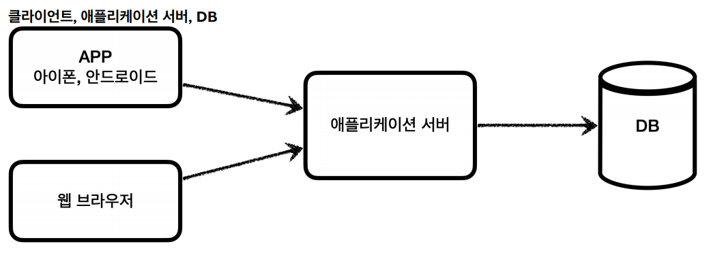
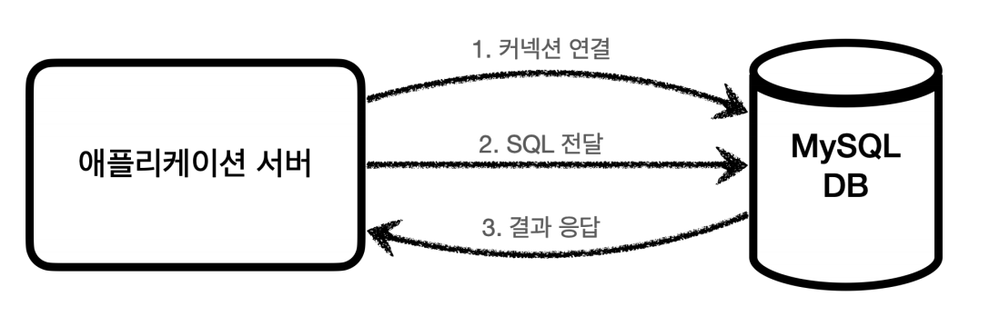
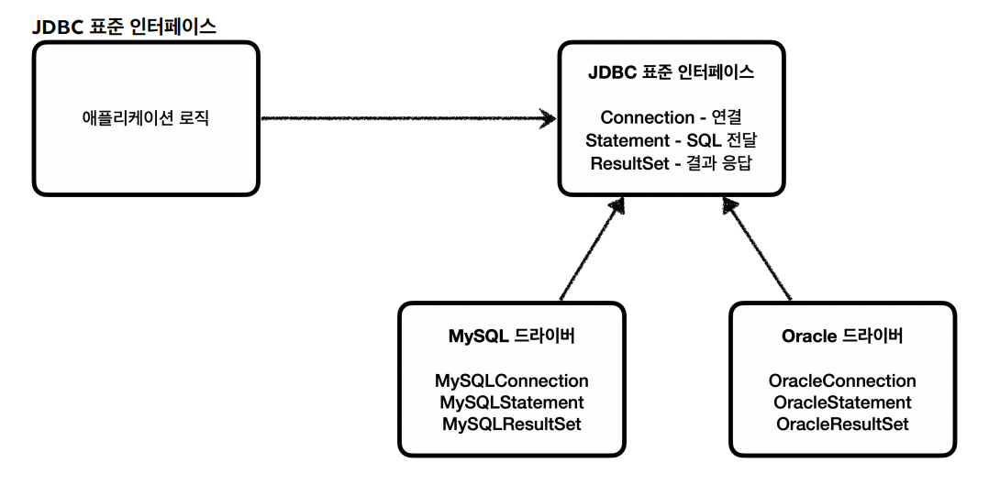
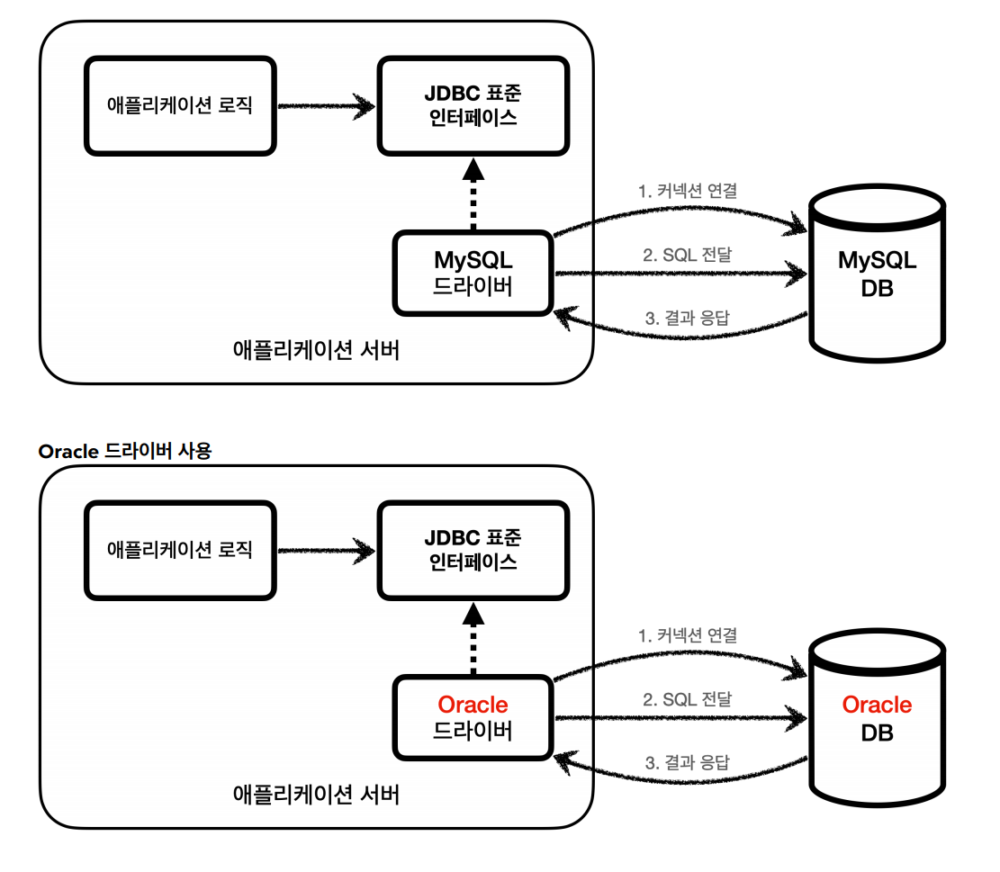
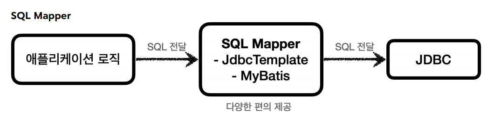
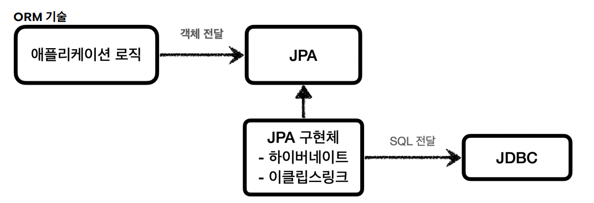
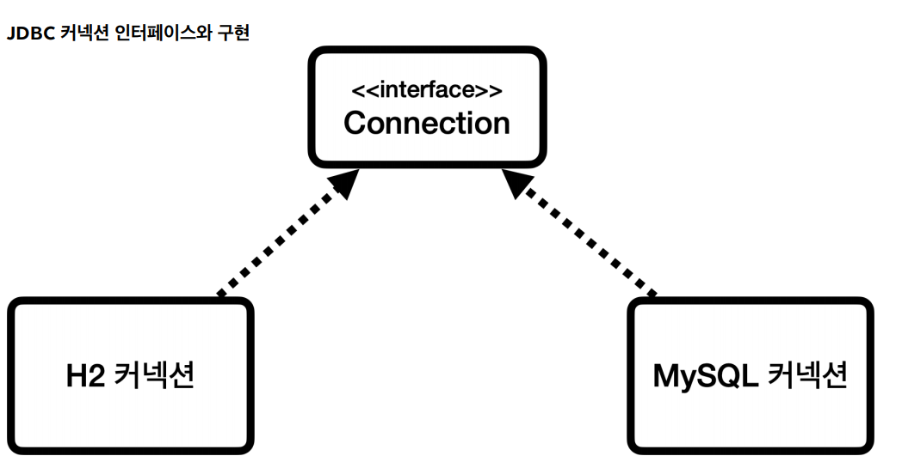
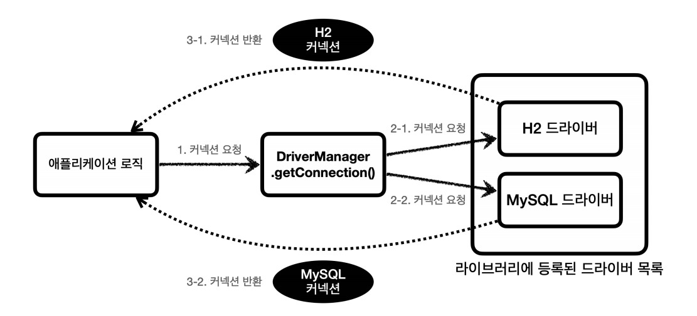
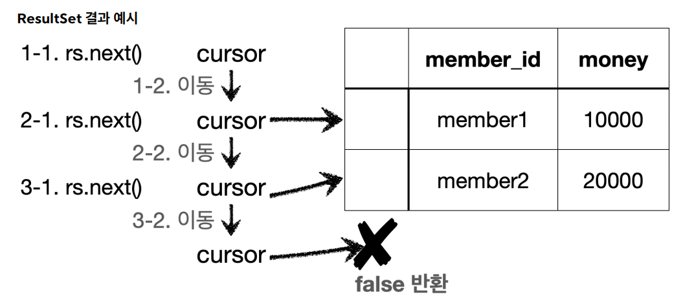

# JDBC

## JDBC의 등장 이유


애플리케이션을 개발할 때 중요한 데이터는 대부분 데이터베이스에 보관한다. 클라이언트가 애플리케이션 서버를 통해 데이터를 저장하거나 조회하면 애플리케이션 서버는
다음 과정을 통해 데이터베이스를 사용한다.


1. `커넥션 연결` : 주로 `TCP/IP`를 사용해서 커넥션을 연결한다.
2. `SQL 전달` : 애플리케이션 서버는 DB가 이해할 수 있는 SQL을 연결된 커넥션을 통해 DB에 전달한다.
3. `결과 응답` : DB는 전달된 SQL을 수행하고 그 결과를 응답한다. 애플리케이션 서버는 응답 결과를 활용한다.

문제는 관계형 DB만 해도 수십 개가 있는데 각각의 DB마다 커넥션 연결 방법, SQL 전달 방법, 결과를 응답 받는 방법이 모두 다르다.

1. DB를 다른 종류의 DB로 변경하면 서버에 개발된 DB 사용 코드도 함께 변경해야 한다.
2. 개발자가 DB마다 커넥션 연결, SQL 전달, 결과를 응답 받는 방법도 새로 학습해야 한다.

이런 문제를 해결하기 `JDBC`라는 자바 표준이 등장한다.

### JDBC 표준 인터페이스
> `JDBC(Java Database Connectivity)`는 자바에서 데이터베이스에 접속할 수 있도록 하는 자바 API다. JDBC는 데이터베이스에서 자료를 쿼리하거나
> 업데이트 하는 방법을 제공한다.



대표적으로 3가지 기능을 표준 인터페이스로 정의해서 제공한다.
- `Connection` : 연결
- `Statement` : SQL을 담은 내용
- `ResultSet` : SQL 요청 응답

개발자는 이 표준 인터페이스만 사용해서 개발하면 된다. 그리고 이 JDBC 인터페이스를 각각의 DB 벤더(회사)에서 자신의 DB에 맞도록 구현해서 라이브러리로
제공하는데 이것을 `JDBC 드라이버`라고 한다.(`MySQL JDBC 드라이버`, `Oracle JDBC 드라이버` 등)



JDBC 표준 인터페이스에 의존하기 때문에 **다른 종류의 데이터베이스로 변경해도 JDBC 구현 라이브러리만 변경하면 된다.** 그리고 **개발자가 각 DB마다 새로운 
학습을 꼭 하지 않아도 된다.** 위에 두 가지 문제가 해결되었다.

<br>

## JDBC와 최신 데이터 접근 기술
> JDBC를 편리하게 사용하는 다양한 기술이 있는데 대표적으로 `SQL Mapper`, `ORM 기술`로 나눌 수 있다.


- `SQL Mapper`
  - **장점** : JDBC를 편리하게 사용하도록 도와준다.
    - SQL 응답 결과를 객체로 편리하게 변환해준다.
    - JDBC의 반복 코드를 제거해준다.
  - **단점** : 개발자가 SQL을 직접 작성해야 한다.
  - 대표 기술 : 스프링 JdbcTemplate, MyBatis


- `ORM 기술`
  - 객체를 관계형 DB 테이블과 매핑해주는 기술
  - 개발자는 반복적인 SQL을 직접 작성하지 않고, ORM 기술이 개발자 대신에 SQL을 동적으로 만들어 실행해준다. 
  - 각각의 DB마다 다른 SQL을 사용하는 문제도 중간에서 해결해준다.
  - **대표 기술** : `JPA`, `하이버네이트`,`이클립스링크`
  - **JPA는 자바 진영의 ORM 표준 인터페이스이고 이것을 구현한 것으로 하이버네이트 등의 구현 기술이 있다.**

<br>

## 데이터베이스 연결
- ConnectionConst
```java
public abstract class ConnectionConst {
    public static final String URL = "jdbc:h2:tcp://localhost/~/test";
    public static final String USERNAME = "sa";
    public static final String PASSWORD = "";
}
```
데이터베이스에 접속하는데 필요한 기본 정보를 상수로 정의

- DBConnectionUtil
```java
import java.sql.Connection;
import java.sql.DriverManager;
import java.sql.SQLException;

import static hello.jdbc.connection.ConnectionConst.*;

@Slf4j
public class DBConnectionUtil {

    public static Connection getConnection() {
        try {
            Connection connection = DriverManager.getConnection(URL, USERNAME, PASSWORD);
            log.info("get connection={}, class={}", connection, connection.getClass());
            return connection;

        } catch (SQLException e) {
            throw new IllegalArgumentException(e);
        }
    }
}
```
DB에 연결하려면 JDBC가 제공하는 `DriverManager.getConnection()`을 사용하면 된다. 라이브러리에 있는 DB 드라이버를 찾아서 해당 드라이버가 제공하는
커넥션을 반환해준다. 여기서는 H2 DB 드라이버가 작동해서 커넥션을 맺고 그 결과를 반환해준다.

- 테스트 코드
```java
@Test
void connection() {
    Connection connection = DBConnectionUtil.getConnection();
    assertThat(connection).isNotNull();
}
```
- 로그
```java
DBConnectionUtil - get connection=conn0: url=jdbc:h2:tcp://localhost/~/testuser=SA, 
class=class org.h2.jdbc.JdbcConnection
```
로그에 `class=class org.h2.jdbc.JdbcConnection`부분이 H2 DB 드라이버가 제공하는 H2 전용 커넥션이다. 이 커넥션은 JDBC 표준 커넥션 인터페이스인
`java.sql.Connection`인터페이스를 구현하고 있다.

## JDBC DriverManager 연결 이해





JDBC가 제공하는 `DriverManager`는 라이브러리에 등록된 DB 드라이버들을 관리하고 커넥션을 획득하는 기능을 제공한다.
1. 커넥션이 필요하면 `DriverManager.getConnection()`을 호출한다.
2. `DriverManager`는 라이브러리에 등록된 드라이버 목록을 자동으로 인식한다. 이 드라이버들에게 순서대로 다음 정보를 넘겨서 커넥션을 획득할 수 있는지 확인한다.
   - URL, 이름, 비밀번호 등 접속에 필요한 추가 정보
   - 여기서 각 드라이버는 URL 정보를 체크해서 본인이 처리할 수 있는 요청인지 확인한다. 예를 들어 URL이 `jdbc:h2`로 시작하면 이것은 H2 DB에 접근하기 위한 규칙이기 때문에
      H2 드라이버는 본인이 처리할 수 있으므로 실제 DB에 연결해서 커넥션을 획득하고 이 커넥션을 클라이언트에게 반환한다. 반면에 URL이 `jdbc:h2`로 시작하는데 MySQL 드라이버가
      먼저 실행되면 본인이 처리할 수 없다는 결과를 반환하게 되고 다음 드라이버에게 순서가 넘어간다.

<br>

## JDBC 개발 - 등록
- schema.sql
```sql
drop table member if exists cascade;
create table member (
  member_id varchar(10),
  money integer not null default 0,
  primary key (member_id)
);
```
- Member
```java
@Data
@NoArgsConstructor
@AllArgsConstructor
public class Member {
    
    private String memberId;
    private int money;
}
```
- MemberRepository - 회원 등록
```java
/**
 * JDBC - DriverManager 사용
 */
@Slf4j
public class MemberRepositoryV0 {

    public Member save(Member member) throws SQLException {
        String sql = "insert into member(member_id, money) values(?, ?)";

        Connection con = null;
        PreparedStatement pstmt = null;

        try {
            con = getConnection();
            pstmt = con.prepareStatement(sql);
            pstmt.setString(1, member.getMemberId());
            pstmt.setInt(2, member.getMoney());
            pstmt.executeUpdate();
            
            return member;
        } catch (SQLException e) {
            log.error("db error", e);
            throw e;
        } finally {
            close(con, pstmt, null);
        }
    }
    
    private void close(Connection con, Statement stmt, ResultSet rs) {
    
      if (rs != null) {
        try {
          rs.close();
        } catch (SQLException e) {
            log.info("error", e);
        }
      }
    
      if (stmt != null) {
        try {
          stmt.close();
        } catch (SQLException e) {
          log.info("error", e);
        }
      }
    
      if (con != null) {
        try {
          con.close();
        } catch (SQLException e) {
          log.info("error", e);
        }
      }
      
    }
    
    private Connection getConnection() {
      return DBConnectionUtil.getConnection();
    }
}
```
쿼리를 실행하고 나면 **꼭 리소스를 정리해야 한다.(`close(con, pstmt, null);`)** 항상 역순으로 정리해야 한다. `Connection`을 먼저 획득하고 `Connection`을 통해
`PreparedStatement`를 만들었기 때문에 리소스를 반환할 때는 `PreparedStatement`를 먼저 종료하고 그 다음에 `Connection`을 종료하면 된다.

**리소스 정리를 하지 않으면 커넥션이 끊어지지 않고 계속 유지되는 `리소스 누수`문제가 발생하고 결과적으로 커넥션 부족으로 장애가 발생할 수 있다.**<br>

<br>

## JDBC 개발 - 조회
- MemberRepository
```java
public Member findById(String memberId) throws SQLException {
        String sql = "select * from member where member_Id = ?";

        Connection con = null;
        PreparedStatement pstmt = null;
        ResultSet rs = null;

        try{
            con = getConnection();
            pstmt = con.prepareStatement(sql);
            pstmt.setString(1, memberId);

            rs = pstmt.executeQuery();

            if (rs.next()) {
                Member member = new Member();
                member.setMemberId(rs.getString("member_id"));
                member.setMoney(rs.getInt("money"));
                return member;
            } else {
                throw new NoSuchElementException("member not found memberId=" + memberId);
            }
        } catch (SQLException e) {
            log.error("db error", e);
            throw e;
        } finally {
            close(con, pstmt, rs);
        }
}
```
ResultSet


- `rs.next()` : 최초의 커서는 데이터를 가리키고 있지 않기 때문에 최초 한 번은 호출해야 데이터를 조회할 수 있다. `rs.next()`의 결과가 `true`면 커서의
이동 결과 데이터가 있다는 뜻이다.
- `findById()`는 회원 하나를 조회하는 것이기 때문에 `while`문 대신 `if`문을 사용한다.

<br>

## JDBC 개발 - 수정, 삭제
> 등록, 수정, 삭제처럼 데이터를 변경하는 쿼리는 `executeUpdate()`를 사용한다. `executeUpdate()`는 쿼리를 실행하고 영향 받은 row수를 반환한다.

- MemberRepository
```java
public void update(String memberId, int money) throws SQLException {
        String sql = "update member set money = ? where member_id = ?";

        Connection con = null;
        PreparedStatement pstmt = null;
        ResultSet rs = null;

        try{
            con = getConnection();
            pstmt = con.prepareStatement(sql);
            pstmt.setInt(1,money);
            pstmt.setString(2, memberId);

            int resultSize = pstmt.executeUpdate();
            log.info("resultSize={}", resultSize);

        } catch (SQLException e) {
            log.error("db error", e);
            throw e;
        }finally {
            close(con, pstmt, rs);
        }
    }

    public void delete(String memberId) throws SQLException {
        String sql = "delete from member where member_id = ?";

        Connection con = null;
        PreparedStatement pstmt = null;

        try{
            con = getConnection();
            pstmt = con.prepareStatement(sql);
            pstmt.setString(1, memberId);

            pstmt.executeUpdate();
        } catch (SQLException e) {
            log.error("db error", e);
            throw e;
        }finally {
            close(con, pstmt, null);
        }
    }
```

- 최종 테스트 코드
```java
@Slf4j
class MemberRepositoryV0Test {

    MemberRepositoryV0 repository = new MemberRepositoryV0();

    @Test
    void crud() throws SQLException {
        //save
        Member member = new Member("memberV5", 10000);
        repository.save(member);

        //findById
        Member findMember = repository.findById(member.getMemberId());
        log.info("findMember={}", findMember);

        assertThat(findMember).isEqualTo(member);

        //update: money 10000 -> 20000
        repository.update(member.getMemberId(), 20000);
        Member updateMember = repository.findById(member.getMemberId());
        assertThat(updateMember.getMoney()).isEqualTo(20000);

        //delete
        repository.delete(member.getMemberId());
        assertThatThrownBy(() -> repository.findById(member.getMemberId()))
                .isInstanceOf(NoSuchElementException.class);

    }
}
```