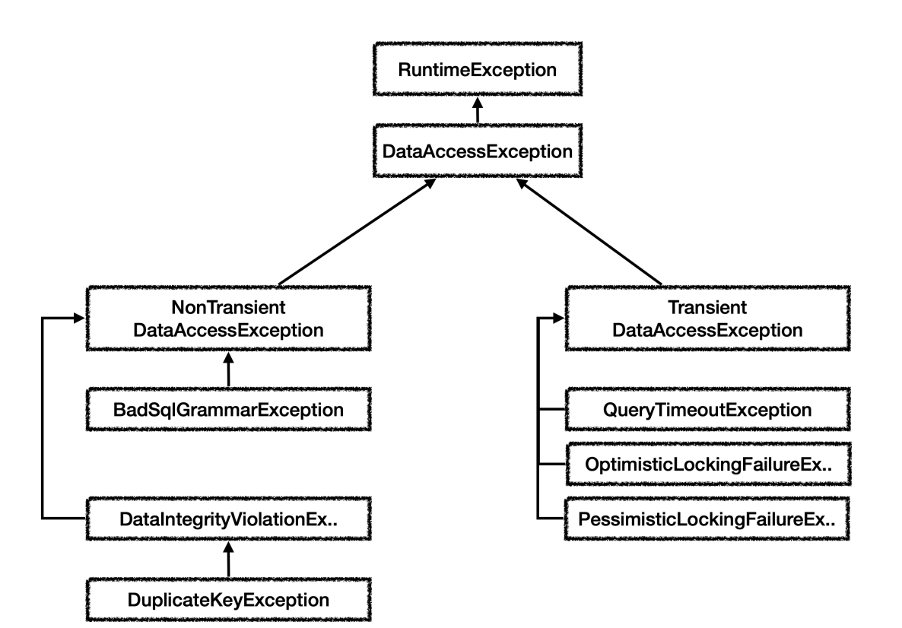
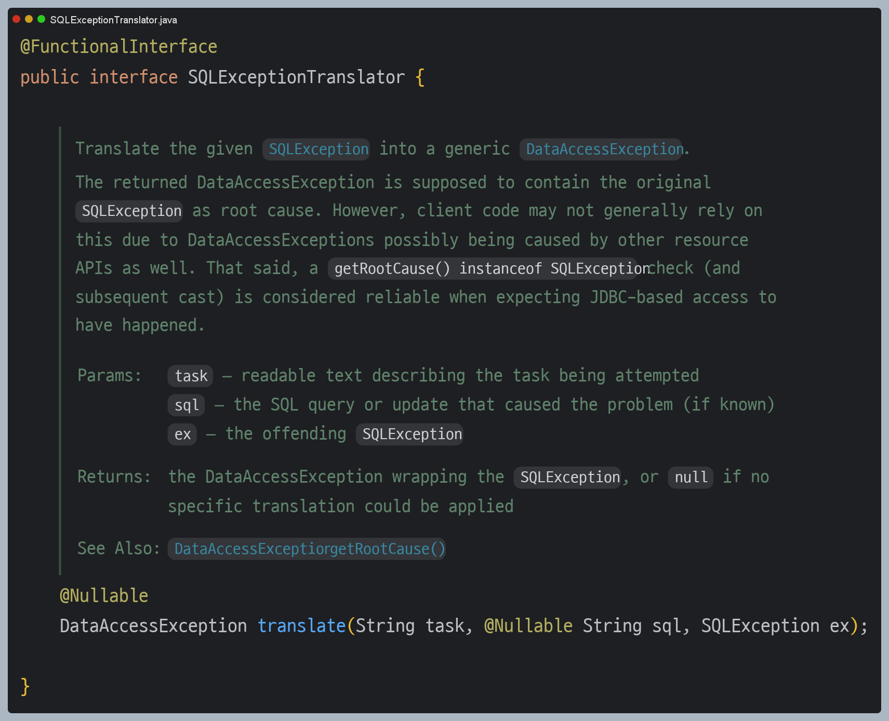
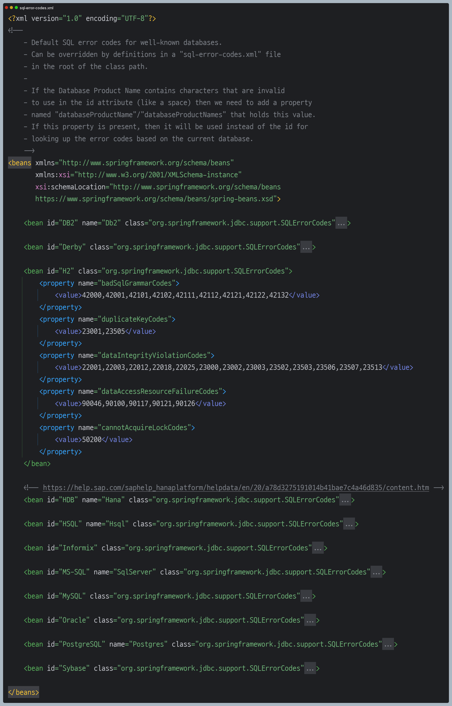

# 스프링 예외 추상화
스프링은 데이터 접근 계층에 대한 수십 가지 예외를 정리해서 일관된 예외 계층을 제공한다.
각각의 예외는 특정 기술에 종속적이지 않게 설계되어 있다.



예외의 최고 상위는 `DataAccessException`으로 `RuntimeException`을 상속받았기 때문에 모든 예외는 런타임 예외(언체크)다.

- `Transient`
  - **일시적**이라는 뜻으로 동일한 SQL을 다시 시도했을 때 성공할 가능성이 있다.(락이 풀리거나 DB 상태가 좋아지거나)
- `NonTransient`
  - 일시적이지 않다, 같은 SQL을 그대로 반복해서 실행하면 실패한다.(문법 오류, 제약조건 위배 등)


**테스트 코드**
```java
DataSource dataSource;

@BeforeEach
void init() {
    dataSource =  new DriverManagerDataSource(URL, USERNAME, PASSWORD);
}

@Test
void sqlExceptionErrorCode() {
    String sql = "select bad grammer"; //SQL 문법 오류

    try {
        Connection con = dataSource.getConnection();
        PreparedStatement pstmt = con.prepareStatement(sql);
        pstmt.executeUpdate();
    } catch (SQLException e) {
        assertThat(e.getErrorCode()).isEqualTo(42122);
        int errorCode = e.getErrorCode();
        log.info("errorCode={}", errorCode);
        log.info("error", e);
    }
}
```
- 이렇게 직접 예외를 확인하고 하나하나 스프링이 만들어준 예외로 변환하는 것은 현실성이 없다. 심지어 DB마다 오류 코드가 모두 다르다.
- 스프링은 DB에서 발생하는 오류 코드를 스프링이 정의한 예외로 자동으로 변환해주는 변환기를 제공한다.



**테스트 코드**
```java
@Test
void exceptionTranslator() {
    String sql = "select bad grammar";

    try {
        Connection con = dataSource.getConnection();
        PreparedStatement pstmt = con.prepareStatement(sql);
        pstmt.executeQuery();
    } catch (SQLException e) {
        assertThat(e.getErrorCode()).isEqualTo(42122);

        SQLErrorCodeSQLExceptionTranslator exTranslator = new SQLErrorCodeSQLExceptionTranslator(dataSource);
        DataAccessException resultEx = exTranslator.translate("select", sql, e);
        log.info("resultEx", resultEx);
        assertThat(resultEx.getClass()).isEqualTo(BadSqlGrammarException.class);
    }
}
```
`translate()` : 첫 번째 파라미터는 읽을 수 있는 설명, 두 번째는 실행한 sql, 마지막은 발생된 `SQLException`을 전달하면 된다. 이렇게 하면 스프링 데이터
접근 계층의 예외로 변환해서 반환해준다.

위 파일이 어떤 스프링 데이터 접근 예외로 전환해야 할 지 찾아준다. 10개 이상의 대부분의 관계형 DB를 지원한다.

> 👆 **참고**
> - 스프링은 `org.springframework.jdbc.support.sql-error-codes.xml` 파일을 참고하여 각각의 DB가 제공하는 SQL ErrorCode를 고려해서
> 예외를 변환한다.
> - 10개 이상의 대부분의 관계형 DB를 지원한다.
> 
> 
> 
> - 스프링 SQL 예외 변환기는 SQL ErrorCode를 이 파일에 대입해서 어떤 스프링 데이터 접근 예외로 전환해야 할 지 찾아낸다.
> - 예를 들어 H2 데이터베이스에서 오류 코드 `42000`이 발생하면 `badSqlGrammarCodes`이기 때문에 `BadSqlGrammarException`을 반환한다.

---

## 스프링 예외 추상화 적용 예제

**레포지토리**
```java
/**
 * SQLExceptionTranslator 추가
 */
@Slf4j
public class MemberRepositoryV4_2 implements MemberRepository{

    private final DataSource dataSource;
    private final SQLExceptionTranslator exTranslator;

    public MemberRepositoryV4_2(DataSource dataSource) {
        this.dataSource = dataSource;
        this.exTranslator = new SQLErrorCodeSQLExceptionTranslator(dataSource);
    }

    @Override
    public Member save(Member member) {
        String sql = "insert into member(member_id, money) values(?, ?)";

        Connection con = null;
        PreparedStatement pstmt = null;

        try {
            con = getConnection();
            pstmt = con.prepareStatement(sql);
            pstmt.setString(1, member.getMemberId());
            pstmt.setInt(2, member.getMoney());
            pstmt.executeUpdate();
            return member;
        } catch (SQLException e) {
            throw exTranslator.translate("save", sql, e);
        } finally {
            close(con, pstmt, null);
        }
    }

    @Override
    public Member findById(String memberId){
        String sql = "select * from member where member_Id = ?";

        Connection con = null;
        PreparedStatement pstmt = null;
        ResultSet rs = null;

        try {
            con = getConnection();
            pstmt = con.prepareStatement(sql);
            pstmt.setString(1, memberId);

            rs = pstmt.executeQuery();

            if (rs.next()) {
                Member member = new Member();
                member.setMemberId(rs.getString("member_id"));
                member.setMoney(rs.getInt("money"));
                return member;
            } else {
                throw new NoSuchElementException("member not found memberId=" + memberId);
            }
        } catch (SQLException e) {
            throw exTranslator.translate("update", sql, e);
        } finally {
            close(con, pstmt, rs);
        }
    }

    @Override
    public void update(String memberId, int money) {
        String sql = "update member set money = ? where member_id = ?";

        Connection con = null;
        PreparedStatement pstmt = null;
        ResultSet rs = null;

        try {
            con = getConnection();
            pstmt = con.prepareStatement(sql);
            pstmt.setInt(1,money);
            pstmt.setString(2, memberId);

            int resultSize = pstmt.executeUpdate();
            log.info("resultSize={}", resultSize);

        } catch (SQLException e) {
            throw exTranslator.translate("update", sql, e);
        } finally {
            close(con, pstmt, rs);
        }
    }

    @Override
    public void delete(String memberId) {
        String sql = "delete from member where member_id = ?";

        Connection con = null;
        PreparedStatement pstmt = null;

        try {
            con = getConnection();
            pstmt = con.prepareStatement(sql);
            pstmt.setString(1, memberId);

            pstmt.executeUpdate();
        } catch (SQLException e) {
            throw exTranslator.translate("delete", sql, e);
        } finally {
            close(con, pstmt, null);
        }
    }

    private void close(Connection con, Statement stmt, ResultSet rs) {
        JdbcUtils.closeResultSet(rs);
        JdbcUtils.closeStatement(stmt);
        // 주의! 트랜잭션 동기화를 사용하려면 DataSourceUtils를 사용해야 한다.
        DataSourceUtils.releaseConnection(con, dataSource);
    }

    private Connection getConnection() throws SQLException {
        // 주의! 트랜잭션 동기화를 사용하려면 DataSourceUtils를 사용해야 한다.
        Connection con = DataSourceUtils.getConnection(dataSource);
        log.info("get connection={}, class={}", con, con.getClass());
        return con;
    }
}
```

**중요 부분**
```java
catch (SQLException e){
    throw exTranslator.translate("{description}", sql, e);
}
```
스프링이 예외를 추상화해준 덕분에 서비스 계층은 특정 레포지토리의 구현 기술과 예외에 종속적이지 않게 되었다. 서비스 계층에서 예외를 잡아서 복구해야 하는 경우
예외가 스프링이 제공하는 데이터 접근 예외로 변경되어서 서비스 계층에 넘어오기 때문에 필요한 경우 예외를 잡아서 복구할 수도 있다.

---

## JdbcTemplate

레포지토리에서 JDBC 반복 문제가 발생했다.
- 커넥션 조회, 커넥션 동기화
- 쿼리 실행
- 결과 바인딩
- 리소스 종료

스프링은 JDBC의 반복 문제를 해결하기 위해 `JdbcTemplate`이라는 템플릿을 제공한다.

**JdbcTemplate 사용 예제**
```java
/**
 * JdbcTemplate 사용
 */
@Slf4j
public class MemberRepositoryV5 implements MemberRepository{

   private final JdbcTemplate template;

    public MemberRepositoryV5(DataSource dataSource) {
        this.template = new JdbcTemplate(dataSource);
    }

    @Override
    public Member save(Member member) {
        String sql = "insert into member(member_id, money) values(?, ?)";
        template.update(sql, member.getMemberId(), member.getMoney());

        return member;
    }

    @Override
    public Member findById(String memberId){
        String sql = "select * from member where member_Id = ?";
        return template.queryForObject(sql, memberRowMapper(), memberId);
    }

    @Override
    public void update(String memberId, int money) {
        String sql = "update member set money = ? where member_id = ?";
        template.update(sql, money, memberId);
    }

    @Override
    public void delete(String memberId) {
        String sql = "delete from member where member_id = ?";
        template.update(sql, memberId);
    }

    private RowMapper<Member> memberRowMapper() {
        return (rs, rowNum) -> {
            Member member = new Member();
            member.setMemberId(rs.getString("member_id"));
            member.setMoney(rs.getInt("money"));
            return member;
        };
    }
}
```
`JdbcTemplate`은 JDBC로 개발할 때 발생하는 반복을 대부분 해결해준다. 
**트랜잭션을 위한 커넥션 동기화**, 예외 발생 시 **스프링 예외 변환기**도 자동으로 실행해준다.