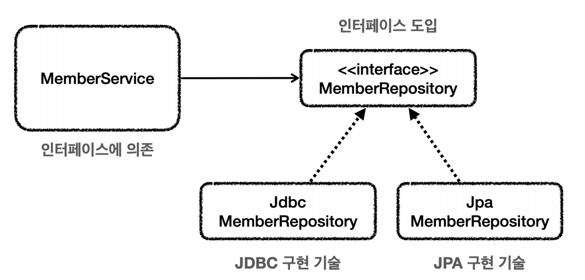

# 런타임 예외 적용

**인터페이스 도입**
```java
public interface MemberRepository {
    Member save(Member member);
    Member findById(String memberId);
    void update(String memberId, int money);
    void delete(String memberId);
}
```


> 인터페이스의 도입으로 `MemberService`는 `MemberRepository`인터페이스만 의존하면 된다. 구현 기술이 변경되더라도 DI를 사용해서 `MemberService`의 코드 변경 없이 가능해진다.

**MyDbException (런타임 예외)**
```java
public class MyDbException extends RuntimeException {
    public MyDbException() { }
    
    public MyDbException(String message) {
        super(message);
    }
    
    public MyDbException(String message, Throwable cause) {
        super(message, cause);
    }
    
    public MyDbException(Throwable cause) {
        super(cause);
    }
}
```

**레포지토리**
```java
/**
 * 예외 누수 문제 해결
 * 체크 예외를 런타임 예외로 변경
 * MemberRepository 인터페이스 적용
 * throws SQLException 제거
 */
@Slf4j
public class MemberRepositoryV4_1 implements MemberRepository {

    private final DataSource dataSource;

    public MemberRepositoryV4_1(DataSource dataSource) {
        this.dataSource = dataSource;
    }

    @Override
    public Member save(Member member) {
        String sql = "insert into member(member_id, money) values(?, ?)";

        Connection con = null;
        PreparedStatement pstmt = null;

        try {
            con = getConnection();
            pstmt = con.prepareStatement(sql);
            pstmt.setString(1, member.getMemberId());
            pstmt.setInt(2, member.getMoney());
            pstmt.executeUpdate();
            return member;
        } catch (SQLException e) {
            throw new MyDbException(e);
        } finally {
            close(con, pstmt, null);
        }
    }

    @Override
    public Member findById(String memberId){
        String sql = "select * from member where member_Id = ?";

        Connection con = null;
        PreparedStatement pstmt = null;
        ResultSet rs = null;

        try {
            con = getConnection();
            pstmt = con.prepareStatement(sql);
            pstmt.setString(1, memberId);

            rs = pstmt.executeQuery();

            if (rs.next()) {
                Member member = new Member();
                member.setMemberId(rs.getString("member_id"));
                member.setMoney(rs.getInt("money"));
                return member;
            } else {
                throw new NoSuchElementException("member not found memberId=" + memberId);
            }
        } catch (SQLException e) {
            throw new MyDbException(e);
        } finally {
            close(con, pstmt, rs);
        }
    }

    @Override
    public void update(String memberId, int money) {
        String sql = "update member set money = ? where member_id = ?";

        Connection con = null;
        PreparedStatement pstmt = null;
        ResultSet rs = null;

        try {
            con = getConnection();
            pstmt = con.prepareStatement(sql);
            pstmt.setInt(1,money);
            pstmt.setString(2, memberId);

            int resultSize = pstmt.executeUpdate();
            log.info("resultSize={}", resultSize);

        } catch (SQLException e) {
            throw new MyDbException(e);
        } finally {
            close(con, pstmt, rs);
        }
    }

    @Override
    public void delete(String memberId) {
        String sql = "delete from member where member_id = ?";

        Connection con = null;
        PreparedStatement pstmt = null;

        try {
            con = getConnection();
            pstmt = con.prepareStatement(sql);
            pstmt.setString(1, memberId);

            pstmt.executeUpdate();
        } catch (SQLException e) {
            throw new MyDbException(e);
        } finally {
            close(con, pstmt, null);
        }
    }

    private void close(Connection con, Statement stmt, ResultSet rs) {
        JdbcUtils.closeResultSet(rs);
        JdbcUtils.closeStatement(stmt);
        // 주의! 트랜잭션 동기화를 사용하려면 DataSourceUtils를 사용해야 한다.
        DataSourceUtils.releaseConnection(con, dataSource);
    }

    private Connection getConnection() throws SQLException {
        // 주의! 트랜잭션 동기화를 사용하려면 DataSourceUtils를 사용해야 한다.
        Connection con = DataSourceUtils.getConnection(dataSource);
        log.info("get connection={}, class={}", con, con.getClass());
        return con;
    }
}
```
> **중요한 부분은 `SQLException` 체크 예외를 `MyDbException` 런타임 예외로 변환해서 던진다. 그리고 기존 예외를 생성자를 통해서 포함한다.**

**서비스**
```java
/**
 * 예외 누수 문제 해결
 * SQLException 제거
 *
 * MemberRepository 인터페이스 의존
 */
@Slf4j
public class MemberServiceV4 {

    private final MemberRepository memberRepository;

    public MemberServiceV4(MemberRepository memberRepository) {
        this.memberRepository = memberRepository;
    }

    @Transactional
    public void accountTransfer(String fromId, String toId, int money) {
        bisLogic(fromId, toId, money);
    }

    private void bisLogic(String fromId, String toId, int money){
        Member fromMember = memberRepository.findById(fromId);
        Member toMember = memberRepository.findById(toId);

        memberRepository.update(fromId, fromMember.getMoney() - money);
        validation(toMember);
        memberRepository.update(toId, toMember.getMoney() + money);
    }

    private void validation(Member toMember) {
        if (toMember.getMemberId().equals("ex")) {
            throw new IllegalStateException("이체중 예외 발생");
        }
    }
}
```
> `MemberRepository` 인터페이스에 의존한다. `throws SQLException`도 제거가 됐다. 순수한 서비스 코드가 됐다.

**테스트 코드**
```java
/**
 * 예외 누수 문제 해결
 * SQLException 제거
 *
 * MemberRepository 인터페이스 의존
 */
@SpringBootTest
@Slf4j
class MemberServiceV4Test {

    public static final String MEMBER_A = "memberA";
    public static final String MEMBER_B = "memberB";
    public static final String MEMBER_EX = "ex";

    @Autowired private MemberRepository memberRepository;
    @Autowired private MemberServiceV4 memberService;

    @TestConfiguration
    @RequiredArgsConstructor
    static class TestConfig {
        @Autowired private final DataSource dataSource;

        @Bean
        MemberRepository memberRepository() {
//            return new MemberRepositoryV4_1(dataSource);
//            return new MemberRepositoryV4_2(dataSource);
            return new MemberRepositoryV5(dataSource);
        }

        @Bean
        MemberServiceV4 memberServiceV4() {
            return new MemberServiceV4(memberRepository());
        }
    }

    @AfterEach
    void afterEach() {
        memberRepository.delete(MEMBER_A);
        memberRepository.delete(MEMBER_B);
        memberRepository.delete(MEMBER_EX);
    }

    @Test
    @DisplayName("AOP 확인")
    void AopCheck() {
        log.info("memberService class={}", memberService.getClass());
        log.info("memberRepository class={}", memberRepository.getClass());
        assertThat(AopUtils.isAopProxy(memberService)).isTrue();
        assertThat(AopUtils.isAopProxy(memberRepository)).isFalse();
    }

    @Test
    @DisplayName("정상 이체")
    void accountTransfer() {
        //given
        Member memberA = new Member(MEMBER_A, 10000);
        Member memberB = new Member(MEMBER_B, 10000);
        memberRepository.save(memberA);
        memberRepository.save(memberB);

        //when
        memberService.accountTransfer(memberA.getMemberId(), memberB.getMemberId(), 2000);

        //then
        Member findMemberA = memberRepository.findById(memberA.getMemberId());
        Member findMemberB = memberRepository.findById(memberB.getMemberId());

        assertThat(findMemberA.getMoney()).isEqualTo(8000);
        assertThat(findMemberB.getMoney()).isEqualTo(12000);
    }

    @Test
    @DisplayName("이체 중 예외 발생")
    void accountTransferEx() {
        //given
        Member memberA = new Member(MEMBER_A, 10000);
        Member memberEx = new Member(MEMBER_EX, 10000);
        memberRepository.save(memberA);
        memberRepository.save(memberEx);

        //when
        assertThatThrownBy(() -> memberService.accountTransfer(memberA.getMemberId(), memberEx.getMemberId(), 2000))
                .isInstanceOf(IllegalStateException.class);

        //then
        Member findMemberA = memberRepository.findById(memberA.getMemberId());
        Member findMemberB = memberRepository.findById(memberEx.getMemberId());

        assertThat(findMemberA.getMoney()).isEqualTo(10000);
        assertThat(findMemberB.getMoney()).isEqualTo(10000);
    }
}
```

체크 예외를 런타임 예외로 변환하면서 인터페이스와 서비스 계층을 순수하게 유지할 수 있게 되었다. 
향후 JDBC에서 다른 구현 기술로 변경하더라도 서비스 로직은 변경 없이 유지할 수 있다.

---

## 데이터 접근 예외 직접 만들기

데이터베이스 오류에 따라서 특정 예외는 복구를 할 수 있도록 해보자.

**MyDuplicateKeyException**
```java
public class MyDuplicateKeyException extends MyDbException{
    public MyDuplicateKeyException() { }

    public MyDuplicateKeyException(String message) {
        super(message);
    }

    public MyDuplicateKeyException(String message, Throwable cause) {
        super(message, cause);
    }

    public MyDuplicateKeyException(Throwable cause) {
        super(cause);
    }
}
```

> 기존 `MyDbException`을 상속받아서 의미있는 계층을 형성했다. 이 예외는 직접 만든 것이기 때문에 JDBC나 JPA 같은 특정 기술에 종속적이지 않다.

**테스트 코드**
```java
@Slf4j
public class ExTranslatorV1Test {

    Repository repository;
    Service service;

    @BeforeEach
    void init() {
        DriverManagerDataSource dataSource = new DriverManagerDataSource(URL, USERNAME, PASSWORD);
        repository = new Repository(dataSource);
        service = new Service(repository);
    }

    @Test
    void duplicateKeySave() {
        service.create("myId");
        service.create("myId");
    }
    
    @Slf4j
    @RequiredArgsConstructor
    static class Service {
        private final Repository repository;

        public void create(String memberId) {
            try {
                repository.save(new Member(memberId, 0));
                log.info("saveId={}", memberId);
            } catch (MyDuplicateKeyException e) {
                log.info("키 중복, 복구 시도");
                String retryId = generateNewId(memberId);
                log.info("retryId={}", retryId);
                repository.save(new Member(retryId, 0));
            } catch (MyDbException e) {
                log.info("데이터 접근 계층 예외", e);
                throw e;
            }
        }

        private String generateNewId(String memberId) {
            return memberId + new Random().nextInt();
        }
    }

    @RequiredArgsConstructor
    static class Repository {
        private final DataSource dataSource;

        public Member save(Member member) {
            String sql = "insert into member(member_id, money) values(?, ?)";
            Connection con = null;
            PreparedStatement pstmt = null;

            try {
                con = dataSource.getConnection();
                pstmt = con.prepareStatement(sql);
                pstmt.setString(1, member.getMemberId());
                pstmt.setInt(2, member.getMoney());
                pstmt.executeUpdate();

                return member;
            } catch (SQLException e) {
                //h2 db
                if (e.getErrorCode() == 23505) {
                    throw new MyDuplicateKeyException(e);
                }
                throw new MyDbException(e);
            } finally {
                JdbcUtils.closeStatement(pstmt);
                JdbcUtils.closeConnection(con);
            }
        }
    }
}
```
> 같은 ID로 저장을 시도하면 H2는 키 중복 오류 `23505` 에러코드를 반환하는데 예외를 잡아서 새로운 ID 생성 시도 후 저장해 예외를 복구했다.
> 만약 복구할 수 없는 예외(`MyDbException`)면 로그만 남기고 다시 예외를 던진다.