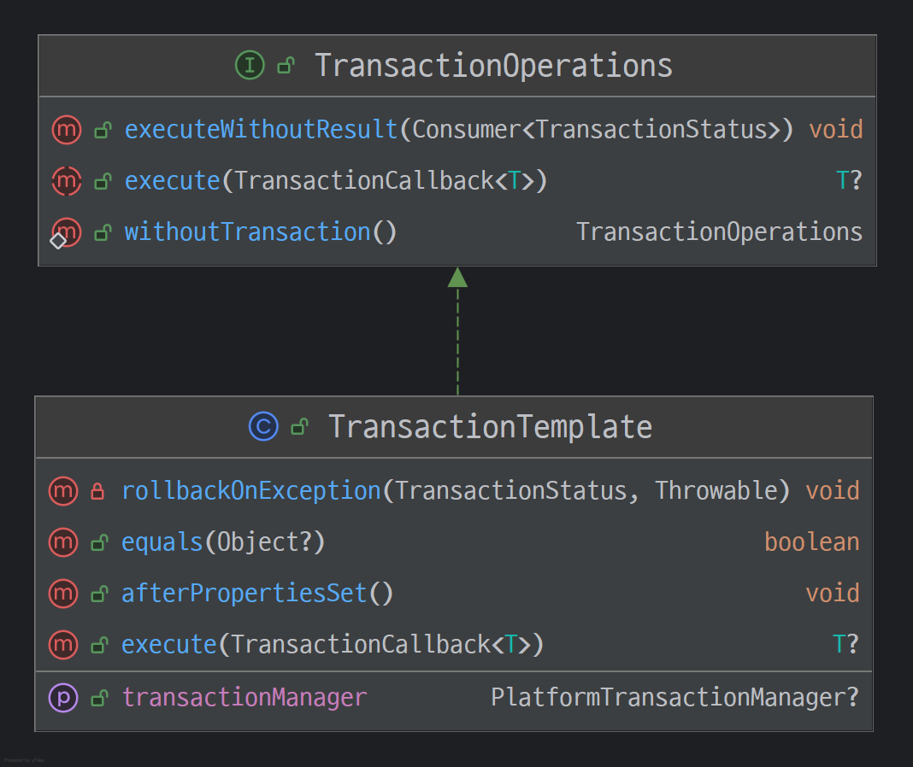
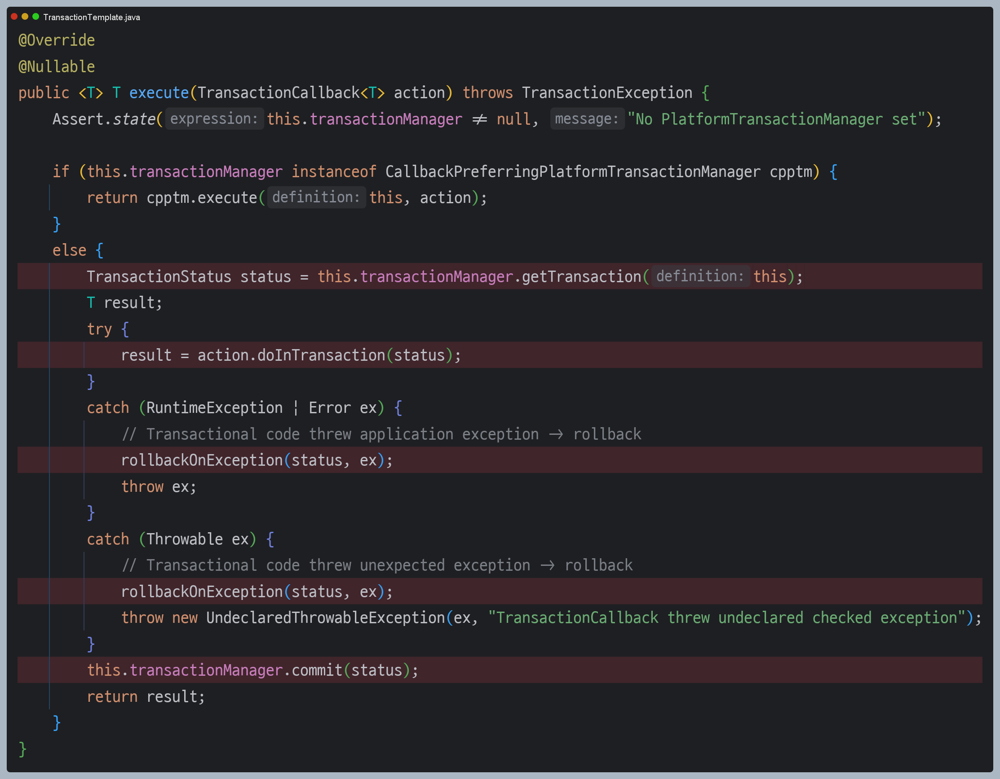
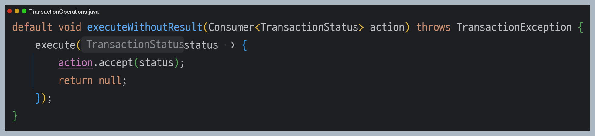

# 트랜잭션 템플릿

- 트랜잭션을 사용하는 로직은 대부분 트랜잭션을 시작하고, 비즈니스 로직을 실행하고, 성공 시 커밋, 예외 시 롤백과 같은 패턴이 반복된다.
- 이런 형태는 각각의 서비스에서 반복되고, 달라지는 부분은 비즈니스 로직 뿐이다.

스프링이 제공하는 `TransactionTemplate` 이라는 템플릿 클래스를 사용해서 **템플릿 콜백 패턴**으로 중복된 코드를 제거할 수 있다.



- `execute()` : 응답 값이 있을 때 사용
- `executeWithoutResult()` : 응답 값이 없을 때 사용





---

## 트랜잭션 템플릿 사용 예제

**서비스 로직**
```java
/**
 * 트랜잭션 - 트랜잭션 템플릿
 */
@Slf4j
public class MemberServiceV3_2 {

    private final TransactionTemplate txTemplate;
    private final MemberRepositoryV3 memberRepository;

    public MemberServiceV3_2(PlatformTransactionManager transactionManager, MemberRepositoryV3 memberRepository) {
        this.txTemplate = new TransactionTemplate(transactionManager);
        this.memberRepository = memberRepository;
    }

    public void accountTransfer(String fromId, String toId, int money) throws SQLException {
        txTemplate.executeWithoutResult((status) -> {
            try {
                bisLogic(fromId, toId, money);
            } catch (SQLException e) {
                throw new IllegalStateException(e);
            }
        });
    }

    private void bisLogic(String fromId, String toId, int money) throws SQLException {
        Member fromMember = memberRepository.findById(fromId);
        Member toMember = memberRepository.findById(toId);

        memberRepository.update(fromId, fromMember.getMoney() - money);
        validation(toMember);
        memberRepository.update(toId, toMember.getMoney() + money);
    }

    private void validation(Member toMember) {
        if (toMember.getMemberId().equals("ex")) {
            throw new IllegalStateException("이체중 예외 발생");
        }
    }
}
```

- `TransactionTemplate` 클래스를 사용하여 트랜잭션을 시작하고, 커밋하거나 롤백하는 코드가 모두 제거되었다.
- 트랜잭션 템플릿은 기본적으로 다음과 같이 동작한다.
  - 비즈니스 로직이 정상 수행되면 커밋한다.
  - 언체크 예외가 발생하면 롤백하고, 그 외의 경우 커밋한다. (체크 예외의 경우 커밋)

**테스트 코드**
```java
/**
 * 트랜잭션 - 트랜잭션 템플릿
 */
class MemberServiceV3_2Test {

    public static final String MEMBER_A = "memberA";
    public static final String MEMBER_B = "memberB";
    public static final String MEMBER_EX = "ex";

    private MemberRepositoryV3 memberRepository;
    private MemberServiceV3_2 memberService;

    @BeforeEach
    void beforeEach() {
        DriverManagerDataSource dataSource = new DriverManagerDataSource(URL, USERNAME, PASSWORD);
        memberRepository = new MemberRepositoryV3(dataSource);

        PlatformTransactionManager transactionManager = new DataSourceTransactionManager(dataSource);
        memberService = new MemberServiceV3_2(transactionManager , memberRepository);
    }

    @AfterEach
    void afterEach() throws SQLException {
        memberRepository.delete(MEMBER_A);
        memberRepository.delete(MEMBER_B);
        memberRepository.delete(MEMBER_EX);
    }

    @Test
    @DisplayName("정상 이체")
    void accountTransfer() throws SQLException {
        //given
        Member memberA = new Member(MEMBER_A, 10000);
        Member memberB = new Member(MEMBER_B, 10000);
        memberRepository.save(memberA);
        memberRepository.save(memberB);

        //when
        memberService.accountTransfer(memberA.getMemberId(), memberB.getMemberId(), 2000);

        //then
        Member findMemberA = memberRepository.findById(memberA.getMemberId());
        Member findMemberB = memberRepository.findById(memberB.getMemberId());

        assertThat(findMemberA.getMoney()).isEqualTo(8000);
        assertThat(findMemberB.getMoney()).isEqualTo(12000);
    }

    @Test
    @DisplayName("이체 중 예외 발생")
    void accountTransferEx() throws SQLException {
        //given
        Member memberA = new Member(MEMBER_A, 10000);
        Member memberEx = new Member(MEMBER_EX, 10000);
        memberRepository.save(memberA);
        memberRepository.save(memberEx);

        //when
        assertThatThrownBy(() -> memberService.accountTransfer(memberA.getMemberId(), memberEx.getMemberId(), 2000))
                .isInstanceOf(IllegalStateException.class);

        //then
        Member findMemberA = memberRepository.findById(memberA.getMemberId());
        Member findMemberB = memberRepository.findById(memberEx.getMemberId());

        assertThat(findMemberA.getMoney()).isEqualTo(10000);
        assertThat(findMemberB.getMoney()).isEqualTo(10000);
    }
}
```