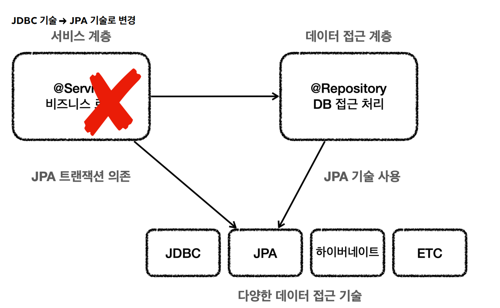
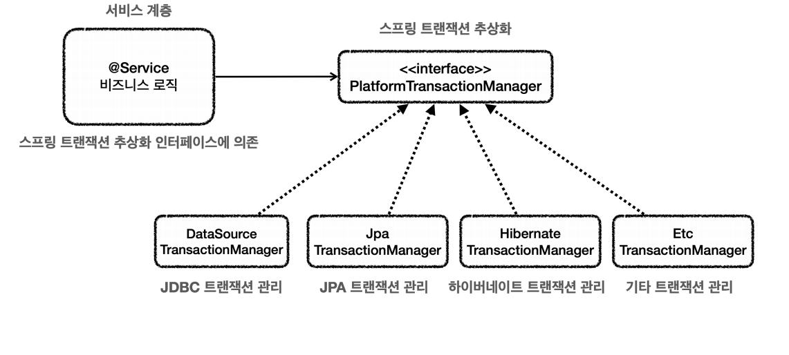
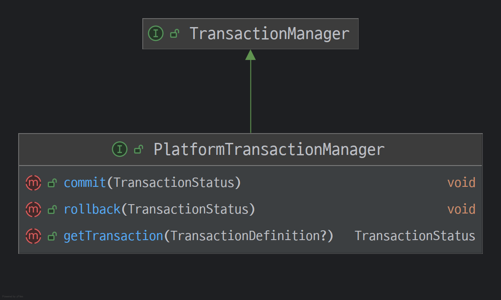
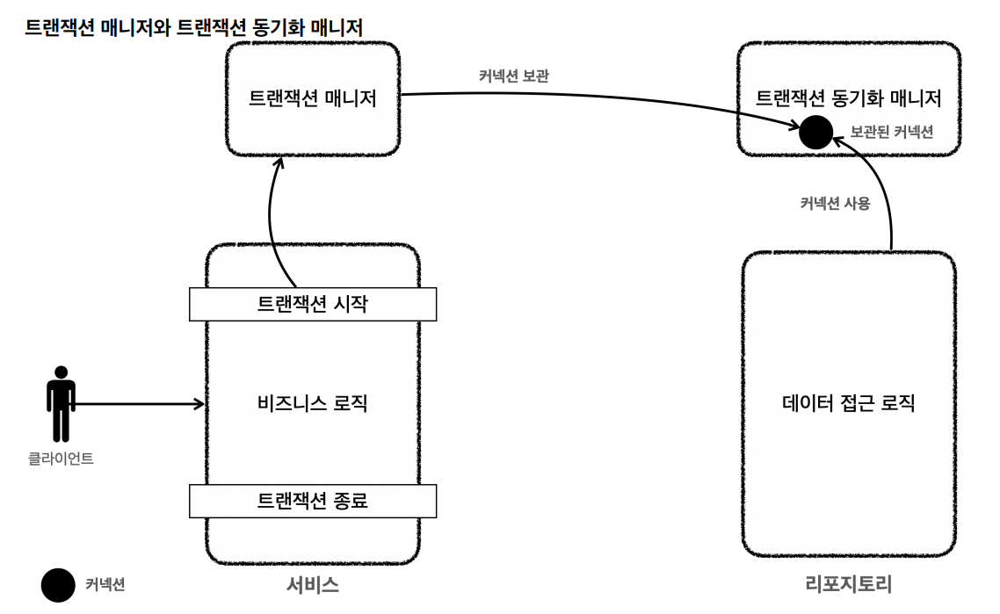
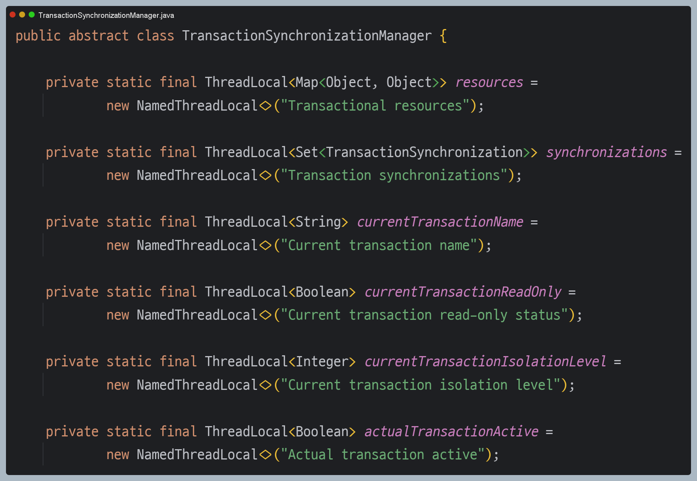
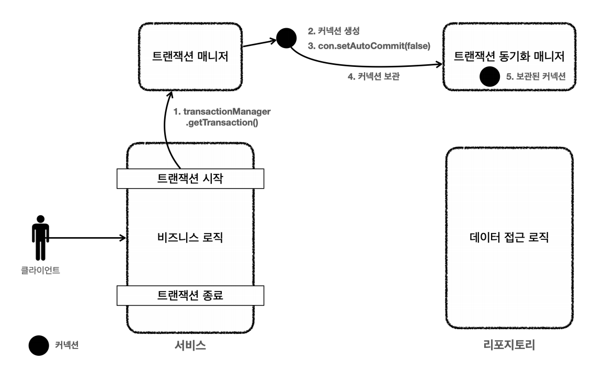
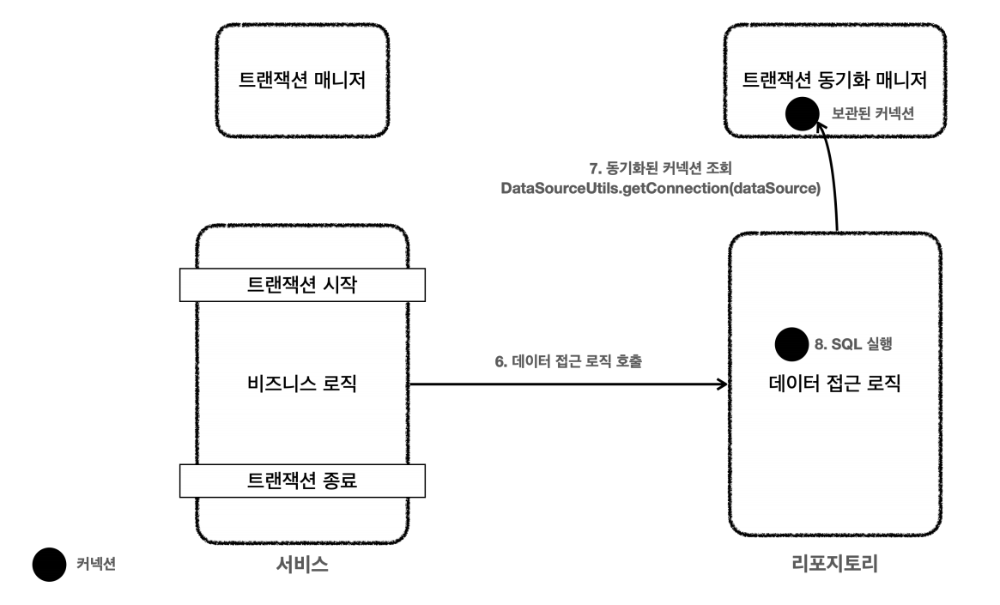

# 트랜잭션 추상화, 동기화

## 트랜잭션 추상화
> 트랜잭션을 시작하는 코드는 데이터 접근 기술마다 다르다. 만약 JDBC 기술을 사용하고 JDBC 트랜잭션에 의존하다가 JPA 기술로 변경하게 되면 서비스 계층의 코드도
> JPA 기술을 사용하도록 함께 수정해야 한다.



이러한 문제를 해결하기 위해스프링은 트랜잭션 추상화 기술을 제공한다. 
데이터 접근 기술에 따른 트랜잭션 구현체도 대부분 만들어져 있다.



스프링 트랜잭션 추상화의 핵심은 `PlatformTransactionManager` 인터페이스이다.



- `getTransaction()` : 트랜잭션을 시작한다.
  - 기존에 이미 진행중인 트랜잭션이 있는 경우 해당 트랜잭션에 참여할 수 있다.
- `commit()` : 트랜잭션을 커밋한다.
- `rollback()` : 트랜잭션을 롤백한다.

---

## 트랜잭션 동기화
스프링이 제공하는 트랜잭션 매니저는 크게 2가지 역할을 한다.
1. **트랜잭션 추상화**
   - 위에서 설명
2. **리소스 동기화**
   - 트랜잭션을 유지하려면 트랜잭션의 시작부터 끝까지 같은 DB 커넥션을 유지해야 한다. 
   스프링은 이것을 편리하게 사용할 수 있게 **트랜잭션 동기화 매니저**를 제공한다.


- 스프링은 **트랜잭션 동기화 매니저**를 제공하는데 쓰레드 로컬(`ThreadLocal`)을 사용해서 커넥션을 동기화 해준다. 트랜잭션 매니저는 내부에서 이 **트랜잭션 동기화 매니저**를 사용한다.
- **트랜잭션 동기화 매니저**는 **쓰레드 로컬**을 사용하기 때문에 멀티쓰레드 상황에 안전하게 커넥션을 동기화할 수 있다.

**동작 방식**
1. 트랜잭션을 시작하려면 **커넥션**이 필요한데 트랜잭션 매니저는 `DataSource`를 통해 **커넥션**을 만들고 트랜잭션을 시작한다.
2. 트랜잭션 매니저는 트랜잭션이 시작된 커넥션을 **트랜잭션 동기화 매니저에 보관**한다.
3. 리포지토리는 **트랜잭션 동기화 매니저**에 보관된 **커넥션**을 꺼내서 사용한다.
4. 트랜잭션이 종료되면 트랜잭션 매니저는 **트랜잭션 동기화 매니저**에 보관된 **커넥션**을 통해 트랜잭션을 종료하고 커넥션도 닫는다.

> 👆 **참고 - 트랜잭션 동기화 매니저 클래스 (`TransactionSynchronizationManager`)**
> 
> 

---

## 트랜잭션 매니저 적용 예제

**Repository**
```java
/**
 * 트랜잭션 - 트랜잭션 매니저
 * DataSourceUtils.getConnection()
 * DataSourceUtils.releaseConnection()
 */
@Slf4j
public class MemberRepositoryV3 {

    private final DataSource dataSource;

    public MemberRepositoryV3(DataSource dataSource) {
        this.dataSource = dataSource;
    }

    public Member save(Member member) throws SQLException {
        String sql = "insert into member(member_id, money) values(?, ?)";

        Connection con = null;
        PreparedStatement pstmt = null;

        try {
            con = getConnection();
            pstmt = con.prepareStatement(sql);
            pstmt.setString(1, member.getMemberId());
            pstmt.setInt(2, member.getMoney());
            pstmt.executeUpdate();
            return member;
        } catch (SQLException e) {
            log.error("db error", e);
            throw e;
        } finally {
            close(con, pstmt, null);
        }
    }

    public Member findById(String memberId) throws SQLException {
        String sql = "select * from member where member_Id = ?";

        Connection con = null;
        PreparedStatement pstmt = null;
        ResultSet rs = null;

        try {
            con = getConnection();
            pstmt = con.prepareStatement(sql);
            pstmt.setString(1, memberId);

            rs = pstmt.executeQuery();

            if (rs.next()) {
                Member member = new Member();
                member.setMemberId(rs.getString("member_id"));
                member.setMoney(rs.getInt("money"));
                return member;
            } else {
                throw new NoSuchElementException("member not found memberId=" + memberId);
            }
        } catch (SQLException e) {
            log.error("db error", e);
            throw e;
        } finally {
            close(con, pstmt, rs);
        }
    }

    public void update(String memberId, int money) throws SQLException {
        String sql = "update member set money = ? where member_id = ?";

        Connection con = null;
        PreparedStatement pstmt = null;
        ResultSet rs = null;

        try {
            con = getConnection();
            pstmt = con.prepareStatement(sql);
            pstmt.setInt(1,money);
            pstmt.setString(2, memberId);

            int resultSize = pstmt.executeUpdate();
            log.info("resultSize={}", resultSize);

        } catch (SQLException e) {
            log.error("db error", e);
            throw e;
        } finally {
            close(con, pstmt, rs);
        }
    }

    public void delete(String memberId) throws SQLException {
        String sql = "delete from member where member_id = ?";

        Connection con = null;
        PreparedStatement pstmt = null;

        try {
            con = getConnection();
            pstmt = con.prepareStatement(sql);
            pstmt.setString(1, memberId);

            pstmt.executeUpdate();
        } catch (SQLException e) {
            log.error("db error", e);
            throw e;
        } finally {
            close(con, pstmt, null);
        }
    }

    private void close(Connection con, Statement stmt, ResultSet rs) {
        JdbcUtils.closeResultSet(rs);
        JdbcUtils.closeStatement(stmt);
        // 주의! 트랜잭션 동기화를 사용하려면 DataSourceUtils를 사용해야 한다.
        DataSourceUtils.releaseConnection(con, dataSource);
    }

    private Connection getConnection() throws SQLException {
        // 주의! 트랜잭션 동기화를 사용하려면 DataSourceUtils를 사용해야 한다.
        Connection con = DataSourceUtils.getConnection(dataSource);
        log.info("get connection={}, class={}", con, con.getClass());
        return con;
    }
}
```

- `DataSourceUtils.getConnection(dataSource);`
  - 트랜잭션 동기화 매니저가 관리하는 커넥션이 있으면 해당 커넥션을 반환한다.
  - 없다면 새로운 커넥션을 생성해서 반환한다.
- `DataSourceUtils.releaseConnection(con, dataSource);`
  - 트랜잭션을 사용하기 위해 동기화된 커넥션은 커넥션을 닫지 않고 그대로 유지해준다.
  - 트랜잭션 동기화 매니저가 관리하는 커넥션이 없는 경우 해당 커넥션을 닫는다.

**서비스 로직**
```java
/**
 * 트랜잭션 - 트랜잭션 매니저
 */
@RequiredArgsConstructor
@Slf4j
public class MemberServiceV3_1 {

    private final PlatformTransactionManager transactionManager;
    private final MemberRepositoryV3 memberRepository;

    public void accountTransfer(String fromId, String toId, int money) throws SQLException {
        // 트랜잭션 시작
        TransactionStatus status = transactionManager.getTransaction(new DefaultTransactionDefinition());

        try {
            // 비즈니스 로직 시작
            bisLogic(fromId, toId, money);
            transactionManager.commit(status); // 성공 시 커밋
        } catch (Exception e) {
            transactionManager.rollback(status); // 실패 시 롤백
            throw new IllegalStateException(e);
        }
    }

    private void bisLogic(String fromId, String toId, int money) throws SQLException {
        Member fromMember = memberRepository.findById(fromId);
        Member toMember = memberRepository.findById(toId);

        memberRepository.update(fromId, fromMember.getMoney() - money);
        validation(toMember);
        memberRepository.update(toId, toMember.getMoney() + money);
    }

    private void validation(Member toMember) {
        if (toMember.getMemberId().equals("ex")) {
            throw new IllegalStateException("이체중 예외 발생");
        }
    }
}
```

**테스트 코드**
```java
/**
 * 트랜잭션 - 트랜잭션 매니저
 */
class MemberServiceV3_1Test {

    public static final String MEMBER_A = "memberA";
    public static final String MEMBER_B = "memberB";
    public static final String MEMBER_EX = "ex";

    private MemberRepositoryV3 memberRepository;
    private MemberServiceV3_1 memberService;

    @BeforeEach
    void beforeEach() {
        DriverManagerDataSource dataSource = new DriverManagerDataSource(URL, USERNAME, PASSWORD);
        memberRepository = new MemberRepositoryV3(dataSource);

        //Jdbc용 트랜잭션 매니저
        PlatformTransactionManager transactionManager = new DataSourceTransactionManager(dataSource);
        memberService = new MemberServiceV3_1(transactionManager , memberRepository);
    }

    @AfterEach
    void afterEach() throws SQLException {
        memberRepository.delete(MEMBER_A);
        memberRepository.delete(MEMBER_B);
        memberRepository.delete(MEMBER_EX);
    }

    @Test
    @DisplayName("정상 이체")
    void accountTransfer() throws SQLException {
        //given
        Member memberA = new Member(MEMBER_A, 10000);
        Member memberB = new Member(MEMBER_B, 10000);
        memberRepository.save(memberA);
        memberRepository.save(memberB);

        //when
        memberService.accountTransfer(memberA.getMemberId(), memberB.getMemberId(), 2000);

        //then
        Member findMemberA = memberRepository.findById(memberA.getMemberId());
        Member findMemberB = memberRepository.findById(memberB.getMemberId());

        assertThat(findMemberA.getMoney()).isEqualTo(8000);
        assertThat(findMemberB.getMoney()).isEqualTo(12000);
    }

    @Test
    @DisplayName("이체 중 예외 발생")
    void accountTransferEx() throws SQLException {
        //given
        Member memberA = new Member(MEMBER_A, 10000);
        Member memberEx = new Member(MEMBER_EX, 10000);
        memberRepository.save(memberA);
        memberRepository.save(memberEx);

        //when
        assertThatThrownBy(() -> memberService.accountTransfer(memberA.getMemberId(), memberEx.getMemberId(), 2000))
                .isInstanceOf(IllegalStateException.class);

        //then
        Member findMemberA = memberRepository.findById(memberA.getMemberId());
        Member findMemberB = memberRepository.findById(memberEx.getMemberId());

        assertThat(findMemberA.getMoney()).isEqualTo(10000);
        assertThat(findMemberB.getMoney()).isEqualTo(10000);
    }
}
```

---

## 트랜잭션 매니저 동작 흐름

**[트랜잭션 시작]**


1. 서비스 계층에서 `transactionManager.getConnection()`을 호출해서 **트랜잭션을 시작**한다.
2. 트랜잭션을 시작하려면 먼저 **DB 커넥션**이 필요한데 트랜잭션 매니저는 내부에서 `DataSource`를 사용해서 **커넥션을 생성**한다.
3. 커넥션을 **수동 커밋 모드**로 변경해서 실제 DB 트랜잭션을 시작한다.
4. **커넥션을 트랜잭션 동기화 매니저에 보관**한다.
5. 트랜잭션 동기화 매니저는 **쓰레드 로컬**에 커넥션을 보관하기 때문에 멀티 쓰레드 환경에서 안전하게 커넥션을 보관할 수 있다.

**[로직 실행]**


6. 서비스는 비즈니스 로직을 실행하면서 레포지토리의 메서드들을 호출한다.
7. 레포지토리 메서드들은 **트랜잭션이 시작된 커넥션**이 필요하다. `DataSourceUtils.getConnection()`을 사용해서 **트랜잭션 동기화 매니저**에 보관된 커넥션을 꺼내서
사용한다. 이 과정을 통해서 자연스럽게 같은 커넥션을 사용하고 트랜잭션도 유지된다.
8. 획득한 커넥션을 사용해서 SQL을 DB에 전달해서 실행한다.

**[트랜잭션 종료]**


9. 비즈니스 로직이 끝나고 트랜잭션을 종료한다. 트랜잭션은 **커밋**하거나 **롤백**하면 종료된다.
10. 트랜잭션을 종료하려면 **동기화된 커넥션**이 필요하다. **트랜잭션 동기화 매니저**를 통해 **동기화된 커넥션**을 획득한다.
11. 획득한 커넥션을 통해 DB에 트랜잭션을 **커밋**하거나 **롤백**한다.
12. 전체 리소스를 정리한다.
    - 트랜잭션 동기화 매니저를 정리한다. **쓰레드 로컬은 사용 후 꼭 정리해야 한다.**
    - 커넥션 풀을 고려해 `con.setAutoCommit(true)`로 되돌린다.
    - `con.close()`를 호출해서 커넥션을 종료한다. 커넥션 풀을 사용하는 경우 `con.close()`를 호출하면 커넥션 풀에 반환된다.
