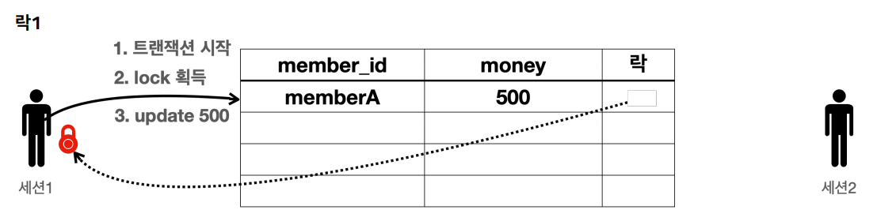
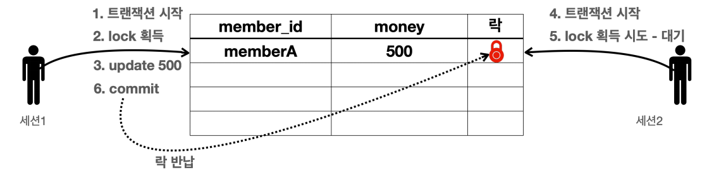
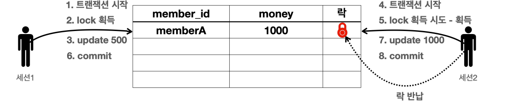

# DB 락 개념


- 세션1이 세션2보다 조금 더 빨리 요청했다고 하면 세션1이 해당 로우의 락을 먼저 획득하고 트랜잭션을 시작한다.
- 세션1은 락을 획득했으므로 해당 로우에 업데이트 쿼리를 수행한다.


- 세션2도 데이터를 변경하기 위해 트랜잭션을 시작하지만 해당 로우의 락을 먼저 획득해야 한다. 락이 없으므로 락이 올아올 때까지 대기한다.
  - 락 대기 시간은 설정할 수 있다. 락 대기 시간이 넘어가면 락 타임아웃 오류가 발생한다.


- 세션1에서 커밋을 수행하고 트랜잭션이 종료되었으므로 락도 반납한다.
- 락을 획득하기 위해 대기하던 세션2가 락을 획득한다.
- 세션2에서 업데이트 쿼리를 수행하고 커밋을 수행 후 트랜잭션이 종료되었으므로 락을 반납한다.

---

## DB 락 예제

### 변경

- **기본 데이터**
```sql
set autocommit true; //자동 커밋 모드
delete from member;
insert into member(member_id, money) values ('memberA',10000);
```

- **세션1 트랜잭션 시작**
```sql
set autocommit false; //수동 커밋 모드
update member set money=500 where member_id = 'memberA';
```
아직 **커밋**은 하지 않았다. `memberA`로우의 락은 세션1이 가지게 된다.

- **세션2 트랜잭션 시작, 락 획득 시도**
```sql
SET LOCK_TIMEOUT 60000;  //타임아웃 설정
set autocommit false;    //수동 커밋 모드
update member set money=1000 where member_id = 'memberA';
```

- 세션1에서 아직 **커밋**이나 **롤백**해서 트랜잭션을 종료하지 않았기 때문에 아직 세션1이 락을 가지고 있다. 세션2는 60초 동안 대기하고 이 안에 락을 얻지 못하면 예외가 발생한다.
- 세션1에서 `commit;`을 하면 락을 반납하고 세션2에서 락 획득 후 업데이트 쿼리를 수행한다.
- 아직 세션2에서도 `commit;`을 하지 않았다. 세션1에서는 500원, 세션2에서는 1000원인 상태이다. 세션2에서 `commit;`을 하면 세션1과 세션2에 1000원이 조회된다.

### 조회

- **기본 데이터**
```sql
set autocommit true; 
delete from member;
insert into member(member_id, money) values ('memberA',10000);
```

- **세션1**
```sql
set autocommit false;
select * from member where member_id='memberA' for update;
```
> `select for update` 구문으로 조회 시점에 선택한 로우의 락을 획득할 수 있다.

- **세션2**
```sql
set autocommit false;
update member set money=500 where member_id = 'memberA';
```
세션2에서 데이터 변경을 시도하지만 세션1이 락을 획득했기 때문에 세션2는 락을 획득할 때까지 기다린다. 이후에 세션1이 `commit;`을 수행하면 세션2가 락을
획득하고 데이터를 변경한다. 세션2에서도 `commit;`을 수행해 데이터를 반영해준다.

> 👆 **일반적인 조회는 락을 사용하지 않는다.**
> 
> DB마다 다르지만 보통 데이터 조회는 락을 획득하지 않고 바로 조회할 수 있다. 
> 예를 들어서 세션1에서 락을 획득하고 데이터를 변경하고 있어도 세션2에서 데이터 조회가 가능하다.

> 👆 **조회 시점에 락이 필요한 경우**
> - 트랜잭션 종료 시점까지 해당 데이터를 다른 곳에서 변경하지 못하도록 강제로 막아야 할 때 사용한다.
> - 예를 들어서 어떤 데이터를 조회한 다음 그 정보로 어떤 중요한 로직을 수행할 때 다른 곳에서 변경하면 안 될때 조회 시점에 락을 획득하면 된다.