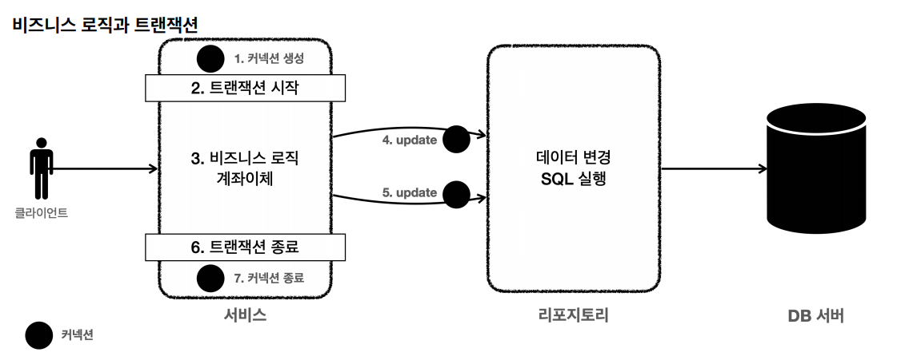

# 트랜잭션 적용

## 트랜잭션 없는 단순한 로직
```java
@RequiredArgsConstructor
public class MemberServiceV1 {

    private final MemberRepositoryV1 memberRepository;

    public void accountTransfer(String fromId, String toId, int money) throws SQLException {
        Member fromMember = memberRepository.findById(fromId);
        Member toMember = memberRepository.findById(toId);

        memberRepository.update(fromId, fromMember.getMoney() - money);
        validation(toMember);
        memberRepository.update(toId, toMember.getMoney() + money);
    }

    private void validation(Member toMember) {
        if (toMember.getMemberId().equals("ex")) {
            throw new IllegalStateException("이체중 예외 발생");
        }
    }
}
```

**테스트 코드**
```java
/**
 * 기본 동작, 트랜잭션이 없어서 문제 발생
 */
class MemberServiceV1Test {

    static final String MEMBER_A = "memberA";
    static final String MEMBER_B = "memberB";
    static final String MEMBER_EX = "ex";

    private MemberRepositoryV1 memberRepository;
    private MemberServiceV1 memberService;

    @BeforeEach
    void beforeEach() {
        DriverManagerDataSource dataSource = new DriverManagerDataSource(URL, USERNAME, PASSWORD);
        memberRepository = new MemberRepositoryV1(dataSource);
        memberService = new MemberServiceV1(memberRepository);
    }

    @AfterEach
    void afterEach() throws SQLException {
        memberRepository.delete(MEMBER_A);
        memberRepository.delete(MEMBER_B);
        memberRepository.delete(MEMBER_EX);
    }

    @Test
    @DisplayName("정상 이체")
    void accountTransfer() throws SQLException {
        //given
        Member memberA = new Member(MEMBER_A, 10000);
        Member memberB = new Member(MEMBER_B, 10000);
        memberRepository.save(memberA);
        memberRepository.save(memberB);

        //when
        memberService.accountTransfer(memberA.getMemberId(), memberB.getMemberId(), 2000);

        //then
        Member findMemberA = memberRepository.findById(memberA.getMemberId());
        Member findMemberB = memberRepository.findById(memberB.getMemberId());

        assertThat(findMemberA.getMoney()).isEqualTo(8000);
        assertThat(findMemberB.getMoney()).isEqualTo(12000);
    }

    @Test
    @DisplayName("이체 중 예외 발생")
    void accountTransferEx() throws SQLException {
        //given
        Member memberA = new Member(MEMBER_A, 10000);
        Member memberEx = new Member(MEMBER_EX, 10000);
        memberRepository.save(memberA);
        memberRepository.save(memberEx);

        //when
        assertThatThrownBy(() -> memberService.accountTransfer(memberA.getMemberId(), memberEx.getMemberId(), 2000))
                .isInstanceOf(IllegalStateException.class);

        //then
        Member findMemberA = memberRepository.findById(memberA.getMemberId());
        Member findMemberB = memberRepository.findById(memberEx.getMemberId());

        assertThat(findMemberA.getMoney()).isEqualTo(8000);
        assertThat(findMemberB.getMoney()).isEqualTo(10000);
    }
}
```

---

## 트랜잭션 활용

- 트랜잭션은 비즈니스 로직이 있는 서비스 계층에서 시작해야 한다. 비즈니스 로직이 잘못 되면 해당 비즈니스 로직으로 인해 문제가 되는 부분을 함께 **롤백**해야 하기 때문이다.
- 그런데 트랜잭션을 시작하려면 커넥션이 필요하다. 서비스 계층에서 커넥션을 만들고 트랜잭션 커밋 이후에 커넥션을 종료해야 한다.
- 애플리케이션에서 DB 트랜잭션을 사용하려면 **트랜잭션을 사용하는 동안 같은 커넥션을 유지해야 한다.** 그래야 같은 세션을 사용할 수 있다.



- 같은 커넥션을 유지하는 가장 단순한 방법은 커넥션을 파라미터로 전달해서 같은 커넥션이 사용되도록 유지하는 것이다.

**레포지토리**
```java
/**
 * JDBC - ConnectionParam
 */
@Slf4j
public class MemberRepositoryV2 {

    private final DataSource dataSource;

    public MemberRepositoryV2(DataSource dataSource) {
        this.dataSource = dataSource;
    }

    public Member save(Member member) throws SQLException {
        String sql = "insert into member(member_id, money) values(?, ?)";

        Connection con = null;
        PreparedStatement pstmt = null;

        try {
            con = getConnection();
            pstmt = con.prepareStatement(sql);
            pstmt.setString(1, member.getMemberId());
            pstmt.setInt(2, member.getMoney());
            pstmt.executeUpdate();
            return member;
        } catch (SQLException e) {
            log.error("db error", e);
            throw e;
        } finally {
            close(con, pstmt, null);
        }
    }

    public Member findById(String memberId) throws SQLException {
        String sql = "select * from member where member_Id = ?";

        Connection con = null;
        PreparedStatement pstmt = null;
        ResultSet rs = null;

        try {
            con = getConnection();
            pstmt = con.prepareStatement(sql);
            pstmt.setString(1, memberId);

            rs = pstmt.executeQuery();

            if (rs.next()) {
                Member member = new Member();
                member.setMemberId(rs.getString("member_id"));
                member.setMoney(rs.getInt("money"));
                return member;
            } else {
                throw new NoSuchElementException("member not found memberId=" + memberId);
            }
        } catch (SQLException e) {
            log.error("db error", e);
            throw e;
        } finally {
            close(con, pstmt, rs);
        }
    }

    public Member findById(Connection con, String memberId) throws SQLException {
        String sql = "select * from member where member_Id = ?";

        PreparedStatement pstmt = null;
        ResultSet rs = null;

        try {
            pstmt = con.prepareStatement(sql);
            pstmt.setString(1, memberId);

            rs = pstmt.executeQuery();

            if (rs.next()) {
                Member member = new Member();
                member.setMemberId(rs.getString("member_id"));
                member.setMoney(rs.getInt("money"));
                return member;
            } else {
                throw new NoSuchElementException("member not found memberId=" + memberId);
            }
        } catch (SQLException e) {
            log.error("db error", e);
            throw e;
        } finally {
            //connection은 여기서 닫지 않는다.
            JdbcUtils.closeResultSet(rs);
            JdbcUtils.closeStatement(pstmt);
        }
    }

    public void update(String memberId, int money) throws SQLException {
        String sql = "update member set money = ? where member_id = ?";

        Connection con = null;
        PreparedStatement pstmt = null;
        ResultSet rs = null;

        try {
            con = getConnection();
            pstmt = con.prepareStatement(sql);
            pstmt.setInt(1,money);
            pstmt.setString(2, memberId);

            int resultSize = pstmt.executeUpdate();
            log.info("resultSize={}", resultSize);

        } catch (SQLException e) {
            log.error("db error", e);
            throw e;
        } finally {
            close(con, pstmt, rs);
        }
    }

    public void update(Connection con, String memberId, int money) throws SQLException {
        String sql = "update member set money = ? where member_id = ?";

        PreparedStatement pstmt = null;

        try {
            pstmt = con.prepareStatement(sql);
            pstmt.setInt(1,money);
            pstmt.setString(2, memberId);

            int resultSize = pstmt.executeUpdate();
            log.info("resultSize={}", resultSize);

        } catch (SQLException e) {
            log.error("db error", e);
            throw e;
        } finally {
            JdbcUtils.closeStatement(pstmt);
        }
    }

    public void delete(String memberId) throws SQLException {
        String sql = "delete from member where member_id = ?";

        Connection con = null;
        PreparedStatement pstmt = null;

        try {
            con = getConnection();
            pstmt = con.prepareStatement(sql);
            pstmt.setString(1, memberId);

            pstmt.executeUpdate();
        } catch (SQLException e) {
            log.error("db error", e);
            throw e;
        } finally {
            close(con, pstmt, null);
        }
    }

    private void close(Connection con, Statement stmt, ResultSet rs) {
        JdbcUtils.closeResultSet(rs);
        JdbcUtils.closeStatement(stmt);
        JdbcUtils.closeConnection(con);
    }

    private Connection getConnection() throws SQLException {
        Connection con = dataSource.getConnection();
        log.info("get connection={}, class={}", con, con.getClass());
        return con;
    }
}
```
- 커넥션 유지가 필요한 두 메서드가 추가되었다. 계좌이체 서비스 로직에서 호출하는 메서드이다.
  - `findById(Connection con, String memberId)`
  - `update(Connection con, String memberId, int money)`
- 커넥션 유지가 필요한 두 메서드는 파라미터로 넘어온 커넥션을 사용해야 하기에 `getConnection()`코드가 있으면 안 된다.
- 그리고 레포지토리에서 커넥션을 닫으면 안 된다. 커넥션을 전달 받은 레포지토리 뿐만 아니라 이후에도 커넥션을 계속 이어서 사용하기 때문에 이후 서비스 로직이 
끝날 때 트랜잭션을 종료하고 닫아야 한다.

**서비스 로직**
```java
/**
 * 트랜잭션 - 파라미터를 연동, 풀을 고려한 종료
 */
@Slf4j
@RequiredArgsConstructor
public class MemberServiceV2 {

    private final DataSource dataSource;
    private final MemberRepositoryV2 memberRepository;

    public void accountTransfer(String fromId, String toId, int money) throws SQLException {
        //서비스 계층에서 커넥션 획득
        Connection con = dataSource.getConnection();
        
        try {
            // 수동 커밋 모드 변경 = 트랜잭션 시작
            con.setAutoCommit(false);
            // 비즈니스 로직 시작 (커넥션 전달)
            bisLogic(con, fromId, toId, money); 
            // 성공 시 커밋
            con.commit();
        } 
        catch (Exception e) {
            con.rollback(); // 실패 시 롤백
            throw new IllegalStateException(e);
        } finally {
            release(con);
        }
    }

    private void bisLogic(Connection con, String fromId, String toId, int money) throws SQLException {
        Member fromMember = memberRepository.findById(con, fromId);
        Member toMember = memberRepository.findById(con, toId);

        memberRepository.update(con, fromId, fromMember.getMoney() - money);
        validation(toMember);
        memberRepository.update(con, toId, toMember.getMoney() + money);
    }

    private void validation(Member toMember) {
        if (toMember.getMemberId().equals("ex")) {
            throw new IllegalStateException("이체중 예외 발생");
        }
    }

    private void release(Connection con) {
        if (con != null) {
            try {
                con.setAutoCommit(true); // 커넥션 풀 고려, 풀에 반납하기 전에 기본 값인 자동 커밋 모드로 변경해주는 것이 안전하다.
                con.close();
            } catch (Exception e) {
                log.info("error", e);
            }
        }
    }
}
```

**테스트 코드**
```java
/**
 * 트랜잭션 - 커넥션 파라미터 전달 방식 동기화
 */
@Slf4j
class MemberServiceV2Test {

    public static final String MEMBER_A = "memberA";
    public static final String MEMBER_B = "memberB";
    public static final String MEMBER_EX = "ex";

    private MemberRepositoryV2 memberRepository;
    private MemberServiceV2 memberService;

    @BeforeEach
    void beforeEach() {
        DriverManagerDataSource dataSource = new DriverManagerDataSource(URL, USERNAME, PASSWORD);
        memberRepository = new MemberRepositoryV2(dataSource);
        memberService = new MemberServiceV2(dataSource , memberRepository);
    }

    @AfterEach
    void afterEach() throws SQLException {
        memberRepository.delete(MEMBER_A);
        memberRepository.delete(MEMBER_B);
        memberRepository.delete(MEMBER_EX);
    }

    @Test
    @DisplayName("정상 이체")
    void accountTransfer() throws SQLException {
        //given
        Member memberA = new Member(MEMBER_A, 10000);
        Member memberB = new Member(MEMBER_B, 10000);
        memberRepository.save(memberA);
        memberRepository.save(memberB);

        //when
        log.info("START TX");
        memberService.accountTransfer(memberA.getMemberId(), memberB.getMemberId(), 2000);
        log.info("END TX");

        //then
        Member findMemberA = memberRepository.findById(memberA.getMemberId());
        Member findMemberB = memberRepository.findById(memberB.getMemberId());

        assertThat(findMemberA.getMoney()).isEqualTo(8000);
        assertThat(findMemberB.getMoney()).isEqualTo(12000);
    }

    @Test
    @DisplayName("이체 중 예외 발생")
    void accountTransferEx() throws SQLException {
        //given
        Member memberA = new Member(MEMBER_A, 10000);
        Member memberEx = new Member(MEMBER_EX, 10000);
        memberRepository.save(memberA);
        memberRepository.save(memberEx);

        //when
        assertThatThrownBy(() -> memberService.accountTransfer(memberA.getMemberId(), memberEx.getMemberId(), 2000))
                .isInstanceOf(IllegalStateException.class);

        //then
        Member findMemberA = memberRepository.findById(memberA.getMemberId());
        Member findMemberB = memberRepository.findById(memberEx.getMemberId());

        assertThat(findMemberA.getMoney()).isEqualTo(10000);
        assertThat(findMemberB.getMoney()).isEqualTo(10000);
    }
}
```
