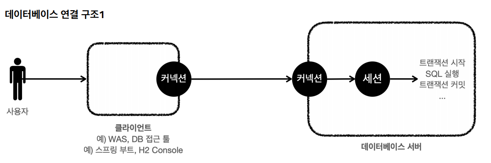
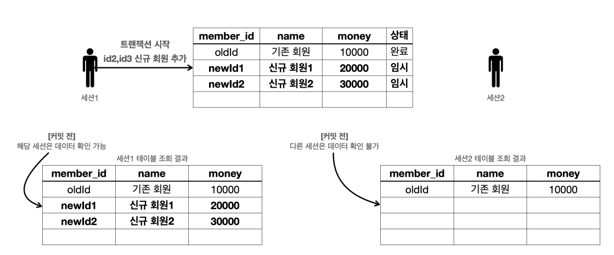
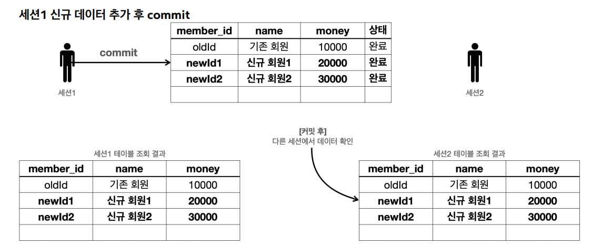
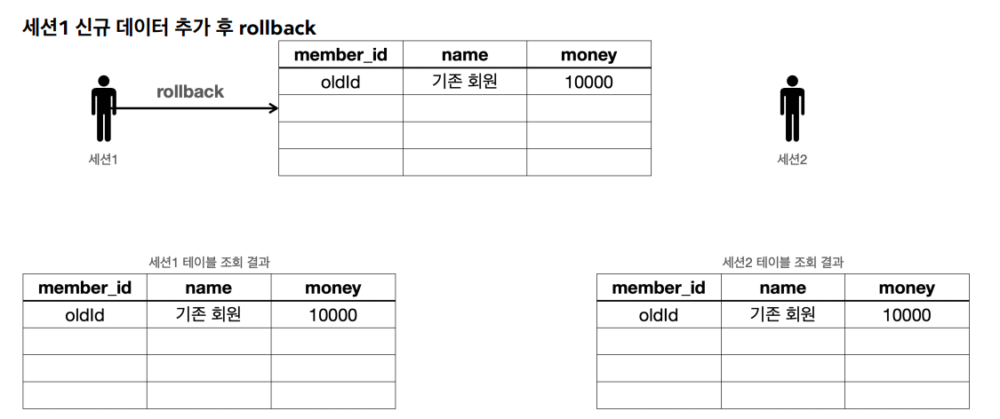
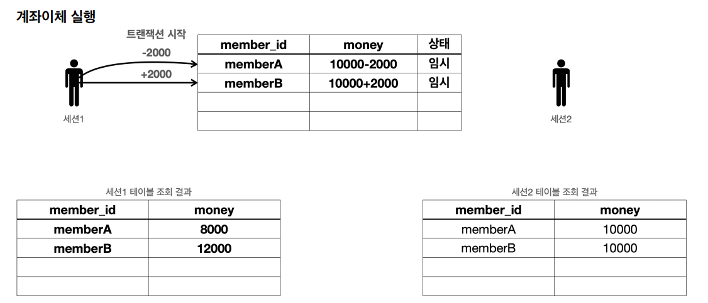
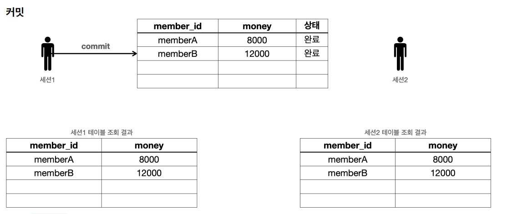
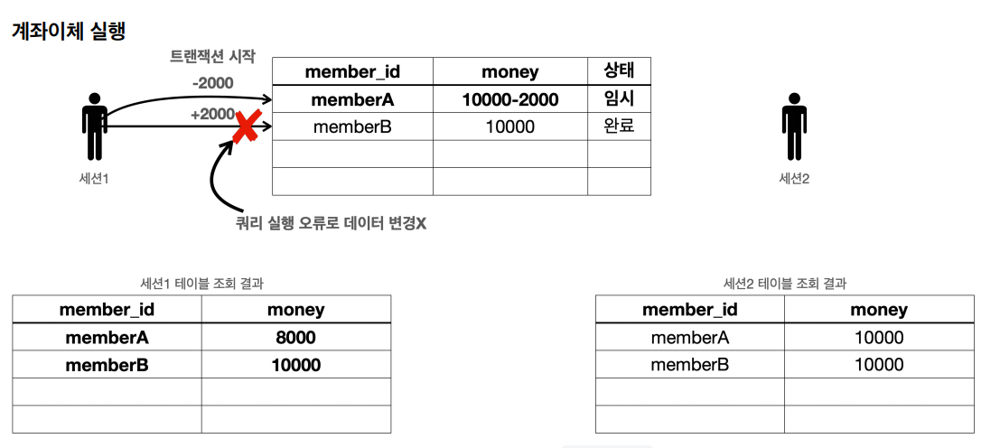
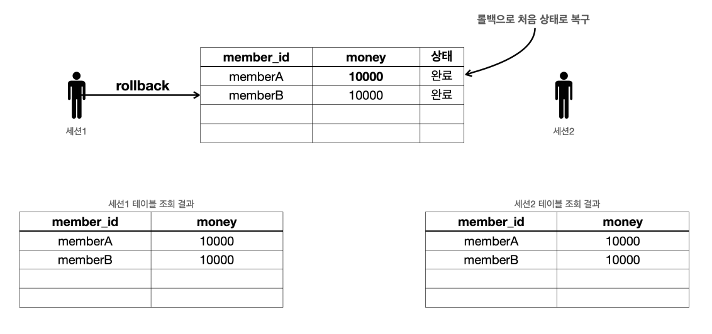

# 트랜잭션 DB 예제

## 데이터베이스 연결 구조와 DB 세션



- 사용자는 WAS나 DB 접근 툴 같은 클라이언트를 사용해서 DB 서버에 접근할 수 있다. 클라이언트는 DB 서버에 연결을 요청하고 커넥션을 맺게 되는데 이때 
DB 서버는 내부에 `세션`이라는 것을 만든다. 그리고 앞으로 해당 커넥션을 통한 모든 요청은 이 `세션`을 통해서 실행하게 된다.
- 개발자가 클라이언트를 통해 SQL을 전달하면 현재 커넥션에 연결된 세션이 SQL을 실행한다.
- 세션은 `트랜잭션`을 시작하고 `커밋` 또는 `롤백`을 통해 트랜잭션을 종료한다. 그리고 이후에 새로운 트랜잭션을 다시 시작할 수 있다.
- 사용자가 커넥션을 닫거나 또는 DBA(DB 관리자)가 세션을 강제로 종료하면 세션은 종료된다.
- 커넥션 풀이 10개의 커넥션을 생성하면 세션도 10개가 만들어진다.

<br>

## 트랜잭션 개념 이해

- 트랜잭션 사용법
  - 데이터 변경 쿼리를 실행하고 DB에 그 결과를 반영하려면 `commit`을, 결과를 반영하고 싶지 않으면 `rollback`을 호출하면 된다.
  - **`commit`을 호출하기 전까지는 임시로 데이터를 저장하는 것이다.** 따라서 해당 트랜잭션을 시작한 세션(사용자)에게만 변경 데이터가 보이고 다른 세션(사용자)
        에게는 변경 데이터가 보이지 않는다.
  - 등록, 수정, 삭제 같은 **데이터의 변경**이 일어날 때 모두 같은 원리로 동작한다.



- 세션1이 `트랜잭션`을 시작하고 새로운 데이터를 DB에 추가하고 아직 `커밋`은 하지 않았다.
- 새로운 데이터는 **임시 상태**로 저장 된다.
- 세션1은 `select`쿼리를 실행해서 본인이 입력한 새로운 데이터를 조회할 수 있다.
- 세션2는 `select`쿼리를 실행해도 조회할 수 없다. 왜냐하면 세션1이 아직 `커밋`을 하지 않았다.
    
만약 `커밋`하지 않은 데이터를 볼 수 있다면 세션2에서는 새로운 데이터가 DB에 있다고 가정하고 어떤 로직을 수행할 수 있다. 그런데 세션1이 `롤백`을 수행하면
새로운 데이터는 사라지게 된다. 데이터 정합성에 큰 문제가 발생한다.



- 세션1이 `commit`을 호출해 실제 DB에 반영이 됐다. 데이터의 상태도 임시에서 완료로 변경되었다.
- 이제 다른 세션에서도 새로운 데이터를 조회할 수 있다.



- 세션1에서 새로운 데이터를 추가한 후에 `rollback`을 실행했다.
- 수정하거나 삭제한 데이터도 `rollback`을 호출하면 모두 트랜잭션을 시작하기 직전의 상태로 복구된다.

<br>

## 트랜잭션 실습
```sql
drop table member if exists cascade;
create table member (
    member_id varchar(10),
    money integer not null default 0,
    primary key (member_id)
);
```
트랜잭션을 사용하려면 `자동 커밋`과 `수동 커밋`을 이해해야 한다.
- 자동 커밋 : 각가의 쿼리 실행 직후에 자동으로 커밋을 호출한다.(default)
```sql
set autocommit true; //자동 커밋 모드 설정
insert into member(member_id, money) values ('data1',10000); //자동 커밋 
insert into member(member_id, money) values ('data2',10000); //자동 커밋
```
- 수동 커밋 : `commit`과 `rollback`을 직접 호출해서 쿼리를 실행한다.
```sql
set autocommit false; //수동 커밋 모드 설정
insert into member(member_id, money) values ('data3',10000); 
insert into member(member_id, money) values ('data4',10000); 
commit; //수동 커밋
```

이제 H2 DB 웹 콘솔 창을 2개 열어서 비교해본다.

- 기본 데이터
```sql
set autocommit true; 
delete from member;
insert into member(member_id, money) values ('oldId',10000);
```

세션1, 세션2 모두 조회 가능하다.

- 세션1 신규 데이터 추가
```sql
//트랜잭션 시작
set autocommit false; //수동 커밋 모드
insert into member(member_id, money) values ('newId1',10000); 
insert into member(member_id, money) values ('newId2',10000);
```
아직 세션1이 `커밋`을 하지 않은 상태이기 때문에 세션1에서는 데이터가 보이지만 세션2에서는 볼 수 없다.

세션1에서 `commit;` 을 호출하면 세션2에서도 데이터를 조회할 수 있다.

- 이제 `롤백`을 해보기 위해 데이터 초기화
```sql
set autocommit true; 
delete from member;
insert into member(member_id, money) values ('oldId',10000);
```
`커밋` 과정이랑 똑같이 하고 `commit;` 대신 `rollback;`을 하면 세션1, 세션2 모두 새로운 데이터를 조회해도 나오지 않는다.

## 트랜잭션 예제 계좌이체
- 기본 데이터
```sql
set autocommit true; 
delete from member;
insert into member(member_id, money) values ('memberA',10000); 
insert into member(member_id, money) values ('memberB',10000);
```
- 세션1 계좌이체 실행
```sql
set autocommit false;
update member set money=10000 - 2000 where member_id = 'memberA'; 
update member set money=10000 + 2000 where member_id = 'memberB';
```


세션1에서 `commit;`을 실행하면 세션2에서도 정상적으로 결과가 반영이 된 걸 볼 수 있다.



### 계좌이체 문제 상황
- 기본 데이터
```sql
set autocommit true;
delete from member;
insert into member(member_id, money) values ('memberA',10000);
insert into member(member_id, money) values ('memberB',10000);
```

- 계좌이체 오류 SQL
```sql
set autocommit false;
update member set money=10000 - 2000 where member_id = 'memberA'; //성공
update member set money=10000 + 2000 where member_iddd = 'memberB'; //쿼리 예외 발생
```


계좌이체를 실행 하는 도중 필드 오타로 오류가 발생한다. 그래서 돈을 보내는 것만 성공하고 받는 것은 실패했다.

여기서 `commit;`을 실행하면 계좌이체에 실패한 체로 데이터가 반영되게 된다.

하지만 `rollback;`을 실행하면 트랜잭션을 시작하기 전 단계로 데이터를 복구가 되기 때문에 계좌이체를 실행하기 전 상태로 돌아오게 된다.

