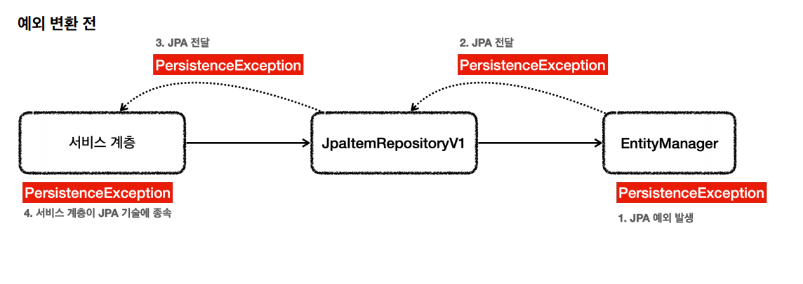
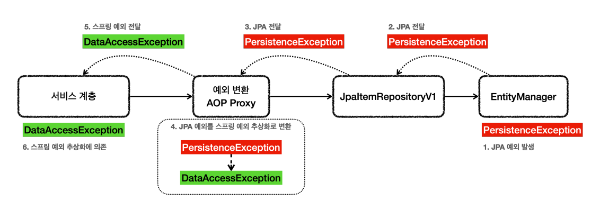

# JPA

- `build.gradle`
```properties
implementation 'org.springframework.boot:spring-boot-starter-data-jpa'
```
- `application.properties`
```properties
logging.level.org.hibernate.SQL=DEBUG
logging.level.org.hibernate.orm.jdbc.bind=TRACE
```
- `org.hibernate.SQL` : 하이버네이트가 생성하고 실행하는 SQL을 확인할 수 있다. `logger`를 통해 출력 된다.
- `org.hibernate.orm.jdbc.bind` : SQL에 바인딩 되는 파라미터를 확인할 수 있다.
- `spring.jpa.show-sql=true` : `org.hibernate.SQL`와 같이 SQL이 출력되는데 `System.out`으로 출력 된다. 그래서 로그로 나오는 위 설정을 쓰는 것이 좋다.

<br>

- 객체 매핑
```java
@Data
@Entity
@NoArgsConstructor(access = PROTECTED)
public class Item {

    @Id @GeneratedValue(strategy = IDENTITY)
    private Long id;

    @Column(name = "item_name", length = 10)
    private String itemName;
    private Integer price;
    private Integer quantity;

    public Item(String itemName, Integer price, Integer quantity) {
        this.itemName = itemName;
        this.price = price;
        this.quantity = quantity;
    }
}
```

- Repository
```java
@Slf4j
@Repository
@Transactional
public class JpaItemRepository implements ItemRepository {

    private final EntityManager em;

    public JpaItemRepository(EntityManager em) {
        this.em = em;
    }

    @Override
    public Item save(Item item) {
        em.persist(item);
        return item;
    }

    @Override
    public void update(Long itemId, ItemUpdateDto updateParam) {
        Item findItem = em.find(Item.class, itemId);
        findItem.setItemName(updateParam.getItemName());
        findItem.setPrice(updateParam.getPrice());
        findItem.setQuantity(updateParam.getQuantity());
    }

    @Override
    public Optional<Item> findById(Long id) {
        return Optional.ofNullable(em.find(Item.class, id));
    }

    @Override
    public List<Item> findAll(ItemSearchCond cond) {
        String jpql = "select i from Item i";

        Integer maxPrice = cond.getMaxPrice();
        String itemName = cond.getItemName();
        if (StringUtils.hasText(itemName) || maxPrice != null) {
            jpql += " where";
        }

        boolean andFlag = false;
        if (StringUtils.hasText(itemName)) {
            jpql += " i.itemName like concat('%',:itemName,'%')";
            andFlag = true;
        }
        if (maxPrice != null) {
            if (andFlag) {
                jpql += " and";
            }
            jpql += " i.price <= :maxPrice";
        }
        log.info("jpql={}", jpql);
        TypedQuery<Item> query = em.createQuery(jpql, Item.class);
        if (StringUtils.hasText(itemName)) {
            query.setParameter("itemName", itemName);
        }
        if (maxPrice != null) {
            query.setParameter("maxPrice", maxPrice);
        }
        return query.getResultList();
    }
}
```

- Config
```java
@Configuration
public class JpaConfig {

    private final EntityManager em;

    public JpaConfig(EntityManager em) {
        this.em = em;
    }

    @Bean
    public ItemService itemService() {
        return new ItemServiceV1(itemRepository());
    }

    @Bean
    public ItemRepository itemRepository() {
        return new JpaItemRepository(em);
    }
}

@Slf4j
@Import(JpaConfig.class)
@SpringBootApplication(scanBasePackages = "hello.itemservice.web")
public class ItemServiceApplication {

    public static void main(String[] args) {
        SpringApplication.run(ItemServiceApplication.class, args);
    }
}
```

`EntityManager`는 순수한 `JPA기술`이고 스프링과는 관계가 없다. 그래서 `EntityManager`는 예외가 발생하면 JPA 관련 예외를 발생시킨다.

JPA는 `PersistenceException`과 그 하위 예외, 추가로 `IllegalArgumentException`, `IllegalStateException`을 발생시킬 수 있다.

JPA 예외를 스프링 예외 추상화(`DataAccessException`)으로 변환하려면 `@Repository`가 필요하다.



**`@Repository`의 기능**
- 컴포넌트 스캔의 대상이 된다.
- 예외 변환 AOP의 적용 대상이 된다.
  - 스프링과 JPA를 함께 사용하는 경우 스프링은 JPA 예외 변환기(`PersistenceExceptionTranslator`)를 등록한다.
  - 예외 변환 AOP Proxy는 JPA 관련 예외가 발생하면 JPA 예외 변환기를 통해 발생한 예외를 스프링 데이터 접근 예외로 변환한다.


