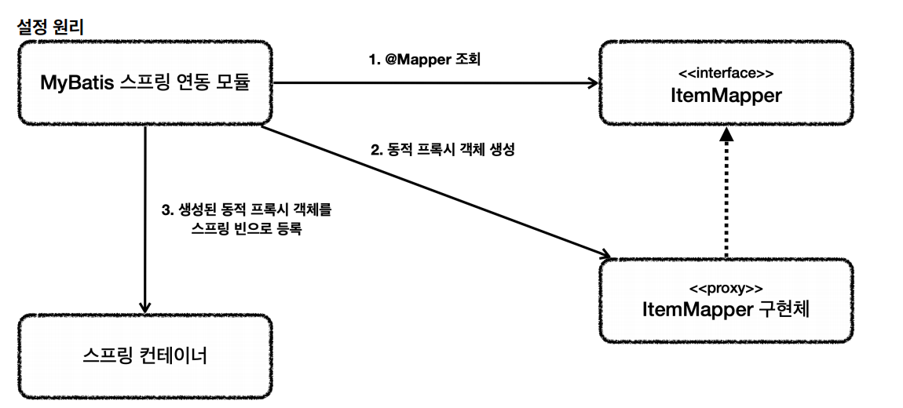

# MyBatis
> `JdbcTemplate`보다 더 많은 기능을 제공하는 SQL Mapper이다. SQL을 XML에 작성하여 동적 쿼리를 편리하게 작성할 수 있다.

- 설정 `build.gradle`
```properties
implementation 'org.mybatis.spring.boot:mybatis-spring-boot-starter:3.0.3'
```
`MyBatis`는 스프링 부트가 버전을 관리해주는 공식 라이브러리가 아니기 때문에 뒤에 버전 정보가 있어야 한다.

- 설정 `application.properties`(테스트 포함)
```properties
mybatis.type-aliases-package=hello.itemservice.domain
mybatis.configuration.map-underscore-to-camel-case=true
logging.level.hello.itemservice.repository.mybatis=trace
```
- `mybatis.type-aliases-package` : `MyBatis`에서 타입 정보를 사용할 때는 패키지 이름을 적어주어야 하는데 여기에 명시하면 패키지 이름을 생략할 수 있다.
  - 지정한 패키지와 그 하위 패키지 자동 인식. `,`,`;`로 구분하여 여러 위치를 지정할 수 있다.
- `mybatis.configuration.map-underscore-to-camel-case` : 언더바를 카멜로 자동 변경해주는 기능을 활성화한다.
- `logging.level.hello.itemservice.repository.mybatis=trace` : `MyBaits`에서 실행하는 쿼리 로그 확인

<br>

- ItemMapper 인터페이스
```java
@Mapper
public interface ItemMapper {

    void save(Item item);

    void update(@Param("id") Long id, @Param("updateParam") ItemUpdateDto updateParam);

    Optional<Item> findById(Long id);

    List<Item> findAll(ItemSearchCond itemSearch);
}
```
- MyBatis 매핑 XML을 호출해주는 매핑 인터페이스이다. `@Mapper`어노테이션을 붙어주어야 MyBatis에서 인식할 수 있다.
- 메서드를 호출하면 `XML`의 해당 SQL을 실행하고 결과를 돌려준다.

<br>

- XML파일(`src/main/resources` 하위에 패키지 위치를 맞춰야 한다.)
```xml
<?xml version="1.0" encoding="UTF-8"?>
<!DOCTYPE mapper PUBLIC "-//mybatis.org//DTD Mapper 3.0//EN"
        "http://mybatis.org/dtd/mybatis-3-mapper.dtd">
<mapper namespace="hello.itemservice.repository.mybatis.ItemMapper">

    <insert id="save" useGeneratedKeys="true" keyProperty="id">
        insert into item(item_name, price, quantity)
        values (#{itemName}, #{price}, #{quantity})
    </insert>

    <update id="update">
        update item
        set item_name=#{updateParam.itemName},
            price=#{updateParam.price},
            quantity=#{updateParam.quantity}
        where id = #{id}
    </update>

    <select id="findById" resultType="Item">
        select id, item_name, price, quantity
        from item
        where id = #{id}
    </select>

    <select id="findAll" resultType="Item">
        select id, item_name, price, quantity
        from item
        <where>
            <if test="itemName != null and itemName != ''">
                and item_name like concat('%', #{itemName}, '%')
            </if>
            <if test="maxPrice != null">
                and price &lt;= #{maxPrice}
            </if>
        </where>
    </select>
</mapper>
```
`namespace`에 앞서 만든 매퍼 인터페이스(`ItemMapper`)를 지정한다.

- Config
```java
@Configuration
@RequiredArgsConstructor
public class MyBatisConfig {

    private final ItemMapper itemMapper;

    @Bean
    public ItemService itemService() {
        return new ItemServiceV1(itemRepository());
    }

    @Bean
    public ItemRepository itemRepository() {
        return new MybatisItemRepository(itemMapper);
    }
}

@Slf4j
@Import(MyBatisConfig.class)
@SpringBootApplication(scanBasePackages = "hello.itemservice.web")
public class ItemServiceApplication {

    public static void main(String[] args) {
        SpringApplication.run(ItemServiceApplication.class, args);
    }
}
```

**ItemMapper 인터페이스의 구현체가 없는데 어떻게 되는 걸까?**



1. 애플리케이션 로딩 시점에 `MyBatis` 스프링 연돌 모듈은 `@Mapper`가 붙어있는 인터페이스를 조사한다.
2. 헤딩 인터페이스가 발견되면 동적 프록시 기술을 사용해서 `ItemMapper` 인터페이스의 구현체를 만든다.
3. 생성된 구현체를 스프링 빈으로 등록한다.

로그 : `itemMapper class=class jdk.proxy3.$Proxy111`

매퍼 구현체를 사용하면 스프링 예외 추상화도 함께 적용해 주기 때문에 `DataAccessException`에 맞게 예외 변환까지 처리해준다.

`MyBatis` 스프링 연동 모듈이 DB 커넥션, 트랜잭션과 관련된 기능도 MyBatis와 함께 연동하고 동기화까지 자동으로 설정해준다.

[MyBatis 동적 쿼리](https://mybatis.org/mybatis-3/ko/dynamic-sql.html)