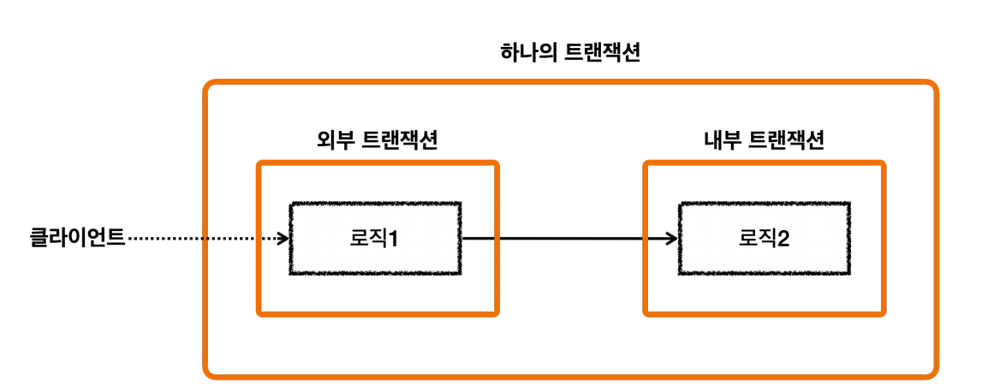
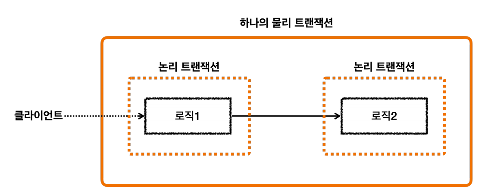
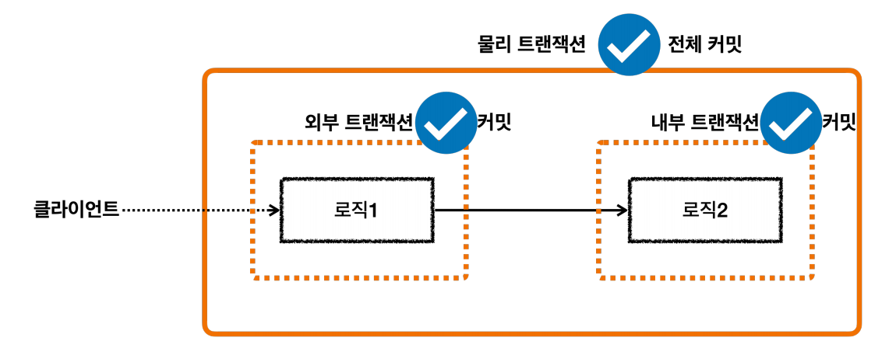
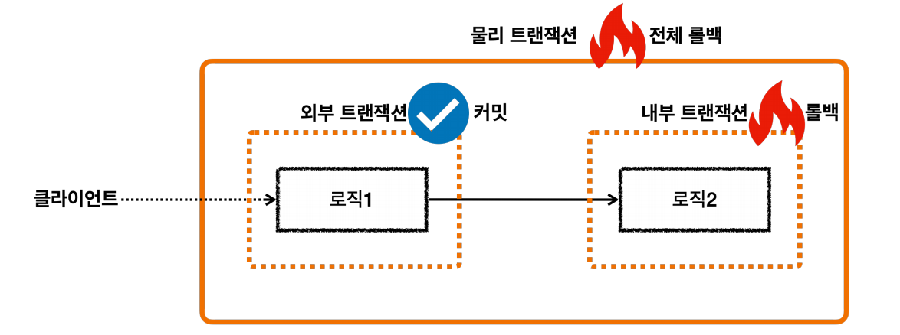
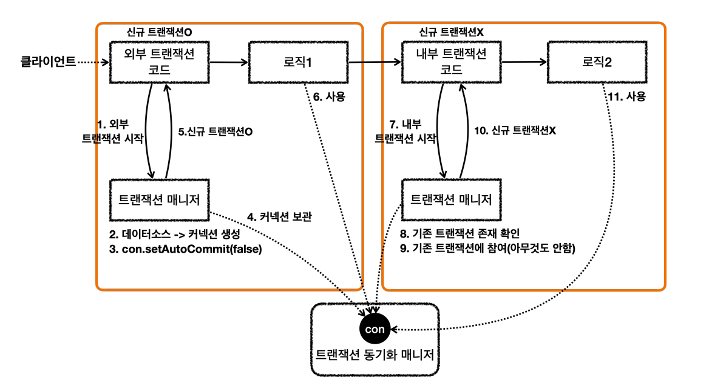
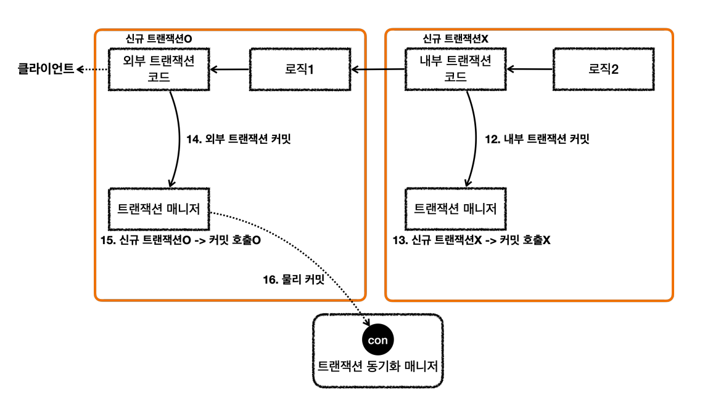

# 스프링 트랜잭션 전파
> 트랜잭션이 이미 진행 중인데 여기에 추가로 트랜잭션을 수행하면 어떻게 될까?

## 전파 기본


- 외부 트랜잭션이 수행 중이고 아직 끝나지 않았는데 내부 트랜잭션이 수행된다.
- 외부 트랜잭션은 처음 시작된 트랜잭션이라고 생각하면 된다.


- 스프링에서 이 경우 외부 트랜잭션과 내부 트랜잭션을 묶어서 **하나의 트랜잭션**을 만들어준다. 내부 트랜잭션이 외부 트랜잭션에 참여하는 것이다. 이것이 기본 동작이다.


- 스프링은 `논리 트랜잭션`과 `물리 트랜잭션`이라는 개념을 나눈다.
- `논리 트랜잭션`들은 하나의 `물리 트랜잭션`으로 묶인다.
- `물리 트랜잭션`은 실제 DB에 적용되는 트랜잭션을 뜻한다. 실제 커넥션을 통해서 트랜잭션을 시작(`setAutoCommit(false))`하고, `커밋`,`롤백`하는 단위이다.
- `논리 트랜잭션`은 트랜잭션 매니저를 통해 트랜잭션을 사용하는 단위이다.
- 이러한 `논리 트랜잭션` 개념은 트랜잭션이 진행되는 중에 내부에 추가로 트랜잭션을 사용하는 경우에만 적용된다. 단순히 트랜잭션이 하나인 경우 둘을 구분하지 않는다.

**논리 트랜잭션과 물리 트랜잭션을 나누었을 때 만들어지는 원칙**
1. **모든 `논리 트랜잭션`이 `커밋`되어야 `물리 트랜잭션`이 `커밋`된다.**
2. **하나의 `논리 트랜잭션`이라도 `롤백`되면 `물리 트랜잭션`은 `롤백`된다.**

풀어서 설명하면 **모든 트랜잭션 매니저를 `커밋`해야 `물리 트랜잭션`이 `커밋`되고, 하나의 트랜잭션 매니저라도 `롤백`하면 `물리 트랜잭션`은 `롤백`된다.**


- 모든 `논리 트랜잭션`이 `커밋` 되었으므로 `물리 트랜잭션`도 `커밋`된다.


- 외부 `논리 트랜잭션`이 `롤백` 되었으므로 `물리 트랜잭션`은 `롤백`된다.


- 내부 `논리 트랜잭션`이 `롤백` 되었으므로 `물리 트랜잭션`은 `롤백`된다.

<br>

## 전파 예제
> `외부 트랜잭션`과 `내부 트랜잭션`이 모두 커밋되었을 때
```java
@Test
void inner_commit() {
    log.info("외부 트랜잭션 시작");
    TransactionStatus outer = txManager.getTransaction(new DefaultTransactionDefinition());
    log.info("outer.isNewTransaction()={}", outer.isNewTransaction());

    log.info("내부 트랜잭션 시작");
    TransactionStatus inner = txManager.getTransaction(new DefaultTransactionDefinition());
    log.info("inner.isNewTransaction()={}", inner.isNewTransaction());
    log.info("내부 트랜잭션 커밋");
    txManager.commit(inner);

    log.info("외부 트랜잭션 커밋");
    txManager.commit(outer);
}
// 실행 로그
hello.springtx.propagation.BasicTxTest   : 외부 트랜잭션 시작
DataSourceTransactionManager     : Creating new transaction with name [null]: PROPAGATION_REQUIRED,ISOLATION_DEFAULT
DataSourceTransactionManager     : Acquired Connection [HikariProxyConnection@116893278 wrapping conn0: url=jdbc:h2:mem:1fed5fe3-0709-4c2c-85ed-4dcc9933f771 user=SA] for JDBC transaction
DataSourceTransactionManager     : Switching JDBC Connection [HikariProxyConnection@116893278 wrapping conn0: url=jdbc:h2:mem:1fed5fe3-0709-4c2c-85ed-4dcc9933f771 user=SA] to manual commit
hello.springtx.propagation.BasicTxTest   : outer.isNewTransaction()=true
hello.springtx.propagation.BasicTxTest   : 내부 트랜잭션 시작
DataSourceTransactionManager     : Participating in existing transaction
hello.springtx.propagation.BasicTxTest   : inner.isNewTransaction()=false
hello.springtx.propagation.BasicTxTest   : 내부 트랜잭션 커밋
hello.springtx.propagation.BasicTxTest   : 외부 트랜잭션 커밋
DataSourceTransactionManager     : Initiating transaction commit
DataSourceTransactionManager     : Committing JDBC transaction on Connection [HikariProxyConnection@116893278 wrapping conn0: url=jdbc:h2:mem:1fed5fe3-0709-4c2c-85ed-4dcc9933f771 user=SA]
DataSourceTransactionManager     : Releasing JDBC Connection [HikariProxyConnection@116893278 wrapping conn0: url=jdbc:h2:mem:1fed5fe3-0709-4c2c-85ed-4dcc9933f771 user=SA] after transaction
```
- `외부 트랜잭션(outer)`이 수행 중인데, `내부 트랜잭션(inner)`을 추가로 수행했다.
- `외부 트랜잭션`은 처음 수행된 트랜잭션이기 때문에 `isNewTransaction()=true`가 된다.
- `내부 트랜잭션`을 시작하는 시점에는 이미 `외부 트랜잭션`이 진행 중인 상태이다. 이 경우 `내부 트랜잭션`은 `외부 트랜잭션`에 **참여**한다.
  - 참여한다는 뜻은 **`내부 트랜잭션`이 `외부 트랜잭션`을 그대로 이어 받아서 따른다는 뜻이다.**
  - `외부 트랜잭션`의 범위가 `내부 트랜잭션`까지 넓어졌다.
  - **`외부 트랜잭션`과 `내부 트랜잭션`이 하나의 `물리 트랜잭션`으로 묶이는 것이다.**
- `내부 트랜잭션`은 이미 진행 중인 `외부 트랜잭션`에 참여한 것이기 때문에 신규 트랜잭션이 아니다.(`isNewTransaction()=false`)


- 로그를 잘 보면 `내부 트랜잭션 시작` 밑에 `Participating in existing transaction`를 확인할 수 있는데 `내부 트랜잭션`이 기존에 존재하는 `외부 트랜잭션`에 참여한 것이다.
- `외부 트랜잭션`을 시작하거나 커밋할 때는 DB 커넥션을 통한 `물리 트랜잭션`을 시작(`manual commit`)하고, DB 커넥션을 통해 `커밋`하는 것을 확인할 수 있다.
- `내부 트랜잭션`을 시작하거나 커밋할 때는 DB 커넥션을 통해 커밋하는 로그를 전혀 확인할 수 없다.
- **`외부 트랜잭션`만 `물리 트랜잭션`을 시작하고 커밋한 것이다.**
- 만약 `내부 트랜잭션`이 실제 `물리 트랜잭션`을 `커밋`하면 트랜잭션이 끝나버리기 때문에 트랜잭션을 처음 시작한 `외부 트랜잭션`까지 이어갈 수 없다. 그래서 `내부 트랜잭션`은
    DB 커넥션을 통한 `물리 트랜잭션`을 `커밋`하면 안 된다.

**스프링은 이렇게 여러 트랜잭션이 함께 사용되는 경우 처음 트랜잭션을 시작한 `외부 트랜잭션`이 실제 `물리 트랜잭션`을 관리하도록 한다.**

요청 흐름



응답 흐름



**핵심**
- 트랜잭션 매니저에 `커밋`을 호출한다고 해서 항상 실제 커넥션에 물리 커밋이 발생하지는 않는다.
- `신규 트랜잭션`인 경우에만 실제 커넥션을 사용해서 물리 커밋과 롤백을 수행하고 `신규 트랜잭션`이 아니면 실제 물리 커넥션을 사용하지 않는다.