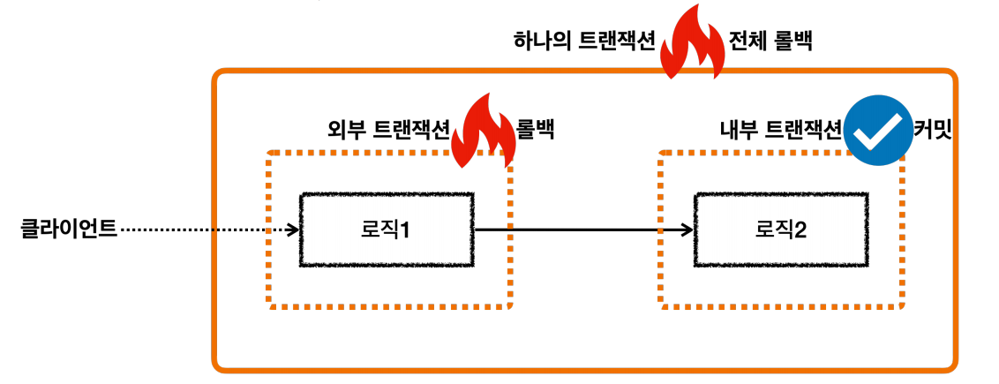
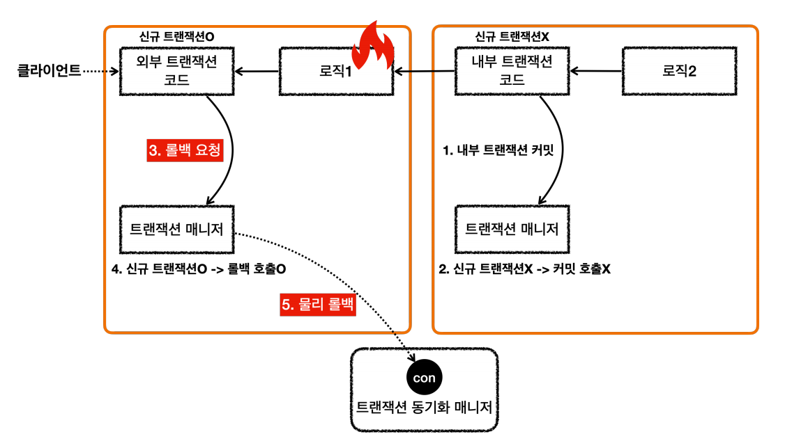
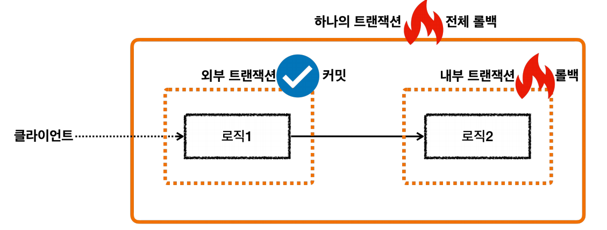
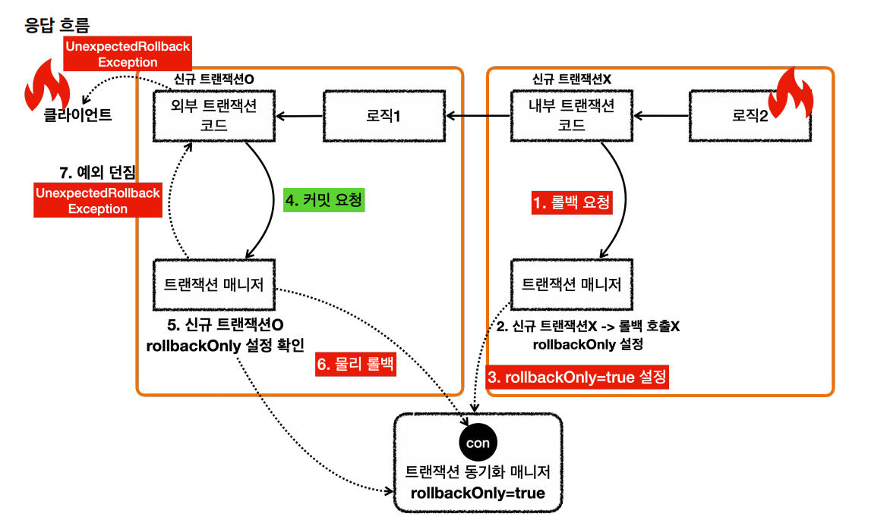

# 스프링 트랜잭션 전파

## 외부 롤백
> `내부 트랜잭션`은 커밋되는데 `외부 트랜잭션`이 롤백되는 경우



- `논리 트랜잭션`이 하나라도 롤백되면 전체 `물리 트랜잭션`은 롤백되어야 한다. 

```java
@Test
void outer_rollback() {
    log.info("외부 트랜잭션 시작");
    TransactionStatus outer = txManager.getTransaction(new DefaultTransactionDefinition());

    log.info("내부 트랜잭션 시작");
    TransactionStatus inner = txManager.getTransaction(new DefaultTransactionDefinition());
    log.info("내부 트랜잭션 커밋");
    txManager.commit(inner);

    log.info("외부 트랜잭션 롤백");
    txManager.rollback(outer);
}
// 실행 로그
hello.springtx.propagation.BasicTxTest   : 외부 트랜잭션 시작
DataSourceTransactionManager     : Creating new transaction with name [null]: PROPAGATION_REQUIRED,ISOLATION_DEFAULT
DataSourceTransactionManager     : Acquired Connection [HikariProxyConnection@116893278 wrapping conn0: url=jdbc:h2:mem:79db72d8-18ba-44e6-b149-0a003114a148 user=SA] for JDBC transaction
DataSourceTransactionManager     : Switching JDBC Connection [HikariProxyConnection@116893278 wrapping conn0: url=jdbc:h2:mem:79db72d8-18ba-44e6-b149-0a003114a148 user=SA] to manual commit
hello.springtx.propagation.BasicTxTest   : 내부 트랜잭션 시작
d.DataSourceTransactionManager     : Participating in existing transaction
hello.springtx.propagation.BasicTxTest   : 내부 트랜잭션 커밋
hello.springtx.propagation.BasicTxTest   : 외부 트랜잭션 롤백
DataSourceTransactionManager     : Initiating transaction rollback
DataSourceTransactionManager     : Rolling back JDBC transaction on Connection [HikariProxyConnection@116893278 wrapping conn0: url=jdbc:h2:mem:79db72d8-18ba-44e6-b149-0a003114a148 user=SA]
DataSourceTransactionManager     : Releasing JDBC Connection [HikariProxyConnection@116893278 wrapping conn0: url=jdbc:h2:mem:79db72d8-18ba-44e6-b149-0a003114a148 user=SA] after transaction
```
- `외부 트랜잭션`이 `물리 트랜잭션`을 시작하고 `롤백`한다.
- `내부 트랜잭션`은 직접 `물리 트랜잭션`에 관여하지 않는다.
- `외부 트랜잭션`에서 시작한 `물리 트랜잭션`의 범위가 `내부 트랜잭션`까지 사용된다. 이후 `외부 트랜잭션`이 `롤백`되면서 전체 내용은 모두 `롤백`된다.

응답 흐름



<br>

## 내부 롤백
> `내부 트랜잭션`은 롤백되는데 `외부 트랜잭션`이 커밋되는 경우



겉으로 보기에는 단순하다.

`내부 트랜잭션`이 `롤백`을 했지만 `물리 트랜잭션`에 영향을 주지 않는다. 그런데 `외부 트랜잭션`은 `커밋`을 해버린다. `외부 트랜잭션`만 `물리 트랜잭션`에 영향을 주기 때문에
`물리 트랜잭션`이 커밋될 것 같은데 스프링은 이 문제를 어떻게 해결할까?

```java
@Test
void inner_rollback() {
    log.info("외부 트랜잭션 시작");
    TransactionStatus outer = txManager.getTransaction(new DefaultTransactionDefinition());

    log.info("내부 트랜잭션 시작");
    TransactionStatus inner = txManager.getTransaction(new DefaultTransactionDefinition());
    log.info("내부 트랜잭션 롤백");
    txManager.rollback(inner);

    log.info("외부 트랜잭션 커밋");
    assertThatThrownBy(() -> txManager.commit(outer))
            .isInstanceOf(UnexpectedRollbackException.class);
}
// 실행 로그
hello.springtx.propagation.BasicTxTest   : 외부 트랜잭션 시작
DataSourceTransactionManager     : Creating new transaction with name [null]: PROPAGATION_REQUIRED,ISOLATION_DEFAULT
DataSourceTransactionManager     : Acquired Connection [HikariProxyConnection@961256994 wrapping conn0: url=jdbc:h2:mem:f103ca9b-14b7-43f5-b565-bc881a11edc8 user=SA] for JDBC transaction
DataSourceTransactionManager     : Switching JDBC Connection [HikariProxyConnection@961256994 wrapping conn0: url=jdbc:h2:mem:f103ca9b-14b7-43f5-b565-bc881a11edc8 user=SA] to manual commit
hello.springtx.propagation.BasicTxTest   : 내부 트랜잭션 시작
DataSourceTransactionManager     : Participating in existing transaction
hello.springtx.propagation.BasicTxTest   : 내부 트랜잭션 롤백
DataSourceTransactionManager     : Participating transaction failed - marking existing transaction as rollback-only
DataSourceTransactionManager     : Setting JDBC transaction [HikariProxyConnection@961256994 wrapping conn0: url=jdbc:h2:mem:f103ca9b-14b7-43f5-b565-bc881a11edc8 user=SA] rollback-only
hello.springtx.propagation.BasicTxTest   : 외부 트랜잭션 커밋
DataSourceTransactionManager     : Global transaction is marked as rollback-only but transactional code requested commit
DataSourceTransactionManager     : Initiating transaction rollback
DataSourceTransactionManager     : Rolling back JDBC transaction on Connection [HikariProxyConnection@961256994 wrapping conn0: url=jdbc:h2:mem:f103ca9b-14b7-43f5-b565-bc881a11edc8 user=SA]
DataSourceTransactionManager     : Releasing JDBC Connection [HikariProxyConnection@961256994 wrapping conn0: url=jdbc:h2:mem:f103ca9b-14b7-43f5-b565-bc881a11edc8 user=SA] after transaction
```
- `Participating in existing transaction` : `내부 트랜잭션`이 `외부 트랜잭션`에 참여한다.
- `Participating transaction failed - marking existing transaction as rollback-only` : `내부 트랜잭션`을 `롤백`하면 실제 `물리 트랜잭션`을 `롤백`하지는 못하기 때문에 대신
   기존 트랜잭션을 `롤백 전용`으로 표시한다.
- `Global transaction is marked as rollback-only but transactional code requested commit` : `외부 트랜잭션`이 `커밋`을 호출했지만 전체 트랜잭션이 `롤백 전용`으로
    표시되어 있기 때문에 `물리 트랜잭션`을 `롤백`한다.




- `논리 트랜잭션`이 하나라도 `롤백`되면 `물리 트랜잭션`은 `롤백`되어야 한다.
- `내부 논리 트랜잭션`이 `롤백`되면 롤백 전용 마크를 표시한다.(`marking existing transaction as rollback-only`)
- `외부 트랜잭션`을 `커밋`할 때 롤백 전용 마크를 확인한다. 표시되어 있으면 `물리 트랜잭션`을 `롤백`하고 `UnexpectedRollbackException`예외를 던진다.