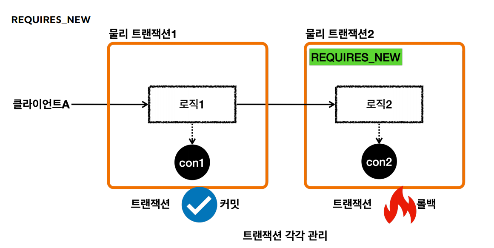
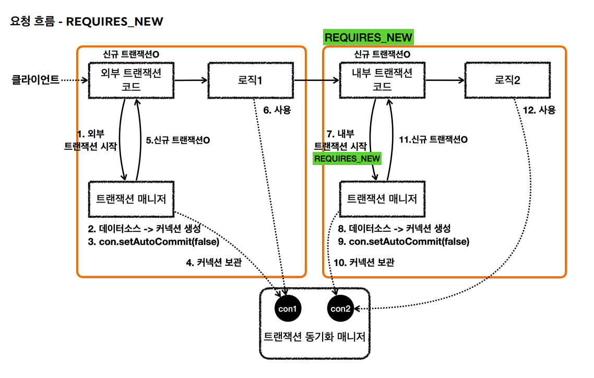
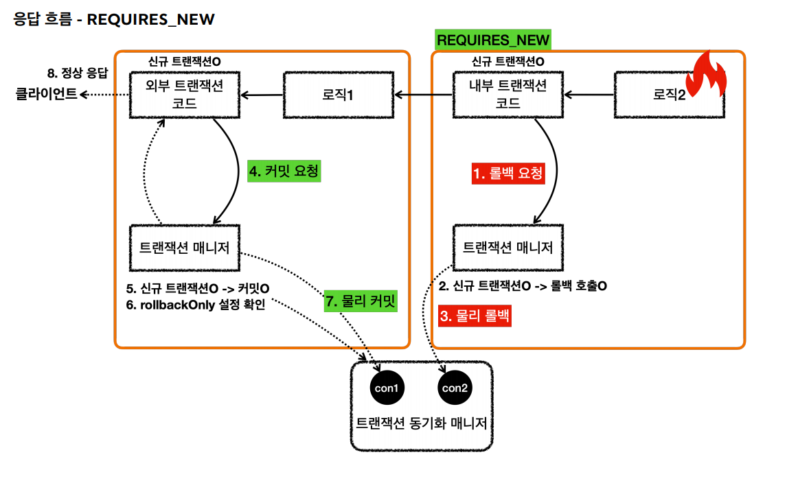

# 스프링 트랜잭션 전파

## REQUIRES_NEW
>  `외부 트랜잭션`과 `내부 트랜잭션`을 완전히 분리해서 각각 별도의 `물리 트랜잭션`을 사용할 수 있다.



```java
@Test
void inner_rollback_requires_new() {
    log.info("외부 트랜잭션 시작");
    TransactionStatus outer = txManager.getTransaction(new DefaultTransactionDefinition());
    log.info("outer.isNewTransaction()={}", outer.isNewTransaction());

    log.info("내부 트랜잭션 시작");
    DefaultTransactionDefinition definition = new DefaultTransactionDefinition();
    definition.setPropagationBehavior(PROPAGATION_REQUIRES_NEW);
    TransactionStatus inner = txManager.getTransaction(definition);
    log.info("inner.isNewTransaction()={}", inner.isNewTransaction());

    log.info("내부 트랜잭션 롤백");
    txManager.rollback(inner);

    log.info("외부 트랜잭션 커밋");
    txManager.commit(outer);
}
// 실행 로그
hello.springtx.propagation.BasicTxTest   : 외부 트랜잭션 시작
DataSourceTransactionManager     : Creating new transaction with name [null]: PROPAGATION_REQUIRED,ISOLATION_DEFAULT
DataSourceTransactionManager     : Acquired Connection [HikariProxyConnection@1454670179 wrapping conn0: url=jdbc:h2:mem:272a5b64-9a9d-499f-8373-7680da60f6f6 user=SA] for JDBC transaction
DataSourceTransactionManager     : Switching JDBC Connection [HikariProxyConnection@1454670179 wrapping conn0: url=jdbc:h2:mem:272a5b64-9a9d-499f-8373-7680da60f6f6 user=SA] to manual commit
hello.springtx.propagation.BasicTxTest   : outer.isNewTransaction()=true
hello.springtx.propagation.BasicTxTest   : 내부 트랜잭션 시작
DataSourceTransactionManager     : Suspending current transaction, creating new transaction with name [null]
DataSourceTransactionManager     : Acquired Connection [HikariProxyConnection@982532336 wrapping conn1: url=jdbc:h2:mem:272a5b64-9a9d-499f-8373-7680da60f6f6 user=SA] for JDBC transaction
DataSourceTransactionManager     : Switching JDBC Connection [HikariProxyConnection@982532336 wrapping conn1: url=jdbc:h2:mem:272a5b64-9a9d-499f-8373-7680da60f6f6 user=SA] to manual commit
hello.springtx.propagation.BasicTxTest   : inner.isNewTransaction()=true
hello.springtx.propagation.BasicTxTest   : 내부 트랜잭션 롤백
DataSourceTransactionManager     : Initiating transaction rollback
DataSourceTransactionManager     : Rolling back JDBC transaction on Connection [HikariProxyConnection@982532336 wrapping conn1: url=jdbc:h2:mem:272a5b64-9a9d-499f-8373-7680da60f6f6 user=SA]
DataSourceTransactionManager     : Releasing JDBC Connection [HikariProxyConnection@982532336 wrapping conn1: url=jdbc:h2:mem:272a5b64-9a9d-499f-8373-7680da60f6f6 user=SA] after transaction
DataSourceTransactionManager     : Resuming suspended transaction after completion of inner transaction
hello.springtx.propagation.BasicTxTest   : 외부 트랜잭션 커밋
DataSourceTransactionManager     : Initiating transaction commit
DataSourceTransactionManager     : Committing JDBC transaction on Connection [HikariProxyConnection@1454670179 wrapping conn0: url=jdbc:h2:mem:272a5b64-9a9d-499f-8373-7680da60f6f6 user=SA]
DataSourceTransactionManager     : Releasing JDBC Connection [HikariProxyConnection@1454670179 wrapping conn0: url=jdbc:h2:mem:272a5b64-9a9d-499f-8373-7680da60f6f6 user=SA] after transaction
```
`Suspending current transaction` : 현재 트랜잭션을 미뤄두고 새 트랜잭션을 생성한다.

`Resuming suspended transaction after completion of inner transaction` : `내부 트랜잭션`완료 후 미뤄진 트랜잭션(`외부 트랜잭션`) 재시작






**`REQUIRES_NEW` 옵션을 사용하여 `물리 트랜잭션`을 명확하게 분리할 수 있다.**

<br>

## 다양한 전파 옵션
> 다양한 트랜잭션 전파 옵션이 있는데 별도의 설정을 하지 않으면 `REQUIRED`가 기본으로 사용된다. 대부분 `REQUIRED`을 사용하고 가끔 `REQUIRED_NEW`를 사용한다.

**REQUIRED**
- 가장 많이 사용하는 기본 설정으로 트랜잭션이 필수라는 의미이다.
  - 기존 트랜잭션 있음 : 기존 트랜잭션에 참여
  - 기존 트랜잭션 없음 : 새로운 트랜잭션 생성

**REQUIRED_NEW**
- 항상 새로운 트랜잭션 생성
    - 기존 트랜잭션 있음 : 새로운 트랜잭션 생성
    - 기존 트랜잭션 없음 : 새로운 트랜잭션 생성

**SUPPORT**
- 트랜잭션을 지원한다. 없으면 없는대로, 있으면 있는대로.
    - 기존 트랜잭션 있음 : 기존 트랜잭션 참여
    - 기존 트랜잭션 없음 : 트랜잭션 없이 진행한다.

**NOT_SUPPORT**
- 트랜잭션을 지원하지 않는다.
    - 기존 트랜잭션 있음 : 트랜잭션 없이 진행한다.(기존 트랜잭션은 보류)
    - 기존 트랜잭션 없음 : 트랜잭션 없이 진행한다.

**MANDATORY**
- 의무사항, 트랜잭션이 반드시 있어야 한다. 기존 트랜잭션이 없으면 예외 발생.
    - 기존 트랜잭션 있음 : 기존 트랜잭션에 참여
    - 기존 트랜잭션 없음 : `IllegalTransactionStateException` 예외 발생

**NEVER**
- 강한 부정, 트랜잭션을 사용하지 않는다. 기존 트랜잭션이 있으면 예외 발생.
    - 기존 트랜잭션 있음 : `IllegalTransactionStateException` 예외 발생
    - 기존 트랜잭션 없음 : 트랜잭션 없이 진행한다.

**NESTED**
- 기존 트랜잭션 있음 : 중첩 트랜잭션을 만든다.
  - 중첩 트랜잭션은 외부 트랜잭션의 영향을 받지만 중첩 트랜잭션은 외부에 영향을 주지 않는다.
  - 중첩 트랜잭션이 롤백 되어도 외부 트랜잭션은 커밋할 수 있다.
  - 외부 트랜잭션이 롤백 되면 중첩 트랜잭션도 함께 롤백된다.
- 기존 트랜잭션 없음 : 새로운 트랜잭션을 생성한다.
- 중첩 트랜잭션은 `JPA`에서는 사용할 수 없다.

`isolation`, `timeout`, `readOnly`는 `REQUIRED`, `REQUIRED_NEW`와 같은 트랜잭션이 처음 시작될 때(시작 시점)만 적용되고 참여하는 경우에는 적용되지 않는다.
