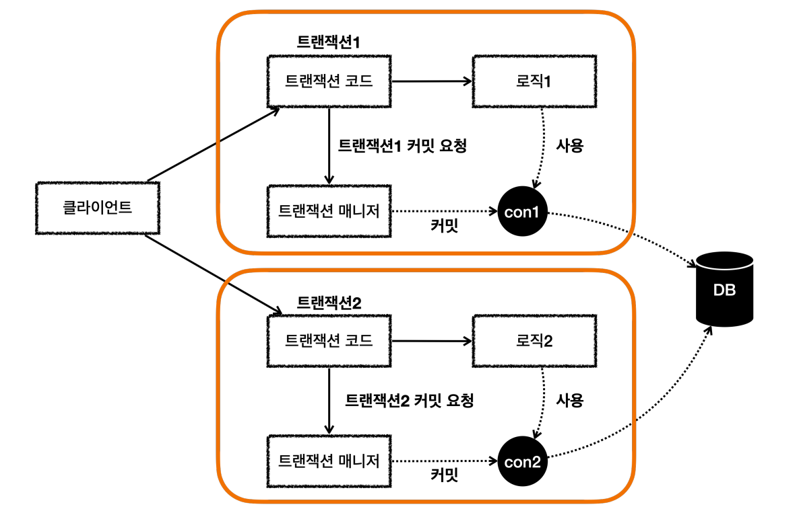
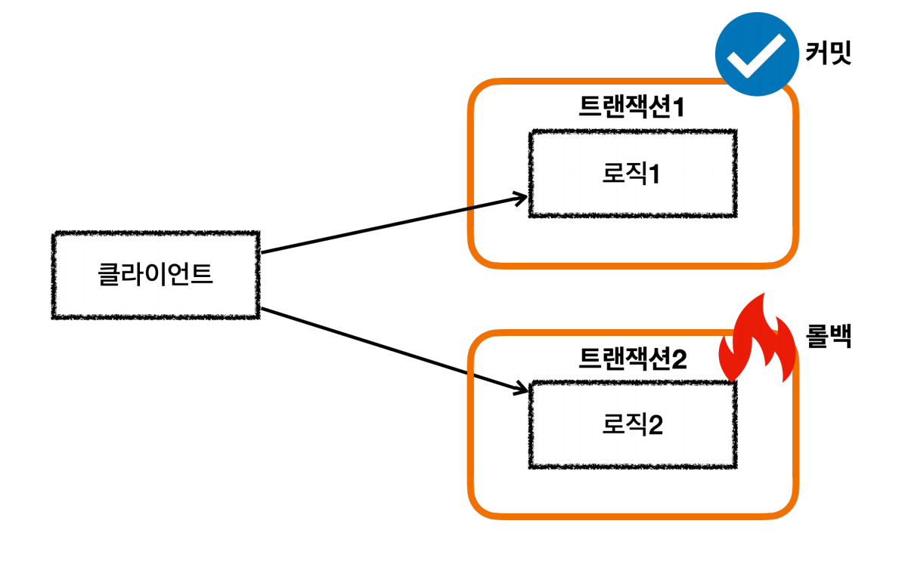
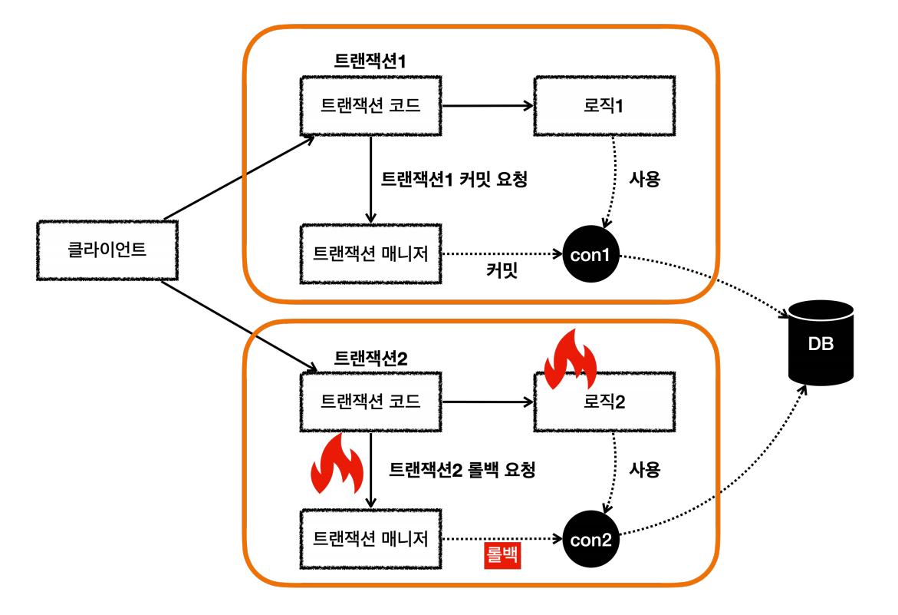

# 스프링 트랜잭션 전파
> 트랜잭션이 둘 이상 있을 때 어떻게 동작하는지, 스프링이 제공하는 트랜잭션 전파(propagation)을 알아보자.

기본 테스트 설정
```java
@Slf4j
@SpringBootTest
public class BasicTxTest {

    @Autowired PlatformTransactionManager txManager;

    @TestConfiguration
    static class Config {
        @Bean
        PlatformTransactionManager transactionManager(DataSource dataSource) {
            return new DataSourceTransactionManager(dataSource);
        }
    }
}
```

## 커밋, 롤백

- 커밋
```java
@Test
void commit() {
    log.info("트랜잭션 시작");
    TransactionStatus status = txManager.getTransaction(new DefaultTransactionDefinition());

    log.info("트랜잭션 커밋 시작");
    txManager.commit(status);
    log.info("트랜잭션 커밋 완료");
}
// 실행 로그
hello.springtx.propagation.BasicTxTest   : 트랜잭션 시작
DataSourceTransactionManager     : Creating new transaction with name [null]: PROPAGATION_REQUIRED,ISOLATION_DEFAULT
DataSourceTransactionManager     : Acquired Connection [HikariProxyConnection@116893278 wrapping conn0: url=jdbc:h2:mem:88c20d05-2c65-41af-9e80-01c5648b88c7 user=SA] for JDBC transaction
DataSourceTransactionManager     : Switching JDBC Connection [HikariProxyConnection@116893278 wrapping conn0: url=jdbc:h2:mem:88c20d05-2c65-41af-9e80-01c5648b88c7 user=SA] to manual commit
hello.springtx.propagation.BasicTxTest   : 트랜잭션 커밋 시작
DataSourceTransactionManager     : Initiating transaction commit
DataSourceTransactionManager     : Committing JDBC transaction on Connection [HikariProxyConnection@116893278 wrapping conn0: url=jdbc:h2:mem:88c20d05-2c65-41af-9e80-01c5648b88c7 user=SA]
DataSourceTransactionManager     : Releasing JDBC Connection [HikariProxyConnection@116893278 wrapping conn0: url=jdbc:h2:mem:88c20d05-2c65-41af-9e80-01c5648b88c7 user=SA] after transaction
hello.springtx.propagation.BasicTxTest   : 트랜잭션 커밋 완료
```

- 롤백
```java
@Test
void rollback() {
    log.info("트랜잭션 시작");
    TransactionStatus status = txManager.getTransaction(new DefaultTransactionDefinition());

    log.info("트랜잭션 롤백 시작");
    txManager.rollback(status);
    log.info("트랜잭션 롤백 완료");
}
// 실행 로그
hello.springtx.propagation.BasicTxTest   : 트랜잭션 시작
DataSourceTransactionManager     : Creating new transaction with name [null]: PROPAGATION_REQUIRED,ISOLATION_DEFAULT
DataSourceTransactionManager     : Acquired Connection [HikariProxyConnection@1846486430 wrapping conn0: url=jdbc:h2:mem:9a5427e9-ca85-43b5-a241-02a098252981 user=SA] for JDBC transaction
DataSourceTransactionManager     : Switching JDBC Connection [HikariProxyConnection@1846486430 wrapping conn0: url=jdbc:h2:mem:9a5427e9-ca85-43b5-a241-02a098252981 user=SA] to manual commit
hello.springtx.propagation.BasicTxTest   : 트랜잭션 롤백 시작
DataSourceTransactionManager     : Initiating transaction rollback
DataSourceTransactionManager     : Rolling back JDBC transaction on Connection [HikariProxyConnection@1846486430 wrapping conn0: url=jdbc:h2:mem:9a5427e9-ca85-43b5-a241-02a098252981 user=SA]
DataSourceTransactionManager     : Releasing JDBC Connection [HikariProxyConnection@1846486430 wrapping conn0: url=jdbc:h2:mem:9a5427e9-ca85-43b5-a241-02a098252981 user=SA] after transaction
hello.springtx.propagation.BasicTxTest   : 트랜잭션 롤백 완료
```

## 트랜잭션 두 번 사용
> 트랜잭션이 각각 따로 사용되는 경우
```java
@Test
void double_commit() {
    log.info("트랜잭션1 시작");
    TransactionStatus tx1 = txManager.getTransaction(new DefaultTransactionDefinition());

    log.info("트랜잭션1 커밋");
    txManager.commit(tx1);

    log.info("트랜잭션2 시작");
    TransactionStatus tx2 = txManager.getTransaction(new DefaultTransactionDefinition());

    log.info("트랜잭션2 커밋");
    txManager.commit(tx2);
}
// 실행 로그
hello.springtx.propagation.BasicTxTest   : 트랜잭션1 시작
DataSourceTransactionManager     : Creating new transaction with name [null]: PROPAGATION_REQUIRED,ISOLATION_DEFAULT
DataSourceTransactionManager     : Acquired Connection [HikariProxyConnection@1846486430 wrapping conn0: url=jdbc:h2:mem:3d624ace-1a88-4d52-8ba6-5bda43246017 user=SA] for JDBC transaction
DataSourceTransactionManager     : Switching JDBC Connection [HikariProxyConnection@1846486430 wrapping conn0: url=jdbc:h2:mem:3d624ace-1a88-4d52-8ba6-5bda43246017 user=SA] to manual commit
hello.springtx.propagation.BasicTxTest   : 트랜잭션1 커밋
DataSourceTransactionManager     : Initiating transaction commit
DataSourceTransactionManager     : Committing JDBC transaction on Connection [HikariProxyConnection@1846486430 wrapping conn0: url=jdbc:h2:mem:3d624ace-1a88-4d52-8ba6-5bda43246017 user=SA]
DataSourceTransactionManager     : Releasing JDBC Connection [HikariProxyConnection@1846486430 wrapping conn0: url=jdbc:h2:mem:3d624ace-1a88-4d52-8ba6-5bda43246017 user=SA] after transaction
hello.springtx.propagation.BasicTxTest   : 트랜잭션2 시작
DataSourceTransactionManager     : Creating new transaction with name [null]: PROPAGATION_REQUIRED,ISOLATION_DEFAULT
DataSourceTransactionManager     : Acquired Connection [HikariProxyConnection@1960932807 wrapping conn0: url=jdbc:h2:mem:3d624ace-1a88-4d52-8ba6-5bda43246017 user=SA] for JDBC transaction
DataSourceTransactionManager     : Switching JDBC Connection [HikariProxyConnection@1960932807 wrapping conn0: url=jdbc:h2:mem:3d624ace-1a88-4d52-8ba6-5bda43246017 user=SA] to manual commit
hello.springtx.propagation.BasicTxTest   : 트랜잭션2 커밋
DataSourceTransactionManager     : Initiating transaction commit
DataSourceTransactionManager     : Committing JDBC transaction on Connection [HikariProxyConnection@1960932807 wrapping conn0: url=jdbc:h2:mem:3d624ace-1a88-4d52-8ba6-5bda43246017 user=SA]
DataSourceTransactionManager     : Releasing JDBC Connection [HikariProxyConnection@1960932807 wrapping conn0: url=jdbc:h2:mem:3d624ace-1a88-4d52-8ba6-5bda43246017 user=SA] after transaction
```
- 트랜잭션 1
  - `Acquired Connecntion ... conn0`
- 트랜잭션 2
  - `Acquired Connecntion ... conn0`

로그를 보면 두 트랜잭션 모두 같은 `conn0` 커넥션을 사용했다. 이것은 중간에 `커넥션 풀` 때문에 그런 것이다. 트랜잭션1이 `conn0` 커넥션을 사용하고 풀에 반납까지 완료하고 이후에 트랜잭션 2가
`conn0` 커넥션을 커넥션 풀에서 획득한 것이다. 따라서 둘은 완전히 다른 커넥션으로 보는 것이 맞다.

`히카리 커넥션 풀`에서 커넥션을 획득하면 실제 커넥션을 그대로 반환하는 것이 아니라 내부 관리를 위해 `히카리 프록시 커넥션`이라는 객체를 생성해서 반환한다. 내부에는 실제 커넥션이 포함되어 있는 것이다.

로그를 자세히 보면 트랜잭션1은 `HikariProxyConnection@1846486430`이고, 트랜잭션 2는 `HikariProxyConnection@1960932807`으로 서로 다르다.<br>
결과적으로 `conn0`을 통해 커넥션이 재사용 된 것이고 각각 커넥션 풀에서 커넥션을 조회한 것을 확인할 수 있다.




- 트랜잭션이 각각 수행되면서 사용되는 `DB 커넥션`도 모두 다르다.
- 이 경우 트랜잭션을 각자 관리하기 때문에 전체 트랜잭션을 묶을 수 없다.

트랜잭션 1은 `커밋`하고 트랜잭션 2는 `롤백`하는 경우
```java
@Test
void double_commit_rollback() {
    log.info("트랜잭션1 시작");
    TransactionStatus tx1 = txManager.getTransaction(new DefaultTransactionDefinition());

    log.info("트랜잭션1 커밋");
    txManager.commit(tx1);

    log.info("트랜잭션2 시작");
    TransactionStatus tx2 = txManager.getTransaction(new DefaultTransactionDefinition());

    log.info("트랜잭션2 롤백");
    txManager.rollback(tx2);
}
// 실행 로그
hello.springtx.propagation.BasicTxTest   : 트랜잭션1 시작
DataSourceTransactionManager     : Creating new transaction with name [null]: PROPAGATION_REQUIRED,ISOLATION_DEFAULT
DataSourceTransactionManager     : Acquired Connection [HikariProxyConnection@700420348 wrapping conn0: url=jdbc:h2:mem:ed270fb7-892c-48e2-90e8-e73123487219 user=SA] for JDBC transaction
DataSourceTransactionManager     : Switching JDBC Connection [HikariProxyConnection@700420348 wrapping conn0: url=jdbc:h2:mem:ed270fb7-892c-48e2-90e8-e73123487219 user=SA] to manual commit
hello.springtx.propagation.BasicTxTest   : 트랜잭션1 커밋
DataSourceTransactionManager     : Initiating transaction commit
DataSourceTransactionManager     : Committing JDBC transaction on Connection [HikariProxyConnection@700420348 wrapping conn0: url=jdbc:h2:mem:ed270fb7-892c-48e2-90e8-e73123487219 user=SA]
DataSourceTransactionManager     : Releasing JDBC Connection [HikariProxyConnection@700420348 wrapping conn0: url=jdbc:h2:mem:ed270fb7-892c-48e2-90e8-e73123487219 user=SA] after transaction
hello.springtx.propagation.BasicTxTest   : 트랜잭션2 시작
DataSourceTransactionManager     : Creating new transaction with name [null]: PROPAGATION_REQUIRED,ISOLATION_DEFAULT
DataSourceTransactionManager     : Acquired Connection [HikariProxyConnection@2142873660 wrapping conn0: url=jdbc:h2:mem:ed270fb7-892c-48e2-90e8-e73123487219 user=SA] for JDBC transaction
DataSourceTransactionManager     : Switching JDBC Connection [HikariProxyConnection@2142873660 wrapping conn0: url=jdbc:h2:mem:ed270fb7-892c-48e2-90e8-e73123487219 user=SA] to manual commit
hello.springtx.propagation.BasicTxTest   : 트랜잭션2 롤백
DataSourceTransactionManager     : Initiating transaction rollback
DataSourceTransactionManager     : Rolling back JDBC transaction on Connection [HikariProxyConnection@2142873660 wrapping conn0: url=jdbc:h2:mem:ed270fb7-892c-48e2-90e8-e73123487219 user=SA]
DataSourceTransactionManager     : Releasing JDBC Connection [HikariProxyConnection@2142873660 wrapping conn0: url=jdbc:h2:mem:ed270fb7-892c-48e2-90e8-e73123487219 user=SA] after transaction
```
전체 트랜잭션을 묶지 않고 각각 관리했기 때문에 트랜잭션1은 `커밋`되고 트랜잭션2는 `롤백`이 된다.



