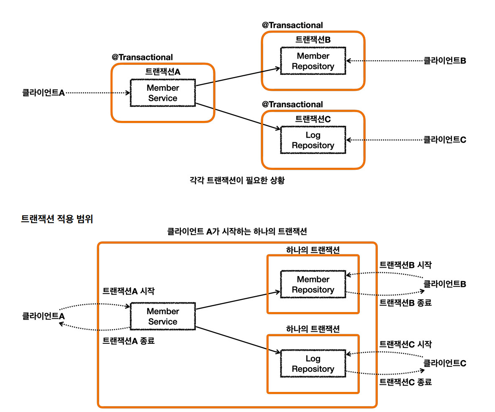
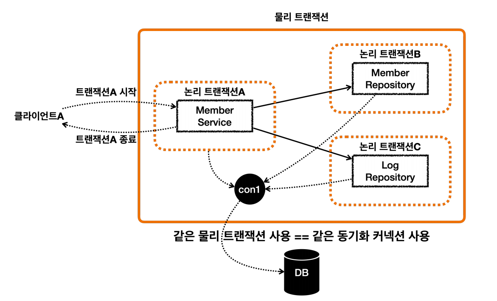
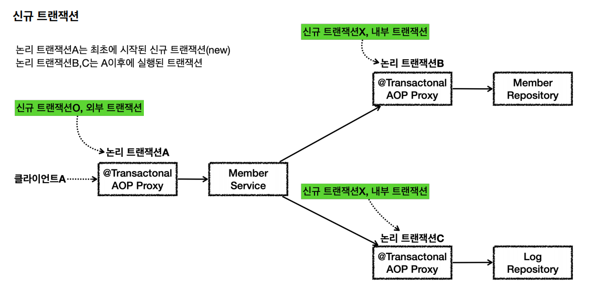
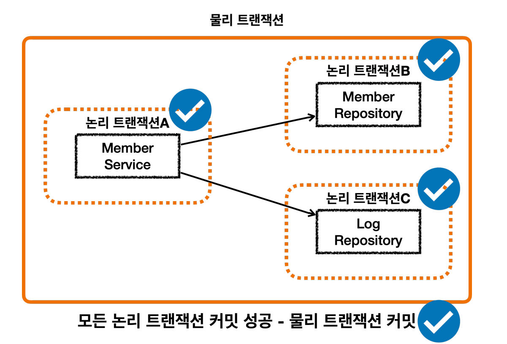
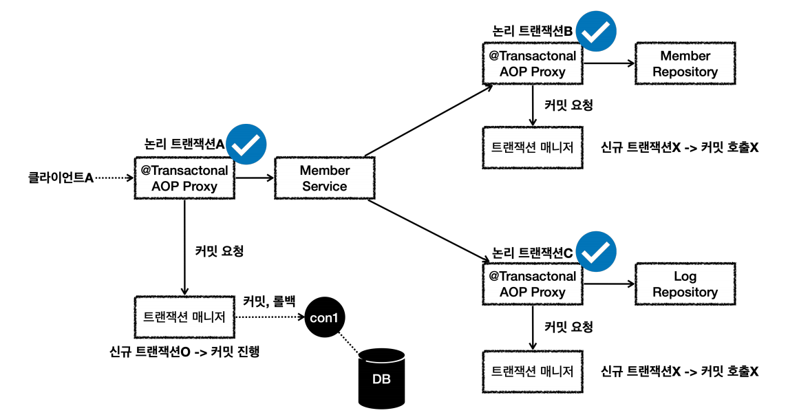
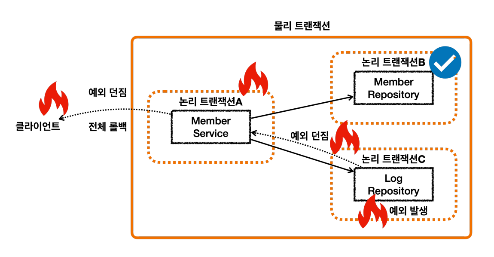
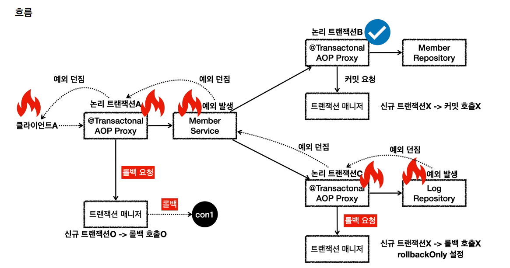

# 트랜잭션 전파 활용
> 각각 트랜잭션이 필요한 상황



클라이언트A만 생각하면 `MemberService`에만 `@Transactional`을 적용하면 된다. 하지만 클라이언트 B와 C는
트랜잭션을 적용할 수 없다. 

`트랜잭션 전파`없이 해결하려면 트랜잭션이 있는 메서드와 없는 메서드를 각각 만들어야 할 것이다.

**문제를 해결하기 위해 트랜잭션 전파를 활용할 수 있다.**

## 전파 커밋
> 스프링은 `@Transactional`이 적용되어 있으면 기본으로 `REQUIRED` 전파 옵션을 사용한다.
> 
> 기존 트랜잭션이 없으면 생성하고, 있으면 기존 트랜잭션에 참여한다.



 

이 경우 외부에 있는 `신규 트랜잭션`만 실제 `물리 트랜잭션`을 시작하고 커밋한다.

내부에 있는 트랜잭션은 물리 트랜잭션을 시작하거나 커밋할 수 없다.

- 모든 논리 트랜잭션이 정상 커밋되는 경우
```java
/**
 * memberService     @Transactional:ON
 * memberRepository  @Transactional:ON
 * logRepository     @Transactional:ON
 */
@Test
void outerTxOn_success() {
    //given
    String username = "outerTxOn_success";
    //when
    memberService.joinV1(username);

    //then
    assertTrue(memberRepository.find(username).isPresent());
    assertTrue(logRepository.find(username).isPresent());
}
```





- LogRepository에서 예외가 발생해서 전체 트랜잭션이 롤백되는 경우
```java
 /**
 * memberService     @Transactional:OFF
 * memberRepository  @Transactional:ON
 * logRepository     @Transactional:ON Exception
 */
@Test
void outerTxON_fail() {
    //given
    String username = "로그예외_outerTxOff_fail";
    //when
    assertThatThrownBy(() -> memberService.joinV1(username))
            .isInstanceOf(RuntimeException.class);

    //then
    // 모든 데이터 롤백
    assertTrue(memberRepository.find(username).isEmpty());
    assertTrue(logRepository.find(username).isEmpty());
}
```
`로그예외`를 넘겨서 `런타임 예외`가 발생했다.


