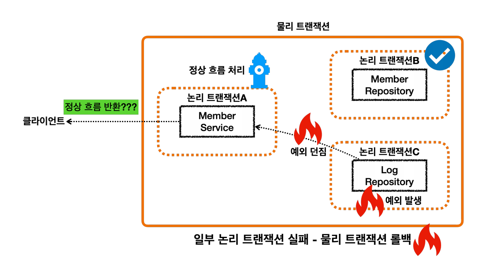
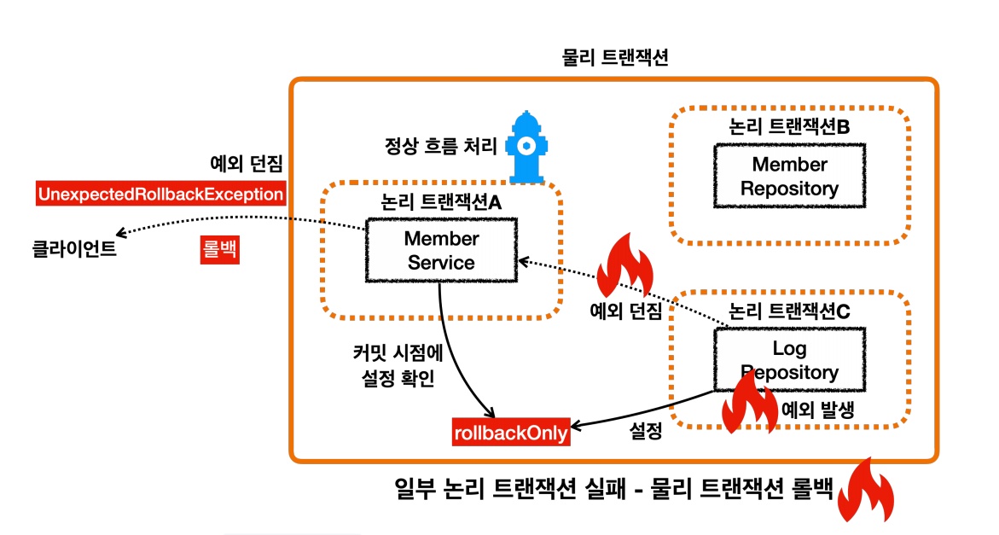
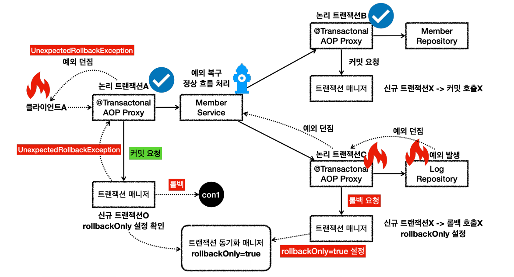
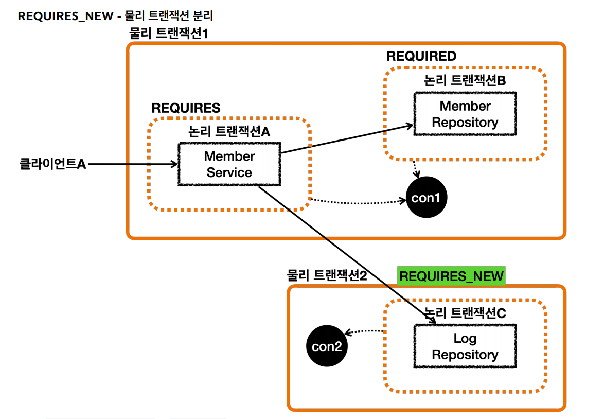
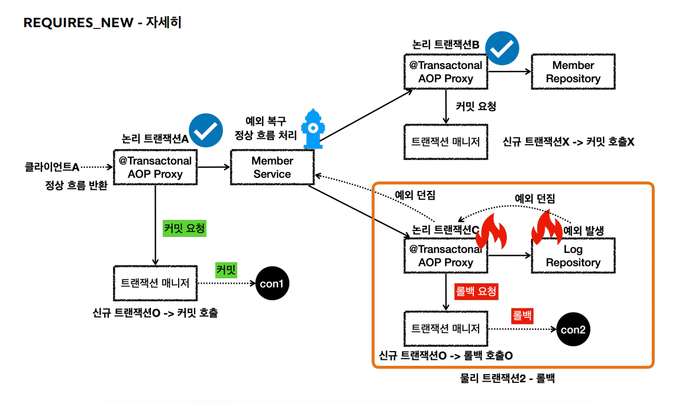
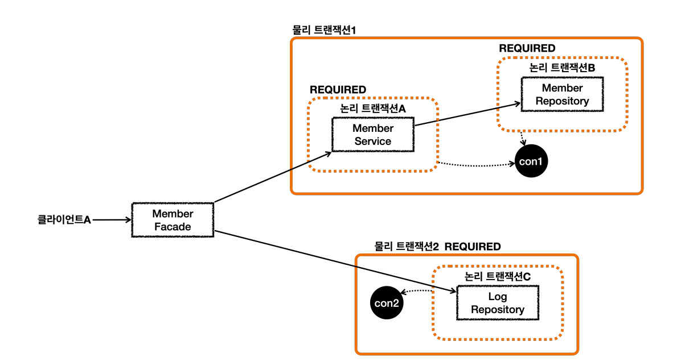

# 트랜잭션 전파 활용
> 로그를 저장하는 데 실패해도 회원가입은 유지시킬 수 있다.



`MemberService`에서 예외를 잡아서 처리해서 정상 흐름으로 바꾸면 트랜잭션 AOP가 커밋을 수행할까?

```java
@Transactional
public void joinV2(String username) {
    Member member = new Member(username);
    Log logMessage = new Log(username);

    log.info("== memberRepository 호출 시작 ==");
    memberRepository.save(member);
    log.info("== memberRepository 호출 종료 ==");

    log.info("== logRepository 호출 시작 ==");
    try {
        logRepository.save(logMessage);
    } catch (RuntimeException e) {
        log.info("log 저장에 실패했습니다. logMessage={}", logMessage.getMessage());
        log.info("정상 흐름 반환");
    }
    log.info("== logRepository 호출 종료 ==");
}
```

- 테스트 코드
```java
/**
 * memberService     @Transactional:ON
 * memberRepository  @Transactional:ON
 * logRepository     @Transactional:ON Exception
 */
@Test
void recoverException_fail() {
    //given
    String username = "로그예외_recoverException_fail";
    //when
    assertThatThrownBy(() -> memberService.joinV2(username))
            .isInstanceOf(UnexpectedRollbackException.class);

    //then
    // 모든 데이터 롤백
    assertTrue(memberRepository.find(username).isEmpty());
    assertTrue(logRepository.find(username).isEmpty());
}
```
서비스에서 예외를 잡고 처리했기 때문에 회원은 저장될 걸 예상했으나 실제로는 저장되지 않았다.



내부 트랜잭션에서 `rollbackOnly`를 설정하기 때문에 외부 트랜잭션에서 커밋을 해도 물리 트랜잭션은 롤백 된다.



내부 트랜잭션이 롤백 되었는데 외부 트랜잭션이 커밋되면 `UnexpectedRollbackException`예외가 발생한다.<br>
`rollbackOnly` 상황에서 커밋이 발생하면 `UnexpectedRollbackException`예외가 발생하는 것이다.

<br>

## REQUIRES_NEW
> 전파 옵션을 사용하여 로그 저장에 실패하더라도 회원가입은 성공시킨다.

```java
/**
 * memberService     @Transactional:ON
 * memberRepository  @Transactional:ON
 * logRepository     @Transactional:ON(REQUIRES_NEW) Exception
 */
@Test
void recoverException_success() {
    //given
    String username = "로그예외_recoverException_success";
    //when
    memberService.joinV2(username);
    
    //then
    // member 저장, log 롤백
    assertTrue(memberRepository.find(username).isPresent());
    assertTrue(logRepository.find(username).isEmpty());
}
```
```java
@Transactional(propagation = Propagation.REQUIRES_NEW)
public void save(Log logMessage) {
    log.info("log 저장");
    em.persist(logMessage);

    if (logMessage.getMessage().contains("로그예외")) {
        log.info("log 저장 시 예외 발생");
        throw new RuntimeException("예외 발생");
    }
}
```



- `REQUIRES_NEW`는 신규 트랜잭션이므로 `rollbackOnly`표시가 되지 않고 그냥 해당 트랜잭션이 물리 롤백되고 끝난다.



**주의할 점**
- `REQUIRES_NEW`를 사용하면 하나의 HTTP 요청에 동시에 2개의 DB 커넥션을 사용하게 되기 때문에 성능에 문제가 생길 수 있다.



`MemberService`앞에 클래스를 하나 두어서 동시에 2개의 커넥션을 사용하지 않는 방법도 있다. 그냥 커넥션을 순차적으로 사용하고 반환한다.