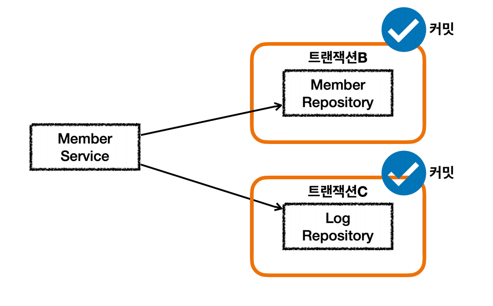
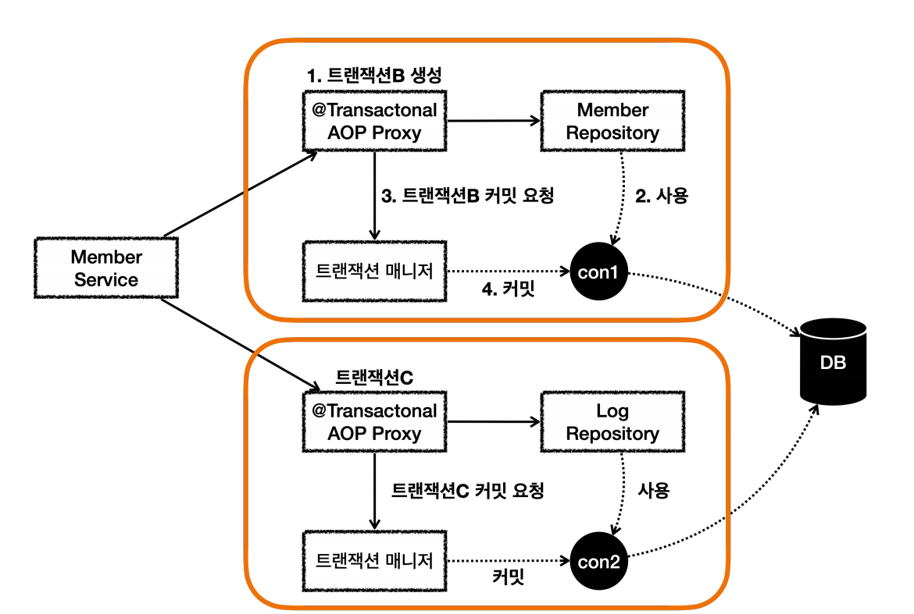
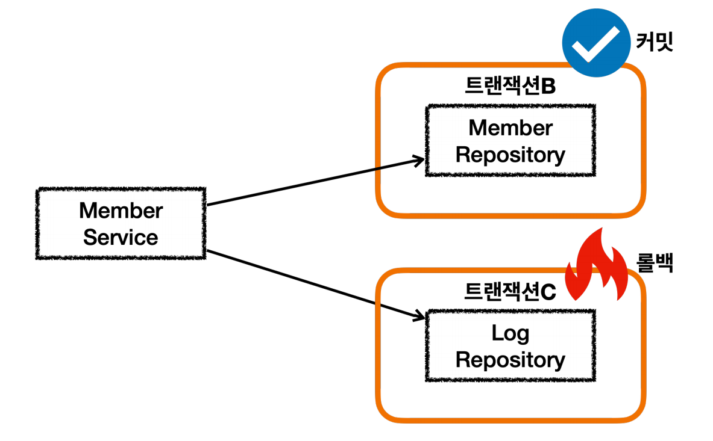
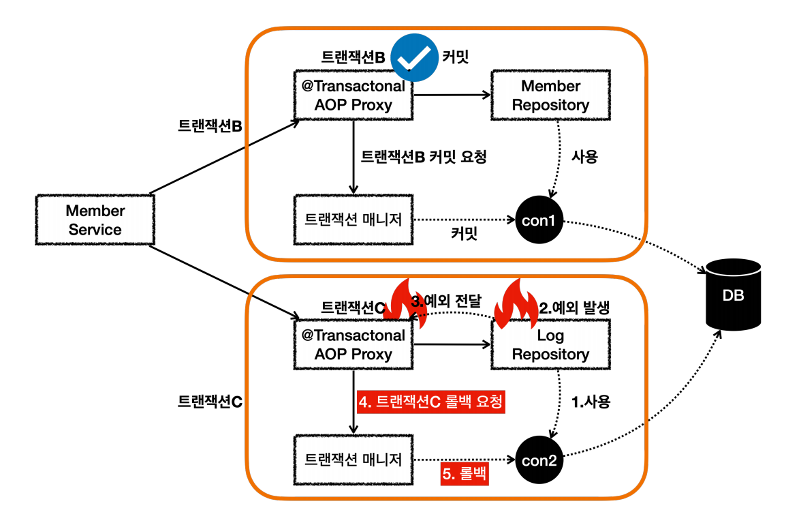
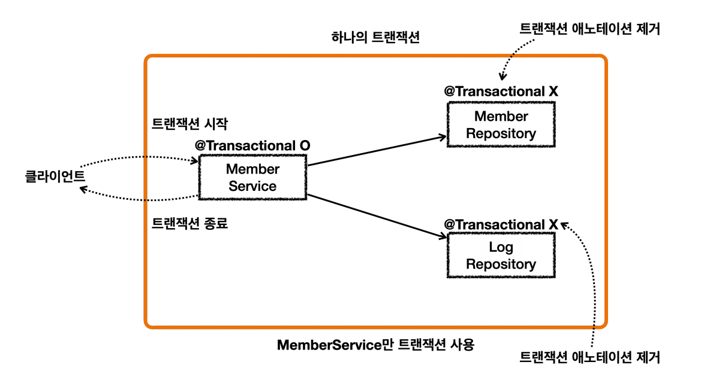
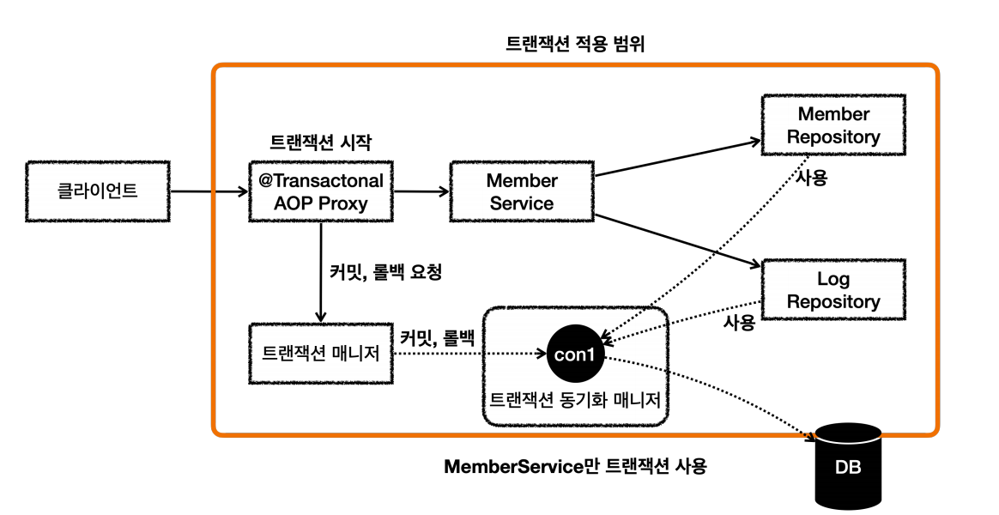

# 트랜잭션 전파 활용

## 서비스 계층에 트랜잭션이 없을 때 - 커밋 


- Member 엔티티
```java
@Entity
@Getter @Setter
@NoArgsConstructor(access = AccessLevel.PROTECTED)
public class Member {

    @Id @GeneratedValue
    private Long id;

    private String username;

    public Member(String username) {
        this.username = username;
    }
}
```
- MemberRepository
```java
@Slf4j
@Repository
@RequiredArgsConstructor
public class MemberRepository {
    private final EntityManager em;

    @Transactional
    public void save(Member member) {
        log.info("member 저장");
        em.persist(member);
    }

    public Optional<Member> find(String username) {
        return em.createQuery("select m from Member m where m.username = :username", Member.class)
                 .setParameter("username", username)
                 .getResultList()
                 .stream()
                 .findAny();
    } 
}
```
- Log 엔티티
```java
@Entity
@Getter @Setter
@NoArgsConstructor(access = AccessLevel.PROTECTED)
public class Log {

    @Id @GeneratedValue
    private Long id;
    
    private String message;
    
    public Log(String message) {
        this.message = message;
    }
}
```
- LogRepository
```java
@Slf4j
@Repository
@RequiredArgsConstructor
public class LogRepository {

    private final EntityManager em;

    @Transactional
    public void save(Log logMessage) {
        log.info("log 저장");
        em.persist(logMessage);

        if (logMessage.getMessage().contains("로그예외")) {
            log.info("log 저장 시 예외 발생");
            throw new RuntimeException("예외 발생");
        }
    }

    public Optional<Log> find(String message) {
        return em.createQuery("select l from Log l where l.message = :message", Log.class)
                .setParameter("message", message)
                .getResultList()
                .stream()
                .findAny();
    }
}
```
`로그예외`라고 입력하는 경우 예외를 발생시킨다. 런타임(언체크)예외이므로 `롤백`된다.

- MemberService
```java
@Slf4j
@Service
@RequiredArgsConstructor
public class MemberService {

    private final MemberRepository memberRepository;
    private final LogRepository logRepository;

    public void joinV1(String username) {
        Member member = new Member(username);
        Log logMessage = new Log(username);

        log.info("== memberRepository 호출 시작 ==");
        memberRepository.save(member);
        log.info("== memberRepository 호출 종료 ==");

        log.info("== logRepository 호출 시작 ==");
        logRepository.save(logMessage);
        log.info("== logRepository 호출 종료 ==");
    }

    public void joinV2(String username) {
        Member member = new Member(username);
        Log logMessage = new Log(username);

        log.info("== memberRepository 호출 시작 ==");
        memberRepository.save(member);
        log.info("== memberRepository 호출 종료 ==");

        log.info("== logRepository 호출 시작 ==");
        try {
            logRepository.save(logMessage);
        } catch (RuntimeException e) {
            log.info("log 저장에 실패했습니다. logMessage={}", logMessage.getMessage());
            log.info("정상 흐름 반환");
        }
        log.info("== logRepository 호출 종료 ==");
    }
}
```
`joinV1()`과 `joinV2()` 모두 회원과 로그를 저장하는 로직이고 `joinV2()`는 예외 발생 시 예외를 복구한다.

- 테스트 코드
```java
 /**
 * memberService     @Transactional:OFF
 * memberRepository  @Transactional:ON
 * logRepository     @Transactional:ON
 */
@Test
@DisplayName("모든 데이터가 정상적으로 저장된다.")
void outerTxOff_success() {
        //given
        String username = "outerTxOff_success";
        //when
        memberService.joinV1(username);

        //then (Junit Assertions)
        assertTrue(memberRepository.find(username).isPresent());
        assertTrue(logRepository.find(username).isPresent());
}
```


<br>

## 서비스 계층에 트랜잭션이 없을 때 - 롤백


- 테스트 코드
```java
 /**
 * memberService     @Transactional:OFF
 * memberRepository  @Transactional:ON
 * logRepository     @Transactional:ON Exception
 */
@Test
void outerTxOff_fail() {
    //given
    String username = "로그예외_outerTxOff_fail";
    //when
    assertThatThrownBy(() -> memberService.joinV1(username))
            .isInstanceOf(RuntimeException.class);

    //then
    assertTrue(memberRepository.find(username).isPresent());
    assertTrue(logRepository.find(username).isEmpty());
}
```
이름에 `로그예외`가 있으므로 `런타임 예외`가 발생한다. 트랜잭션 AOP는 해당 예외를 확인하고 `롤백`처리한다.



이 경우 회원은 저장되지만 로그는 저장되지 않고 `롤백`되기 때문에 데이터 정합성에 문제가 발생할 수 있다. 둘을 하나 트랜잭션으로 묶어보자.

<br>

## 단일 트랜잭션
> 서비스에만 트랜잭션을 사용한다.

```java
/**
 * memberService     @Transactional:ON
 * memberRepository  @Transactional:OFF
 * logRepository     @Transactional:OFF
 */
@Test
void singleTx() {
    //given
    String username = "singleTx";
    //when
    memberService.joinV1(username);

    //then
    assertTrue(memberRepository.find(username).isPresent());
    assertTrue(logRepository.find(username).isPresent());
}
```
서비스에만 `@Transactional`을 적용하고 레포지토리에는 적용하지 않았다.



